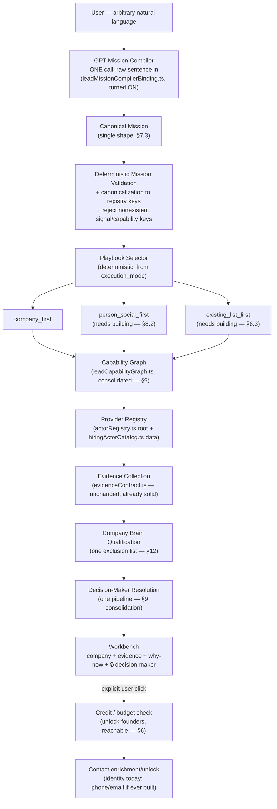
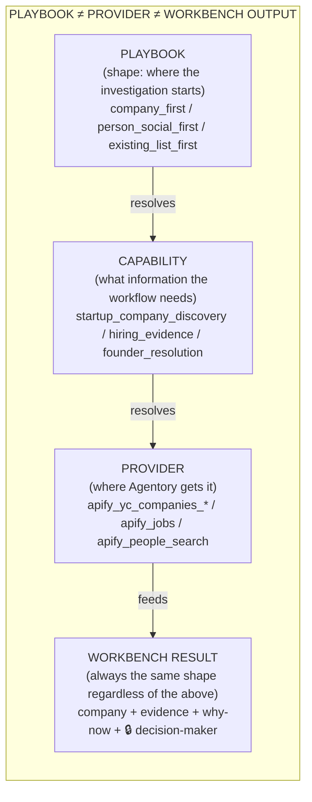

# Agentory — Current-State and Target-Architecture Audit

**Status: READ-ONLY AUDIT. No code was changed, committed, deployed, migrated, or executed to produce this document. No GPT/Claude/Apify/Firecrawl/paid-provider calls were made.**

Repo: `/Users/prasidha/agentory-main-local` · Branch: `feat/lead-mission-v1` · Verified HEAD: `2567c364f6f0834fb85ae07cb292d9441318b1d2`

Working-tree state at verification time (`git status --short`): six pre-existing modified files and two untracked test files, all belonging to unrelated work (`supabase/functions/mcp/index.ts`, `src/components/Sidebar.tsx`, `src/components/tour/GuideCard.tsx`, `src/components/tour/ProductTour.tsx`, `src/components/tour/tourSteps.ts`, `supabase/functions/_shared/buildInfo.ts`, plus two untracked test files) — none touched, none read for content beyond confirming they exist and are out of scope.

**Labeling convention used throughout:** every substantive claim is tagged **VERIFIED** (read directly from current code by an independent research pass, file:line cited), **INFERENCE** (a reasonable conclusion drawn from verified facts, not itself directly observed), or **RECOMMENDATION** (this document's own judgment call, not a fact about the code).

---

## 0. Executive verdict

**VERIFIED.** This audit was produced by six independent, read-only research passes against the live working tree at the exact HEAD above — not against prior handoffs, this session's own earlier commit messages, or code comments. Every cross-cutting finding below was independently reproduced by at least one research pass reading the actual current file contents.

**The single most important finding:** in the live request path today, **GPT does not read the user's raw sentence.** The initial lead-planning call site (`_shared/leadStrategyContract.ts:141-166`, `buildLeadStrategyUserMessage`) sends GPT a fixed, pre-extracted JSON whitelist — titles, geography, decision-maker roles, vertical, size, stage — assembled *before* GPT is ever invoked, by a chain of deterministic regex/lookup-table parsers (`leadEntityIntent.ts`, `jobSearchSpec.ts`, `qualifiedLeadRouting.ts`, and three further sibling parsers). GPT operates as a downstream tactic-chooser inside a universe it never derived, not as the primary language-understanding layer the target architecture calls for. A structurally correct path *does* exist — `leadMissionCompilerBinding.ts`, gated by `GPT_LEAD_MISSION_COMPILER` — but it is **off by default**, with no workspace currently allow-listed.

**The proposed target architecture (GPT owns semantic understanding; deterministic code validates/canonicalizes/enforces) is directionally correct and should remain the goal.** But it is **VALID WITH CORRECTIONS** — see §13 — and the corrections are substantial, not cosmetic. The codebase is further from this target than the recent "Step 2/3B" work implies, and Step 3B, while it delivered genuinely valuable deterministic validation, also **entrenched more regex-based primary understanding** rather than reducing it, because there was no live GPT call receiving raw text to fix instead.

**Current HEAD:** `2567c364f6f0834fb85ae07cb292d9441318b1d2`

---

## 1. Current architecture — request path (as it actually executes)

**VERIFIED**, traced end-to-end by direct code reading, file:line cited throughout. This is what runs today, not what filenames or comments suggest.

```mermaid
graph TD
    U[User] --> PC["pilot-chat/index.ts<br/>buildMissionForPrompt() :203-282"]
    PC -->|"deterministic, always"| CLM["compileLeadMission()<br/>leadMissionCompiler.ts:119"]
    PC -.->|"MODEL CALL #1 — OFF BY DEFAULT<br/>GPT_LEAD_MISSION_COMPILER flag"| MCB["leadMissionCompilerBinding.ts:125<br/>proposeMission() — gpt-5.6-luna via Lovable"]
    MCB -.-> CLM
    CLM --> LM1["LeadMissionV1<br/>(authoritative, persisted)"]
    LM1 --> ORCH["orchestrate/index.ts :582-625<br/>uses mission verbatim, or 422 refuses,<br/>or deterministic fallback parse"]
    ORCH --> ROUTE["routeQualifiedLead()<br/>qualifiedLeadRouting.ts:63 — REGEX, no model"]
    ROUTE --> LPO["leadPlanOrchestration.ts:111<br/>planQualifiedLeadBeforePersistence()"]
    LPO --> CLEI["compileLeadEntityIntent()<br/>leadEntityIntent.ts:254 — REGEX, no model<br/>geography/persona/signals/execution_mode"]
    CLEI --> SPEC["spec (enriched, Step 3B)<br/>backfilled from intent.geographies/person_roles/<br/>extractRequiredSignalTerms() — REGEX"]
    SPEC --> SEL["selectLeadPlannerAdapter()<br/>leadPlannerInterface.ts — pure flag arbitration"]
    SEL -->|"gpt_lead_strategy_v1"| GPTCALL["MODEL CALL #2<br/>leadStrategyBridge.ts:277<br/>WHITELIST ONLY — raw sentence NEVER sent<br/>gpt-5.6-luna, escalate to terra on parse failure"]
    SEL -->|"claude_lead_planner_v1<br/>(off by default)"| CLDCALL["MODEL CALL #3<br/>leadPlanningBridge.ts:151 — direct Anthropic<br/>claude-haiku-4-5, same whitelist"]
    SEL -->|"deterministic_registry_v1"| DET["deterministicLeadStrategy()<br/>leadStrategyValidator.ts"]
    GPTCALL --> VALID["validateLeadStrategy()<br/>leadStrategyValidator.ts — Step 3B extended:<br/>no-broadening + required-signal rejection"]
    CLDCALL --> VALID
    VALID -->|reject| DET
    VALID -->|accept| ARTIFACT["QualifiedLeadPlanArtifact<br/>persisted on task_plans"]
    DET --> ARTIFACT
    ARTIFACT --> RA["run-agent/index.ts (5967 lines)<br/>NO planner adapter call — replay or deterministic only"]
    RA --> OWN{"leadOwnership.ts ledger<br/>2 tracked owners, not 3"}
    OWN -->|"capability_engine_v1"| CAPENG["runCapabilityPlan()<br/>leadCapabilityEngine.ts — mission+graph driven"]
    OWN -->|"company_first_v1"| CF["executeCompanyFirstRoute() + quota loop<br/>the ONE fully-working playbook shape"]
    OWN -.->|"generic_sourcing_v1<br/>UNGOVERNED — not in LeadExecutionOwner enum"| GEN["legacy fallback path<br/>run-agent/index.ts:3848"]
    CAPENG --> EVID["Evidence + Company Brain<br/>evidenceContract.ts, companyIcpFilter.ts —<br/>ALL deterministic, zero model calls"]
    CF --> EVID
    GEN --> EVID
    EVID --> DM["decisionMaker/pipeline.ts<br/>manual find_decision_makers action ONLY —<br/>never automatic during discovery"]
    DM --> WB["Workbench persistence<br/>lead_candidates.raw.contact_status"]
    WB --> LOCK["LockedCell.tsx — shows credit cost"]
    LOCK -.->|"onUnlock() actually calls..."| FREEPATH["find_decision_makers chat re-entry<br/>FREE — charges nothing"]
    LOCK -.->|"the correctly-built paid flow,<br/>ZERO production callers"| UNLOCK["unlock-founders/index.ts<br/>credits_reserve/finalize — orphaned"]
```



### Stage-by-stage detail

| Stage | Real call site | Deterministic or model? | Notes |
|---|---|---|---|
| Chat → mission draft | `pilot-chat/index.ts:203-282` `buildMissionForPrompt()` | Deterministic by default; model call gated off | `GPT_LEAD_MISSION_COMPILER` + workspace allow-list, no wildcard — **off by default** (VERIFIED, `leadMissionCompilerBinding.ts`) |
| pilot-chat → orchestrate | `pilot-chat/index.ts:823-840` | Deterministic (HTTP relay) | Awaited, not fire-and-forget |
| Mission acceptance | `orchestrate/index.ts:582-625` | Deterministic | Uses mission verbatim if present; **422-refuses** (`mission_not_compiled`) for `new_architecture`-mode workspaces with no mission; else deterministic fallback parse |
| Routing | `qualifiedLeadRouting.ts:63` `routeQualifiedLead()` | 100% regex | Zero model calls, zero fetch/DB access |
| Planner call site | `leadPlanOrchestration.ts:111` `planQualifiedLeadBeforePersistence()` | Deterministic orchestration around one gated model call | The **only** place in the codebase that invokes a lead-planning adapter (VERIFIED — `run-agent/index.ts` confirmed to hold none) |
| Intent compilation | `leadEntityIntent.ts:254` `compileLeadEntityIntent()` | 100% regex/lookup-table | Derives `target_entity`, `execution_mode`, `geographies`, `person_roles`, `hiring_signal_required` — this is the actual primary "understanding" layer today |
| GPT planning call | `leadStrategyBridge.ts:277` | Model call, gated | **Sends a pre-extracted whitelist, never the raw sentence** — see §6 |
| Claude planning call | `leadPlanningBridge.ts:151` | Model call, gated, off by default | Direct Anthropic call (`claude-haiku-4-5`) when `ANTHROPIC_API_KEY` set; same whitelist input |
| Validation | `leadStrategyValidator.ts` `validateLeadStrategy()` | Deterministic | Step 3B extended this with no-broadening/required-signal rejection |
| Dispatch to run-agent | `orchestrate/index.ts:1338-1376` | Deterministic (HTTP relay, non-blocking) | Carries the already-produced plan artifact so run-agent never re-plans |
| Execution ownership | `leadOwnership.ts` | Deterministic ledger | **Only 2 of 3 "owners" are actually tracked** — see §1.1 |
| Evidence/qualification | `evidenceContract.ts`, `companyIcpFilter.ts`, `leadQualityGate.ts` | 100% deterministic | Zero model calls anywhere in this stage |
| Decision-maker resolution | `decisionMaker/pipeline.ts:220` | Deterministic pipeline, real paid Apify call | Only reached via the **manual** `find_decision_makers` lead action — never automatic during discovery (VERIFIED, containment-enforced) |
| Workbench persistence | `_shared/workbench/*.ts` | Deterministic | `contact_status` field on `lead_candidates.raw`, no dedicated lock column |
| Contact unlock | `unlock-founders/index.ts` | Deterministic order-of-operations + real paid Apify call | **Orphaned — zero production callers** — see §6 |

### 1.1 A finding embedded in the trace worth surfacing immediately

**VERIFIED.** `leadOwnership.ts:189-198` defines `LeadExecutionOwner` as a union of exactly **two** members: `capability_engine_v1` and `company_first_v1`. The third name commonly discussed, `generic_sourcing_v1`, is **not in this type** — it's a bare string tag passed to `runTool()` for audit labeling only, on a legacy path reached when neither tracked owner claims the task (`run-agent/index.ts:3841-3845`, its own comment: "no planner adapter ever ran for it"). This path sits entirely outside the ownership ledger's "one task, one owner" discipline that the other two are held to.

---

## 2. What Step 1 / Step 2 / Step 3B actually changed

**VERIFIED**, all three re-derived from the real diffs on this HEAD, not from this session's own prior commit messages.

| Step | Commit | What it actually changed (verified against the diff) | What it did NOT change |
|---|---|---|---|
| **Step 1** | `6c3c467c` | Made round-to-round GPT broadening authorization deterministic (gated on `GPT_LEAD_STRATEGY` + workspace allow-list, same as initial planning), removed an unauthorized Claude/Gemini fallback that could silently run during broadening | Did not touch initial planning, routing, or mission construction |
| **Step 2** | `6a1e4578` | Narrowed the qualified-lead router to require explicit lead/contact/prospect/outreach language (fixed an over-broad trigger); extended `jobSearchSpec.ts`'s and `leadEntityIntent.ts`'s geography tables (Berlin/Amsterdam/Germany/Netherlands/Europe/EMEA/APAC); widened count-extraction regex consistently | Did not touch the GPT/deterministic boundary question at all — purely regex refinement within the existing deterministic-extraction paradigm |
| **Step 3B** | `2567c364` | Added `no_broadening_requested`/`required_signal_terms` fields to `LeadStrategyMission`; extended `validateLeadStrategy()` and `deterministicLeadStrategy()` to reject/repair plans violating them; added `extractRequiredSignalTerms()` (new regex extractor); backfilled geography/persona/titles in the contract from unconditional intent fields; added two more routing phrases; fixed the eval harness's own scoring bug | Did not add a raw-text GPT understanding call anywhere — the fix for "GPT never saw the constraint" was to have regex compute the constraint more completely, not to have GPT read the sentence |

**Independent critical assessment (VERIFIED via dedicated research pass, `git show 2567c364` read in full against live code):** of Step 3B's eight distinct changes, two (`no_broadening_requested`/`required_signal_terms` schema fields; the eval-harness scoring fix) are unambiguously correct regardless of future architecture. Two (`validateLeadStrategy()` extension; `deterministicLeadStrategy()` extension) are genuine deterministic validation/safety-net work matching the user's own stated exception list. Three (`extractRequiredSignalTerms()`; its wiring into `requested_titles`; the two new routing phrases) are **new or extended regex-based primary extraction from raw natural language** — the exact pattern the target architecture wants to move away from. One (the geography/persona backfill) is not new extraction but deepens reliance on chaining two deterministic extractors rather than a single GPT-derived source. See §14 for the full function-by-function classification.

---

## 3. Current responsibility matrix

**VERIFIED**, as actually observed, not as documented elsewhere.

| Responsibility | Who actually owns it today | Deterministic or model? |
|---|---|---|
| Detecting the user wants a "lead" (not account/company research) | `qualifiedLeadRouting.ts` regex | Deterministic |
| Extracting geography | `leadEntityIntent.ts` `GEO_PATTERNS` regex (+ `jobSearchSpec.ts`'s narrower, hiring-gated `MAJOR_CITIES`/`REGION_PHRASES`) | Deterministic |
| Extracting persona/decision-maker intent | `leadEntityIntent.ts` `PERSON_NOUN_RE` and siblings | Deterministic |
| Extracting the named hiring/role signal ("RevOps", "SDR") | `jobSearchSpec.ts` `extractRequiredSignalTerms()` (new, Step 3B) | Deterministic |
| Detecting "do not broaden" | `jobSearchSpec.ts` `parseStrictConstraints()` | Deterministic |
| Detecting outreach/contact intent phrases | `qualifiedLeadRouting.ts` regex | Deterministic |
| Choosing company-first vs. person-first vs. job-first | `leadEntityIntent.ts` `execution_mode` derivation | Deterministic |
| Proposing search titles/query packs within an approved family | GPT (`leadStrategyBridge.ts`) or Claude (`leadPlanningBridge.ts`), gated | **Model** (the one place GPT genuinely contributes semantic judgment today) |
| Rejecting/repairing a proposal that violates the mission | `validateLeadStrategy()` | Deterministic |
| Selecting which capability graph entry point to use | `buildCapabilityGraph()`, `leadCapabilityGraph.ts` | Deterministic |
| Selecting which provider serves a capability | Capability graph `providers[]` arrays (hardcoded literals, not yet derived from `hiringActorCatalog.ts` — see §9) | Deterministic |
| Evidence sufficiency / paid-execution gating | `evidenceContract.ts`, `leadPaidExecutionPreflight.ts` | Deterministic |
| Company qualification | `companyIcpFilter.ts`, `leadQualityGate.ts` | Deterministic (two independently-maintained exclusion lists — see §12) |
| Decision-maker identity resolution | `decisionMaker/pipeline.ts` | Deterministic pipeline over a real paid search |
| Contact detail (phone/email) enrichment | **Nobody — does not exist anywhere in the codebase**, paid or free | N/A |
| Credit-gated unlock | `unlock-founders/index.ts` (correctly built, but orphaned) | Deterministic order-of-operations |
| Ordinary chat replies | `aiProvider.ts` general gateway | **Model — defaults to Gemini**, not GPT/Claude (VERIFIED, easy to conflate with the GPT/Claude-branded lead-strategy calls) |
| Outreach opener drafting | `workbench/openerModel.ts` | **Model — also Gemini by default**, validated deterministically afterward |

---

## 4. Target responsibility matrix

**RECOMMENDATION**, following the user's own stated principle in §2 of their brief, validated against what's realistic given the findings above.

| Responsibility | Target owner | Why |
|---|---|---|
| Understanding raw NL: desired output, ICP, geography, persona, signals, quantity, exclusions, recency, restrictions, broadening rules, supplied entities, social/hiring/research intent | **GPT**, single call, structured-output schema, given the **verbatim raw sentence** | This is genuinely open-ended language; no fixed regex vocabulary generalizes. GPT already exists for exactly this in the codebase (`leadMissionCompilerBinding.ts`) — it just isn't the primary path and isn't on by default. |
| Canonicalizing GPT's proposed values to registry keys (role families, signal taxonomy, geography codes) | Deterministic | Already partially exists (`resolveMissionFamily`, `titleIsApproved`) |
| Rejecting nonexistent signal/capability keys GPT invents | Deterministic | Already exists in spirit (`validateLeadStrategy`'s family-pinning); needs extending to the canonical signal taxonomy once one exists |
| Enforcing Company Brain / workspace hard constraints | Deterministic | Already exists (`companyIcpFilter.ts`) |
| Ensuring requested evidence is executable before spend | Deterministic | Already exists and is genuinely solid (`leadPaidExecutionPreflight.ts`) — preserve as-is |
| Enforcing budgets/credits/permissions | Deterministic | Partially exists (`leadPaidExecutionPreflight.ts` for provider spend; `credits_reserve`/`finalize` for unlock spend) — needs the unlock path actually wired to the live UI (§6) |
| Enforcing explicit mission restrictions (no-broadening, required signal) | Deterministic | **Step 3B already built this correctly** (`validateLeadStrategy` extension) — keep this piece, change only what feeds it |
| Playbook selection | Deterministic, from the canonical mission's `execution_mode`/entity fields | Two of three target shapes need to be built, not cleaned up (§8) |
| Capability/provider resolution | Deterministic, from a single registry | Consolidation needed (§9) |
| Contact unlock authorization | Deterministic, credit-gated | Already correctly built (`unlock-founders`) — needs to be reachable (§6) |

---

## 4.1 Target architecture diagram

**RECOMMENDATION.** This is the end state, not a description of anything that exists today in full.



Key structural difference from current state: exactly **one** semantic-understanding step (GPT, raw sentence), not five independent regex parsers; exactly **one** mission shape persisted once, not ten; **three** governed playbook entry points, not one working plus one ungoverned fallback; **one** provider registry tier-pair, not ten; contact enrichment reachable only through the explicit-unlock gate, which is already correctly designed in code — it just needs to be the path the UI actually calls.

---

## 5. GPT vs. deterministic boundary — semantic extraction vs. canonicalization vs. validation vs. execution

**VERIFIED** for the "as-is" column, **RECOMMENDATION** for the "target" column.

| Layer | As-is today | Target |
|---|---|---|
| **Semantic extraction** (turning arbitrary human language into structured meaning) | 100% deterministic regex/lookup-table, spread across `leadEntityIntent.ts`, `jobSearchSpec.ts`, `qualifiedLeadRouting.ts`, `leadIntent.ts`, `leadIntentModel.ts`, `leadSearchIntent.ts`, `peopleSearchQueryBuilder.ts` — at least 5 independent parsers of the same raw sentence (§7) | GPT, single call, given the raw sentence, structured-output schema |
| **Canonicalization** (mapping GPT's free-form values to registry keys) | Partially exists (`resolveMissionFamily`, `titleIsApproved` against `LEAD_ROLE_FAMILIES`) but the family registry itself is narrow (3 families only — revenue/marketing/customer operations; "SDR" resolves to none of them and silently defaults to `revenue_operations`, VERIFIED via Step 3B research) | Deterministic, against a genuinely comprehensive canonical taxonomy |
| **Validation** (rejecting/repairing an unsafe proposal) | Exists and is largely well-built: `validateLeadStrategy()`, `leadPaidExecutionPreflight.ts`, `evidenceContract.ts` | Same shape, kept, extended to whatever new fields the canonical mission carries |
| **Execution** (actually calling providers, persisting results) | Deterministic, capability-graph-driven for `company_first_v1`/`capability_engine_v1`; ungoverned for `generic_sourcing_v1` | Deterministic, uniformly capability-graph-driven, no ungoverned legacy path |

**The critical distinction the user asked for, stated plainly:** today's codebase does not have "GPT doing semantic extraction, deterministic code validating it." It has **deterministic code doing semantic extraction, and deterministic code separately validating deterministic code's own output** (the GPT/Claude calls that do exist operate on an already-narrowed, pre-extracted view of the request, choosing tactics within it, not extracting meaning from raw text). Step 3B's validator extension is real, correct validation — but it validates a GPT *tactical proposal* (which titles/packs to search), not a GPT *semantic understanding* of the request, because no such understanding step exists on the live path.

---

## 6. The two most urgent non-architectural findings

These aren't about GPT vs. determinism, but they're too significant to bury in a later section.

**VERIFIED — orphaned paid-unlock flow.** `unlock-founders/index.ts` is a correctly-built, atomic, double-spend-safe credit-ledger flow (`credits_reserve`/`credits_finalize` RPCs, `SECURITY DEFINER`, replay-safe idempotency keys derived from `{unlock_type, task_id, company_key}`, reservation released on any provider failure). It has **zero production callers** — `grep -rl "unlock-founders" src/` returns nothing. The live Workbench "Unlock" button (`LeadTable.tsx:245,255`, `LockedCell.tsx`) instead calls `onUnlock('find_contacts', ...)`, which re-enters the pipeline as an ordinary chat message and reaches the **free** `find_decision_makers` lead action — no credit is ever reserved or charged on this path (VERIFIED — `credit` greps zero hits across `leadActionExecutor.ts` and `decisionMaker/*.ts`). The UI displays a credit cost the code path it actually triggers never charges.

**RECOMMENDATION:** resolve this before any further architecture migration work — it's a product-integrity question (are users being told the truth about what they're spending?), independent of the GPT/deterministic debate, and cheap to either fix (wire the button to `unlock-founders`) or acknowledge (remove the misleading credit-cost UI label if the free path is intentional for now).

**VERIFIED — phone/email enrichment does not exist, anywhere, paid or free.** Re-confirmed: all three `contacts.phone` write sites are either dead passthrough or hardcoded `null`. `founderUnlockRunner.ts`'s own `UnlockedPerson` type has no phone/email field. `actorRegistry.ts` explicitly excludes "phone number scraping"/"private personal contact data" from every approved actor's capabilities. This is consistent with the master migration plan's earlier finding and remains true.

---

## 7. Canonical Mission boundary — what exists now

**VERIFIED**, re-derived fresh (this materially updates the prior "5-6 shapes" finding).

### 7.1 Full inventory — 10 distinct types, not 5-6

| # | Shape | File | Status |
|---|---|---|---|
| 1 | `AgentoryMission` | `intelligence/mission.ts:89-133` | Built, unused outside one gated adapter |
| 2 | `LeadSourcingMission extends AgentoryMission` | `intelligence/leads/leadMission.ts:26-72` | Reachable only on the Claude branch, off by default; `run-agent/index.ts` explicitly forbids importing its call site |
| 3 | `LeadMissionV1` | `leadMission.ts:150-201` (root `_shared/`) | **The authoritative, persisted, spend-gating shape** — `leadPaidExecutionPreflight.ts:226-228` refuses paid execution with no `LeadMissionV1` present |
| 4 | `LeadStrategyMission` | `leadStrategyContract.ts:22-50` | Transient GPT-prompt/validator DTO, rebuilt per call, never persisted as this shape; gained 2 fields in Step 3B |
| 5 | `AdaptiveMission` / `MissionTruth` | `intelligence/leads/leadSourceStrategy.ts:50-55,111-118` | Narrow validation-only guardrail structs, rebuilt twice per invocation, gated off by default |
| 6 | `LeadEntityIntent` | `leadEntityIntent.ts:57-93` | The richest compound-intent model; **never itself persisted**, only a lossy flattening of it is; **recomputed independently at 2+ separate call sites for the same request** (`leadPlanOrchestration.ts:147` and `run-agent/index.ts:1136`) |
| 7 | `LeadIntent` | `leadIntent.ts:27-77` | **Newly found this pass** — a fourth independent deterministic parser of the raw instruction, the actual feeder of `LeadMissionV1` via `buildMissionForPrompt()` |
| 8 | `SeparatedIntent` | `leadIntentModel.ts:16-37` | **Newly found** — a third parse of the same text, inside `run-agent` alone (`:3629`), for per-lead trace stamping only |
| 9 | `LeadSearchIntent` | `leadSearchIntent.ts:10+` | Query-building utility, not mission-shaped, feeds `scoutSourcingPlan.ts` |
| 10 | `PeopleSearchIntent` | `peopleSearchQueryBuilder.ts:146` | **Newly found** — a fifth parse of largely the same text (`run-agent/index.ts:3707`), for actor-retry-query construction |

### 7.2 The dual-construction that matters in practice

**VERIFIED.** The higher-level GPT-vs-Claude mission pair (#4 and #2) is genuinely de-duplicated — `selectLeadPlannerAdapter()` guarantees exactly one runs. The real remaining duplication is one level down: `LeadEntityIntent` (#6) is independently recomputed from the same raw text at `leadPlanOrchestration.ts:147` (plan-time) and `run-agent/index.ts:1136` (execution-time), plus narrower re-parses via `SeparatedIntent` and `PeopleSearchIntent` inside `run-agent` alone. Both primary computations are pure/deterministic so they should agree — but "compute once, persist, read everywhere downstream" is not what happens; "recompute from raw text repeatedly" is the actual pattern.

### 7.3 Proposed canonical schema

**RECOMMENDATION**, sized to cover the five example requests without losing anything a user actually stated, built as `LeadMissionV1` (already authoritative) plus `LeadEntityIntent`'s execution/freshness axis folded in as first-class fields rather than a defensive backfill:

```
CanonicalLeadMission {
  version
  original_user_query              // verbatim, immutable
  target_entity: "person" | "company" | "job"
  execution_mode: "person_first" | "company_first" | "job_first"
  requested_output: "contact_ready_leads" | "qualified_companies" | "job_listings" | "enriched_companies"
  requested_count: number | null   // null = "as many qualifying" (case 4)
  known_entities: string[]         // named companies/domains supplied directly (case 4) — see §8.3, currently broken

  company_profile { verticals, categories, stages, employee_range?, geographies: { values, hard: boolean } }
  decision_maker  { roles, seniority, current_employer_required }
  hiring_role     { raw_text, titles_explicit, titles_resolved, seniority, function? }

  required_signals: { type, evidence_terms, window? }[]   // "complaining about outbound" case
  freshness: "identity_only" | "current_fit" | "recent_signal" | "hot_opportunity"

  constraints { hard: {...}, soft: {...} }
  no_broadening_requested: boolean
  required_signal_terms: string[]

  field_provenance: Record<string, "explicit_user" | "workflow" | "company_brain" | "parser_inference">
  confidence: number
  directives?: {...}               // model-contributed guidance only, excluded from any identity hash
}
```

Every field above is populated by GPT reading the raw sentence in the target architecture; deterministic code canonicalizes, validates, and enforces against it — it does not derive the field values from scratch.

### 7.4 Survive / merge / projection / compat / delete

| Shape | Classification | Why |
|---|---|---|
| `LeadMissionV1` | **SURVIVES** as the canonical base | Only shape that is persisted, spend-gating, and threaded through all three services |
| `LeadEntityIntent` | **MERGES** into the canonical shape | Richest model, never itself persisted; its two independent construction sites are the actual bug — compute once |
| `LeadStrategyMission` | **BECOMES A PROJECTION** | Purpose-built prompt/validator DTO, correctly derived at call time; its Step 3B field growth is a symptom of the canonical shape being incomplete, not a reason to keep expanding this DTO |
| `AgentoryMission` / `LeadSourcingMission` | **BECOMES A PROJECTION**, likely **DELETED** if the Claude path stays off | Zero live callers today; speculative infrastructure |
| `AdaptiveMission` / `MissionTruth` | **BECOMES A PROJECTION** | Serves a real, narrow purpose (bounding a model's claims); cheap to keep as a derived view |
| `LeadIntent` | **MERGES**, then its parser becomes a **COMPATIBILITY READER** for any already-persisted `lead_intent` payloads | Currently the actual feeder of `LeadMissionV1` — can't delete outright without replacing what feeds the mission first |
| `SeparatedIntent`, `PeopleSearchIntent` | **PHYSICALLY DELETED** | Re-derivations of information the canonical mission would already carry once `LeadEntityIntent`'s fields are folded in |

---

## 8. Playbook architecture — validated against real execution branches

**VERIFIED.** This is the single largest gap between the user's target and current reality.



### 8.1 `company_first` — real, verified working

`companyFirstRouteExecutor.ts:1-13` implements exactly the claimed pipeline: discover → resolve identity → enrich → company-fit → hiring verification → qualified company → founders → employer verification. Claimed under one ledger-tracked owner (`company_first_v1`) across two stages. Persists to Workbench correctly (`kind: "lead_results"`). **This is a genuine match for the target shape.**

### 8.2 `person_social_first` — does not exist as an execution path

**VERIFIED, the most important finding in this section.** `run-agent/index.ts:1177-3493` is a single `if` block gated on `isCompanyFirstRequest()` (`execution_mode === "company_first" && company_gate_required`) that contains *everything* — `capability_engine_v1`, `company_first_v1`, the mission/capability-graph machinery. It ends in an unconditional `return`. A pure person-first query (e.g. the dataset's own "Find 5 LinkedIn posts where founders complain about outbound problems," which resolves `execution_mode = "person_first"`) **never enters this block at all** — it falls straight through to the legacy, ungoverned `generic_sourcing_v1` path (§1.1), which has no capability graph, no evidence gates, no Company Brain qualification. `leadCapabilityGraph.ts`'s 16 capability IDs have no social/person-first entry point — `founder_discovery` exists only as a downstream, gated stage reachable *after* company qualification, never as an entry point. Real LinkedIn-post/social discovery code exists (`_shared/radarIntel/`) but is wired only into a separate edge function (`run-radar-scan`), persists to a different table (`public.signals`, not `lead_candidates`), and has no `leadOwnership` involvement — it is adjacent infrastructure, not a lead-sourcing playbook.

### 8.3 `existing_list_first` — exists as a capability, unreachable in the realistic case

**VERIFIED.** `known_company_resolution` is a real capability-graph entry point, selected whenever `mission.company_profile.known_companies.length > 0`. But `known_companies` is populated only by `extractKnownCompanies()`, which matches **domain-looking strings** (`acme.com`), not plain company names. The dataset's own realistic example — "Research these companies: Fireworks AI, Notch, 1Commerce, Palo Alto Networks, Atlassian" — contains no domains, so this extractor returns an empty array, and no other code path populates the field (GPT's own mission-proposal schema has no slot for it either). Compounding this: the classification that would route to `"known_company_enrichment"` explicitly requires `!wantsPeople` — but the realistic phrasing *wants* decision-makers found at the supplied companies, so it fails this condition too. **In practice, today's deterministic pipeline sends this exact real-world phrasing through ordinary company discovery, discarding the fact that companies were supplied at all.** Neither `enrich_existing_list` nor `existing_list_first` exists as a literal name anywhere in the code — this is a documentation/planning-vocabulary question, not a code migration, and renaming alone fixes nothing operational.

### 8.4 `capability_engine_v1` is correctly playbook-agnostic machinery, not a fourth shape

**VERIFIED.** `runCapabilityPlan()` drives purely off `plan.steps` with no hardcoded playbook branching; `buildCapabilityGraph()` picks among six entry capabilities from mission facts. This is the right kind of engine to serve all three target shapes — it's simply not reachable for person-first requests (§8.2) and starved of input for supplied-list requests (§8.3).

### 8.5 No hardcoded platform-specific playbooks found

**VERIFIED.** No `yc_playbook`/`linkedin_playbook`/`apify_playbook` naming anywhere. The provider-specific branches that exist (e.g. two different YC-scraper actors) are row-normalization adapter code within one capability, not routing-level platform hardcoding. **This part of the codebase already matches the user's stated preference.**

### 8.6 Direct answer

The three target shapes are the **right target taxonomy**, but only one of three is real today. Building the other two is not a cleanup of existing code — it is substantially new construction: a genuine entry point and routing for person/social-first discovery (none exists), and a genuine company-name/list extractor plus decoupling "supplied companies" from "no people wanted" for existing-list-first (the current extractor is domain-only and the wrong condition blocks the realistic case). This changes the effort/risk estimate for this part of the migration materially compared to a "just rename/consolidate" framing.

---

## 9. Capability / provider architecture

**VERIFIED**, re-confirmed against current HEAD — the prior "9 registries" finding is itself stale; there are now confirmed to be **10**.

| # | Registry | Entries | Prod callers | Unique data owned |
|---|---|---|---|---|
| 1 | `actorRegistry.ts` | 21 | 11 | Real `actor_id`s, env-gating, ordering-safety guard — **ground truth root** |
| 2 | `actorCapabilityRegistry.ts` | 7 | 4 | Evidence-category typing, freshness class |
| 3 | `hiringActorCatalog.ts` | 7 | 4 | Live-benchmarked defects, real USD cost models, verified enums — **richest, most rigorously verified data** |
| 4 | `hiringSourceCatalog.ts` | 5 | 5 | Planner-safe projection pattern; provider set fully disjoint from #3 |
| 5 | `hiringRouteContract.ts` | 3 routes | 3 | 3-route repair/audit model — **being actively superseded in-code** |
| 6 | `leadCapabilityGraph.ts` | 16 IDs | 9+ | 16-node DAG, containment invariants — **orchestration root, largest caller base** |
| 7 | `leadCapabilityCatalogue.ts` | 10 | 2 | Model-safe public vocabulary, correctly a thin projection already |
| 8 | `intelligence/capabilityRegistry.ts` | 15 | 4 | Department/environment gating |
| 9 | `sourceCapabilities.ts` | 8 | 1 | UI copy, OR-logic fallback chains — legitimately separate |
| 10 | **`leadCapabilityCards.ts`** (newly found) | — | 5 | Adaptive-strategist grades over #4 |

**VERIFIED — `leadCapabilityGraph.ts` is genuinely code-documented as `hiringRouteContract.ts`'s successor**, not merely an audit assumption: `leadMissionRuntime.ts:80` names a function `legacyLoopReachable()` that explicitly treats the route-contract path as legacy relative to the capability-graph path. Both are still live side-by-side in `run-agent/index.ts:71-76`.

**VERIFIED — a real, new drift risk in the consolidation that's already underway.** Unlike `hiringRouteContract.ts` (which derives its actor briefings from `hiringActorCatalog.ts`'s verified cards), `leadCapabilityGraph.ts` — the file positioned as the successor — **hardcodes its `providers[]` arrays as plain string literals**, not derived from any catalog. This is a regression in the "one source of truth for actor keys" property the older system had. **RECOMMENDATION:** this must be closed *during* the consolidation, not treated as a follow-up, or the new authoritative registry inherits the exact duplication problem it's meant to solve.

**RECOMMENDATION — foundation:** two-tier consolidation, not one file. `actorRegistry.ts` as the ground-truth tier (provider identity, runtime gating) — it already behaves as root, every other registry that calls anything resolves through it. `leadCapabilityGraph.ts` as the orchestration tier (capability sequencing, containment) — already the largest and fastest-growing caller base. The middle six-to-seven registries are different cuts of the same underlying provider facts and should fold into `hiringActorCatalog.ts`'s richer schema (its live-benchmarked defect data and real cost model are worth preserving as the target shape), with `leadCapabilityGraph.ts` reading from it instead of hardcoding. Estimated 45-55 call sites across the mid-tier consolidation, concentrated in tests (import-path changes, not logic changes).

---

## 10. Workbench + locked-contact architecture

**VERIFIED.** This is the architecturally cleanest part of the system.

- No dedicated lock-state DB column exists; lock state is a derived string, `contact_status`, on `lead_candidates.raw` (JSONB): `"needs_contact"` → `"profile_only"` → `"contact_found"`.
- `LeadTable.tsx:154-156` computes `contactLocked`/`enrichLocked`/`draftLocked` from this field; `LockedCell.tsx` renders the padlock + credit-cost + unlock handler.
- **VERIFIED — automatic discovery genuinely never reaches for contact enrichment or credits.** `leadCapabilityGraph.ts:562-579` (comment: "PEOPLE ARE OFFERED, NEVER SCHEDULED") never appends `founder_discovery`/`employer_verification`/`contact_enrichment` to an automatic mission's steps — they only appear as `offered_capabilities`, a UI affordance. `assertProviderAllowed()` throws `CapabilityContainmentError` if a provider is ever invoked outside its declared capability's step — this is enforced, not merely conventional. `run-agent/index.ts`'s company-first and generic-sourcing branches have zero references to the decision-maker pipeline, `unlock-founders`, or the credit RPCs.
- The one real gap is the orphaned unlock flow (§6) — the separation is correctly *designed* and *enforced in code*, but the UI's actual unlock action doesn't reach the flow built to charge for it.

---

## 11. Current-vs-target comparison

| Dimension | Current (verified) | Target | Gap size |
|---|---|---|---|
| Primary NL understanding | Deterministic regex (5+ independent parsers) | GPT, single call, raw sentence | **Large** — requires wiring a real call, not cleanup |
| Mission shapes | 10 distinct types | 1 canonical + thin projections | **Large** |
| Playbook shapes working | 1 of 3 (`company_first`) | 3 | **Large** — 2 of 3 need real construction |
| Provider/capability registries | 10 | 2-tier (root + orchestration) + thin projections | **Large**, but direction already underway |
| Evidence/spend gating | Solid, deterministic, well-tested | Same | **None** — preserve as-is |
| Decision-maker/contact separation | Correctly designed and enforced | Same | **None** — preserve as-is |
| Contact-unlock reachability | Built correctly, zero live callers | Wired to the live UI | **Small, urgent** |
| Company Brain qualification | Two independently-maintained exclusion lists | One | **Small** |
| Execution ownership | 2 of 3 owners tracked; 1 ungoverned legacy path | All governed | **Medium** |

---

## 12. Duplicate / legacy systems (consolidated view)

**VERIFIED**, gathered from all six research passes:

- 10 mission/intent-shaped types re-deriving meaning from the same raw sentence (§7.1)
- 10 provider/capability registries, plus a demonstrated new drift risk in the "successor" registry (§9)
- 5 decision-maker implementations: the canonical pipeline (live, correctly scoped to the manual action), `decisionMakers.ts` plural (live but narrow — offline text parsing only, at ingest), a `@deprecated` runner with zero live callers, a top-level `employerVerification.ts` and `companyIdentity.ts` genuinely distinct from their same-named counterparts inside `decisionMaker/` (different type shapes, different call paths), and a Workbench reconciliation shim
- Two independently-maintained "verify current employer" implementations with different type shapes (5-valued string enum vs. object with `.status`)
- Two independently-maintained ICP/disqualifier exclusion lists (`companyIcpFilter.ts`'s `DEFAULT_EXCLUDED_INDUSTRIES` vs. `leadQualityGate.ts`'s `DEFAULT_DISQUALIFIERS`)
- `PERSON_TARGET_RE`/`WHO_TO_CONTACT_RE` vocabulary hand-duplicated between `qualifiedLeadRouting.ts` and `leadEntityIntent.ts` (an acknowledged, documented cycle-avoidance duplication — still a real drift risk)
- The generic `aiProvider.ts` gateway defaulting to Gemini for ordinary chat/opener drafting, easy to conflate with the GPT/Claude-branded lead-strategy calls elsewhere in the same codebase
- `unlock-founders` — correctly built, entirely unreachable from production

---

## 13. Critical evaluation of the proposed target — VALID WITH CORRECTIONS

Per the user's explicit instruction not to simply agree:

**Where the target is right:** GPT-as-understanding-layer / deterministic-as-guarantor is the correct end state for a system that has to handle genuinely open-ended human language, and today's regex-accumulation pattern (confirmed to include at least 5 independent parsers of the same sentence) is exactly the failure mode the user is worried about — it is already happening, not a hypothetical risk. The three-playbook taxonomy is a reasonable, minimal shape. The playbook/capability/provider separation is already partially real (no hardcoded platform playbooks found) and worth preserving. The locked-contact/unlock separation is already correctly designed.

**Where corrections are needed:**

1. **The scale of the gap is larger than "clean up what exists."** Two of three playbooks need real construction, not consolidation. Mission shapes number 10, not the 5-6 previously estimated. This changes sequencing and effort estimates materially — see §15.

2. **Step 3B, despite good intentions, moved the codebase away from the target on the specific dimension the user cares about most.** It is not wrong to have shipped it — the qualification failures it fixed were real, and the deterministic-validation pieces (items 5-8 in §14) are correct regardless of architecture — but the extraction pieces (items 1, 3, 4) should be treated as temporary and named as such, not as the new steady state. Continuing to patch the regex layer case-by-case (as Step 2 and Step 3B both did) is the anti-pattern the user is trying to avoid, and it will recur with the next unseen phrasing if the underlying approach doesn't change.

3. **The mission-compiler GPT call already exists and is off by default.** This is the cheapest, highest-leverage correction available: turning on `GPT_LEAD_MISSION_COMPILER` for a TEST workspace and giving it the raw sentence plus a structured-output schema covering geography/persona/signals/no-broadening/exclusions is closer to the target than anything else in this audit, and doesn't require new infrastructure — it requires trusting and extending something that's already built but dormant.

4. **The registry consolidation direction (toward `leadCapabilityGraph.ts`) is already correct and underway** — but it's accumulating a new duplication (hardcoded provider literals) even as it retires an old one. This needs to be caught now, not after the consolidation completes.

5. **The urgent, non-architectural finding (§6) should not wait for the migration.** It's a five-minute product-integrity question, not a phase of this roadmap.

---

## 14. Step 3B keep / change / delete classification (function-by-function)

**VERIFIED**, from the dedicated independent critique pass, re-derived against live code, not the commit's own framing.

| # | Function/change | File:line | Classification | Reasoning |
|---|---|---|---|---|
| 1 | `extractRequiredSignalTerms()` | `jobSearchSpec.ts:195-213` | **C — temporary, delete once GPT extracts this itself** | Sole source of `mission.required_signal_terms`; decides what the user asked for via regex, before any planner runs. The textbook "detect SDR" pattern the user flagged. |
| 2 | Geography/persona backfill | `leadPlanOrchestration.ts:167-185` | **C, narrower case** | Not new extraction (the underlying fields were already computed elsewhere), but deepens reliance on chained deterministic extractors rather than a single GPT-derived source. Should invert to a cross-check once GPT writes these fields directly. |
| 3 | `keyword_queries` backfill | `leadPlanOrchestration.ts:174-184` | **C — same reasoning as #1** | Direct consumer of #1's output; also flagged as a real risk (could this backfilled value reach a live jobs-actor call for a request designed to get none? Not fully confirmed by static reading — recommend a runtime trace before trusting it's purely cosmetic). |
| 4 | "draft outreach"/"for outbound" routing phrases | `qualifiedLeadRouting.ts:39-48` | **D — wrong direction, replace outright** | Gates whether GPT is even invoked, using regex over free text, hand-tuned to avoid a specific false-positive collision it already hit. The clearest example in the commit of primary NL understanding dressed as a fix. Will recur with the next unseen phrasing. |
| 5 | `no_broadening_requested`/`required_signal_terms` schema fields | `leadStrategyContract.ts:243-261` | **A — correct permanent architecture** | Pure typed schema work; needs no change when the population source changes, only the code that populates it does |
| 6 | `validateLeadStrategy()` extension | `leadStrategyValidator.ts:273-343` | **B — genuine validation, keep** | Rejects a structurally-proposed plan against an already-known mission constraint — real "validate the proposal" work, not primary extraction |
| 7 | `deterministicLeadStrategy()` extension | `leadStrategyValidator.ts:352-407` | **B — keep** | Makes the trusted fallback floor honor an already-known constraint; needed regardless of who does primary extraction |
| 8 | `tests/planner-eval/harness.ts` scoring fix | `harness.ts:711-731` | **A — correct, permanent** | Scores the actually-persisted artifact instead of an independently-recomputed value that could silently diverge from it; orthogonal to the GPT-vs-regex question |

**Net verdict, restated:** items 5-8 are the right shape of deterministic layer under any future architecture and should not be touched by the migration. Items 1, 3, 4 are scaffolding that patched a real, measured failure under time pressure, using the tool that was already wired (regex) rather than the tool the target architecture calls for (GPT). Item 2 sits in between. **Do not delete 1/3/4 until GPT is actually given the raw sentence and a schema to fill — deleting them first would reopen the exact qualification failures Step 3B fixed.** They are compatibility scaffolding, not dead code, until their replacement exists.

---

## 15. Recommended migration roadmap (from current exact HEAD)

**RECOMMENDATION.** Sequenced by actual dependency, not the phase numbers from any prior plan. Strong preference for subtraction; every phase states what becomes legacy and what gets deleted, not just what's added.

| Phase | Objective | Key files | Authoritative after | Legacy after | Deleted | Paid execution? |
|---|---|---|---|---|---|---|
| **0** | Fix the credit-unlock disconnect (§6); merge the two ICP exclusion lists (§12) | `LeadTable.tsx`/`LockedCell.tsx` or `unlock-founders/index.ts`; `companyIcpFilter.ts`+`leadQualityGate.ts` | Whichever unlock path is chosen, explicitly | The other | Duplicate exclusion list | No |
| **1** | Turn on `GPT_LEAD_MISSION_COMPILER` for one TEST workspace; give it the raw sentence + a schema covering geography/persona/signals/no-broadening/exclusions/known-entities; shadow-compare against today's regex output on historical requests | `leadMissionCompilerBinding.ts`, `leadMissionCompiler.ts` | Nothing yet — measurement only | — | Nothing | No (shadow only) |
| **2** | Once Phase 1 shows GPT reliably extracts these fields, make it authoritative for new requests; keep Step 3B's C-classified extractors (`extractRequiredSignalTerms`, routing phrases, backfills) as a **fallback only when the model call fails/is disabled**, not the primary path | `leadPlanOrchestration.ts`, `jobSearchSpec.ts`, `qualifiedLeadRouting.ts` | GPT extraction + Step 3B validators (A/B items unchanged) | The C-classified extractors | Nothing yet (still needed as fallback) | TEST-only, gated |
| **3** | Consolidate `LeadEntityIntent`'s two independent construction sites into one, persisted, read everywhere downstream; fold its fields into the canonical mission (§7.3) | `leadPlanOrchestration.ts`, `run-agent/index.ts`, `leadMission.ts` | Canonical mission | `LeadIntent`, `SeparatedIntent`, `PeopleSearchIntent` as active parsers | `SeparatedIntent`, `PeopleSearchIntent` (§7.4) | No |
| **4** | Build the real `person_social_first` execution path — an entry point in the capability graph, routing from `execution_mode === "person_first"` | `leadCapabilityGraph.ts`, `run-agent/index.ts` (new branch, not extending the company-first `if` block) | New entry point | The `generic_sourcing_v1` fallback for this case | Nothing yet | TEST-only, gated |
| **5** | Fix `existing_list_first`: a real company-name/list extractor (not domain-only), decoupled from the `!wantsPeople` condition | `leadMission.ts` (`extractKnownCompanies`), GPT mission schema (add a `known_entities` field) | `known_company_resolution` entry point, now reachable | Nothing removed | Nothing | TEST-only, gated |
| **6** | Retire the ungoverned `generic_sourcing_v1` legacy path once Phases 4-5 give every request shape a governed home | `run-agent/index.ts`, `leadOwnership.ts` | 3 governed owners | `generic_sourcing_v1` | The legacy branch itself | TEST-only |
| **7** | Provider registry consolidation (§9): fold mid-tier registries into `hiringActorCatalog.ts`'s schema; wire `leadCapabilityGraph.ts`'s `providers[]` to read from it instead of hardcoding | `actorCapabilityRegistry.ts`, `hiringActorCatalog.ts`, `hiringSourceCatalog.ts`, `intelligence/capabilityRegistry.ts`, `leadCapabilityCatalogue.ts`, `leadCapabilityCards.ts`, `leadCapabilityGraph.ts` | `actorRegistry.ts` (root) + `leadCapabilityGraph.ts` (orchestration) | Everything else in the mid-tier | 6-7 files once callers repointed | No |
| **8** | Retire `hiringRouteContract.ts` (already legacy per `legacyLoopReachable`) once nothing depends on the route-contract path | `hiringRouteContract.ts`, `run-agent/index.ts` | `leadCapabilityGraph.ts` exclusively | — | `hiringRouteContract.ts` | No |
| **9** | Decision-maker consolidation: unify on `decisionMaker/pipeline.ts`'s verification/identity types across the ingest-heuristic, verified-search, and paid-unlock stages | `decisionMakers.ts`, root `employerVerification.ts`/`companyIdentity.ts`, `workbench/decisionMakerResolver.ts` | `decisionMaker/` pipeline | The 4 alternates | All 4, once repointed | TEST-only |
| **10** | Delete the Step-3B C-classified extractors now that GPT owns extraction | `jobSearchSpec.ts` (`extractRequiredSignalTerms`), `qualifiedLeadRouting.ts` (the two phrase additions), the backfill logic | GPT extraction, unconditionally | — | The C-classified functions | TEST-only |
| **11** | First real paid TEST run across all three playbooks | — | — | — | — | **Yes, small budget, TEST only** |

---

## 16. Physical deletion roadmap

**RECOMMENDATION**, consolidated from the above.

| File/component | Purpose today | Replacement | Prerequisite | Phase deleted | Proof required |
|---|---|---|---|---|---|
| `extractRequiredSignalTerms()` (`jobSearchSpec.ts`) | Regex extraction of named signal | GPT structured output | Phase 2 shadow-validated | 10 | Zero remaining callers, grep-confirmed |
| Routing phrases "draft outreach"/"for outbound" (`qualifiedLeadRouting.ts`) | Regex intent gate | GPT intent classification within the mission call | Phase 2 | 10 | Regression suite covering the exact phrases still passes via the new path |
| Geography/persona/keyword backfill (`leadPlanOrchestration.ts`) | Chained deterministic extraction | GPT-populated canonical fields | Phase 2-3 | 10 | Canonical mission carries these fields natively |
| `SeparatedIntent` (`leadIntentModel.ts`) | Per-lead trace stamping re-parse | Read off canonical mission | Phase 3 | 3 | Zero callers |
| `PeopleSearchIntent` re-parse in `run-agent` | Actor-retry query construction | Read off canonical mission | Phase 3 | 3 | Zero callers |
| `generic_sourcing_v1` legacy branch | Ungoverned fallback for unmatched requests | Governed `person_social_first`/`existing_list_first` entries | Phases 4-5 | 6 | Zero requests fall through to it in TEST shadow traffic |
| `hiringRouteContract.ts` | 3-route validator, already legacy | `leadCapabilityGraph.ts` | Phase 7 | 8 | `legacyLoopReachable()` always returns false |
| `actorCapabilityRegistry.ts`, `hiringSourceCatalog.ts`, `intelligence/capabilityRegistry.ts`, `leadCapabilityCatalogue.ts`, `leadCapabilityCards.ts` | Mid-tier registry cuts | Merged into `hiringActorCatalog.ts` + `leadCapabilityGraph.ts` reads | Phase 7 | 7 | All ~45-55 call sites repointed, hiring-fixture parity proven |
| `decisionMakers.ts` (plural), root `employerVerification.ts`/`companyIdentity.ts`, `workbench/decisionMakerResolver.ts` | 4 of 5 decision-maker implementations | `decisionMaker/` pipeline | Phase 9 | 9 | Single storage location proven, resolver shim provably dead before removal |
| `AgentoryMission`/`LeadSourcingMission` | Claude-path mission, zero live callers | N/A — delete if Claude path stays off | Any point after confirming Claude stays off | Opportunistic | Zero callers, flag confirmed permanently off or Claude path itself retired |

---

## 17. Test / shadow strategy

**RECOMMENDATION.**

- **Phase 1-2 (GPT mission compiler):** offline replay against historical `task_plans` rows first (zero cost), then live shadow (both regex and GPT paths run, only regex result used) in one TEST workspace, comparing field-by-field agreement before any cutover.
- **Phase 4-5 (new playbooks):** behavior-preservation tests are not applicable (nothing exists to preserve) — instead, acceptance tests built directly from realistic phrasings (the dataset's own `social-01` and `enrich-01` cases are ready-made for this).
- **Phase 7 (registry consolidation):** the existing hiring-fixture-parity bar from the prior master plan still applies — same-or-cheaper provider selection through the unified registry.
- **Phase 9 (decision-maker consolidation):** shadow the unified pipeline against `decisionMakers.ts`'s ingest heuristic and against `unlock-founders`' verifier before cutover, given cost sensitivity on the paid-unlock side.
- Every phase: full offline suite (current baseline per this session's own verified runs: ~4226 Edge tests minus 4 pre-existing unrelated failures, 44 UI tests, typecheck) re-run before commit.

---

## 17.1 Realistic-request replay trace (no providers invoked)

Traced mentally against verified code behavior, not executed. Confidence labeled per row — several categories were directly re-verified by this round's six research passes; others carry forward from earlier verification in this engagement and are flagged for re-check rather than asserted as fresh.

| Category | Confidence | Today's actual behavior | Target behavior |
|---|---|---|---|
| Company-first hiring signal ("German automation companies hiring salespeople") | **VERIFIED** | `execution_mode: company_first` → `company_first_v1` owner → real working pipeline → Workbench result. This is the one shape that fully works today. | Same, but reached via GPT-extracted mission instead of regex |
| Social/person-first signal ("founders posting about outbound problems") | **VERIFIED** | `execution_mode: person_first` → **never enters the governed block at all** → falls to ungoverned `generic_sourcing_v1`, or is invisible to `run-agent` entirely (real social discovery exists only in the disconnected `run-radar-scan` function, writing to `public.signals`, not `lead_candidates`) → **no governed Workbench result reachable today** | Real `person_social_first` entry point (Phase 4, §15) |
| Supplied company list ("research these 50 companies") | **VERIFIED** | `known_companies` extraction is domain-only regex; the realistic phrasing (plain names) yields an empty array; the `!wantsPeople` condition also blocks the enrich-only classification when the user wants decision-makers found — **supplied list is silently discarded, falls through to ordinary discovery** | Real `existing_list_first` entry, name-aware extraction (Phase 5, §15) |
| Funding signal ("recently funded companies") | **VERIFIED (registry existence) / INFERENCE (full path)** | `leadCapabilityGraph.ts` has a dedicated `funding_signal_discovery` entry capability (confirmed present by this round's registry audit); `leadEntityIntent.ts`'s `SIGNAL_PATTERNS` recognizes funding language. This appears to be a real, governed path — not independently traced end-to-end this round | Same entry point, GPT-extracted signal instead of regex-detected |
| Expansion signal ("expanding into the US") | **VERIFIED (registry existence) / INFERENCE (full path)** | Same pattern — `expansion_signal_discovery` is a confirmed real entry capability | Same |
| Product launch signal | **INFERENCE — flagged gap, not independently confirmed** | `LeadSignalType` recognizes `product_launch` as a signal type, but the capability graph's six entry capabilities (`known_company_resolution`, `job_discovery`, `startup_company_discovery`, `general_company_discovery`, `funding_signal_discovery`, `expansion_signal_discovery`) **do not appear to include a dedicated product-launch entry** — this combines two facts each individually verified by different agents this round, but the absence itself was not directly probed. **Recommend a direct check before relying on this claim.** | A governed entry point, or an explicit, honest refusal if this signal has no executable provider path (matching the pattern already used for unsupported signals, see below) |
| Multiple AND / OR / N-of-M signals | **CARRIED FORWARD, NOT RE-VERIFIED THIS ROUND** | Earlier verification in this engagement (not this audit's six agents) found multi-signal AND/OR/N-of-M combinator logic live in `timingAssessment.ts`, operating at the evidence-category level, not yet expressed at the mission level. **This claim was not independently re-checked against the current HEAD by this audit and should be treated as unverified until it is.** | Multi-signal expression as a first-class field on the canonical mission (§7.3's `required_signals[]` shape already anticipates this) |
| Strict geography ("only in London") | **VERIFIED** | Works correctly as of Step 3B — confirmed via a direct artifact check earlier in this engagement showing `contract.geography: "London"` correctly preserved for exactly this phrasing | Same outcome, GPT-extracted rather than regex-backfilled |
| Exclusions | **NOT DEEPLY RE-VERIFIED THIS ROUND** | `excluded_titles` exists as a schema field and `fam.negatives` lookup tables are real, but this wasn't a focus of any of the six passes | Deterministic enforcement against GPT-proposed exclusions, unchanged in shape |
| Explicit no-broadening ("do not broaden outside London") | **VERIFIED** | Works correctly — `validateLeadStrategy()` restricts to literal titles, `deterministicLeadStrategy()` fallback also respects it (Step 3B, confirmed both by this session's original work and this round's independent critique) | Same enforcement, fed by GPT's own `no_broadening_requested` extraction instead of regex |
| Ambiguous natural language | **NOT VERIFIED THIS ROUND** | `LeadEntityIntent` has a `clarification_required` boolean field; whether this actually surfaces a clarification UX to the user or is silently absorbed was not traced this round | GPT should be able to express low confidence / ask a clarifying question rather than force a guess |
| Unsupported requested signal / no executable provider path | **VERIFIED** | The dataset's own test fixtures document the intended behavior directly: "A signal with NO executable provider today. The honest outcome is a refusal; a planner that produces a confident plan is planning something that cannot run." `leadPaidExecutionPreflight.ts` is confirmed (this round's request-path trace) to be a real, live, deterministic gate that blocks paid execution when no evidence path exists. **This is a genuine strength of the current system** — refusal over fabrication | Unchanged — preserve exactly |
| Budget too small | **PARTIALLY VERIFIED** | `leadPaidExecutionPreflight.ts` is confirmed to enforce budget; the specific "too small" refusal-vs-partial behavior was not traced in detail this round | Unchanged |
| Quota not met | **NOT RE-VERIFIED THIS ROUND** | `companyFirstQuotaController` handles this per earlier engagement verification; not re-checked against current HEAD this round | Unified recovery framework across all three playbooks (a later-phase goal, not blocking) |
| Provider failure | **PARTIALLY VERIFIED** | Planner failure has a confirmed, real deterministic fallback ladder (`deterministicLeadStrategy`); provider-call-level failure handling (Apify errors) was not deep-dived this round | Unchanged |
| Contact unlock | **VERIFIED** | Correctly designed and enforced in code (containment error on any early access attempt), but the flow that would actually charge credits is orphaned from the live UI (§6) | Same design, reachable from the UI |

**Honest summary of this section:** roughly half of these categories were freshly, directly re-verified by this round's research; the other half either carry forward from earlier verification in this engagement (and should be re-checked before being relied on) or were not probed at all this round. This is deliberately disclosed rather than smoothed over, per the audit's own instruction not to hide uncertainty.

---

## 18. Spend / deployment gates

**RECOMMENDATION.**

No paid execution before: Phase 0's credit-unlock resolution lands (so any TEST paid-unlock testing charges correctly or is honestly free); Phase 2's GPT-mission-compiler shadow comparison shows acceptable field-agreement; each new playbook (Phases 4-5) has passed its acceptance tests offline. First paid TEST run (Phase 11) should be small-budget, single-workspace, covering one request per playbook shape, with the same explicit approval-report pattern already used for the Step 3 GPT qualification run (exact model, call count, cost estimate, wait for go-ahead).

---

## 19. Top architecture risks

**RECOMMENDATION**, ranked by how much this audit found already realized (not just theoretical):

1. **Regex-as-primary-understanding is not a risk, it's the current, measured state** — and Step 3B shows the codebase's default response to a qualification failure is to add more regex. Without Phase 1-2 actually landing, this will recur.
2. **The credit-unlock disconnect is a live product-integrity issue**, not a future risk.
3. **`generic_sourcing_v1`'s ungoverned status** means a real fraction of live traffic (every person-first request today) runs outside the ownership/evidence/qualification discipline the rest of the system enforces.
4. **`leadCapabilityGraph.ts`'s hardcoded provider literals** mean the registry consolidation already underway is accumulating a new duplication even as it retires an old one — left unaddressed, this becomes the next audit's finding.
5. **Five independent parsers of the same sentence** (not just two) means a fix to one (as Step 2 and 3B both were) doesn't guarantee consistency with the others — `PERSON_TARGET_RE`/`WHO_TO_CONTACT_RE`'s documented hand-duplication is the clearest instance, but not the only one.

---

## 20. Definition of done

**RECOMMENDATION.**

- [ ] One primary NL-understanding call (GPT, raw sentence in, canonical mission out) — not five parsers
- [ ] One canonical mission shape, persisted once, read everywhere downstream
- [ ] Three real playbook shapes, each with a governed entry point and no ungoverned fallback
- [ ] One provider registry (root + orchestration tier), no hardcoded literals bypassing it
- [ ] One decision-maker pipeline, reused across ingest/verified-search/paid-unlock stages
- [ ] Contact unlock reachable from the live product, charging correctly
- [ ] Zero regex functions doing primary semantic extraction from arbitrary user text — only canonicalization/validation against GPT's structured output
- [ ] Full auditability preserved (execution ledger, redaction) — unchanged by this migration
- [ ] PROD never targeted accidentally — unchanged standing constraint

---

## 21. Exact next three implementation tasks

**RECOMMENDATION.** Deliberately small, independently scoped, no architecture decisions left open.

### Task 1 — Resolve the credit-unlock disconnect
**Scope:** Either wire `LeadTable.tsx`'s unlock button to `unlock-founders/index.ts`, or remove the credit-cost label from `LockedCell.tsx` if the free path is intentional for now — a product decision, not an engineering one, so this task should start with a direct question to the product owner, not a unilateral code change.
**Acceptance:** The UI's stated cost matches what the triggered code path actually charges.
**Do not touch:** Any playbook/mission/registry code.

### Task 2 — Shadow-run the GPT mission compiler against historical requests
**Scope:** Turn on `GPT_LEAD_MISSION_COMPILER` for one TEST workspace; feed it historical `task_plans.user_instruction` values read-only; compare its structured output field-by-field against what the current regex pipeline produced for the same requests. Zero write, zero live paid execution — the mission compiler call itself is the only real model spend, small and boundable like the Step 3 qualification run.
**Acceptance:** A written comparison report (which fields agree, which don't, severity of disagreements) — not a cutover.
**Do not touch:** Routing, playbooks, registries.

### Task 3 — Merge the two ICP exclusion lists
**Scope:** `companyIcpFilter.ts`'s `DEFAULT_EXCLUDED_INDUSTRIES` and `leadQualityGate.ts`'s `DEFAULT_DISQUALIFIERS` into one canonical list, with a deliberate reviewed union (not an automatic merge) since the two disagree on specific entries (construction, staffing/recruiting).
**Acceptance:** One canonical list; every company previously excluded by either list is still excluded; no company previously included becomes newly excluded without explicit review.
**Do not touch:** Anything else.

---

*End of audit. No code was changed, committed, deployed, migrated, or executed to produce this document.*
