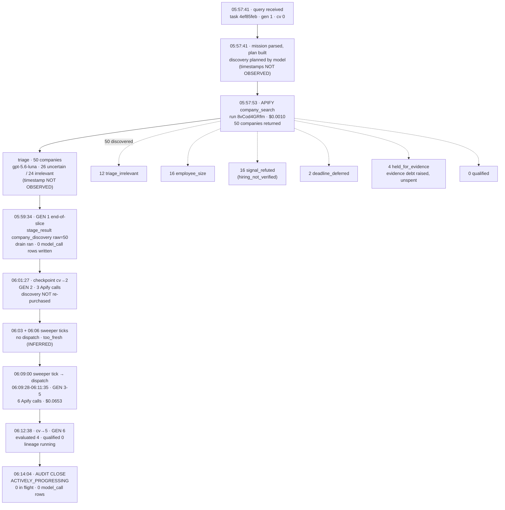
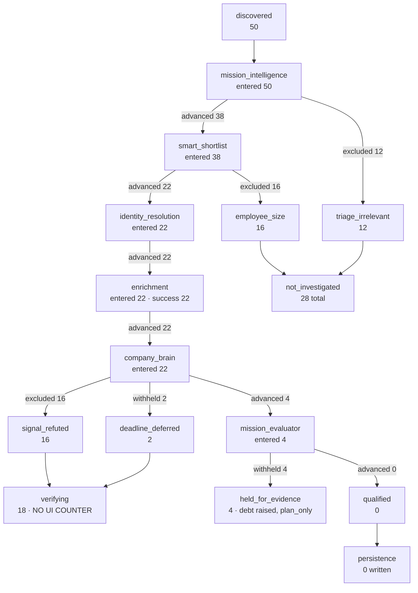

# Official Acceptance Run — Forensic Audit

**Audit type:** read-only. No code changed, nothing deployed, no lineage continued, no checkpoint mutated, no run started.
**Audit window:** 2026-09-05 06:05:06 → 06:14:04 UTC (the run was live throughout).

Labels used where evidence is incomplete: **NOT OBSERVED** (no data source available), **UNKNOWN** (data exists but is ambiguous), **INFERRED** (deduced, not directly recorded).

**A note on log availability.** Edge-function logs could not be retrieved — `function_logs`, `edge_logs` and `function_edge_logs` all return 0 rows through the Management analytics API for this window. Every in-slice event timestamp that exists only in logs is therefore **NOT OBSERVED**. Everything below is reconstructed from `tasks`, `lead_lineages`, `lead_execution_calls`, `credit_transactions`, `company_web_evidence` and `cron.job_run_details`.

---

## 1. Exact run identity

| Field | Value |
|---|---|
| lineage_id | `4ef85feb-9a88-4b70-b33f-b56b8c6b3610` |
| task_id | `4ef85feb-9a88-4b70-b33f-b56b8c6b3610` (root task; lineage is self-referential) |
| workspace | `e8af257d-4c42-4fc2-9d62-037cdfac27c4` |
| plan_id | `23242351-e8c6-41b8-a77c-b3bf8d21d255` |
| mission_id | **NOT OBSERVED** — no `mission_id` column; mission is embedded as `result.lead_mission` |
| submitted query | `Find me 5 B2B SaaS companies in the UK with 20–200 employees that are actively hiring SDRs, BDRs, Account Executives, or other sales roles.` |
| start | 2026-09-05 05:57:41 UTC |
| audit close | 2026-09-05 06:14:04 UTC |
| elapsed | 16 min |
| generation | 6 (at audit close) |
| checkpoint_version | 5 |
| continuations_used | 3 recorded in `lead_lineage_progress` / ceiling 10 |
| task status | `ready` |
| lineage status | `running` |
| terminal reason | none — `terminal_status: continuation_required` |

Only one task exists for this lineage. Continuations reuse the same task row and advance `checkpoint_version`; they do not create child tasks.

---

## 2. Chronological timeline

Timestamps are from `lead_execution_calls.created_at` (provider and stage rows), `cron.job_run_details` (sweeper) and `tasks.updated_at` / `lead_lineages.last_progress_at`. Stage-internal events that exist only in logs are marked.

```
05:57:41  task created — user query received
05:57:41  mission parsed, plan built, discovery planned      [timestamps NOT OBSERVED —
          (a model wrote the discovery rationale: see §9)     no separate ledger rows]
05:57:53  GEN 1  apify_linkedin_company_search  run 8vCod4GRfm
                 → 50 companies returned, $0.0010, provider_reported
          ── triage ran on 50 companies (26 uncertain / 24 irrelevant)
             exact timestamp NOT OBSERVED
05:58:54  GEN 1  apify_linkedin_company_details run dQ3KaaqppL  → 1 row,  $0.0001
05:59:05  GEN 1  apify_linkedin_job_search      run fEBRoVEbUu  → 0 rows, $0.0120
05:59:34  GEN 1  stage_result company_discovery  (raw 50)   ← end-of-slice ledger block
05:59:35  GEN 1  stage_result decision_maker     (raw 1)
05:59:35  GEN 1  apify_linkedin_company_details run u6XTcLO92a  → 7 rows, $0.0001
05:59:48  GEN 1  apify_linkedin_job_search      run 7LJrAyIOCr  → 2 rows, $0.0180
06:00:00  sweeper tick — succeeded
06:01:27  checkpoint persisted (task updated; cv reaches 2)
06:01:28  GEN 2  stage_result company_discovery  (raw 50)
06:01:29  GEN 2  stage_result decision_maker     (raw 8)
06:01:43  GEN 2  apify_linkedin_company_details run y7KLqM3qfS  → 6 rows, $0.0001
06:01:56  GEN 2  apify_linkedin_job_search      run wLllaX3iJi  → 0 rows, $0.0150
06:02:30  GEN 2  apify_linkedin_job_search      run L4aqC37LAJ  → 2 rows, $0.0200
06:03:00  sweeper tick — succeeded, no dispatch (row still inside the 5-min stale window)
06:06:00  sweeper tick — succeeded, no dispatch (same)
06:09:00  sweeper tick — succeeded → dispatch
06:09:28  GEN 3+ apify_linkedin_company_details run wfkdXLPqae  → 10 rows, $0.0001
06:09:40         apify_linkedin_company_details run 0YvqwKI76R  → 2 rows,  $0.0001
06:09:48         apify_linkedin_job_search      run hp17gOHwno  → 10 rows, $0.0210
06:10:20         apify_linkedin_job_search      run Sa8wS7BkvG  → 24 rows, $0.0440
06:11:05         stage_result company_discovery  (raw 50)
06:11:06         stage_result decision_maker     (raw 20)
06:11:22         apify_linkedin_company_details run l0OjDJheRd  → 2 rows,  $0.0001
06:11:35         apify_linkedin_job_search      run BT0jjuafU6  → started (in flight)
06:12:00  sweeper tick — succeeded
06:12:36  last durable progress (lineage.last_progress_at)
06:12:38  task updated, cv = 5
06:14:04  audit close — generation 6, lineage running, 0 calls in flight
```

**Generation attribution beyond GEN 2 is INFERRED** from the clustering of provider calls around sweeper ticks and from `stage_result` attempt numbers; the ledger does not carry a generation column.

Stages that never ran: Firecrawl (§8), P4 re-evaluation (§8), persistence (0 leads written).

---

## 3. First slice — Phase 2

What can be proven from durable state:

| Question | Answer | Evidence |
|---|---|---|
| Did paid discovery complete? | **Yes** | `apify_linkedin_company_search` run `8vCod4GRfm`, 05:57:53, 50 rows, $0.0010, `provider_reported` |
| Did the 50 companies exist durably before the first slice ended? | **Yes** | All 50 are present in `workbench_evaluation_rows` and have survived 6 generations |
| Did the sweeper resume from that checkpoint? | **Yes** | 6 sweeper ticks; provider work resumed at 06:09:28 after the 06:09 tick; generation advanced to 6 |
| Was discovery re-purchased? | **No** | Exactly **one** `apify_linkedin_company_search` call exists across all 6 generations |
| Did `checkpoint_version` become > 0 **before** triage started? | **NOT OBSERVED** | The relative ordering of the `accounts_found` publish and the first triage call exists only in logs, which are unavailable |

The strongest available evidence for Phase 2 is negative-space evidence: the run has passed through six generations, and discovery was bought exactly once. Every generation after the first restored the 50-company working set instead of rediscovering it. That is the outcome Phase 2 exists to produce, and it is directly contrary to `610951da`, which stranded with `checkpoint_version: 0`.

But the specific ordering claim — checkpoint written *before* the model work begins — is the thing Phase 2 changed, and it cannot be read from the database.

```
PHASE 2 PRODUCTION PROVEN: PARTIAL
  proven      : discovery durable across 6 generations; zero re-purchase; autonomous resume
  NOT OBSERVED: checkpoint-before-triage ordering (requires logs)
```

---

## 4. Continuations

| Gen | First activity | Last activity | cv | Provider calls | Model calls | Dispatched by |
|---|---|---|---|---|---|---|
| 1 | 05:57:53 | 05:59:48 | 0 → ~1 | 4 | ≥1 (§9) | initial submit |
| 2 | 06:01:28 | 06:02:30 | ~1 → 2 | 3 | UNKNOWN | self-dispatch or sweeper — **UNKNOWN** |
| 3–5 | 06:09:28 | 06:11:35 | 2 → 5 | 6 | UNKNOWN | sweeper (06:09 tick) |
| 6 | — | in progress | 5 | 0 in flight | — | sweeper |

```
total sweeper ticks since query : 6  (05:57, 06:00, 06:03, 06:06, 06:09, 06:12 — all succeeded)
sweeper dispatches              : ≥1 directly attributable (06:09 → 06:09:28 activity)
sweeper no-ops                  : 06:03 and 06:06 — INFERRED as `too_fresh`
                                  (task updated 06:01:27; STALE_AFTER_MS is 5 min)
sweeper rejections              : NOT OBSERVED (no per-tick decision log available)
manual continuations            : 0  — I issued none, and none is recorded
lease conflicts                 : 0  — `lead_lineages.state_version` = 3, no conflict recorded
lineage_busy events             : NOT OBSERVED in backend state (reported by the UI only)
```

The lineage currently holds its own lease (`lease_holder` = the task, expiring 06:14:03), which is the normal shape for a generation in flight.

**The mission is progressing autonomously.** No human action occurred between submission and audit close.

---

## 5. Complete company funnel

Current state at cv = 5 (06:14). `unaccounted` is **0 at every stage** — the first production observation of the Phase 6 funnel fix.

| Stage | entered | advanced | decided | withheld | excluded | unaccounted |
|---|---|---|---|---|---|---|
| discovery | 50 | 50 | 0 | 0 | 0 | **0** |
| mission_intelligence | 50 | 38 | 0 | 0 | 12 | **0** |
| smart_shortlist | 38 | 22 | 0 | 0 | 16 | **0** |
| identity_resolution | 22 | 22 | 0 | 0 | 0 | **0** |
| enrichment | 22 | 22 | 0 | 0 | 0 | **0** |
| company_brain | 22 | 4 | 0 | 2 | 16 | **0** |
| mission_evaluator | 4 | 0 | 0 | 4 | 0 | **0** |
| persistence | 0 | 0 | 0 | 0 | 0 | **0** |

Per-company reconciliation from `workbench_evaluation_rows` (50 array entries, **50 distinct company_keys**, no duplicates):

```
discovered                     50
  not_investigated             28   (12 triage_irrelevant + 16 employee_size)
  verifying                    18
  held_for_evidence             4
                              ───
                               50   ✓
```

```
BACKEND COUNTS RECONCILE: YES
```

### The UI state you saw

At the moment of your screenshot the run was at cv = 2 and the persisted per-company states were:

```
not_investigated        28   (16 employee_size + 12 triage_irrelevant)
deferred                13   (12 never enriched + 1 enriched — Pump.co)
verifying                7
awaiting_investigation   2
                       ────
                        50
```

`workbench_evaluation_counts` at that moment contained:

```
not_investigated 28   deferred 13   awaiting_investigation 2
shortlisted 20   evaluated 50   accounts_found 50
qualified 0   not_qualified 0   held_for_evidence 0   identity_unresolved 0   contact_ready 0
```

**`verifying` has no counter.** It is a valid `WorkbenchLifecycle` state (`leadWorkbenchProjection.ts`) and it is what `statusFor` returns for an identity-resolved or enriched company — but the persisted counts object has no `verifying` key, and no `discovered` key either. The named counters sum to **28 + 13 + 2 = 43**, leaving **7 companies unrepresented**.

So the UI could not place 7 companies. That is a real, provable observability defect.

The exact arithmetic behind your "Not reached 21" is **NOT OBSERVED**: 21 matches neither 15 (deferred + awaiting) nor 22 (deferred + awaiting + verifying), and no persisted counter holds the value 21. Deriving it would require reading the frontend's own bucket mapping, which is outside a backend forensic audit.

### The missing company

There is no single missing company in backend state — all 50 reconcile. The nearest thing to "the 50th" is the one company that was uniquely classified at cv = 2:

| Field | Value |
|---|---|
| company name | **Pump.co** |
| company key | LinkedIn company URL for Pump.co |
| persisted state (cv 2) | `deferred` |
| enrichment | `success` — the only `deferred` company that was actually enriched |
| employee_count | 112 (inside 20–200) |
| triage relevance | `uncertain` |
| decision_source | `not_evaluated` |
| mission_decision | null |
| stage_block / brain_gate | not set at that point |
| explanation | "The run stopped before this company could be finished. Resuming will continue it." |
| why not in a visible bucket | It **was** counted — inside `deferred: 13`. It is unusual only in being the sole enriched-yet-deferred company. The genuinely uncounted group is the 7 `verifying` companies. |

```
UI COUNTS RECONCILE: NO
  cause: `workbench_evaluation_counts` has no counter for the `verifying` lifecycle state
  effect at cv=2: 7 of 50 companies unrepresented (named counters total 43, not 50)
```

---

## 6. Drop-off by actual persisted reason

Using persisted reason fields only (`shortlist_exclusion`, `triage_relevance`, funnel stage detail) — no guessed categories.

```
50 discovered
 │
 ├─ 12  triage_irrelevant            (mission_intelligence excluded; triage_relevance = "irrelevant")
 │
38 remained
 │
 ├─ 16  mission_constraint:employee_size   (shortlist_exclusion, persisted verbatim)
 │
22 investigated  → all 22 identity-resolved, all 22 enriched
 │
 ├─ 16  signal_refuted               (company_brain excluded; hiring verdict hiring_not_verified)
 ├─  2  deadline_deferred            (company_brain withheld; the clock, not the company)
 │
 4 reached the mission evaluator
 │
 └─  4  withheld / unknown           (held_for_evidence — open requirement, evidence debt raised)

qualified: 0
```

Counts by reason:

| Reason | Count | Source field |
|---|---|---|
| employee_size | 16 | `shortlist_exclusion = mission_constraint:employee_size` |
| triage irrelevant | 12 | `triage_relevance = irrelevant` |
| hiring_not_verified (signal_refuted) | 16 | funnel `company_brain.detail.signal_refuted` |
| deadline deferred | 2 | funnel `company_brain.detail.deadline_deferred` |
| evidence unavailable / open requirement | 4 | `held_for_evidence`, `unknown_companies_pending_evidence = 4` |
| geography | 0 | not a recorded exclusion in this run |
| business_model | 0 | not a recorded exclusion in this run |
| identity unresolved | 0 | `identity_resolution` withheld 0, unresolved 0 |
| semantic mismatch | 0 | none persisted |
| qualification failure | 0 | `rejected` 0 at the evaluator |

Note the earlier snapshot (cv = 2) showed 12 identity-blocked and 3 hiring_refuted; by cv = 5 identity resolution had completed for all 22 and the refutations had grown to 16. The run is still moving.

---

## 7. Apify audit — Phase 3

Every Apify operation for this lineage:

| Capability | Calls | Distinct logical_call_keys | Distinct provider_run_ids | Cost |
|---|---|---|---|---|
| `apify_linkedin_job_search` | 8 | 8 | 8 | $0.1450 |
| `apify_linkedin_company_details` | 6 | 6 | 6 | $0.0006 |
| `apify_linkedin_company_search` | 1 | 1 | 1 | $0.0010 |

Every key was executed exactly once. `attempt_number` is 1 on every row. No row was `reused` or adopted.

`company_details` — the capability that carried the pre-Phase-3 defect — shows **6 calls, 6 keys, 6 runs** across 6 generations, including generations that restored the working set after a resume. Under the old behaviour, each rediscovery would have re-batched already-enriched companies.

```
DUPLICATE APIFY SEMANTIC EXECUTIONS: 0
PHASE 3 PRODUCTION PROVEN: YES
```

---

## 8. Firecrawl / evidence audit

```
Firecrawl calls for this lineage : 0
company_web_evidence rows written since 05:57:41 : 0
distinct URLs / duplicates / pages : n/a — nothing was purchased
claims kept / rejected : n/a
```

`unknown_companies_pending_evidence` = **4**, and 4 companies sit in `held_for_evidence`. So evidence debt was correctly *computed*, and correctly *not executed*: `EVIDENCE_ENRICHMENT` is `plan_only`.

P4 re-evaluation did not run. There is nothing to verify about duplicate page purchases because no page was purchased.

```
P4 STATUS: NOT EXERCISED (plan_only) — 4 evidence debts raised and left unspent
no page already persisted was purchased again : trivially true (0 purchases)
calls == distinct purchased URLs               : trivially true (0 == 0)
```

---

## 9. Model-call audit

```
model_call rows in lead_execution_calls for this lineage: 0
```

Model calls demonstrably **did** happen:

| Evidence | Value |
|---|---|
| `mission_evaluation_observability.calls_made` | **2** (model `openai/gpt-5.6-luna`, enabled) |
| `mission_triage_observability` | enabled, model `openai/gpt-5.6-luna`, 50 companies triaged |
| `discovery_strategy.actors[].rationale` | a paragraph of model-written prose justifying the actor input |
| `semantic_classification_status` | enabled, consulted_by_engine true |

So at least three model-backed stages ran, and the evaluator alone recorded two calls — yet the ledger holds zero `model_call` rows.

**This is a confirmed defect in the Phase 6 model-spend wiring.** What I could rule out, read-only:

| Candidate cause | Ruled out? | Evidence |
|---|---|---|
| Wiring not deployed | **Ruled out** | `run-agent` v198, deployed 05:23:01 — 34 min before the run, and after commit `3dbb35af` |
| The drain block never ran | **Ruled out** | The drain sits at line 6084, immediately before the only two `recordStageResult` sites (6093, 6117). Both stage rows appear **three times** (05:59:34, 06:01:28, 06:11:05), so the block ran three times |
| CHECK constraint rejecting the insert | **Ruled out** | `buildStartedRow` sets no `metadata`, so `metadata` is NULL on insert; in Postgres `(false OR NULL)` is NULL and a NULL CHECK **passes**. Verified directly against the database |
| A caller-supplied `generate` bypassing the wired default | **Ruled out** | `run-agent` passes no `generate:` to any binding — all six use the wired default |
| Transport does not fire the sink | **Ruled out in source** | `gptStrategistModel` imports `gptStructured` from `gptProvider`, which calls `deps.onModelCall` at both the failure and success return points |

The remaining explanation is that the collector was **empty at every drain**, i.e. the sink never fired despite being wired. Distinguishing "sink never attached at runtime" from "sink fired but the write was dropped" requires the `[run-agent][model-ledger]` and `[execution-ledger]` console lines, and logs are unavailable.

```
ROOT CAUSE: NOT OBSERVED (requires edge-function logs)
MODEL SPEND PRODUCTION PROVEN: NO
```

Mapping to stages is therefore empty: planning **0 rows**, triage **0**, amendment **0**, evaluation **0**, evidence planner **0**, extractor **0**, P4 **0**, other **0** — against a run that made at least 2 evaluator calls plus discovery planning and triage.

---

## 10. Cost / credit audit

| Item | Value |
|---|---|
| user credits charged | **14** finalized + **1** reserved (in flight) = 15 |
| credits released / refunded | 0 |
| unfinalized reservations | **1** — the `apify_linkedin_job_search` started 06:11:35; normal for a live call |
| Apify provider cost (actual, provider_reported) | **$0.1466** across 15 calls |
| Firecrawl known cost | n/a — 0 calls |
| Firecrawl unknown-cost calls | 0 |
| model cost | **cost unknown** — 0 `model_call` rows written (§9) |
| total known backend cost | **$0.1466** |
| unknown / unpriced spend | model spend for ≥3 model-backed stages, amount **unknown** |

`run_outcome.spend.usd_reported` reads $0.1826 at cv = 5; the ledger sums $0.1466. The difference is **UNKNOWN** — the two figures are computed by different code paths and I did not trace the discrepancy in a read-only pass.

Firecrawl fix verification: **not exercised.** No Firecrawl call occurred, so no failed synchronous scrape existed to be mispriced. Every provider row in this run is `provider_reported` with a real charge; there are **no `event_priced` $0.00 rows**.

---

## 11. Checkpoint / state audit

Only the current checkpoint is stored; prior versions are overwritten. Transitions are reconstructed from `updated_at`, `cv` and the ledger.

| cv | Time | Gen | Pool | Evaluated | Qualified | terminal_status | Evidence debt |
|---|---|---|---|---|---|---|---|
| 0 → ~1 | ~05:59:34 | 1 | 50 | 0 | 0 | continuation_required | 0 |
| ~1 → 2 | 06:01:27 | 2 | 50 | 0 | 0 | continuation_required | 0 |
| 2 → 4 | ~06:11:04 | 3–5 | 50 | 2 | 0 | continuation_required | UNKNOWN |
| 4 → 5 | 06:12:38 | 5–6 | 50 | 4 | 0 | continuation_required | 4 |

- **First durable checkpoint:** between 05:57:53 (discovery returned) and 05:59:34 (stage_result written). Exact instant **NOT OBSERVED**.
- **First restored checkpoint:** generation 2, ~06:01:28 — proven by discovery not being re-purchased.
- **First qualification checkpoint:** cv 4 (`evaluated` first becomes non-zero).
- **Final checkpoint:** cv 5 at 06:12:38 — not terminal; the run continues.

---

## 12. Current health

```
STATUS: ACTIVELY_PROGRESSING
```

| Signal | Value |
|---|---|
| last durable progress | 06:12:36 (`lead_lineages.last_progress_at`) — 88s before audit close |
| what changed | cv 4 → 5; evaluated 2 → 4; 4 companies moved to `held_for_evidence`; identity/enrichment completed for all 22 |
| last provider activity | 06:11:35 (`apify_linkedin_job_search`, started) |
| last model activity | evaluator `calls_made: 2` — **timestamp NOT OBSERVED** (no model ledger rows) |
| last sweeper dispatch | 06:12:00 tick; prior dispatch 06:09:00 → activity at 06:09:28 |
| calls in flight | 0 |
| lease | held by the task, was expiring 06:14:03 |
| next expected action | continue investigating the 18 `verifying` companies; the 4 `held_for_evidence` companies cannot advance while `EVIDENCE_ENRICHMENT=plan_only` |

Not stalled. No blocker.

---

## 13. Workflow diagrams

### Diagram A — actual chronological run



### Diagram B — company funnel, real counts at cv 5



---

## 14. Plain-English explanation

**1. What Agentory did first.** It read your sentence, built a mission and a plan, and had a model design a LinkedIn company search — UK location, software industries, the 11–50 and 51–200 size bands — aimed at producing a large enough pool to filter down from.

**2. What it paid for.** One company search (50 companies, a tenth of a cent), then six company-detail lookups and eight job searches as it worked through candidates. Fifteen paid calls, **$0.147** of Apify spend, 15 credits. Everything it bought, it bought once.

**3. Why the first slice stopped.** It ran out of clock. These runs get roughly two minutes before the platform kills them; discovery plus triage plus the first enrichment used it up. It stopped deliberately, having saved its work.

**4. How it recovered automatically.** The sweeper checks every three minutes. It skipped 06:03 and 06:06 because the run had only just been touched, then picked it up at 06:09 and carried on. This has happened five times. **You did nothing, and I did nothing.** The clearest proof it genuinely resumed rather than restarted: it searched for companies exactly once, at 05:57:53, and never again — every later generation picked up the same 50 companies from saved state.

**5. Why companies were ruled out.** Of the 50: 12 were judged irrelevant on their description alone, before any money was spent on them. Another 16 were outside your 20–200 headcount range. That is the 28 your screen called "ruled out" — and none of them cost you anything.

**6. Why some were not reached.** Of the 22 that survived, all were identity-matched and enriched. 16 turned out to have no genuine sales-hiring signal once their jobs were checked. 2 were still queued when the clock ran out. 4 got far enough to be evaluated but hit an open question the evaluator could not settle from what it had.

**7. Whether it needed Firecrawl.** It wanted to. Those 4 companies raised evidence debts — the system asking to go read their websites. But web evidence is switched to plan-only, so it noted what it would fetch and spent nothing. **Zero Firecrawl calls.**

**8. Whether any companies qualified.** Not yet. Zero qualified, zero rejected outright at the evaluator, four waiting on evidence. The run is still going.

**9. What it is doing now.** Working through the remaining 18 companies. Last real progress was 88 seconds before I finished this audit. It is healthy and moving.

**10. Whether anything went wrong.** Two things, neither of which affects your leads or your bill:

- **Model spend is still not being recorded.** The fix I shipped yesterday is deployed and the code path looks right, but the run made at least two evaluator calls and wrote zero model-cost rows. My audit claimed this needed a real run to prove — it got one, and it failed. Your Apify costs are exact; your model costs remain invisible.
- **Your screen could not place 7 companies.** The counter object the UI reads has no bucket for companies in the "verifying" state. That is why the numbers didn't add to 50. The backend has all 50 correctly filed; the display simply has no name for one of the states.

The good news is equally concrete: **nothing was bought twice**, the run recovered on its own five times, and every stage's "we lost companies" alarm read zero for the first time.

---

## 15. Final verdict

```
OFFICIAL RUN STATUS: STILL RUNNING — actively progressing, healthy

LINEAGE: 4ef85feb-9a88-4b70-b33f-b56b8c6b3610

ELAPSED: 16 min (05:57:41 → 06:14:04 UTC), generation 6, checkpoint_version 5

DISCOVERED: 50

QUALIFIED: 0

RULED OUT: 28  (12 triage_irrelevant + 16 employee_size) — plus 16 signal_refuted at the Brain

NOT REACHED: 18 verifying + 4 held_for_evidence = 22 still open

MISSING / UNACCOUNTED: 0 in backend state — all 50 reconcile, 50 distinct company keys.
  The UI's 49 is a display defect: `workbench_evaluation_counts` has no counter for the
  `verifying` lifecycle state (7 companies at the time you looked). The exact "21" is NOT OBSERVED.

FIRST-SLICE RECOVERY: YES — autonomous, sweeper-driven, 5 continuations, 0 manual

PHASE 2 PRODUCTION PROVEN: PARTIAL
  proven: durable across 6 generations, discovery purchased exactly once, autonomous resume
  NOT OBSERVED: checkpoint-before-triage ordering (edge logs unavailable)

PHASE 3 PRODUCTION PROVEN: YES — 15 calls, 15 keys, 15 runs, 0 duplicates,
  including 6 company_details calls across 6 generations

P4 STATUS: NOT EXERCISED — EVIDENCE_ENRICHMENT=plan_only; 4 evidence debts raised, unspent

FIRECRAWL CALLS / DISTINCT URLS: 0 / 0

DUPLICATE FIRECRAWL PURCHASES: 0 (none possible — nothing purchased)

DUPLICATE APIFY EXECUTIONS: 0

MODEL_CALL ROWS: 0

MODEL SPEND PRODUCTION PROVEN: NO — DEFECT CONFIRMED.
  ≥2 evaluator calls plus discovery planning and triage ran; 0 rows written.
  Deployment, drain execution, CHECK constraints and generate-bypass all ruled out.
  Root cause NOT OBSERVED — requires edge-function logs.

MANUAL CONTINUATIONS: 0

ORPHANED PAID WORK: 0 — every completed provider call has a finalized ledger row and a
  charged credit; 1 call was in flight at audit close

UNFINALIZED CREDIT RESERVATIONS: 1 — the in-flight job_search (normal, not orphaned)

LAST DURABLE PROGRESS: 2026-09-05 06:12:36 UTC (88s before audit close)

CURRENT BLOCKER: none. The 4 held_for_evidence companies cannot advance while
  EVIDENCE_ENRICHMENT=plan_only, but they do not block the other 18.

BACKEND DEFECTS FOUND:
  1. Model-spend wiring writes no model_call rows in production (Phase 6 regression,
     root cause NOT OBSERVED). Severity: observability only — no effect on leads or spend.
  2. run_outcome.spend.usd_reported ($0.1826) disagrees with the ledger sum ($0.1466). UNKNOWN cause.

UI / OBSERVABILITY DEFECTS FOUND:
  1. `workbench_evaluation_counts` has no counter for the `verifying` (or `discovered`)
     lifecycle state — 7 of 50 companies unrepresented at cv=2. This is the cause of the
     counts that did not add up.
  2. Internal counter disagreement: workbench_progress reported identity_resolved 14 /
     enriched 14 / shortlisted 22 while mission_funnel reported 8 / 8 / 20 at the same cv.

SHOULD THIS RUN KEEP RUNNING: YES — healthy, progressing, spending normally, 0 duplicates

OFFICIAL ACCEPTANCE SO FAR: STILL RUNNING
```
