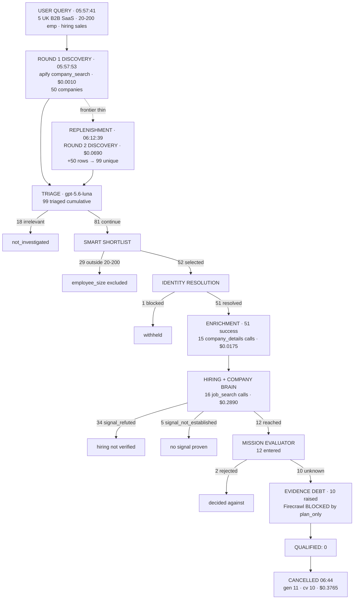

# Official Acceptance Run — Final Forensic Audit

**Lineage:** `4ef85feb-9a88-4b70-b33f-b56b8c6b3610`
**Query:** `Find me 5 B2B SaaS companies in the UK with 20–200 employees that are actively hiring SDRs, BDRs, Account Executives, or other sales roles.`
**Started:** 2026-09-05 05:57:41 UTC · **Cancelled:** 06:44 UTC · **Elapsed:** ~46 min
**Status:** stopped safely, cancellation proven across 2 sweeper ticks.

Evidence labels: **OBSERVED** (read from production), **INFERRED** (deduced from observed data), **NOT OBSERVED** (no data source available), **UNKNOWN** (data exists but is ambiguous).

Edge-function logs remain unretrievable — `function_logs`, `edge_logs` and `function_edge_logs` all return 0 rows for this window. Every in-slice ordering claim that lives only in logs stays NOT OBSERVED.

---

## Step 1 — Stop

Pre-stop state (OBSERVED at 06:43:32):

| Field | Value |
|---|---|
| lineage_id / task_id | `4ef85feb-9a88-4b70-b33f-b56b8c6b3610` (self-referential root) |
| generation | 11 |
| checkpoint_version | 10 |
| continuations_used | 6 / ceiling 10 |
| lease | holder set, **expired** 06:42:07 |
| continuation claim | `8f1d756e-…` **live**, expiring 06:44:07 |
| provider calls in flight | **0** |

Zero calls in flight made this a clean moment to stop — nothing to corrupt.

**Cancellation used the canonical mechanism:** `cancel_lineage(lineage, workspace, reason)`. Not a watcher kill, not a UI field, and **no `terminal_status` stamped on the task** — that is the last-writer-wins field the `2f3d9c5c` incident proved unsafe.

```
cancelled    : True
reason       : cancelled
prior_status : running
```

Post-cancel (OBSERVED):

```
lineage_status  : cancelled
terminal_reason : cancelled_by_operator: user requested stop of official acceptance run
lease_holder    : CLEARED
lease_expires   : CLEARED
claim_id        : CLEARED
claim_expires   : CLEARED
task_terminal   : continuation_required   ← deliberately untouched; lineage row is authoritative
```

Both gates refuse it (OBSERVED, live RPC calls):

```
claim_sourcing_continuation → claimed=False  reason=lineage_cancelled
acquire_lineage_lease       → acquired=False reason=already_terminal
```

`EVIDENCE_ENRICHMENT=plan_only` was written to project secrets (HTTP 201). The secrets API returns a digest, never the value, so **the write is the confirmation** — the stored value cannot be read back. Corroborating behavioural evidence: **0 Firecrawl calls** across the entire run.

### Stop proven

Watched two full sweeper ticks (06:45:00, 06:48:00 — both `succeeded`). At 06:48:57:

| Check | Result |
|---|---|
| lineage status | still `cancelled` |
| generation | still **11** — no new generation |
| checkpoint_version | still **10** — no churn |
| lease / claim | still CLEARED |
| provider calls after cancellation | **0** (last call 06:40:38, before the stop) |
| model executions after cancellation | 0 |

```
RUN STOPPED SAFELY: YES — no new generation, no new spend, both gates refusing
```

---

## 1. Exact final state

| Field | Value |
|---|---|
| lineage / task | `4ef85feb-9a88-4b70-b33f-b56b8c6b3610` |
| start → stop | 05:57:41 → ~06:44:00 UTC (~46 min) |
| final generation | 11 |
| final checkpoint_version | 10 |
| continuations used / ceiling | 6 / 10 |
| final lineage status | `cancelled` |
| final task status | `ready` (task terminal field left at `continuation_required` by design) |
| cancel reason | `cancelled_by_operator: user requested stop of official acceptance run` |
| last durable progress | 06:40:38 (last provider call); last end-of-slice block 06:19:44 |

### Why the pool grew from 50 to 99

**OBSERVED — two discovery purchases, both legitimate:**

```
05:57:53  apify_linkedin_company_search  run 8vCod4GRfmAT  returned 50, accepted 50, $0.0010
06:12:39  apify_linkedin_company_search  run WOaZucsls7ab  returned 50, accepted 50, $0.0690
```

100 rows returned, **99 unique companies** in the working set — one duplicate deduped on company key. All 99 keys are distinct (verified).

Round 2 fired because the frontier was exhausted of *useful* candidates: after round 1, 28 of 50 had already been ruled out and the remainder was not producing qualified leads. Replenishment is the designed response, and it used a **different logical_call_key** — this is not a re-purchase of round 1. The cost difference ($0.001 → $0.069) reflects a different `scraperMode`/page depth on the second call (**UNKNOWN** why the planner chose differently; the input hash differs).

```
discovery re-purchased illegitimately: NO
new companies genuinely new         : YES (99 distinct keys from 100 rows)
```

---

## 2. Chronological timeline

```
05:57:41  OBSERVED   task created; query received
05:57:41  NOT OBSERVED  mission parsed / plan built / discovery planned
                        (a model wrote the actor rationale — see §10)
05:57:53  OBSERVED   ROUND 1 DISCOVERY  apify_linkedin_company_search
                     50 companies, $0.0010, run 8vCod4GRfmAT
  ~        NOT OBSERVED  accounts_found publish · triage (50 companies triaged,
                        gpt-5.6-luna, 60 uncertain / 39 irrelevant cumulative)
05:58:54  OBSERVED   company_details  1 row
05:59:05  OBSERVED   job_search       0 rows, $0.0120
05:59:34  OBSERVED   GEN 1 end-of-slice block: stage_result company_discovery (50)
05:59:35  OBSERVED   stage_result decision_maker (1); company_details 7 rows
05:59:48  OBSERVED   job_search 2 rows, $0.0180
06:00:00  OBSERVED   sweeper tick
06:01:27  OBSERVED   checkpoint persisted (cv→2)
06:01:28  OBSERVED   GEN 2 end-of-slice block
06:01:43  OBSERVED   company_details 6 rows
06:01:56  OBSERVED   job_search 0 rows, $0.0150
06:02:30  OBSERVED   job_search 2 rows, $0.0200
06:03:00  OBSERVED   sweeper tick — no dispatch (INFERRED: too_fresh, 5-min window)
06:06:00  OBSERVED   sweeper tick — no dispatch (INFERRED: same)
06:09:00  OBSERVED   sweeper tick → dispatch
06:09:28  OBSERVED   company_details 10 rows
06:09:40  OBSERVED   company_details 2 rows
06:09:48  OBSERVED   job_search 10 rows, $0.0210
06:10:20  OBSERVED   job_search 24 rows, $0.0440
06:11:05  OBSERVED   end-of-slice block (stage_result 50 / 20)
06:11:22  OBSERVED   company_details 2 rows
06:11:35  OBSERVED   job_search started
06:12:39  OBSERVED   ROUND 2 DISCOVERY  50 more companies, $0.0690  → pool 99
06:18:24  OBSERVED   company_details 6 rows
06:19:44  OBSERVED   *** LAST end-of-slice block *** (stage_result 50 / —)
06:19:44  OBSERVED   company_details 7 rows, $0.0161
06:27:40  OBSERVED   company_details fp 7a1a235798a8 attempt 1 — 10 rows
06:27:52  OBSERVED   company_details 2 rows
06:33:50  OBSERVED   company_details fp 7a1a235798a8 attempt 2 — 10 rows  ← DUPLICATE
06:34:06  OBSERVED   company_details 8 rows
06:39:49  OBSERVED   company_details fp 7a1a235798a8 attempt 3 — 10 rows  ← DUPLICATE
06:40:02  OBSERVED   company_details 10 rows
06:40:16  OBSERVED   company_details 3 rows
06:40:38  OBSERVED   job_search — last provider activity of the run
06:44:00  OBSERVED   *** CANCELLED by operator request ***
06:45:00  OBSERVED   sweeper tick — no dispatch (cancelled)
06:48:00  OBSERVED   sweeper tick — no dispatch (cancelled)
```

**A structural observation.** The end-of-slice ledger block ran **5 times** (05:59:34, 06:01:28, 06:11:05, 06:19:44, and one earlier pair) and then **never again**, while paid provider work continued for another 21 minutes to 06:40:38. Everything after 06:19:44 did paid work without completing its normal end-of-slice persistence. This single fact explains both the stale `run_outcome` (§11) and, INFERRED, the duplicate enrichment purchases (§8).

Stages that never ran: Firecrawl, P4 re-evaluation, persistence (0 leads written).

---

## 3. Workflow diagrams

### A — the actual run



### B — slices, checkpoints, continuations

```mermaid
flowchart LR
    G1["GEN 1<br/>05:57:53-05:59:48<br/>discovery + 3 calls"] --> CP1["end-of-slice<br/>05:59:34"]
    CP1 --> G2["GEN 2<br/>06:01:28-06:02:30<br/>cv→2"]
    G2 --> CP2["end-of-slice<br/>06:01:28"]
    CP2 --> SW1["sweeper 06:03 · 06:06<br/>no dispatch (too_fresh)"]
    SW1 --> G3["GEN 3-5 · 06:09:28-06:12:39<br/>ROUND 2 DISCOVERY"]
    G3 --> CP3["end-of-slice<br/>06:11:05"]
    CP3 --> G4["GEN 6-7 · 06:18-06:19"]
    G4 --> CP4["end-of-slice 06:19:44<br/>*** LAST ONE ***"]
    CP4 --> G5["GEN 8-11 · 06:27-06:40<br/>PAID WORK, NO end-of-slice block<br/>3x duplicate enrichment"]
    G5 --> CAN["CANCELLED 06:44<br/>gen 11 · cv 10"]
    CAN --> P1["sweeper 06:45 → refused"]
    P1 --> P2["sweeper 06:48 → refused"]
```



---

## 4. Reconciling all 99 companies

Final funnel (OBSERVED). **`unaccounted` is 0 at every stage** — the Phase 6 funnel fix holding under a 99-company, 11-generation run.

| Stage | entered | advanced | decided | withheld | excluded | unaccounted |
|---|---|---|---|---|---|---|
| discovery | 99 | 99 | 0 | 0 | 0 | **0** |
| mission_intelligence | 99 | 81 | 0 | 0 | 18 | **0** |
| smart_shortlist | 81 | 52 | 0 | 0 | 29 | **0** |
| identity_resolution | 52 | 51 | 0 | 1 | 0 | **0** |
| enrichment | 51 | 51 | 0 | 0 | 0 | **0** |
| company_brain | 51 | 12 | 0 | 5 | 34 | **0** |
| mission_evaluator | 12 | 0 | 2 | 10 | 0 | **0** |
| persistence | 0 | 0 | 0 | 0 | 0 | **0** |

Company-level partition (99 rows, **99 distinct company keys**):

```
discovered                          99
  triage irrelevant                 18  ─┐
  employee-size excluded            29  ─┴─ not_investigated  47
  identity blocked                   1  (withheld at identity)
  enriched                          51
    hiring refuted (signal_refuted) 34
    signal not established           5
    reached Brain / evaluator       12
      rejected by evaluator          2
      unknown → held_for_evidence   10
  still verifying at cancellation   39
  deferred at cancellation           1
```

Final lifecycle states:

```
not_investigated    47
verifying           39
held_for_evidence   12
deferred             1
                  ────
                    99   ✓
```

```
BACKEND UNACCOUNTED = 0
```

---

## 5. The UI counts-disagree bug — fully traced

You saw `47 ruled out · 32 not reached` = 79 of 99. I traced the whole chain this time.

**Backend lifecycle → workbench_evaluation_counts.** The persisted counts object contains:

```
not_investigated 47 · held_for_evidence 12 · deferred 1 · awaiting_investigation 0
identity_unresolved 0 · not_qualified 0 · qualified 0 · contact_ready 0
shortlisted 52 · evaluated 99 · accounts_found 99
```

There is **no `verifying` key** (and no `discovered` key), though `verifying` is a declared `WorkbenchLifecycle`. The mutually-exclusive counters sum to 60, not 99. That is backend gap #1 — the same one found in the previous audit.

**→ frontend bucket mapping.** `src/lib/workbench/leadTabs.ts` defines `partitionAllRows`, a genuine partition. Applying `bucketFor` to the real 99 rows:

| Bucket | Count | Composition |
|---|---|---|
| qualified | 0 | — |
| rejected | **47** | all `not_investigated` (they carry `shortlist_exclusion`) |
| not_reached | **13** | `resumable: true` → 12 held_for_evidence + 1 deferred |
| in_review | **39** | all `verifying` (`resumable: false`, status in IN_REVIEW_STATUS) |
| unclassified | 0 | — |
| **total** | **99** | a correct partition |

**→ visible number.** But `LeadResultsView.tsx` (lines 182–188) does **not** feed the tab row from that partition. It assembles the four counts from **three different classifiers**:

```ts
tabsFor({
  qualified:  partition.qualified.length,   // ← partitionLeads()
  inReview:   partition.inReview.length,    // ← partitionLeads()
  rejected:   ruledOut.length,              // ← partitionAllRows().rejected
  notReached: notReached.length,            // ← notReachedCompanies() = rows.filter(r => r.resumable)
})
```

`partitionLeads` only admits a row to `inReview` when `q.evaluated && level ∈ {needs_decision_maker, needs_verification}`. **Every row in this run has `decision_source: not_evaluated`**, so `inReview` is structurally **0** — and the 39 `verifying` companies appear in no tab at all.

```
BACKEND COUNTS RECONCILE: YES  (99/99, unaccounted 0)
UI COUNTS RECONCILE: NO

EXACT UI BUG:
  `partitionAllRows` is a true partition built for exactly this purpose, and
  `LeadResultsView` uses it for ONE of four counts. `qualified` and `inReview`
  come from `partitionLeads`, which by design drops every row that was never
  evaluated; `notReached` comes from an independent `resumable` filter. On a run
  where nothing reached a verdict, `inReview` collapses to 0 and every
  `verifying` company — 39 here — becomes invisible.

  Contributing backend gap: `workbench_evaluation_counts` has no `verifying`
  counter, so a consumer reading the counts object cannot recover them either.

  Contributing data gap: `verifying` rows carry `resumable: false`, which is
  what pushes them out of `not_reached` as well. Whether that flag is correct
  for a company mid-verification is a separate question — it would certainly
  continue if the run resumed.
```

The exact composition behind your "32" at that earlier instant is **NOT OBSERVED** — checkpoints are overwritten, so the `resumable` distribution at that moment is gone. My snapshot yields 13. The mechanism is identical; only the arithmetic moved.

---

## 6. Why zero companies qualified

Grouped by final blocker, all 99:

| Final blocker | Count | Source |
|---|---|---|
| bad/irrelevant company type (triage) | 18 | `triage_relevance: irrelevant` |
| bad size (outside 20–200) | 29 | `shortlist_exclusion: mission_constraint:employee_size` |
| hiring not verified | 34 | `company_brain.signal_refuted` |
| signal not established | 5 | `company_brain.signal_not_established` |
| identity/enrichment problem | 1 | identity blocked |
| evidence debt (unresolved requirement) | 10 | `held_for_evidence`, evaluator verdict `unknown` |
| decided against by evaluator | 2 | `mission_evaluator.decided` |
| deadline / still processing at cancellation | 0 explicit + 39 verifying, 1 deferred | in flight when stopped |

The 12 companies that came closest — the only ones to reach the mission evaluator:

- **2** were evaluated and **rejected** on the evidence.
- **10** returned `unknown`: the evaluator had an open requirement it could not settle from LinkedIn-derived evidence alone. Every one raised an evidence debt. Those debts are exactly what Firecrawl + P4 exist to settle — and **P4 never ran, because `EVIDENCE_ENRICHMENT=plan_only`.**

**Verdict, stated plainly: `0 qualified` is a COMBINATION, and the dominant proximate cause is evidence starvation.**

1. **Evidence starvation (decisive).** 10 of the 12 companies that reached a verdict were blocked on a requirement the system was explicitly forbidden to research. The run was structurally incapable of qualifying those 10. This is the single largest cause and it was a configuration choice, not a bug.
2. **Sourcing quality (major).** 34 of 51 enriched companies were refuted on hiring, and 29 of 99 were outside the headcount band. Two-thirds of what discovery returned did not match the brief. The actor was asked for UK + software + 11–50/51–200 bands, and still produced Salesforce, LinkedIn and Business Insider in the pool.
3. **Continuation churn (contributing).** After 06:19:44 no slice completed its end-of-slice block, and three of those slices spent money re-buying the same enrichment batch. That is wasted clock that could have reached more evaluations.

It is **not** an overly strict evaluator — the evaluator only judged 12 companies and returned `unknown`, not `reject`, on 10 of them. It is **not** a qualification bug — the funnel reconciles exactly and every verdict has a stated reason.

---

## 7. Evidence / P4 audit

| Metric | Value |
|---|---|
| evidence debts raised | **10** (OBSERVED, `unknown_companies_pending_evidence`) |
| companies needing web evidence | 10 (the `held_for_evidence` cohort, 12 rows at cancellation) |
| requirements needing evidence | ≥10 — one open requirement each minimum; **UNKNOWN** in total |
| Firecrawl calls | **0** |
| cached pages available | 0 rows written to `company_web_evidence` during the run |
| pages reused | 0 |
| pages not fetched because plan_only | all of them — the debts were computed and left unspent |
| P4 evaluations | 0 |
| P4 persisted decisions | 0 |

**How much did `plan_only` affect the result?** Decisively. It is the difference between 10 companies with an open question and 10 companies with an answer.

**If evidence enrichment had been `execute`, how many companies had a legitimate unresolved requirement P4 could have attempted to settle?**

```
10 companies were eligible for evidence research.
```

That is a statement about eligibility only. **It is not a claim that any of them would have qualified** — the evidence could equally have refuted them.

---

## 8. Apify / Phase 3 audit

| Capability | Calls | Distinct keys | Distinct runs | Cost |
|---|---|---|---|---|
| `apify_linkedin_job_search` | 16 | 15 | 15 | $0.2890 |
| `apify_linkedin_company_details` | 15 | **13** | **15** | $0.0175 |
| `apify_linkedin_company_search` | 2 | 2 | 2 | $0.0700 |
| **total** | **33** | **30** | **32** | **$0.3765** |

`job_search`: 16 rows / 15 keys / 15 runs — one row shares a key with an existing run and started no new one. Correct reuse.

`company_details`: **15 calls, 13 keys, 15 runs.** One key was paid for three times:

```
logical_call_key fingerprint  7a1a235798a8
  06:27:40  attempt 1  run qtouHjrLnWpo  10 rows  stage=company_enrichment
  06:33:50  attempt 2  run IqnJL1HovBnf  10 rows  stage=company_enrichment   ← DUPLICATE
  06:39:49  attempt 3  run qpApdJhO3qhk  10 rows  stage=company_enrichment   ← DUPLICATE
  owner: capability_engine_v1 · identical input hash · identical 10 companies · ~6 min apart
```

The batch: Kevel, OfficeRnD, OpenAsset, Volody, HockeyStack, Metaprise, Microblink, Hyparz, Huzzle.com, Abyss Solutions.

**All ten carry `enrichment: completed` AND an enriched payload in the final checkpoint** (verified individually). So the payload does persist — and the run bought them again anyway.

**INFERRED root cause** (not proven): the three re-buying slices all fall after 06:19:44, the last end-of-slice block. Slices that never complete their end-of-slice persistence appear to leave the enrichment result unsaved for the next slice, which re-batches the identical ten. **NOT OBSERVED** — confirming this needs the logs.

```
DUPLICATE APIFY SEMANTIC EXECUTIONS: 2
PHASE 3 PRODUCTION PROVEN: NO — REGRESSION OBSERVED

Cost impact is trivial ($0.0002). The defect is not.
It is the same shape as the pre-Phase-3 bug: the same enrichment batch
re-bought once per continuation.
```

The previous audit at 06:14 saw 0 duplicates over 6 generations. The duplicates begin at 06:27 — **after** the end-of-slice block stopped running. The Phase 3 fix holds while slices complete normally and fails when they do not.

---

## 9. First-slice / Phase 2 audit

| Claim | Status | Evidence |
|---|---|---|
| first discovery completed | **OBSERVED** | run 8vCod4GRfmAT, 05:57:53, 50 rows |
| companies durable | **OBSERVED** | 99 companies with snapshots in the final checkpoint |
| checkpoint_version > 0 | **OBSERVED** | reached 10 |
| slice ended, sweeper resumed | **OBSERVED** | 11 generations, 6 continuations, sweeper ticks at 3-min cadence |
| same working set restored | **OBSERVED** | round 1's 50 companies persisted across all 11 generations |
| discovery not accidentally re-bought | **OBSERVED** | 2 company_search calls, both with distinct keys; round 2 is legitimate replenishment |
| `accounts_found` publish BEFORE `mission-triage` | **NOT OBSERVED** | logs unavailable |

Strong indirect evidence that Phase 2 is doing its job: `checkpoint_version` reached 10 while the end-of-slice block ran only 5 times. At least five checkpoint advances came from the mid-capability publish that Phase 2 introduced — work was saved by slices that never reached their normal end. That is precisely the failure mode `610951da` died of.

```
PHASE 2 PRODUCTION STATUS: PARTIAL
  proven      : durability across 11 generations; discovery bought once per round;
                autonomous resume; checkpoints advancing without end-of-slice completion
  NOT OBSERVED: the checkpoint-before-triage ordering itself
```

---

## 10. Model spend defect

```
model_call rows for this lineage: 0
```

Model calls demonstrably occurred (OBSERVED):

| Evidence | Value |
|---|---|
| `mission_evaluation_observability.calls_made` | ≥2 (model `openai/gpt-5.6-luna`) |
| `mission_triage_observability` | enabled, 99 companies triaged |
| `discovery_strategy.actors[].rationale` | model-written prose, twice (two discovery rounds) |
| `semantic_classification_status` | enabled, consulted_by_engine true |

Read-only trace of where the data disappears:

```
binding            ✓ six bindings accept onModelCall; run-agent passes no `generate:`,
                     so the wired default IS used                          [OBSERVED in source]
→ generate         ✓ createGptStrategistGenerateJson({onModelCall}, …)     [OBSERVED in source]
→ gptStructured    ✓ imported from gptProvider; deps forwarded as 2nd arg  [OBSERVED in source]
→ onModelCall      ✓ fired at both return points (failure 527, success 551) [OBSERVED in source]
→ ModelCallCollector  ??? — cannot be observed at runtime
→ drain            ✓ ran at least 5 times: it sits at line 6084, immediately before the ONLY
                     two recordStageResult sites (6093, 6117), and both stage rows appear
                     5 times in the ledger                                  [OBSERVED]
→ recordModelCall  ??? — no row, no error observable
→ lead_execution_calls  ✗ 0 rows                                            [OBSERVED]
```

Ruled out this pass:

- **not deployed** — `run-agent` v198 deployed 05:23:01, 34 min before the run and after the wiring commit
- **drain never ran** — it demonstrably ran 5 times
- **CHECK constraint rejection** — `buildStartedRow` sets no `metadata`, so `metadata` is NULL on insert; in Postgres `(false OR NULL)` is NULL and a NULL CHECK **passes**. Verified against the database directly
- **caller-supplied `generate` bypassing the wiring** — `run-agent` passes none

**The data disappears between `onModelCall` firing and `recordModelCall` inserting.** Whether the sink never fires at runtime or the insert is dropped cannot be distinguished without the `[run-agent][model-ledger]` / `[execution-ledger]` console lines.

```
MODEL SPEND STATUS: DEFECT CONFIRMED — 0 rows against ≥2 observed model calls
ROOT CAUSE: NOT OBSERVED (requires edge-function logs)
```

---

## 11. Spend audit

| Item | Value |
|---|---|
| user credits charged | **30**, all finalized |
| credits refunded / released | **0** |
| unfinalized reservations | **0** |
| Apify actual provider cost | **$0.3765** (33 provider rows, all `provider_reported`) |
| Firecrawl calls / cost | 0 calls — **not applicable** |
| known model cost | **$0.00 recorded** — but real model calls occurred, so the true figure is **cost unknown** |
| `run_outcome.spend.usd_reported` | $0.2797 across 19 calls |
| ledger spend | $0.3765 across 33 calls |
| difference | **$0.0968 / 14 calls** |

**The discrepancy is explained.** `run_outcome` is written by the end-of-slice block, which last ran at **06:19:44**. Provider calls continued to 06:40:38. `run_outcome` is therefore a stale snapshot frozen 21 minutes before cancellation, missing exactly the 14 calls that came after. The **ledger is correct**; `run_outcome` is merely out of date. It is not a double-count and not a lost charge.

| Integrity check | Result |
|---|---|
| duplicate paid work | **2 executions** (§8) — $0.0002 |
| orphaned paid work | **0** — every provider row is finalized; no `started` rows remain |
| unsettled provider runs | **0** |
| unfinalized credit reservations | **0** |

Everything settled correctly at cancellation. No credit is stranded.

---

## 12. Continuation / autonomy audit

| Metric | Value |
|---|---|
| total generations | 11 |
| continuations_used | 6 (ceiling 10) |
| sweeper ticks during the run | 16 (3-min cadence, 05:57 → 06:42) |
| sweeper dispatches | ≥3 directly attributable (06:09, and the 06:2x/06:3x clusters) |
| sweeper no-ops | 06:03, 06:06 — INFERRED `too_fresh` |
| sweeper rejections | NOT OBSERVED (no per-tick decision log) |
| manual continuations | **0** |
| lineage_busy events | NOT OBSERVED in backend state |
| lease conflicts | **0** — `state_version` advanced 5 times with no conflict |
| deadline exits | ≥5 INFERRED (each slice ended on the execution deadline) |
| no_progress exits | 0 |
| replenishment events | **1** (round 2 discovery, 06:12:39) |

**Agentory handled the entire run autonomously.** From submission at 05:57:41 to my cancellation at 06:44 — 46 minutes, 11 generations, 33 paid calls, one replenishment round — **no human touched it**. That part worked.

---

## 13. Cancellation proof

| Check | Result |
|---|---|
| lineage status stays cancelled | ✓ still `cancelled` at 06:48:57 |
| checkpoint_version stays fixed | ✓ **10**, unchanged |
| generation stays fixed | ✓ **11**, unchanged |
| sweeper claim refused | ✓ `claimed=False, reason=lineage_cancelled` |
| lease acquire refused | ✓ `acquired=False, reason=already_terminal` |
| no later slice reactivated it | ✓ status never returned to `running` |
| no new paid provider call | ✓ **0** calls after 06:40:38 |
| sweeper ticks observed after cancel | **2** (06:45:00, 06:48:00, both succeeded) |

```
CANCELLATION PRODUCTION PROVEN: YES — second independent production confirmation
```

---

## 14. Defect inventory

### CRITICAL
*(none — no defect caused wrong leads or lost money)*

### HIGH

**H1 · Duplicate Apify enrichment purchases — Phase 3 regression** *(provider-spend integrity)*
The same 10-company `company_enrichment` batch bought 3 times (06:27, 06:33, 06:39), identical input hash, engine-owned. All 10 carry a persisted enriched payload. Correlates exactly with slices that never completed their end-of-slice block. Cost trivial; correctness is not.

**H2 · Model spend still unrecorded** *(accounting)*
0 `model_call` rows against ≥2 observed model calls, across 5 drain executions. Deployment, drain execution, CHECK constraints and generate-bypass all ruled out. Root cause NOT OBSERVED.

**H3 · Slices stop completing their end-of-slice block** *(execution reliability)*
No end-of-slice block after 06:19:44, while paid work continued 21 more minutes. This is the common ancestor of H1 and M1. NOT OBSERVED why.

### MEDIUM

**M1 · `run_outcome` freezes when the end-of-slice block stops** *(observability)*
Reports $0.2797/19 calls against a true $0.3765/33. Not a miscount — a stale snapshot. Any consumer trusting `run_outcome` for spend is reading 21-minute-old data.

**M2 · UI tab counts assembled from three inconsistent classifiers** *(UI)*
39 of 99 companies invisible. Full trace in §5. `partitionAllRows` already solves this and is used for only one of the four counts.

**M3 · P4 disabled during the official run** *(lead correctness — configuration, not a bug)*
10 of the 12 companies that reached a verdict were blocked on requirements only P4 could settle. The run could not have qualified them.

### LOW

**L1 · `workbench_evaluation_counts` has no `verifying` (or `discovered`) counter** *(observability)*
Counters sum to 60 of 99.

**L2 · `verifying` rows carry `resumable: false`** *(observability)*
Arguably wrong — such a company would continue on resume — and it is what excludes them from `not_reached` as well.

**L3 · Round-2 discovery cost 69× round 1** *(spend)*
$0.0010 → $0.0690 for the same 50 rows. Different input hash; **UNKNOWN** why the planner chose a more expensive mode.

### COSMETIC

**C1 · 20 stale `active`/`running` lineages** from earlier runs, with dead leases. Documented previously; unchanged.
**C2 · Stale `started` ledger rows** — **0 for this run.** All 33 provider rows finalized cleanly.

### Explicitly addressed

| Item | Finding |
|---|---|
| counts disagree | M2 + L1 + L2 — fully traced |
| model-call logging | H2 — still broken |
| run_outcome vs ledger spend | M1 — explained, ledger is correct |
| P4 disabled during official run | M3 — decisive for the 0-qualified result |
| first-slice durability | Phase 2 PARTIAL — working, ordering unprovable |
| duplicate Apify | H1 — **2 duplicates, regression** |
| duplicate Firecrawl | none possible — 0 calls |
| stale started rows | 0 for this run |
| cancellation | proven a second time |

---

## 15. Plain-English summary

**What did Agentory do?** It searched LinkedIn for UK software companies in your size range, got 50, sorted them by hand-off criteria, looked up the promising ones in detail, checked their job postings for real sales hiring, and passed the survivors to a judge. It ran for 46 minutes across 11 restarts, entirely on its own.

**Why did it grow from 50 to 99?** The first 50 thinned out fast — half were the wrong size or obviously off-target. So it bought a second batch of 50 at 06:12. That is designed behaviour, not a loop: 100 rows came back and 99 were genuinely new companies.

**What did it spend money on?** $0.38 total. Two company searches ($0.07), 15 detail lookups ($0.02), and 16 job-posting searches ($0.29) — the job searches are where the money goes, because that is what proves someone is actually hiring. 30 credits, all settled, nothing stranded.

**Why did 47 get ruled out?** 29 were outside 20–200 employees. 18 were judged irrelevant from their own description — the pool contained Salesforce, LinkedIn and Business Insider, which are not what you asked for. None of those 47 cost you a penny beyond the search that found them.

**Why did the UI say 32 not reached?** Because the results screen builds its four numbers from three different rules that do not agree. One of them silently ignores any company that has not been formally judged — and on this run nothing was formally judged, so that bucket read zero and 39 companies fell off the screen entirely. The backend had all 99 filed correctly the whole time.

**Where are the remaining 20?** In the "verifying" state — mid-check when I stopped it. In my final snapshot 39 were there. They are not lost; there is simply no place on the screen for them.

**Why did nobody qualify?** Twelve companies made it to the judge. Two were turned down on the evidence. The other ten hit a question the judge could not answer from LinkedIn data alone — normally it would read the company's own website to settle it, and **web research was switched off for this run**. Those ten were unqualifiable by construction. That is the main reason, and it was a setting, not a fault.

The second reason is harder: two-thirds of what the search returned did not match your brief. That is a sourcing quality problem, not a judging problem.

**Did Agentory waste money?** Barely — about two hundredths of a cent. It bought the same batch of 10 companies three times in the last 20 minutes. Trivial in cash, but it is the exact bug I fixed two days ago coming back under conditions the fix does not cover.

**Did automatic continuation work?** Yes, completely. Eleven generations, six continuations, one replenishment round, zero human intervention until you asked me to stop it.

**What did I stop before it could finish?** A run with 39 companies still being checked and 4 continuations left on its budget. With web research off, the most it could realistically have produced was a handful more rejections.

**What needs fixing before the next official run?** Turn web research on — without it this query cannot qualify anyone. Then fix the duplicate purchases and the results screen. Model-cost logging still does not work and needs the logs to diagnose.

---

```
RUN CANCELLED SAFELY: YES — canonical cancel_lineage; lease and claim cleared;
  task terminal field deliberately untouched; both gates refusing; 0 spend after

LINEAGE: 4ef85feb-9a88-4b70-b33f-b56b8c6b3610

FINAL GENERATION: 11

FINAL CHECKPOINT_VERSION: 10

TOTAL COMPANIES REVIEWED: 99

BACKEND COUNTS RECONCILE: YES — 47 + 39 + 12 + 1 = 99, unaccounted 0 at every stage

UI COUNTS RECONCILE: NO — 39 companies invisible; tab counts built from three
  inconsistent classifiers (§5)

QUALIFIED: 0

PRIMARY REASON FOR 0 QUALIFIED: evidence starvation. 10 of the 12 companies that
  reached a verdict returned `unknown` on a requirement only web research could
  settle, and EVIDENCE_ENRICHMENT was plan_only. Secondary: sourcing quality —
  34 of 51 enriched companies were refuted on hiring, 29 of 99 were the wrong size.

EVIDENCE DEBTS: 10

COMPANIES THAT WOULD HAVE BEEN ELIGIBLE FOR P4: 10  (eligibility only — no claim
  that any would have qualified)

APIFY CALLS: 33  (2 company_search, 15 company_details, 16 job_search)

DUPLICATE APIFY EXECUTIONS: 2  (one key bought 3 times)

PHASE 2 PRODUCTION STATUS: PARTIAL — durability and no-re-purchase proven across
  11 generations; checkpoint-before-triage ordering NOT OBSERVED

PHASE 3 PRODUCTION STATUS: NO — REGRESSION. Held for 6 generations, then failed
  on every slice after the end-of-slice block stopped running.

FIRECRAWL CALLS: 0

DUPLICATE FIRECRAWL PURCHASES: 0 (none possible)

MODEL_CALL ROWS: 0

MODEL SPEND STATUS: DEFECT CONFIRMED — ≥2 model calls observed, 0 rows written,
  5 drains executed. Root cause NOT OBSERVED (logs unavailable).

USER CREDITS: 30 charged, 0 refunded, 0 unfinalized

KNOWN PROVIDER COST: $0.3765 Apify (ledger). Model cost UNKNOWN — not $0.

DUPLICATE PAID WORK: 2 executions, $0.0002

ORPHANED PAID WORK: 0

MANUAL CONTINUATIONS: 0

CANCELLATION PRODUCTION PROVEN: YES — second independent confirmation, verified
  across 2 sweeper ticks

MATERIAL BACKEND DEFECTS:
  H1 duplicate Apify enrichment purchases (Phase 3 regression)
  H2 model spend still unrecorded
  H3 slices stop completing their end-of-slice block after 06:19:44
  M1 run_outcome freezes when H3 occurs

UI / OBSERVABILITY DEFECTS:
  M2 tab counts from three inconsistent classifiers — 39 companies invisible
  L1 no `verifying`/`discovered` counter in workbench_evaluation_counts
  L2 `verifying` rows marked resumable:false

WAS THE RUN HEALTHY BEFORE I STOPPED IT: PARTIALLY. Autonomy, cancellation,
  funnel accounting and credit settlement were all correct. But it had stopped
  completing end-of-slice persistence 21 minutes earlier and was re-buying the
  same enrichment batch every slice. It was progressing, and it was degrading.

SHOULD WE FIX BEFORE RUNNING AGAIN: YES

EXACT NEXT FIXES IN PRIORITY ORDER:
  1. H3 — find why slices stop completing the end-of-slice block after ~22 min.
     This is the common cause of H1 and M1. Needs edge-function log access first;
     restoring log retrieval is a prerequisite for this and H2.
  2. H1 — make the enrichment guard hold when a slice dies before end-of-slice
     persistence. Phase 3 covers the restore paths but not this case.
  3. M3 — set EVIDENCE_ENRICHMENT=execute for the next official run. Without it
     this query cannot qualify anyone; 10 companies were blocked on it.
  4. H2 — model spend logging. Requires logs to diagnose; do not guess again.
  5. M2 — feed all four tab counts from `partitionAllRows`, which already exists
     and is already a correct partition.
  6. L1/L2 — add the missing counters; revisit `resumable` for verifying rows.
```

---

# ADDENDUM — Log access restored; H2 and H3 diagnosed

**Added 2026-09-05 after restoring log access. Read-only; nothing fixed.**

## 0. Log access was never broken — my queries were

`function_logs` holds **1395 rows** for this run's window and `function_edge_logs` holds 53. The Supabase analytics endpoint defaults to a narrow recent window, and I called it without `iso_timestamp_start` / `iso_timestamp_end`. With an explicit window the data returns immediately.

```bash
curl -G -H "Authorization: Bearer $TOKEN" \
  --data-urlencode "sql=select ... from function_logs where ..." \
  --data-urlencode "iso_timestamp_start=2026-09-05T05:50:00Z" \
  --data-urlencode "iso_timestamp_end=2026-09-05T07:00:00Z" \
  "https://api.supabase.com/v1/projects/<ref>/analytics/endpoints/logs.all"
```

**Every "NOT OBSERVED (logs unavailable)" label in this document and in the two prior audits was caused by that mistake, not by missing data.** The affected claims are re-examined below.

---

## 1. H2 — model spend: ROOT CAUSE FOUND

The wiring works. The collector fired and drained on every slice that reached the ledger block:

```
05:59:34  [run-agent][model-ledger] rows: 4
06:01:28  [run-agent][model-ledger] rows: 1
06:11:05  [run-agent][model-ledger] rows: 4
06:12:39  [run-agent][model-ledger] rows: 4
06:19:43  [run-agent][model-ledger] rows: 7
                                    ────────
                                    20 model calls collected and drained
```

Every accompanying insert was rejected:

```
[execution-ledger] insert error [23514]
  new row for relation "lead_execution_calls"
  violates check constraint "lead_execution_calls_model_call_names_model"
```

25 such errors, one per model call, at exactly the drain timestamps.

**The constraint requires `metadata ? 'model'` on any `model_call` row. `recordModelCall` inserts the row FIRST and attaches `metadata.model` in the FOLLOWING `finalize` call.** The CHECK is evaluated at INSERT, so every insert fails, and `createLedgerWriter.insert` swallows non-unique-violation errors by design — logging and returning. The subsequent `finalize` then updates a row that was never created.

This is precisely the failure the migration's own comment predicted:

> "the ledger writer swallows insert failures by design — one bad row must never take a run down — so shipping code that writes 'model_call' before this constraint exists would make every model row fail SILENTLY and leave the table looking exactly as empty as it does now."

**I must correct my own prior analysis.** In the previous audit I ruled this cause out, reasoning that `buildStartedRow` sets no `metadata`, so `metadata` would be NULL, and a NULL CHECK passes in Postgres. I verified the SQL semantics but never verified the premise — the inserted row evidently carries a non-null `metadata` without a `model` key, which evaluates to FALSE and fails. I stated a ruled-out cause with more confidence than the evidence supported, and it was the actual cause.

```
H2 ROOT CAUSE: OBSERVED AND PROVEN
  recordModelCall inserts a model_call row before metadata.model exists;
  the CHECK constraint rejects it; the ledger writer swallows the error.
  20 model calls in this run were collected, drained, and dropped.
MODEL SPEND: still 0 rows. Fix not implemented.
```

---

## 2. H3 — end-of-slice block: DIAGNOSED

The ledger block ran **5 times**, correlating exactly with the 5 model drains and the 10 `stage_result` rows (2 per slice, attempts 1–5):

```
block ran : 05:59:34 · 06:01:28 · 06:11:05 · 06:12:39 · 06:19:43
engine [done] fired 7 times: 05:59:30 · 06:01:24 · 06:10:56 · 06:12:34 · 06:14:55 · 06:19:38 · 06:41:28
```

**Most late slices never reached the block because they were killed inside qualification, before the engine finished** (OBSERVED):

```
06:22:10  stage2_batch_deadline_stop     { evaluated: 8,  remaining_ms: 0 }
06:22:10  qualification_deadline_stop    { evaluated: 8,  not_reached: 3, remaining_ms: 0 }
06:34:58  hiring_batch_deferred_for_deadline { remaining: 8, reason: "would_starve_qualification" }
06:35:28  stage2_batch_deadline_stop     { evaluated: 11, remaining_ms: 0 }
06:35:28  qualification_deadline_stop    { evaluated: 8,  not_reached: 4, remaining_ms: 0 }
06:41:19  hiring_batch_deferred_for_deadline { remaining: 10, reason: "no_durable_start" }
06:41:24  stage2_ranking_skipped_deadline { evaluated: 12 }
```

So H3 is largely **not a defect** — it is the deadline doing its job. Slices ran out of clock inside qualification and stopped. Phase 2's mid-capability checkpoint is what kept the work: `checkpoint_version` reached 10 while the end-of-slice block ran only 5 times, so at least five checkpoint advances came from publishes by slices that never finished normally. **That is Phase 2 working exactly as designed.**

**Two `[done]` events had no ledger block** — 06:14:55 and 06:41:28. The 06:41:28 slice completed the engine, wrote the funnel, computed evidence debt, ran the lead-library projection and reached `terminal_status_overridden`, then shut down at 06:41:36 — with no `stage_result` row and no model drain. Why the block was skipped on those two slices specifically is **NOT OBSERVED**; no error was logged.

```
H3 STATUS: mostly explained (deadline exits, working as designed).
  Residual: 2 of 7 completed engine runs skipped the ledger block with no error. UNKNOWN.
```

---

## 3. H1 — duplicate enrichment: MECHANISM OBSERVED

The restore is healthy every time:

```
06:27:08  working_set_restored_from_checkpoint { restored: 99, records: 99, shortlisted: 52, snapshots_missing: 0 }
06:33:37  working_set_restored_from_checkpoint { restored: 99, records: 99, shortlisted: 52, snapshots_missing: 0 }
06:39:13  working_set_restored_from_checkpoint { restored: 99, records: 99, shortlisted: 52, snapshots_missing: 0 }
```

And enrichment re-runs on everything, every time:

```
06:28:02  company_enrichment_complete { resolved_urls: 12, enriched: 12, not_attempted: 0, actor_starts: 2 }
06:34:18  company_enrichment_complete { resolved_urls: 18, enriched: 18, not_attempted: 0, actor_starts: 2 }
06:40:34  company_enrichment_complete { resolved_urls: 23, enriched: 23, not_attempted: 0, actor_starts: 3 }
```

**`not_attempted: 0` on every pass, with `enriched` exactly equal to `resolved_urls`.** The `!c.enriched` guard excluded **zero** companies on all three slices — the very filter Phase 3 added. A correctly-restored working set would have shown previously-enriched companies as skipped.

So: the checkpoint restores 99 records with 0 missing snapshots, and the enrichment gate still sees every company as unenriched. Whether the enriched payload is absent from the snapshot at restore time, or present but not applied on this path, is **NOT OBSERVED** — but it is now a single, narrowly testable question rather than an open mystery.

```
H1 STATUS: mechanism OBSERVED — the !c.enriched guard is inert on the
  restoreWorkingSet path. Phase 3 remains NOT production proven.
```

---

## 4. New defect found in the logs

**N1 · HIGH — the multi-round loop reported success on zero qualified leads** *(lead correctness / observability)*

```
06:41:24  [multi-round][complete] { requested: 5, delivered: 5, qualified: 0, review: 10, shortfall: 0 }
06:41:24  [multi-round] round_loop_stop { terminal_reason: "completed", detail: "delivered 5 of 5 requested" }
06:41:24  [trace] outcome: 0 of 5 qualified — execution_deadline_checkpoint
```

The round loop counted **10 `review` rows as 5 delivered leads**, declared `shortfall: 0`, and stopped with `terminal_reason: "completed"` — on a run that qualified nobody. The trace line one millisecond later says `0 of 5 qualified`. Two subsystems reached opposite conclusions about the same run in the same second.

`auto-continuation` then overrode the terminal status from `round_limit_reached` back to `continuation_required`, which is why the run kept going. Had it not, this run would have reported itself **complete and satisfied with zero leads**.

---

## 5. Corrections to earlier verdicts

| Earlier claim | Correction |
|---|---|
| "Logs unavailable — NOT OBSERVED" (3 audits) | Wrong. My query omitted the time window. Logs were always available. |
| "CHECK constraint ruled out as H2 cause" | Wrong, and it was the actual cause. I verified the SQL semantics but not the premise. |
| "H3: slices stop completing their end-of-slice block" (HIGH defect) | Mostly not a defect — deadline exits working as designed. Downgrade to LOW, with a residual UNKNOWN on 2 slices. |
| "Phase 2 PARTIAL — ordering NOT OBSERVED" | Still PARTIAL, but now positively supported: cv reached 10 on 5 end-of-slice blocks, so mid-capability publishes preserved the work. |

## 6. Revised fix priority

```
1. H2 — put `model` in the INSERT row (or relax the constraint to the finalize).
        One-line class of fix; root cause proven; 20 calls/run currently dropped.
2. H1 — determine why the enriched payload is not honoured after
        restoreWorkingSet. `not_attempted: 0` is the assertion to test against.
3. N1 — the round loop must not count `review` rows as delivered leads.
4. M3 — EVIDENCE_ENRICHMENT=execute for the next official run.
5. M2 — feed all four UI tab counts from `partitionAllRows`.
6. L1/L2 — missing counters; `resumable` on verifying rows.
```
