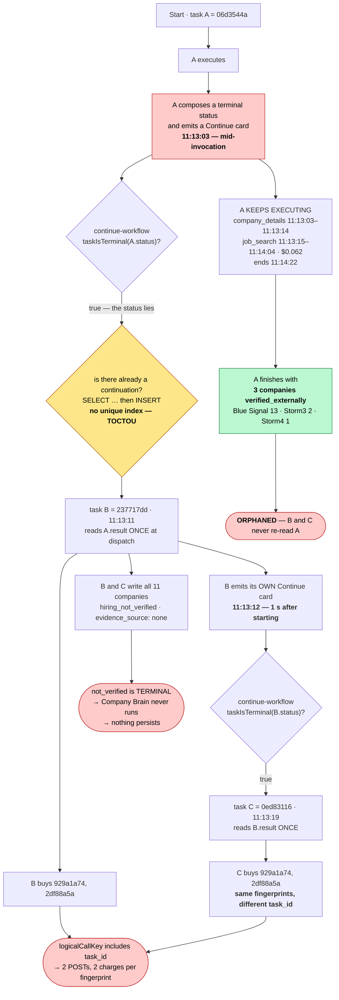
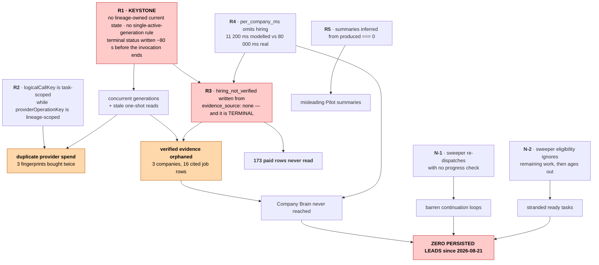
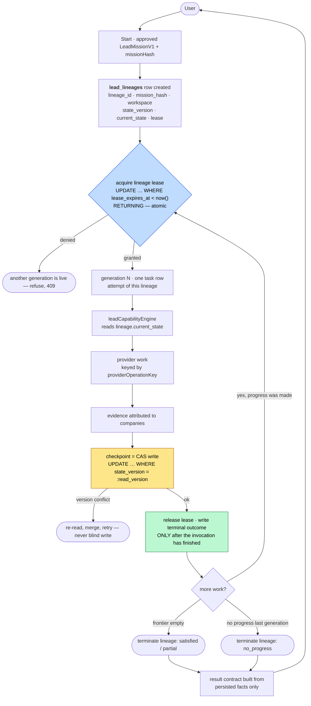
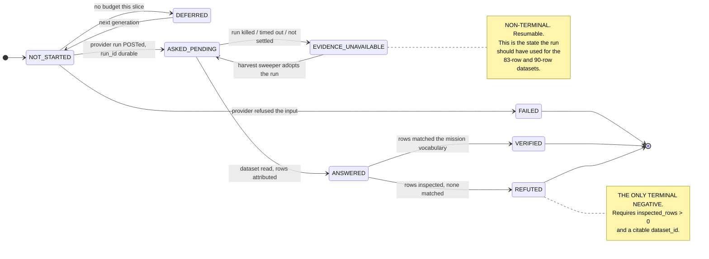
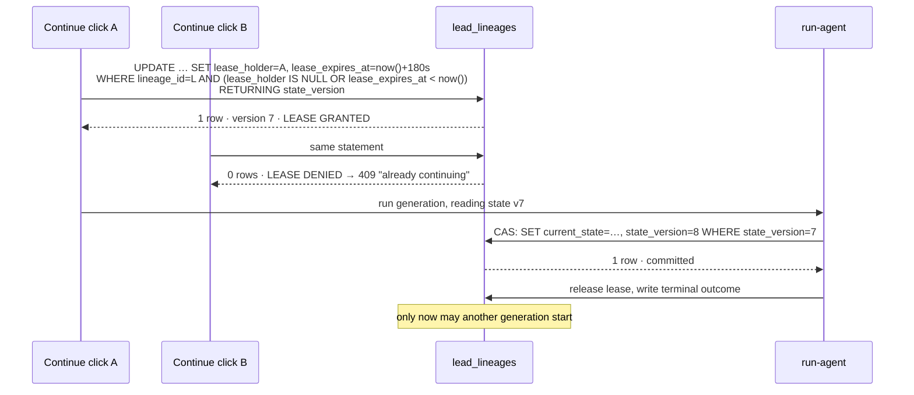
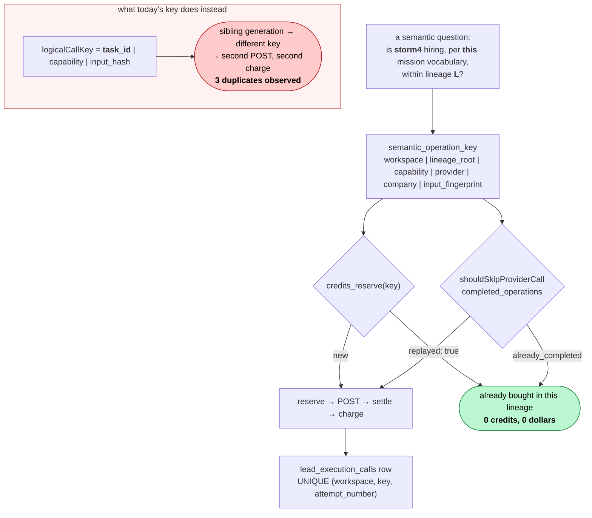
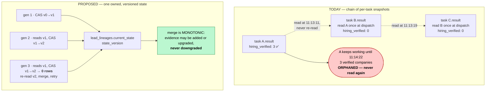
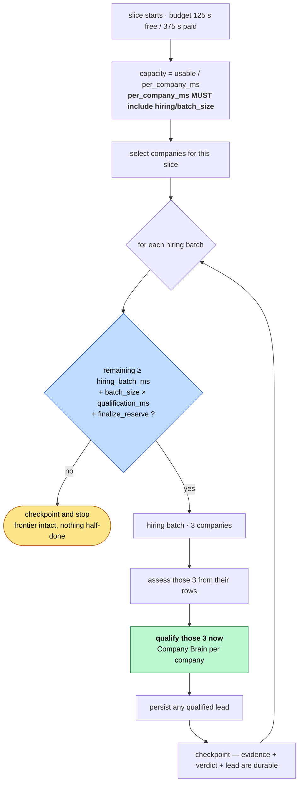
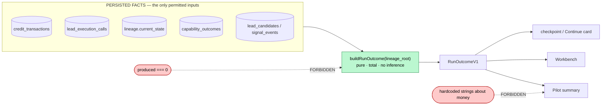

# Agentory Backend Repair Plan

| | |
|---|---|
| **Commit (HEAD)** | `65da8551c27f2f971caa68ccc4a9ef27a28850c9` — unchanged since the audit |
| **Branch** | `feat/lead-mission-v1`, clean, in sync with `origin` |
| **Production project** | `ohsdatpvfdjdemstoiuj` · org `wokikdjpvidhltivuzgh` · **plan: `free`** |
| **Plan date** | 2026-08-29 (verification pass at DB clock `15:11:59 UTC`) |
| **Deployed builds verified** | `run-agent` v134 · `pilot-chat` v108 · `continue-workflow` v11 · `orchestrate` v55 · `resume-stalled-leads` v1 |
| **Predecessor** | [`docs/agentory-backend-workflow-audit.md`](agentory-backend-workflow-audit.md) |
| **Status** | **PLAN ONLY — no code changes made, no migrations applied** |

### Evidence grading

| Grade | Meaning |
|---|---|
| **[PROD]** | Persisted rows, edge logs, cron history, or provider datasets from the deployed build |
| **[CODE]** | Read at HEAD, line-referenced |
| **[DOCS]** | Official Supabase / PostgreSQL documentation |
| **[TEST]** | Passing test only — production behaviour not thereby established |
| **[INFER]** | Reasoned, not observed. Flagged wherever it carries weight |

---

## 0. What the verification pass changed

The audit was re-verified against current HEAD, the live database, deployed function versions, cron history, and the Apify datasets. **Nothing has changed in the repository or in production since it was written** (0 new tasks, 0 new provider calls, 0 new leads). Two findings were **sharpened**, one was **materially corrected**, and four **new root causes** were found that the audit did not reach.

### 0.1 Corrected

**The audit called the evidence loss a "lost update" / "last-write-wins". It is not.** [PROD]

The parent task `06d3544a` still holds its good state today:

```
06d3544a  status=complete  checkpoint_version=1  hiring_verified=3
237717dd  status=complete  checkpoint_version=10 hiring_verified=0
0ed83116  status=complete  checkpoint_version=9  hiring_verified=0
```

Nothing overwrote the parent's row. The three verified companies (Blue Signal 13 job rows, Storm3 2, Storm4 1) are **still there**. What happened is worse and simpler: **each child read its ancestor's `result` once, at dispatch time, and never read it again.** The parent then continued working for another 80 seconds and produced the only good evidence of the entire run — which no descendant ever saw, and which the lineage's "current" state (the newest child) does not contain.

This changes the fix. A `checkpoint_version` compare-and-swap **would not have helped**: there was no competing write to the same row. The real defect is that **a lineage has no single owned current state** — it has a chain of per-task snapshots, and "the truth" is whichever leaf happened to run last.

### 0.2 Sharpened — the exact fork mechanism

`continue-workflow` **does** guard against forking a live parent:

```ts
// workflowContinuation.ts:436
if (!taskIsTerminal(i.task.status)) return { ok: false, refusal: "task_not_terminal" };
```

The guard is correct. **The status is the lie.** The parent wrote a terminal status and rendered a Continue card at 11:13:03 and then kept executing until 11:14:22. [PROD]

The overlap is provable from the provider ledger — three generations buying at once:

```
06d3544a  company_search   11:12:17 → 11:12:36   $0.125
06d3544a  company_details  11:13:03 → 11:13:14   $0.0001
237717dd  company_details  11:13:12 → 11:13:27   $0.0001   ← child starts, parent still live
06d3544a  job_search       11:13:15 → 11:14:04   $0.062    ← parent's BEST call, after the fork
0ed83116  company_details  11:13:21 → 11:13:27   reused    ← grandchild starts
0ed83116  job_search       11:13:38 → 11:14:05   $0.019
237717dd  job_search       11:13:39 → 11:13:55   $0.015
06d3544a  stage_result     11:14:23 → 11:14:24             ← parent finally ends
```

Between **11:13:21 and 11:14:04** all three generations were executing paid provider work simultaneously.

And the second fork is explained by the Continue card itself: each generation emits one within seconds of starting (11:13:03, 11:13:12, 11:13:21), and each card carries a *different* `original_task_id`, so `continuationKey` — which is `workspace + original_task_id + reason` and is explicitly designed so "two clicks a second apart must collide" [CODE, `workflowContinuation.ts:317`] — **cannot collide across generations**. Clicking Continue on the child's card is, to the system, a completely different request.

### Diagram — the current broken continuation flow



### 0.3 New root causes the audit did not reach

**N-1 · `resume-stalled-leads` is the fixed-point engine.** [PROD] The cron has run 160 times in 8 hours, all succeeding. It dispatched lineage `9da530ae` repeatedly — `continuation_dispatched … index: 1`, then `index: 2`, then `index: 3` at 09:09, 09:18, 09:27 — with **no check that the previous dispatch made any progress**. Those are the barren slices in the audit's §11.2 table.

**N-2 · The same sweeper silently abandons recoverable work.** [PROD] Task `43355471` was scanned **every 3 minutes for two hours** and refused every time (`scanned: 1, dispatched: 0` × ~40), then aged past `MAX_RESUMABLE_AGE_MS = 2h` and disappeared (`scanned: 0` ever since). It holds 50 companies, 39 pending, and $0.153 of paid discovery. The refusal reason is `nothing_to_resume`:

```ts
// stalledLeadResume.ts:177-185
const checkpointedPending = Array.isArray(state.pending_runs) && state.pending_runs.length > 0;
if (checkpointedPending || opts.hasStartedProviderRun) return { eligible: true, … };
if (obj(result.auto_continuation).continuing === true)   return { eligible: true, … };
return no("nothing_to_resume");
```

Eligibility is decided from **pending provider runs** and **declared intent** — never from *remaining work*. A checkpoint with 39 unexamined companies and no in-flight run is "nothing to resume".

**This exact bug was already fixed once, in the other resume path.** `continue-workflow` carries the fix and names the very same task in its comment [CODE, `workflowContinuation.ts:441-452`]:

> *"A run that saved a coherent checkpoint carries its own answer… Requiring one refused task 43355471 — 50 companies with snapshots, 10 shortlisted, `pending_runs: []`"*

`assessCheckpointResume` was added to `continue-workflow` and **not** to `stalledLeadResume`. Two resume paths, one fixed.

**N-3 · The credit idempotency machinery is already correct and race-safe.** [PROD/CODE] This is good news and it makes P0-2 cheap. The DB has `credit_transactions_idempotent UNIQUE (workspace_id, idempotency_key)`, and `credits_reserve` is `SECURITY DEFINER`, checks for an existing row first, and **handles `unique_violation` by refunding the reservation and returning the replay**. It cannot double-charge for one key. `lead_execution_calls_attempt_uniq UNIQUE (workspace_id, logical_call_key, attempt_number)` is the same story.

**Only the key's scope is wrong.** Nothing about the enforcement needs redesign.

**N-4 · The platform headroom is real but costs money.** [DOCS] Supabase Edge Functions: *"Maximum Memory: 256MB"*, *"Free plan: 150s"*, *"Paid plans: 400s"* wall clock, *"Request idle timeout: 150s"*, *"Maximum CPU Time: 2s"*. The org is on **`free`**, so the code's `EDGE_WALL_CLOCK_MS = 150_000` [CODE, `leadExecutionFinalizer.ts:107`] **is correct today**. `EdgeRuntime.waitUntil` and `beforeunload` are **not used anywhere in the codebase** — both are free durability wins, and the wall clock rises to 400s on a paid plan.

---

## 1. Executive summary

Agentory's lead pipeline does not have a lead-generation problem. On the audited run it discovered 50 companies, correctly excluded 29 on ICP size, shortlisted 21, resolved and enriched 11, bought 204 job rows, and **correctly verified three companies as actively hiring sales roles with cited evidence**. Then it lost all of it and told the user "none passed the Company Brain".

Every failure traces to **five structural defects, four of which are in the coordination layer around the engine rather than in the engine itself**:

| # | Defect | Nature |
|---|---|---|
| **R1** | A lineage has no owned current state and no single active generation | Concurrency |
| **R2** | Spend idempotency is scoped to a task; execution idempotency is scoped to a lineage | Idempotency |
| **R3** | Absence of evidence is written as a terminal negative verdict | State model |
| **R4** | The capacity model omits the dominant cost, so every slice over-commits | Scheduling |
| **R5** | Presentation asserts spend and evaluation from `produced === 0` | Truth contract |

Plus two recovery defects found in this pass: the stalled-lead sweeper **re-dispatches lineages that make no progress** (N-1) and **abandons lineages that have work left** (N-2).

**The recommendation is repair, not rebuild.** The evidence is unambiguous: the engine's hard parts — mission compilation, provider transport, Actor-specific normalization, evidence attribution, hiring assessment, credit reservation, run-id durability — all demonstrably work in production. What fails is the orchestration *around* the engine, and most of it fails because a per-task model is being used to run a multi-task lineage. §19 sets out the evidence for that conclusion.

---

## 2. Root cause map



**R1 is the keystone.** On a serialised lineage, the parent's three verified companies would have survived, no duplicate purchase could have occurred, and the audited request would have produced qualified leads.

---

## 3. Target execution architecture

The change is one idea: **the lineage becomes a first-class entity that owns its state and its right to execute.** Tasks become attempts against a lineage rather than independent runs that happen to share a JSONB field.



Four properties this buys:

1. **One live generation per lineage**, enforced by the database, not by a status field that can lie.
2. **One current state per lineage**, versioned, so a stale reader is detected rather than silently orphaned.
3. **A completion barrier**: the lease is released *after* the invocation ends, so "terminal" means terminal.
4. **A progress obligation**: a generation that changes nothing terminates the lineage instead of scheduling another.

---

## 4. State machines

Formal answers to the questions posed, derived from the current types (`taskStatusContract.ts`, `leadResumeState.ts`, `capabilityCompletion.ts`) rather than invented.

### 4.1 Lineage — the new entity

```
    ┌──────────┐  Start approved
    │  (none)  │ ─────────────────▶ ACTIVE
    └──────────┘
                    ACTIVE ──lease granted──▶ RUNNING(gen N)
                    RUNNING ──generation ends, work remains, progress made──▶ ACTIVE
                    RUNNING ──generation ends, no progress──▶ TERMINAL(no_progress)
                    RUNNING ──frontier empty, quota met──▶ TERMINAL(satisfied)
                    RUNNING ──frontier empty, quota unmet──▶ TERMINAL(partially_satisfied)
                    RUNNING ──ceiling hit──▶ TERMINAL(budget_exhausted)
                    ACTIVE  ──lease expired, stale > threshold──▶ ACTIVE (reclaimable)
                    ACTIVE  ──age > abandonment horizon──▶ TERMINAL(abandoned) + user notice
                    TERMINAL ──▶ (immutable)
```

**Q: Can two tasks from the same lineage run simultaneously?**
**No. Never.** This is the single most important invariant introduced. Enforced by a lease column on `lead_lineages` updated with an atomic conditional `UPDATE … RETURNING`, and by a unique partial index that permits at most one non-terminal task per lineage.

**Q: When does a task become `ready`?**
Only when its generation has fully ended (the invocation returned or `beforeunload` fired), a coherent checkpoint was written, and the lineage still has work. `ready` means *"the lineage may be continued"*, and it is written by the lease-release step, never mid-run.

### 4.2 Task (row lifecycle)

`tasks.status` keeps the vocabulary the repo already declares [CODE, `taskStatusContract.ts`]:

```
pending → running → { ready | complete | failed | awaiting_approval }
```

Two rules the database does not currently enforce and must:

- `status = 'complete'` **⇒** `result.terminal_status ∉ {continuation_required}`. The contradiction exists in production on three tasks today. [PROD]
- `status = 'running'` **⇒** the lineage lease is held by this task.

`finished_at` must be written. It is **NULL on every task in the database**, including completed and failed ones [PROD], which makes duration unmeasurable and "is this still running?" unanswerable from the row.

### 4.3 Capability

Keep `capabilityCompletion.ts` — it works and it fires correctly in production [PROD: `capability_completion_provisional { capability: "persistence", rows: 0, … }`].

**Q: What makes a capability complete?**
`status === "complete" && evidence === true && !completionIsProvisional(...)`. Unchanged. One addition: a capability may not close while it holds **unsettled provider operations** of its own — the condition that let `hiring_verification` close over two never-read datasets.

### 4.4 Company — the core redesign

Current: `identity · enrichment · hiring · brain · founder`, each a small string enum, with `hiring: not_verified` terminal via `nextStageFor` [CODE, `leadResumeState.ts:367`].

The defect is that `hiring` conflates three different facts: *did we ask*, *did we get an answer*, and *what was the answer*. Splitting the axis is cleaner than adding states to one enum:



**Q: What makes a negative verdict authoritative?**
A verdict of `REFUTED` is authoritative **only if** the assessment inspected at least one provider row for that company, and the row set is citable by `dataset_id` and `provider_run_id`. Formally:

```
REFUTED  ⟺  evidence_source ≠ "none"
          ∧  inspected_row_count ≥ 1
          ∧  dataset_id IS NOT NULL
```

Everything else that today produces `hiring_not_verified` becomes `EVIDENCE_UNAVAILABLE`, which is non-terminal and stays on the frontier. This is the direct expression of **absence of evidence ≠ evidence of absence**.

**Q: What makes a company complete?**
`VERIFIED` → passed to Company Brain → persisted, or `REFUTED`, or `FAILED`. `EVIDENCE_UNAVAILABLE` and `DEFERRED` are **never** complete.

### 4.5 Provider operation

```
PLANNED → RESERVED (credit) → POSTED (run_id durable) → { SETTLED_OK | SETTLED_EMPTY | UNSETTLED }
UNSETTLED → ADOPTED → { SETTLED_OK | SETTLED_EMPTY }
UNSETTLED → ABANDONED (only after dataset read attempt failed, with a recorded reason)
```

**Q: What makes a provider operation settled?**
The dataset has been read and `raw / normalized / unique / accepted / rejected` written, **or** an explicit bounded-read reason is recorded. Today, nine rows sit in `started`/`timed_out` with `raw_count: null` while their datasets hold rows [PROD]. Those are `UNSETTLED`, and `UNSETTLED` must be a *work item*, not a resting state.

Critically: **a credit may not be finalized `charged` while its operation is `UNSETTLED`.** Production violates this — `c34c857b` was charged with reason `provider_call_succeeded` while its ledger row still reads `started`.

### 4.6 Checkpoint

**Q: Who owns the checkpoint?** The **lineage**, not the task.
**Q: Who may overwrite it?** Only the generation currently holding the lease.
**Q: What version check protects writes?** `UPDATE lead_lineages SET current_state = …, state_version = state_version + 1 WHERE lineage_id = :id AND state_version = :version_read_at_start`. Zero rows updated ⇒ re-read, merge, retry. Never blind-write.

**Merge rule (this is what saves evidence):** company evidence is **monotonic**. A merge may add rows, upgrade `EVIDENCE_UNAVAILABLE → ANSWERED`, or `ANSWERED → VERIFIED`. It may **never** downgrade a `VERIFIED` company to an unverified state, and may never reduce `inspected_row_count`. Had this rule existed, the parent's three verified companies would have survived every child.

---

## 5. Concurrency model

**Recommendation: a lineage lease held in a dedicated row, plus a unique partial index as the hard backstop.** Not advisory locks, and not the existing per-task claim alone.

### Why not the alternatives

| Option | Verdict |
|---|---|
| Extend `claim_sourcing_continuation` to the lineage | **Closest to right, and the mechanism is already excellent** — `SELECT … FOR UPDATE`, lease with expiry, refuses already-claimed [PROD/CODE]. But it is keyed on `p_task_id`, and the production continuation path creates *new* tasks, so it is bypassed entirely. Generalise it rather than replace it. |
| Advisory locks (`pg_try_advisory_xact_lock`) | Session-level locks *"do not honor transaction semantics"* and persist through `ROLLBACK` [DOCS]; transaction-level locks release at commit, which is too short for a 125-second Edge invocation spanning many transactions. Wrong lifetime. |
| `SELECT … FOR UPDATE SKIP LOCKED` | Right tool for *queue draining* (pick the next unlocked lineage), wrong tool for *holding* execution rights across an invocation, for the same lifetime reason. Use it in the sweeper's scan, not as the lease. |
| Application-level checks only | Already tried. `continue-workflow`'s "is there already one?" is a `select` then `insert` with no unique index behind it [CODE, `continue-workflow/index.ts:99`], and `continuationKey` is computed but **`task_plans` has no `idempotency_key` column at all** [PROD]. |
| Task reuse (same row) instead of child tasks | **Strongly preferred where possible.** `run-agent`'s `resume_task_id` path already resumes the same row under a real claim [CODE, `run-agent/index.ts:1017`] and increments `checkpoint_version`. Production's problems come from the *child-task* path. Moving `continue-workflow` onto the same-row path removes a whole class of defect. |

### The model



A single conditional `UPDATE … RETURNING` is atomic in PostgreSQL and needs no explicit lock. The lease carries an expiry so a killed isolate cannot deadlock a lineage forever; reclaiming an expired lease is legal and bumps `state_version`, which invalidates the dead generation's writes automatically.

**The completion barrier.** The lease is released in the finalization block, after the engine returns and after the checkpoint write — never at the moment a terminal status is composed. `beforeunload` becomes the safety net: on platform shutdown, flush the checkpoint and release the lease. Supabase documents this hook explicitly — *"listen to the beforeunload event handler to be notified when the Function is about to be shut down"* [DOCS] — and the codebase does not use it today.

---

## 6. Idempotency model

**Q: What uniquely identifies one semantic provider purchase?**

The question the purchase answers, not the attempt that asked it. That is exactly what `providerOperationKey` already computes [CODE, `leadResumeState.ts:391`]:

```
RESUME_STATE_VERSION | workspace_id | lineage_root_task_id | company_key | capability | provider | input_fingerprint
```

Its doc comment already states the principle — *"It excludes the task id and any timestamp, because a continuation is a different task asking the same question."* The defect is that a **second, weaker key** gates the money:

```ts
// executionLedger.ts:1080
logicalCallKey = [task_id, capability, input_hash].join(":")
```

**Q: Where should uniqueness be enforced — application, database, or both?**

**Both, and the database half already exists.** [PROD]

```
credit_transactions_idempotent      UNIQUE (workspace_id, idempotency_key)
lead_execution_calls_attempt_uniq   UNIQUE (workspace_id, logical_call_key, attempt_number)
```

and `credits_reserve` is fully race-safe: it checks for an existing row, and on `unique_violation` it **refunds the reservation and returns the prior transaction as a replay** [PROD]. Two concurrent workers cannot double-charge one key. The machinery is right; the key is wrong.

### The change

Replace the task id in the ledger/credit key with the **lineage root**, so the credit key and the execution key describe the same thing:

```
semantic_operation_key =
  v1 | workspace_id | lineage_root | capability | provider | company_scope | input_fingerprint
```

`company_scope` is the *single-company* fingerprint the batching design already uses for `completed_operations` — production shows it as `…|https://www.linkedin.com/company/storm4|hiring_verification|apify_linkedin_job_search|de62e507` [PROD], deliberately per-company so a partially completed batch resumes exactly.



**The one real design problem this creates**, and it must be solved before implementation: `lead_execution_calls_attempt_uniq` includes `attempt_number`. With a lineage-scoped key, a *legitimate* retry in a later generation collides at `attempt_number = 1`. Two options:

- **(a)** Derive `attempt_number` from `MAX(attempt_number)+1` for the key inside a transaction. Preserves one row per physical attempt; needs care under concurrency (though the lineage lease makes concurrency impossible by then).
- **(b)** Keep one ledger row per semantic operation and let adoption *update* it rather than insert. Matches the "adopted run settles the row that started it" rule already in the codebase.

**(b) is preferred** — it makes "one semantic operation = one ledger row = at most one charge" true structurally, and it makes the unsettled-row sweeper (Phase 8) trivial because each key has exactly one row to settle.

**Target invariant.** For all `k`: `COUNT(credit_transactions WHERE idempotency_key = k AND status = 'charged') ≤ 1`, and `COUNT(DISTINCT provider_run_id WHERE semantic_key = k AND status ≠ 'reused') ≤ 1` — across timeout, continuation, retry, crash, duplicate dispatch and concurrent workers.

---

## 7. Checkpoint model



The checkpoint *schema* needs no change — the audit found every required field present, including `snapshot.identity` as an object and lineage-scoped `completed_operations`. What changes is **ownership, versioning, and the merge rule**.

The monotonic merge is what makes the system robust to the remaining unknown in §17.1: even if some other path loses evidence in memory, a checkpoint write cannot erase a company that was previously verified.

---

## 8. Budget and scheduling model

### 8.1 The arithmetic, verified

```ts
// leadInvestigationBudget.ts:305
perCompany = identity/concurrency + enrichment/batch + qualification
           = 12000/4 + 12000/10 + 7000
           = 3000 + 1200 + 7000 = 11 200 ms      ← matches production exactly
```

```ts
// leadCapabilityEngine.ts:988
HIRING_MS_PER_COMPANY = 80_000                   ← appears nowhere in the capacity model
```

Production budget: `usable_ms: 105 489`, `capacity: 9`, `reserve_ms: 18 000` [PROD]. Real measured job-search durations on this lineage: **16.7 s, 27.0 s, 29.7 s, 48.7 s, 86.3 s, 93.5 s** for batches of 2–3 companies.

With `EDGE_WALL_CLOCK_MS = 150_000` and `SAFETY_MARGIN_MS = 25_000`, the usable budget is **125 s**. A capacity of 9 is roughly **7× over-committed**.

### 8.2 The three options, assessed against the free plan

| | Option A — reserve downstream | Option B — interleave per batch | Option C — durable worker |
|---|---|---|---|
| **What** | Refuse to start hiring unless `hiring + qualification + finalize` fits | Hiring batch → qualify *those* companies → checkpoint → next batch | Move long work off the request path |
| **Effect on 125 s** | Prevents over-commit; does not increase throughput | ~1 batch of 3 fully qualified per slice: 90 s hiring + 21 s qualification + reserve ≈ 111 s — **fits** | `waitUntil` + `beforeunload` (free) ⇒ durability, no extra clock on free plan; **paid plan ⇒ 400 s wall clock** [DOCS] |
| **Necessary?** | **Yes** — it is the guard | **Yes** — it is the throughput fix | Partly free, partly commercial |
| **Sufficient alone?** | No — would checkpoint before starting anything and stall | Yes, for 3 companies/slice | No |

**Recommendation: A + B together, plus the free half of C.**

- **A** is a correctness guard: never start a batch whose expected duration would leave less than `batch_size × qualification_ms + finalize_reserve`.
- **B** is the throughput fix, and the code is already shaped for it — `for (const g of group) assessOne(g.c); await publish("hiring_verified");` runs per batch [CODE, `leadCapabilityEngine.ts:5295`]. Qualification needs to move inside that loop.
- **C (free half)**: adopt `beforeunload` to flush a checkpoint on platform shutdown, and use `EdgeRuntime.waitUntil` so the HTTP response is not what bounds the work. Neither is used today.
- **C (commercial half)**: upgrading to a paid plan raises the wall clock from **150 s to 400 s** [DOCS] — usable budget ~375 s, roughly **3 hiring batches (9 companies) fully qualified per slice**. This is a business decision, not an engineering one, and it should be stated as such. It is the single highest-leverage non-code change available.



The property this buys is the important one: **after every batch the run has produced something durable**. A slice killed at any point loses at most one batch, and a qualified lead is written the moment it is qualified rather than at the end of a stage that never arrives.

### 8.3 Two budget corrections

- **Identity must cost what it costs.** Production made **zero** `apify_linkedin_company_search` calls in the 11:13 runs — every LinkedIn URL was already on the discovery row — yet each company was priced at `identity_call_ms: 12 000`. The estimate should be per-company and conditional: near-zero when identity is already actionable, provider-floor only when a call will actually be made.
- **The reserve must scale with what is outstanding**, not be a flat 18 s. If 9 companies are mid-flight, finalization has 9 companies' worth of state to write.

---

## 9. Truth and result contract

One contract, one builder, no literals. Every field is a **query against persisted rows**, and the renderer may only say what the contract carries.

```ts
interface RunOutcomeV1 {
  state: "SATISFIED" | "PARTIALLY_SATISFIED" | "REQUIRES_APPROVAL" | "UNSUPPORTED" | "FAILED";
  // Each field below names the table it is read FROM. None may be inferred.
  spend: {                        // from credit_transactions WHERE lineage_root = …
    credits_charged: number; provider_calls: number; usd_reported: number | null;
    unsettled_operations: number; // status IN ('started','timed_out') with no settle
  };
  funnel: {                       // from lineage.current_state, never recomputed in the renderer
    discovered: number; excluded: Array<{ reason: string; count: number }>;
    shortlisted: number; deferred: number;
    identity_resolved: number; enriched: number;
    evidence_inspected_rows: number;
    hiring_verified: number; hiring_refuted: number; hiring_evidence_unavailable: number;
  };
  qualification: {                // from capability_outcomes
    ran: boolean; evaluated: number; qualified: number; rejected: number;
    not_reached_reason: string | null;   // NON-NULL whenever ran === false
  };
  persistence: { leads_written: number; signals_written: number };
  continuation: { required: boolean; reason: string | null; resumable: boolean };
  gaps: Array<{ code: string; detail: string }>;
}
```

**Three prohibitions, each traceable to a production lie:**

1. **No branch may read `produced === 0`.** `run-agent/index.ts:5825-5826` does exactly this and emits *"none matched closely enough"* and *"No credits charged, nothing sent"* — the latter a hardcoded literal, printed while credits were being charged.
2. **No sentence may assert a capability's verdict unless that capability is in `completed_capabilities`.** `run-agent/index.ts:574` has no branch for "qualification did not run" and therefore said *"none passed the Company Brain"* about a stage that never executed.
3. **No checkpoint card may claim anything about spend.** `run-agent/index.ts:2911` says *"nothing extra was charged"* unconditionally.



**Workbench accounting.** Enforce `reviewed = Σ mutually-exclusive dispositions` as a computed assertion, not a convention. Production today: 50 reviewed = 29 `not_investigated` + 10 `deferred` + 0 `qualified` + 0 `not_qualified`, leaving **11 companies with no disposition** — the ones actually investigated and rejected. Those need a bucket (`reviewed_no_evidence` / `reviewed_refuted`) carrying the reason.

---

## 10. Database constraints

`tasks` currently has **zero check constraints and zero triggers** [PROD] — the repo's own `taskStatusContract.ts` documents this and notes the live data contains three status dialects. `lead_execution_calls` and `credit_transactions`, by contrast, are already well constrained. The proposals below bring the task/lineage layer up to the standard the ledger layer already meets.

**Not to be applied yet.** Shapes given so they can be reviewed.

```sql
-- ── 1. THE LINEAGE BECOMES A ROW ─────────────────────────────────────────────
create table public.lead_lineages (
  lineage_id        uuid primary key,          -- = the root task id, so existing data maps
  workspace_id      uuid not null references public.workspaces(id) on delete cascade,
  mission_hash      text not null,
  state_version     integer not null default 0,
  current_state     jsonb,                     -- the ONE authoritative checkpoint
  lease_holder      uuid,                      -- task id of the live generation
  lease_expires_at  timestamptz,
  generation        integer not null default 0,
  status            text not null default 'active'
                    check (status in ('active','running','terminal')),
  terminal_reason   text,
  created_at        timestamptz not null default now(),
  updated_at        timestamptz not null default now(),
  constraint lineage_terminal_has_reason
    check (status <> 'terminal' or terminal_reason is not null)
);

-- The lease acquisition is a single atomic statement; no explicit lock needed.
--   update lead_lineages
--      set lease_holder = :task, lease_expires_at = now() + interval '180 seconds',
--          generation = generation + 1, status = 'running'
--    where lineage_id = :id
--      and status <> 'terminal'
--      and (lease_holder is null or lease_expires_at < now())
--   returning state_version, current_state;
-- Zero rows returned  ⇒  another generation is live  ⇒  refuse with 409.

-- ── 2. AT MOST ONE LIVE GENERATION, ENFORCED BY THE DATABASE ─────────────────
alter table public.tasks add column lineage_id uuid references public.lead_lineages(lineage_id);

create unique index tasks_one_live_generation_per_lineage
  on public.tasks (lineage_id)
  where lineage_id is not null and status in ('pending','running');

-- ── 3. ONE CONTINUATION CHILD PER PARENT (closes the continue-workflow TOCTOU)
alter table public.task_plans add column idempotency_key text;

create unique index task_plans_continuation_uniq
  on public.task_plans (workspace_id, idempotency_key)
  where idempotency_key is not null;
-- `continuationKey` is already computed in code and thrown away; this is where it belongs.

-- ── 4. STATUS AND OUTCOME MAY NOT CONTRADICT ─────────────────────────────────
alter table public.tasks add constraint tasks_status_vocabulary
  check (status in ('pending','running','ready','awaiting_approval','complete','failed','skipped'));

alter table public.tasks add constraint tasks_complete_is_not_continuable
  check (status <> 'complete' or coalesce(result->>'terminal_status','') <> 'continuation_required');
-- Three rows violate this today; they must be backfilled to 'ready' first.

-- ── 5. A CHARGE REQUIRES A SETTLED OPERATION ─────────────────────────────────
-- Cross-row, so a constraint cannot express it. Enforce inside credits_finalize:
--   refuse status='charged' when the matching lead_execution_calls row
--   is still 'started'. Today c34c857b is charged 'provider_call_succeeded'
--   while its ledger row reads 'started'.

-- ── 6. RECOVERY WORK IS INDEXABLE (this index already exists — reuse it) ─────
-- lead_execution_calls_unresolved_idx  (workspace_id, status)
--   WHERE status IN ('started','failed','timed_out')
```

**On the semantic-operation key**: no new index is required. `credit_transactions_idempotent` and `lead_execution_calls_attempt_uniq` already enforce uniqueness on the key; only the *value* written into the key changes. That is the cheapest P0 in this plan.

---

## 11. Phased repair plan

Ordered so each phase is independently verifiable and no phase depends on a later one.

---

### Phase 0 — Freeze the evidence, close the observability gaps

**Problem.** Diagnosis currently depends on reading Apify datasets by hand. `tasks.finished_at` is NULL on every row, so "was this still running?" is unanswerable — the exact question at the centre of P0-1.

**Root cause.** Observability was never a first-class output.

**Invariant.** *Every execution fact needed to diagnose a run is queryable from the database.*

**Modules.** `run-agent/index.ts` (task lifecycle writes), `leadExecutionFinalizer.ts`.
**Database.** None. Add a read-only `ops_lineage_health` view.
**Runtime.** Write `finished_at` and `started_at` on every terminal path. Snapshot the 11 stranded `ready` tasks and the 9 unsettled provider rows into `ops_stuck_run_archive` before any later phase can perturb them.
**Migration/backfill.** None; archival copy only.
**Tests.** Assert `finished_at` non-null on every terminal transition.
**Production verification.** `select count(*) from tasks where status in ('complete','failed') and finished_at is null` → 0 for new rows.
**Risk.** Negligible. **Rollback.** Revert; nothing depends on it.
**Done when.** Lineage health is answerable in one SQL query, and today's broken lineages are preserved as replay fixtures.

---

### Phase 1 — Serialise the lineage *(the keystone)*

**Problem.** Three generations of one request executed concurrently and bought provider work simultaneously. [PROD]

**Root cause.** R1 — no lineage entity, no lease, and a terminal status written ~80 s before the invocation ended.

**Invariant.** *At most one generation of a lineage may be executing at any instant, and a generation is not finished until its invocation has ended.*

**Modules.** New `_shared/lineageLease.ts`; `run-agent/index.ts` (acquire on entry, release in finalization); `continue-workflow/index.ts`; `resume-stalled-leads/index.ts`; `leadContinuationDispatch.ts`.
**Database.** `lead_lineages` table; `tasks.lineage_id`; `tasks_one_live_generation_per_lineage`; `task_plans.idempotency_key` + unique index.
**Runtime.** Generalise `claim_sourcing_continuation` from task to lineage — reuse its `SELECT … FOR UPDATE` + lease shape, which is already correct. Move the terminal-status write and the Continue card into the finalization block, after the engine returns. Add `beforeunload` to release the lease and flush a checkpoint on platform shutdown.
**Migration/backfill.** Create one `lead_lineages` row per existing distinct `result->>'lead_resume_lineage_root'` (17 in the last 4 days), seeded from the **most advanced** task in each lineage — not the newest. For `06d3544a` that means seeding from the parent, which still holds `hiring_verified: 3`.
**Tests.** Concurrency: two simultaneous Continue requests → exactly one 200 and one 409. Parent-still-running → child refused. Expired lease → reclaimable. Killed isolate → lease expires, next generation proceeds.
**Production verification.** One real Start; assert no two tasks of the lineage overlap in `[started_at, finished_at]`, and no two provider calls of the lineage overlap across tasks.
**Risk.** **Medium-high** — touches every entry point. Mitigate by shipping the lease in shadow first: acquire, log `would_refuse`, do not enforce. Enforce only once the log shows refusals landing exactly where expected.
**Rollback.** Feature flag `LINEAGE_LEASE_ENFORCED=false` reverts to current behaviour; the table and index are inert when unenforced.
**Done when.** A deliberate double-Continue produces one execution, and the parent's evidence survives into the next generation.

---

### Phase 2 — Lineage-wide provider idempotency

**Problem.** Three input fingerprints were each bought twice, and a `reused` adoption was charged a credit. [PROD]

**Root cause.** R2 — `logicalCallKey` includes `task_id`.

**Invariant.** *One semantic provider operation is paid for at most once per lineage, across timeout, continuation, retry, crash and concurrent dispatch.*

**Modules.** `executionLedger.ts` (`logicalCallKey`), `toolRegistry.ts`, `creditAuthorization.ts`, `leadCapabilityEngine.ts` call sites.
**Database.** No new constraints. Decide (a) attempt-number derivation vs **(b) one ledger row per semantic operation, updated on adoption** — (b) recommended. Adopted runs must write `actual_credits = 0` and must not re-record `actual_cost_usd`.
**Runtime.** Replace the task id with the lineage root in the key; keep everything else.
**Migration/backfill.** None — keys are forward-only. Historical rows keep their old keys, which is honest.
**Tests.** Replay the 11:12 lineage: 6 distinct fingerprints must produce **6** charges, not 10. Property test: for any interleaving of two generations, charged rows per key ≤ 1. Mutation test: reverting the key to task-scoped must fail the replay.
**Production verification.** A real run with a forced continuation; assert `count(distinct provider_run_id) = count(distinct semantic_key)` for non-reused rows.
**Risk.** **Low.** The enforcement path is unchanged and already proven race-safe in production.
**Rollback.** Revert the key construction; one-line change.
**Done when.** The replay shows 6 charges and zero duplicate POSTs.

---

### Phase 3 — Evidence and negative-verdict state model

**Problem.** Companies whose paid evidence was never read were recorded *"No open roles at all"*, terminally. Three companies that **were** verified were downgraded to the same state. [PROD]

**Root cause.** R3 — one enum conflates *asked*, *answered* and *answer*; `not_verified` is terminal.

**Invariant.** *A negative hiring verdict requires inspected evidence. Absence of evidence is non-terminal and stays on the frontier.*

**Modules.** `leadResumeState.ts` (`nextStageFor`, `CompanyResumeRecord`), `leadCapabilityEngine.ts` (`assessOne`), `commercialSignalPolicy.ts` (`reachesCompanyBrain`), `hiringEvidenceFusion.ts`.
**Database.** None — the states live in the checkpoint JSONB.
**Runtime.** Split the `hiring` axis into `inquiry_state` and `verdict` per §4.4. `REFUTED` requires `inspected_row_count ≥ 1` **and** a citable `dataset_id`. Everything else becomes `EVIDENCE_UNAVAILABLE`, which `nextStageFor` treats as resumable. Implement the **monotonic merge**: a checkpoint write may never downgrade a verified company.
**Migration/backfill.** Map existing `not_verified` records: those with `evidence_source = "none"` and `hiring_jobs = []` → `EVIDENCE_UNAVAILABLE` (recoverable); those with inspected rows → `REFUTED`. This alone makes the 11 dead companies of the audited run live again.
**Tests.** Frozen replay of datasets `6F6W9GFkpQdQvIBdv` (83 rows) and `GCNtgID6Cq1ggEdDb` (90 rows): each must produce `VERIFIED` for the companies with matching roles, and **must not** produce `REFUTED` when the dataset is withheld. Merge test: verified-then-stale-write must keep `VERIFIED`.
**Production verification.** A run where a batch is deliberately killed mid-poll; the affected companies must return as `EVIDENCE_UNAVAILABLE` and be re-attempted, never `REFUTED`.
**Risk.** **Medium** — changes qualification eligibility. Guard with the replay corpus.
**Rollback.** Feature-flag the new state mapping; the old enum remains readable.
**Done when.** No company can reach a terminal negative without a citable dataset id.

---

### Phase 4 — Scheduling: reserve, then interleave

**Problem.** Hiring consumes the slice; Company Brain never runs. [PROD]

**Root cause.** R4 — `per_company_ms` omits `HIRING_MS_PER_COMPANY`.

**Invariant.** *No expensive stage may begin unless the budget for the work it makes necessary is still available; and every completed batch leaves durable value.*

**Modules.** `leadInvestigationBudget.ts` (`resolveTimeCapacity`), `leadCapabilityEngine.ts` (batch loop), `executionDeadline.ts`.
**Database.** None.
**Runtime.** (A) Include hiring, amortised over `HIRING_VERIFICATION_BATCH_SIZE`, in `per_company_ms`; refuse a batch unless `remaining ≥ hiring_batch_ms + batch_size × qualification_ms + finalize_reserve`. (B) Move qualification and persistence **inside** the batch loop, beside the existing `assessOne` + `publish` pair. (C-free) Adopt `EdgeRuntime.waitUntil` and `beforeunload`. Correct the identity estimate to near-zero when identity is already actionable.
**Migration/backfill.** None.
**Tests.** Budget unit tests against the six measured production durations (16.7–93.5 s). Simulated-clock test: a 125 s slice completes exactly one batch end-to-end and checkpoints with the frontier intact.
**Production verification.** One real run in which `company_brain_qualification` appears in `completed_capabilities`. **This has never happened.**
**Risk.** **Medium** — fewer companies per slice, more continuations. Acceptable: three qualified companies beat nine unqualified ones.
**Rollback.** Constants are configurable via env (`LEAD_IDENTITY_CALL_MS`, `LEAD_QUALIFICATION_PER_COMPANY_MS` already exist).
**Done when.** A lead is persisted from a real run.

---

### Phase 5 — Harvest the paid rows already bought

**Problem.** Nine provider rows sit `started`/`timed_out` with `raw_count: null` while their datasets hold rows — 173 on the audited lineage alone. [PROD]

**Root cause.** Recovery is driven by `pending_runs` in the checkpoint, not by unsettled ledger rows.

**Invariant.** *Every provider row paid for is read and assessed, explicitly bounded with a recorded reason, or explicitly pending — never silently dropped.*

**Modules.** `pendingRunRecovery.ts`, `resume-stalled-leads/index.ts` or a new `settle-provider-runs` function.
**Database.** None — `lead_execution_calls_unresolved_idx` already indexes exactly this population.
**Runtime.** Sweep unsettled rows past the wall clock; `GET` the known `dataset_id`; settle counts and cost; route rows to companies; upgrade `EVIDENCE_UNAVAILABLE` → `ANSWERED`. Zero new spend — the data is bought.
**Migration/backfill.** A one-off harvest of the nine existing rows, which should reanimate several companies.
**Tests.** Replay against the two real datasets; assert counts settle and rows attribute.
**Production verification.** `select count(*) from lead_execution_calls where status in ('started','timed_out') and raw_count is null` trends to 0.
**Risk.** **Low** — read-only against Apify.
**Rollback.** Disable the cron entry.
**Done when.** No paid dataset remains unread for more than one sweep interval.

---

### Phase 6 — Truthful result contract

**Problem.** *"No credits charged"*, *"none passed the Company Brain"*, *"nothing extra was charged"* — all false, all hardcoded. [PROD]

**Root cause.** R5 — inference from `produced === 0`.

**Invariant.** *No user-facing claim about spend, evaluation, qualification, continuation or persistence may be made except from a persisted fact.*

**Modules.** New `_shared/runOutcome.ts`; `run-agent/index.ts:540-610, 2880-2940, 5795-5840`; `pilot-chat`; `leadWorkbenchProjection.ts`.
**Database.** None.
**Runtime.** Build `RunOutcomeV1` from queries; render from it exclusively. Delete the literals.
**Migration/backfill.** None.
**Tests.** A source-level test that no summary path references `produced === 0` or contains a money literal — the same shape as the existing `readSurface` import-boundary test, which already works well. A truthfulness test per known lie, replayed against the persisted rows of the audited run.
**Production verification.** Re-render the audited run's summary from its persisted rows; it must say *"qualification did not run"* and report the real charged credits.
**Risk.** **Low.**
**Rollback.** Trivial.
**Done when.** Every claim in a summary maps to a row.

---

### Phase 7 — Workbench accounting

**Problem.** 11 investigated companies have no disposition; `stage: "qualified"` with `qualified_companies: 0`. [PROD]

**Invariant.** *`reviewed = Σ mutually-exclusive dispositions`, and every disposition carries its reason.*

**Modules.** `leadWorkbenchProjection.ts`, frontend Workbench.
**Runtime.** Add the missing buckets, derive them from the Phase 3 states, assert reconciliation and fail loudly rather than silently dropping.
**Tests.** Property: for any engine state, the totals reconcile.
**Risk.** **Low.** **Done when.** The audited run reconciles to 50.

---

### Phase 8 — Stalled-work recovery that cannot loop or abandon

**Problem.** The sweeper re-dispatched a no-progress lineage every ~9 minutes and refused a recoverable one ~40 times before dropping it. [PROD]

**Root cause.** N-1, N-2 — eligibility from intent and pending runs, never from remaining work or progress.

**Invariant.** *A lineage is resumed only if it has work left; and a generation that makes no progress terminates the lineage.*

**Modules.** `stalledLeadResume.ts`, `resume-stalled-leads/index.ts`.
**Runtime.** Port `assessCheckpointResume` from `continue-workflow` — the fix already exists in the sibling path and names task `43355471` in its comment. Add a progress obligation: compare `state_version` / frontier size against the previous generation; no change ⇒ terminate with `no_progress`. Replace the `created_at`-based 2-hour horizon with one based on *time since last progress*, and write a terminal status plus a user-visible notice when abandoning, instead of falling silent.
**Tests.** A lineage that makes no progress must terminate within two generations. `43355471`'s persisted row must become eligible.
**Production verification.** The 9 stranded tasks resolve to resumed or explicitly terminated — none silently ignored.
**Risk.** **Low-medium** — could resume work the user has forgotten. Cap by lineage age and notify.
**Done when.** `ready` tasks older than the horizon are zero, by resolution rather than by expiry.

---

### Phase 9 — Production proof

A single real paid run against the audited request class, asserting all acceptance criteria in §14. Cost estimate ~$0.30 based on measured spend.

---

## 12. Test strategy

**Unit.** State transitions (`nextStageFor`, lineage lifecycle, verdict authority), key construction (`semantic_operation_key` stability and lineage-invariance), budget arithmetic against the six measured durations, monotonic-merge algebra.

**Frozen production replays.** The strongest asset this codebase has, and it already has the fixtures. Use the real artefacts:

| Fixture | Proves |
|---|---|
| Datasets `6F6W9GFkpQdQvIBdv` (83 rows), `GCNtgID6Cq1ggEdDb` (90 rows) | Withheld evidence must not produce `REFUTED`; harvested evidence must produce `VERIFIED` |
| Task `06d3544a` checkpoint (`hiring_verified: 3`, 16 job rows) | Monotonic merge preserves verified companies against a stale sibling write |
| Task `43355471` (50 companies, 39 pending, `pending_runs: []`) | Sweeper eligibility must be `resumable`, not `nothing_to_resume` |
| Lineage `9da530ae` (5 barren slices) | Progress obligation terminates within two generations |
| The 11:12 ledger (10 runs, 6 fingerprints) | Lineage-scoped key yields 6 charges |

**Handler/integration.** Real `Start → engine → checkpoint → continuation → adoption → qualification → persistence`, with only the Apify HTTP boundary stubbed by recorded datasets. The database must be real — most of these defects are database-shaped.

**Concurrency.** Each must have exactly one legal outcome:

| Race | Required outcome |
|---|---|
| Two Continue requests, same parent | one 200, one 409 |
| Two Continue requests, parent and its child's card | one 200, one 409 — *the case that actually happened* |
| Parent still executing + Continue | refused until the invocation ends |
| Two workers claiming one lineage | one lease, one execution |
| Duplicate provider request across generations | one POST, one charge, second `replayed: true` |
| Stale checkpoint writer | CAS fails, re-read, merge, no downgrade |
| Lease held by a killed isolate | expires, reclaimable, dead generation's writes rejected |

**Production smoke (Phase 9).** One paid run proving: one lineage; no concurrent generations; no duplicate spend; evidence survives a timeout; qualification runs; a qualified lead persists; Workbench reconciles; Pilot's claims match the rows.

---

## 13. Migration strategy

1. **Additive first.** Every schema change in Phases 1–2 is additive (new table, nullable columns, partial indexes). Nothing existing is altered.
2. **Backfill before constraining.** `tasks_complete_is_not_continuable` will reject three existing rows; move them to `ready` first, then add the constraint `NOT VALID`, then `VALIDATE`.
3. **Seed lineages from the most advanced generation, not the newest.** For `06d3544a` this recovers `hiring_verified: 3`.
4. **Shadow the lease before enforcing it.** Acquire and log `would_refuse` for at least one full day of traffic.
5. **Forward-only keys.** Phase 2 changes future keys only; historical rows keep theirs.
6. Migrations are idempotent (`IF NOT EXISTS`), matching the convention in `20260827090000_request_understanding_log.sql`.

---

## 14. Acceptance criteria

The user's ten, plus five the verification pass showed are needed.

| # | Criterion |
|---|---|
| 1 | At most one active execution generation per lineage |
| 2 | The same semantic provider operation cannot be paid twice, even under concurrent continuation |
| 3 | A stale checkpoint cannot overwrite newer evidence |
| 4 | Missing evidence cannot create a terminal negative verdict |
| 5 | Every paid provider row is read, explicitly bounded with a reason, or explicitly pending |
| 6 | Company Brain gets sufficient time, or the run checkpoints before starting work it cannot finish |
| 7 | A qualified company is persisted exactly once |
| 8 | Every reviewed company has exactly one final/active disposition |
| 9 | Workbench totals reconcile |
| 10 | Pilot's claims are derived from persisted truth |
| **11** | **A generation that makes no progress terminates its lineage** — the fixed point must be structurally impossible |
| **12** | **No lineage is silently abandoned** — expiry writes a terminal status and notifies |
| **13** | **A credit may not be `charged` while its provider operation is unsettled** |
| **14** | **`tasks.finished_at` is written on every terminal transition** — liveness must be answerable from the row |
| **15** | **Verified evidence is monotonic** — no write may downgrade a company that was verified with citations |

---

## 15. Risks

| Risk | Likelihood | Impact | Mitigation |
|---|---|---|---|
| The lease deadlocks a lineage after an isolate is killed | Medium | High | Lease expiry + reclaim; `beforeunload` release; expiry is shorter than the wall clock |
| Serialisation reduces throughput | High | Low | It is the point. One correct generation beats three racing ones |
| Phase 3 makes previously "complete" companies live again, increasing spend | Medium | Medium | Frontier caps and lineage cost ceilings already exist and are unchanged |
| Interleaving qualification adds model calls per batch | High | Low | Already budgeted at 7 s/company; the budget now tells the truth |
| Free-plan 150 s ceiling limits any scheduling fix to ~3 companies/slice | **Certain** | Medium | Accept, or upgrade to paid for 400 s [DOCS] — a commercial decision |
| Backfilling lineages picks the wrong seed generation | Medium | High | Seed by *most advanced*, verify `06d3544a` recovers `hiring_verified: 3` before proceeding |
| Two resume paths drift again | Medium | High | Phase 8 unifies eligibility in one module used by both |

---

## 16. Remaining unknowns

1. **Why `assessOne` produced `evidence_source: none` for `237717dd`'s own batch `2df88a5a`** (5 rows including *Inside Sales Representative*). The stale-restore explanation covers the sibling tasks; it does not fully explain the same-task case. **[INFER]** — resolve by replaying dataset `S4mOFDce4ghLRDvmr` through `assessOne` with the persisted company set. **This should be done before Phase 3 is designed in detail**, because it may reveal a second, independent loss path.
2. **Why semantic triage returns `relevant: 0`** on 50 staffing firms for a staffing mission. Not investigated. Affects efficiency, not correctness. **[INFER]**
3. **Which of the two fork mechanisms fired for the second child** — the `continue-workflow` TOCTOU or a UI double-dispatch. Both are sufficient; Phase 1 closes both. **[INFER]**
4. **Whether `binding_fingerprint` protects a real same-name company collision.** `null` on every production run, `bound_referents: 0`. **[TEST]** only.
5. **Whether the paid plan's 400 s wall clock is available to this workload in practice** — CPU time remains capped at 2 s per request [DOCS], which is ample for I/O-bound work but untested here. **[DOCS/INFER]**

---

## 17. Recommended path — the five fixes that matter, in order

**1 · Serialise the lineage (Phase 1).**
Everything else is downstream. Three generations bought provider work simultaneously between 11:13:21 and 11:14:04, and the parent's three verified companies were orphaned because a child had already forked from a stale snapshot. On a serialised lineage the audited request produces qualified leads with no other change. It is also the only fix that requires new architecture — and even then, the mechanism already exists in `claim_sourcing_continuation` and needs generalising, not inventing.

**2 · Re-scope the spend key (Phase 2).**
One line changes; the DB enforcement and the race-safe `credits_reserve` are already correct and already proven in production. This is the cheapest P0 in the set and it directly restores the invariant *one semantic operation = at most one paid run*.

**3 · Separate absence from refutation (Phase 3).**
Until this lands, any transient failure — a killed isolate, a timeout, a stale restore — permanently destroys a company's chance of qualifying. It is what turned three verified companies and 173 unread paid rows into *"none matched closely enough"*. It also makes the whole system tolerant of the remaining unknown in §16.1.

**4 · Budget hiring and interleave qualification (Phase 4).**
Company Brain has never run in this architecture. Reserving downstream budget and qualifying per batch is the only combination that fits the free plan's 125 s usable budget, and it makes every batch leave durable value.

**5 · Derive summaries from persisted facts (Phase 6).**
Independent of the other four — the system would still lie even if the pipeline were perfect. It is also the fix that restores trust in every subsequent test result, which is why it should not be left to the end.

Phases 5, 7 and 8 are genuinely valuable and genuinely secondary. Phase 5 in particular is nearly free and recovers 173 already-purchased rows.

---

## 18. Repair or rebuild?

**Repair. The evidence is not close.**

A rebuild is justified when the core abstractions are wrong. Here the core abstractions are right and are demonstrably working in production:

| Component | Production evidence |
|---|---|
| Chat Brain → `RequestV1` → mission | Correct mission compiled from natural language; `mission_type: company_research`, all six capabilities, right entry point |
| `missionHash` continuity | Identical hash across all three generations and a separate lineage |
| Stage 0 / Stage 1 preview | *"…then qualify against company brain, then persist results. This one uses credits."* — accurate before the run |
| Mission-derived hiring vocabulary | 20 role-family titles from the mission; no hardcoded list |
| Raw HarvestAPI transport | `job_items` path correct; **zero** `provider_response_shape_violation` in the window |
| Actor-specific normalization | Verified against the live dataset: requested and returned URLs match exactly |
| Evidence attribution | Blue Signal 13 rows, Storm3 2, Storm4 1 — correctly attributed, correctly cited |
| Hiring assessor | `verified: 3` and `verified: 2` in two separate slices, against the mission vocabulary |
| Credit reservation | `credits_reserve` is idempotent, race-safe, refunds on `unique_violation` |
| Provider run durability | run ids persisted before poll; adoption produced a genuine `reused` row |
| Provisional capability completion | Fires correctly; `persistence` held open exactly as designed |
| Continuation claim primitive | `SELECT … FOR UPDATE` + lease + refusals — correct, merely scoped to the wrong entity |

**Every P0 lives in the coordination layer**, and four of the five are small:

- P0-2 is a key-scope change behind constraints that already exist.
- P0-5 is deleting literals and reading rows.
- P0-6 is a sweeper over an index that already exists.
- P0-4 is arithmetic plus moving one call inside a loop the code already has.
- Only P0-1 needs new architecture — one table, one lease, one unique index — and its mechanism already exists at the wrong scope.

The engine is large (`leadCapabilityEngine.ts` is 413 KB) and would be expensive to rebuild, but size is not the argument. The argument is that **the expensive, subtle, hard-won parts — provider contracts, normalization, evidence attribution, idempotent credits, run adoption — are the parts that work.** A rebuild would put exactly those at risk while leaving the coordination defects to be re-solved from scratch.

**One honest caveat.** If, after §16.1 is investigated, the same-task evidence loss turns out to be a second independent defect inside the engine's evidence path, that assessment should be revisited for `assessOne` and the checkpoint snapshot specifically — not for the engine as a whole. I would want that question answered before Phase 3 is implemented.

**Recommendation: repair, in the order above, with Phase 1 as the keystone and §16.1 investigated first.**
