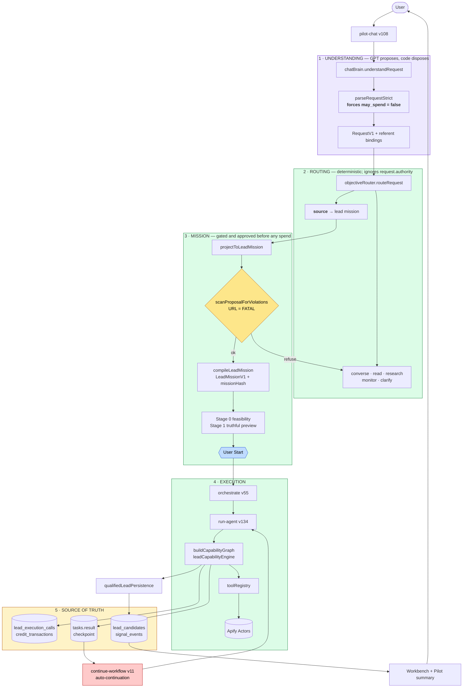
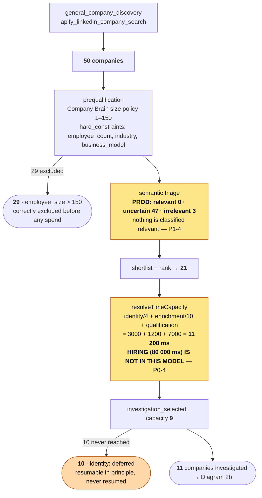
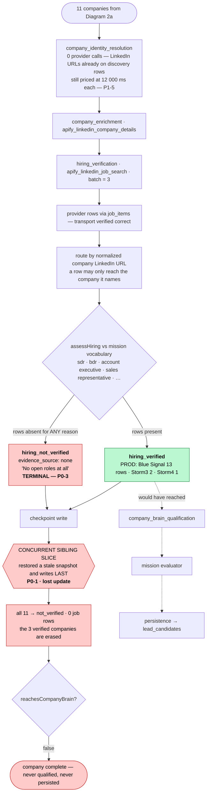
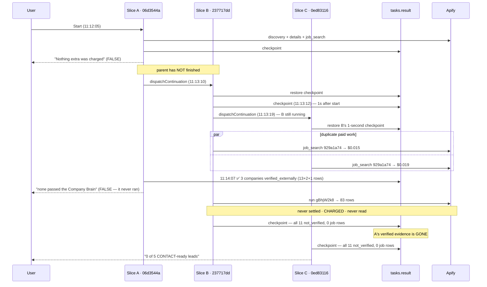
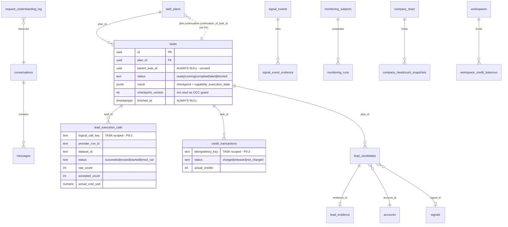
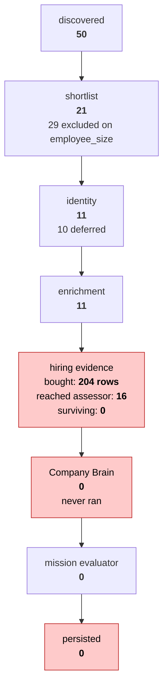
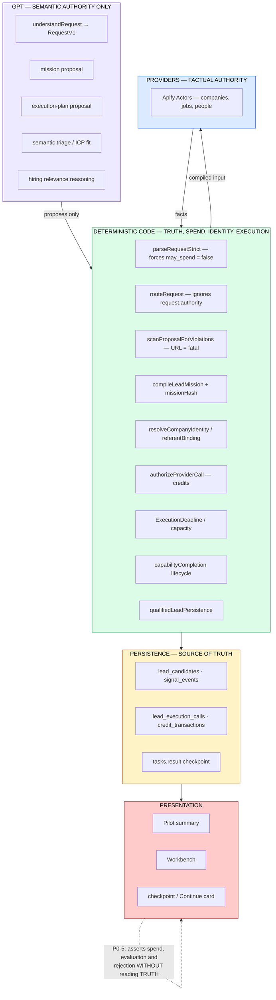

# Agentory Backend Architecture & Forensic Workflow Audit

| | |
|---|---|
| **Commit (HEAD)** | `65da8551c27f2f971caa68ccc4a9ef27a28850c9` — *"Deploy stamp: paid answer durability"*, 2026-08-29 16:30 +0545 |
| **Branch** | `feat/lead-mission-v1` (clean, in sync with `origin`) |
| **Repository** | `/Users/prasidha/agentory-main-local` |
| **Production project** | `ohsdatpvfdjdemstoiuj` |
| **Audit date** | 2026-08-29 (DB clock at first query: `12:07:34 UTC`) |
| **Deployed builds audited** | `run-agent` v134 (2026-08-29 10:44:47 UTC) · `pilot-chat` v108 (10:44:41) · `run-monitoring-scan` v51 (10:44:54) · `continue-workflow` v11 (09:56:13) · `orchestrate` v55 (08:29:25) · `resume-stalled-leads` v1 (2026-08-26 17:10:03) |
| **Primary evidence run** | Lineage `06d3544a` → `237717dd` → `0ed83116`, conversation `4c4ddb5a`, 2026-08-29 11:12–11:23 UTC, executed on `run-agent` v134 |

### Evidence grading used throughout

Every claim in this document carries one of four grades. They are not decorative — several long-standing beliefs about this system turn out to be **inferred/unproven**, and two turned out to be wrong.

| Grade | Meaning |
|---|---|
| **[PROD]** | Proven in production. Persisted rows, edge-function logs, or provider datasets from a real run on the deployed build. |
| **[REPLAY]** | Proven by zero-spend replay against frozen real provider data. |
| **[TEST]** | Proven by unit/integration test only. The test passes; production behaviour is not thereby established. |
| **[INFER]** | Inferred from code reading. Not yet observed. Flagged explicitly wherever it matters. |

---

## 1. Executive summary

### 1.1 The headline

**Agentory's lead pipeline has persisted zero leads since 2026-08-21.** [PROD]

```
lead_candidates by day (last 14 days)
  2026-08-21   28     ← last successful persistence
  2026-08-20    3
  2026-08-19    1
  2026-08-22 … 2026-08-29   0
```

In the same window it made **311 provider calls** and spent **~$4.20** of real Apify money, of which **$1.59 on 2026-08-29 alone across 14 tasks**. [PROD]

`signal_events` tells the same story: the last row was written **2026-08-25**. Nothing — not a lead, not a signal — has been durably produced by the current architecture.

This is not a tuning problem, a recall problem, or an ICP problem. **The pipeline demonstrably works once and then destroys its own output.**

### 1.2 What actually happens

The decisive finding is that **the evidence chain is not broken — it is overwritten.**

On the primary evidence run, slice A (`06d3544a`) did everything right:

| Company | hiring | job rows cited | verdict | evidence source |
|---|---|---|---|---|
| Blue Signal Search | `verified_externally` | **13** | `hiring_verified` | `external_job_search` |
| Storm3 | `verified_externally` | **2** | `hiring_verified` | `external_job_search` |
| Storm4 | `verified_externally` | **1** | `hiring_verified` | `external_job_search` |

Three companies, durably hiring-verified, with citations, in the checkpoint. [PROD]

Its continuation, slice B (`237717dd`), restored a **stale checkpoint written before that verification existed**, re-ran the same paid searches, and wrote its own state over the lineage:

| Company | hiring | job rows | verdict | evidence source |
|---|---|---|---|---|
| Blue Signal Search | `not_verified` | **0** | `hiring_not_verified` | `none` |
| Storm3 | `not_verified` | **0** | `hiring_not_verified` | `none` |
| Storm4 | `not_verified` | **0** | `hiring_not_verified` | `none` |
| *(and 8 more)* | `not_verified` | 0 | `hiring_not_verified` | `none` |

The reason field on each says: **"No open roles at all — nothing to judge against the mission's required role."** [PROD]

`hiring_not_verified` does not reach Company Brain (`reachesCompanyBrain`, `commercialSignalPolicy.ts:401`). So qualification never runs, persistence has nothing to write, `pending_capabilities` never empties, the run reports `continuation_required`, and another continuation starts — from the degraded state.

**The system verified three real companies and then told the user "none passed the Company Brain".**

### 1.3 Why continuations fork

Slice A emitted its "time limit reached" checkpoint at **11:13:03** and *kept running until 11:14:16*, verifying the three companies at 11:14:07. Auto-continuation had already dispatched slice B at **11:13:10** — 66 seconds before its parent finished. Slice B then had its own continuation, slice C (`0ed83116`), dispatched at **11:13:19**, eight seconds after B started and while B was still executing. [PROD]

Three generations of one request ran **concurrently**, each from a snapshot older than the work its predecessor was still doing.

### 1.4 Why the same money is spent twice

`providerOperationKey` is correctly lineage-scoped and excludes the task id — its own doc comment explains why. But the key that actually gates **credits and ledger uniqueness** is `logicalCallKey`, and it is **task-scoped**:

```ts
// executionLedger.ts:1080
export function logicalCallKey(args: {...}): string {
  return [args.task_id ?? "no-task", args.capability ?? args.stage,
          args.input_hash ?? "no-hash"].join(":");
}
```

Production shows the consequence exactly. Identical input fingerprints, two tasks, two paid runs, two charges: [PROD]

| Input fingerprint | Task `237717dd` | Task `0ed83116` | Duplicate? |
|---|---|---|---|
| `996fb92c` | run `G9ppGtOL…` charged | run `G9ppGtOL…` **reused** — *still charged 1 credit* | charge only |
| `298dc1a0` | run `FcGResJtI7CJGdOEa` $0.0001 | run `8NnjlNJgwRcbdUH2M` $0.0001 | **run + charge** |
| `929a1a74` | run `QdMbpZGaNym2bzjZI` $0.015 | run `EimrTjnSzy7TgIldA` $0.019 | **run + charge** |
| `2df88a5a` | run `kCcPbdENXxrueROWZ` $0.016 | run `EnRFGYQzHPSrwVQ5X` $0.025 | **run + charge** |

The stated invariant — *one semantic provider operation = at most one paid provider run* — **is violated in production today.**

### 1.5 Paid evidence that was never read

Two job searches on this lineage were charged and never settled. Their datasets are still in Apify, and I read them (free, no new run): [PROD]

| Run | Ledger status | Credit | Rows actually in dataset | Sample titles |
|---|---|---|---|---|
| `gBhjW2k8ad1SdD7ZJ` | `started`, `raw_count: null` | **charged**, reason `provider_call_succeeded` | **83** | Business Development Representative · Remote Sales Development Representative · Remote Inside Sales Representative |
| `SL6azYExycvQQRbuT` | `timed_out`, `raw_count: null` | **charged**, reason `apify_run_running` | **90** | Medical Sales Specialist · Institutional Research Sales | AVP or VP |

**173 paid job rows of exactly the requested evidence, bought, charged, never read.** The three companies in the first batch (Talentoma, CareerXperts, Blue Signal Search) were then recorded as `hiring_not_verified` — *"No open roles at all"* — while 83 sales openings sat in their dataset.

### 1.6 The three lies the user was told

All three are hardcoded strings emitted from inference, with no read of the persisted facts they assert. [PROD]

| Shown to user (11:13–11:15 UTC) | Persisted truth |
|---|---|
| *"Nothing is lost and nothing extra was charged."* | 10+ `credit_transactions` rows `status='charged'` on this lineage, several written seconds later |
| *"11 identities resolved but none passed the Company Brain."* | `company_brain_qualification` was in `pending_capabilities`. **It never ran. Nobody was evaluated.** |
| *"No credits charged, nothing sent."* | 55 credits charged in the preceding 2 days; several on this exact plan |

### 1.7 The minimum answer

Five root causes produce every symptom. In dependency order:

1. **Continuation forks a still-running lineage** → concurrent generations, stale restores, lost-update on the checkpoint.
2. **The idempotency key that gates spend is task-scoped**, while the one that gates execution is lineage-scoped.
3. **`hiring_not_verified` is terminal and is written from absent evidence** — "we did not find out" and "there is nothing there" are the same value.
4. **The time-capacity model omits hiring entirely** (`per_company_ms` = 11.2 s; hiring alone is 80 s/company), so every slice authorises ~7× the work it can finish.
5. **Presentation asserts spend, evaluation and rejection from `produced === 0`**, never from the ledger or the capability outcomes.

---

## 2. What Agentory is

Agentory is a B2B signal-intelligence lead-generation product. The design intent is a single AI employee rather than a set of forms: the user states an objective in natural language, and the system decides what it is allowed to do, tells the truth about what it will cost, executes against real providers, and reports only what it can prove.

The authority model is explicit and, in the code, largely honoured:

| Authority | Owns |
|---|---|
| **GPT** | Semantic understanding only — what the user meant |
| **Deterministic code** | Truth, identity, feasibility, spend, provider boundaries, execution, persistence, recovery |
| **Providers** | Facts |

GPT may reason over facts. It may never invent execution state, identity, spend, qualification, or provider results.

The permanent product invariant is: **never claim a capability or result without a proof path.** Every request must end in one of `SATISFIED`, `PARTIALLY_SATISFIED + gaps`, `REQUIRES_UNLOCK/APPROVAL`, `UNSUPPORTED`, or `FAILED + structured reason`.

**Audit verdict on the invariant: the execution layer largely respects it; the presentation layer systematically violates it.** See §12 and §16 (P0-5).

---

## 3. Current architecture

### 3.1 Confirmed present at HEAD

The legacy semantic layer really has been removed. `workflowClassifier`, `classifyIntent`, `intentRouter`, `capabilityValidator` and `CHAT_BRAIN_ENABLED` survive **only inside comments and historical notes** — there is no live call site. [PROD: `pilot-chat` v108 log stream shows no classifier stage; code search confirms no live references]

Chat Brain / `RequestV1` is authoritative:

```
pilot-chat/index.ts:32   import { understandRequest } from "../_shared/chatBrain.ts";
pilot-chat/index.ts:60   import { routeRequest, type Route } from "../_shared/objectiveRouter.ts";
pilot-chat/index.ts:1847 const understood = await understandRequest(message, {...});
pilot-chat/index.ts:1933 brainRoute = routeRequest(understood.request, {...});
```

### 3.2 Module inventory (the ones that matter for lead sourcing)

`supabase/functions/_shared/` holds 345 modules. The lead path runs through these:

| Concern | Module | Size |
|---|---|---|
| Execution engine | `leadCapabilityEngine.ts` | 413 KB |
| Provider registry / invocation | `toolRegistry.ts` | 90 KB |
| Actor catalog & contracts | `hiringActorCatalog.ts`, `actorInputContracts.ts` | 78 / 38 KB |
| Capability graph | `leadCapabilityGraph.ts` | 66 KB |
| Mission compile | `leadMissionCompiler.ts`, `leadMission.ts` | 65 / 59 KB |
| Provider row normalization | `hiringActorNormalizers.ts` | 49 KB |
| Ledger | `executionLedger.ts` | 45 KB |
| Budget / scheduling | `leadInvestigationBudget.ts`, `executionDeadline.ts` | 39 KB / — |
| Finalization | `leadExecutionFinalizer.ts` | 33 KB |
| Resume / checkpoint | `leadResumeState.ts` | 30 KB |
| Continuation | `workflowContinuation.ts`, `leadContinuationDispatch.ts`, `continuationClaim.ts` | 28 KB / — / — |
| Understanding | `chatBrain.ts`, `requestV1.ts`, `requestV1Parser.ts`, `objectiveRouter.ts`, `projectToLeadMission.ts` | — |
| Surfaces | `readSurface.ts` (46 KB), `monitorSurface.ts`, `researchEvidenceGate.ts` | — |
| Identity | `companyIdentityResolution.ts`, `referentBinding.ts` | — |
| Persistence | `qualifiedLeadPersistence.ts` | 24 KB |
| Workbench | `leadWorkbenchProjection.ts` | 27 KB |
| Completion lifecycle | `capabilityCompletion.ts` | — |

---

## 4. Chat Brain / RequestV1

### 4.1 Shape

`RequestV1` is deliberately small and sits *in front of* `LeadMissionV1` rather than replacing it. Objectives are ranked by commitment:

```
converse (0) → read (1) → research (2) → source (3) → monitor (4) → compose (5)
```

A request's objective is its **most-committing part**; each `RequestPart` keeps its own. This is what lets a mixed "tell me what we have on X, then find similar" run the read half from held records and only the source half against a provider.

### 4.2 Spend authority — verified sound

Two deterministic guarantees, both confirmed by code inspection and both consistent with production behaviour:

- `parseRequestStrict` forces `may_spend: false` on **every** parse regardless of what the model returned.
- `routeRequest` never reads `request.authority`; permission is passed in by the caller from the deterministic gates.

A malformed or unknown objective produces a clarification, never a silent `source`. **GPT cannot authorise its own spending.** [TEST + INFER — no production case of a malformed understanding was observed in the audit window; the guarantee is structural rather than observed]

### 4.3 Understanding quality on the evidence run

The mission compiled from *"Find 5 recruiting or staffing companies that fit my ICP and are actively hiring sales roles"* was correct. [PROD]

```
[run-agent][lead-mission]
  mission_version: "lead-mission-v1", mission_type: "company_research",
  requested_output: "qualified_companies",
  entry_capability: "general_company_discovery",
  bound_referents: 0,
  capabilities: [general_company_discovery, company_identity_resolution,
                 company_enrichment, hiring_verification,
                 company_brain_qualification, persistence]
```

Stage 1 preview shown to the user was truthful:

> *"Here's what I'd run: discover companies by profile, then resolve company identity, then enrich company, then verify hiring signal, then qualify against company brain, then persist results. This one uses credits."*

**Understanding, compilation, preview and approval are not where this system is failing.**

---

## 5. LeadMissionV1 lifecycle

```
RequestV1 → projectToLeadMission → GptMissionProposal
          → compileLeadMission → LeadMissionV1 + missionHash
          → Stage 0 feasibility → Stage 1 preview → user Start
          → orchestrate → run-agent → buildCapabilityGraph → engine
```

### 5.1 missionHash continuity — holds

All three tasks in the evidence lineage carry the identical `mission_hash`: [PROD]

```
d3d0dc967072423c36e037af80f51b8f14323049811726039fb88ec549b52d92
```

The approved mission survives Start and survives every continuation. The 08:42 task from a separate lineage carries the same hash, which is correct — same request, same mission.

### 5.2 Binding fingerprint — present but inert

`capability_execution_state.binding_fingerprint` is `null` on every production run, and `bound_referents: 0` in the mission log. The Phase E sidecar is deployed and structurally correct but never exercised, because this request class names no referent. [PROD]

`stateMatchesMission` therefore falls back to mission-hash-only comparison, which is the documented pre-binding behaviour. No integrity issue here **for this request class** — but see §16 (P2-4): a same-named-company collision remains untested in production.

---

## 6. Lead sourcing execution

### 6.1 The plan, as resolved

```
[run-agent][capability-engine] execution_plan_resolved
  general_company_discovery : apify_linkedin_company_search
  company_enrichment        : apify_linkedin_company_details
  hiring_verification       : apify_linkedin_job_search
  company_brain_qualification : -
  persistence               : -
  source: "model_validated"
```

Note `company_identity_resolution` is in the capability list but has **no provider** in the resolved plan — identity is satisfied from URLs already present on discovery rows. This matters for §11.

### 6.2 Capability completion semantics

`capabilityCompletion.ts` implements the rule added after task `5c461aa3`: a capability that produced **zero rows** may not close while anything ordered before it is still pending.

```ts
export function completionIsProvisional(i): boolean {
  if (i.rows > 0) return false;                       // ← produced something: closes
  const at = i.planOrder.indexOf(i.capability);
  if (at <= 0) return false;
  const pending = new Set(i.pendingCapabilities);
  return i.planOrder.slice(0, at).some((c) => pending.has(c));
}
```

This works as designed — production shows it firing correctly: [PROD]

```
capability_completion_provisional { capability: "persistence", rows: 0,
  still_pending: [company_identity_resolution, company_brain_qualification,
                  persistence, company_enrichment, hiring_verification] }
```

**Correction to a prior belief:** I initially read the run-wide `completed_capabilities` skip (`leadCapabilityEngine.ts:3324`) as permanently closing hiring for later-resolved companies. That is **wrong**. The investigation frontier reopens them at the end of each slice: [PROD]

```
investigation_frontier_carried { frontier_remaining: 11, qualified: 0, requested: 5,
  reopened: [company_identity_resolution, company_enrichment,
             hiring_verification, company_brain_qualification] }
```

Capability lifecycle is **not** a root cause. The loss is at the per-company evidence level, not the capability level.

---

## 7. Provider architecture

### 7.1 Full provider audit — primary evidence lineage

Every provider call on lineage `06d3544a`, with counts reconciled against the actual Apify datasets. [PROD]

| Task | Capability | Actor | Run id | Dataset | Status | Dur | raw | norm | uniq | acc | rej | Cost USD | Credit | Dataset really holds |
|---|---|---|---|---|---|---|---|---|---|---|---|---|---|---|
| `06d3544a` | company_details | harvestapi/linkedin-company | *(af36cdab)* | — | succeeded | — | — | — | — | — | — | ~0.0001 | charged | — |
| `06d3544a` | job_search | harvestapi/linkedin-job-search | *(0c6ba000)* | — | succeeded | — | — | — | — | — | — | — | charged | 16 rows reached companies |
| `237717dd` | company_details | harvestapi/linkedin-company | `G9ppGtOL11gNZr9Af` | `uwqmu6ds5cChSJ3cx` | succeeded | 14.6 s | 10 | 10 | 10 | 10 | — | 0.0001 | charged | 10 |
| `237717dd` | company_details | harvestapi/linkedin-company | `FcGResJtI7CJGdOEa` | `3l6MlYJmbr0X4Agdv` | succeeded | 10.3 s | 1 | 1 | 1 | 1 | — | 0.0001 | charged | 1 |
| `237717dd` | job_search | harvestapi/linkedin-job-search | `QdMbpZGaNym2bzjZI` | `kDR7fzLcBT3hxfiMc` | succeeded | 16.7 s | 3 | 3 | 3 | 3 | 0 | 0.015 | charged | **3** — *Enterprise Account Executive, Enterprise Sales Director, Sales Director* |
| `237717dd` | job_search | harvestapi/linkedin-job-search | `kCcPbdENXxrueROWZ` | `S4mOFDce4ghLRDvmr` | succeeded | 29.7 s | 5 | 5 | 5 | 5 | 0 | 0.016 | charged | **5** — incl. *Inside Sales Representative* |
| `237717dd` | job_search | harvestapi/linkedin-job-search | `gBhjW2k8ad1SdD7ZJ` | `6F6W9GFkpQdQvIBdv` | **`started` — never settled** | — | null | null | null | null | null | **null** | **charged** (`provider_call_succeeded`) | **83** |
| `237717dd` | job_search | harvestapi/linkedin-job-search | `SL6azYExycvQQRbuT` | `GCNtgID6Cq1ggEdDb` | **`timed_out`** (`apify_run_running`) | 93.5 s | null | null | null | null | null | **null** | **charged** (`apify_run_running`) | **90** |
| `0ed83116` | company_details | harvestapi/linkedin-company | `G9ppGtOL11gNZr9Af` | `uwqmu6ds5cChSJ3cx` | **`reused`** | 5.1 s | 10 | 10 | 10 | 10 | — | **0.0001 recorded again** | **charged** | 10 |
| `0ed83116` | company_details | harvestapi/linkedin-company | `8NnjlNJgwRcbdUH2M` | `qv3osTk9xeUuAiuQb` | succeeded | 7.4 s | 1 | 1 | 1 | 1 | — | 0.0001 | charged | 1 |
| `0ed83116` | job_search | harvestapi/linkedin-job-search | `EimrTjnSzy7TgIldA` | `VLRwThjIBza8hTFjg` | succeeded | 27.0 s | 3 | 3 | 3 | 3 | 0 | 0.019 | charged | 3 |
| `0ed83116` | job_search | harvestapi/linkedin-job-search | `EnRFGYQzHPSrwVQ5X` | `frYRXMALTvFf6QFFR` | succeeded | 86.3 s | 7 | 7 | 7 | 7 | 0 | 0.025 | charged | **7** — incl. *Inside Sales Representative* (Storm4), *IR and BD Specialist* (Atlas Search) |

**Reconciliation:**

- Semantic operations: 6 distinct input fingerprints. Paid provider runs: 10. **Excess: 4.**
- Duplicate spend on this lineage: **~$0.044 of ~$0.119** in job/detail searches, plus 4 duplicate credits.
- `reused` run charged **1 credit and recorded $0.0001** — an adopted run must contribute **zero**.
- Two calls charged with **no cost, no counts, and no dataset read**: 173 rows.
- Total paid job rows on this lineage: 3 + 5 + 7 + 83 + 90 + 16 = **204**. Rows that reached a company's assessment in the surviving state: **0**.

### 7.2 Actor input construction — correct

The mission-derived hiring vocabulary fix (recent history item #2) **is live and working**. [PROD]

```
[run-agent][capability-engine] hiring_search_vocabulary
  { source: "mission", titles: 20,
    leading: [sales roles, sdr, bdr, sales development representative,
              account executive, founding sdr] }
```

The compiled Actor input:

```json
{ "company": ["…/pursuit-sales-solutions", "…/coda-search"],
  "maxItems": 20,
  "jobTitles": ["sales roles","sdr","bdr","sales development representative",
                "account executive","founding sdr","founding ae","head of sales",
                "growth","gtm","go to market","business development",
                "demand generation","revenue","salesperson","sales representative",
                "territory sales manager","ae","enterprise ae","seller"] }
```

There is **no hardcoded senior-GTM list**; role-family expansion from the mission is confirmed. One residual defect: the literal category phrase **`"sales roles"` is still passed as a job title** (P2-1). It matches nothing on LinkedIn and consumes one of 20 slots.

### 7.3 Jobs transport contract — correct

`readProviderResultItems(result, "jobs", { providerRows: true })` returns `job_items` — the Actor's own rows — and `jobRowsLookIntact` logs a `provider_response_shape_violation` if a flattened legacy projection arrives instead. **No shape violation was logged in the audit window.** [PROD]

I verified the join key directly against the paid dataset. Requested URL and returned URL match exactly:

```
requested : https://www.linkedin.com/company/storm4
returned  : company.linkedinUrl = "https://www.linkedin.com/company/storm4"
            company.universalName = "storm4", company.id = "71303127"
```

`normalizeLinkedInJob` applies `normalizeCompanyLinkedInUrl(c.linkedinUrl)`, the same normalizer used to build the lookup map. **The transport bug from task `a76c7b4c` is genuinely fixed.** [PROD]

### 7.4 Count ledger and truncation

Partially honest. For settled calls, `raw = normalized = unique = accepted`, `rejected = 0`, and these agree with the datasets. But:

- `maxItems` is requested as `10 × companies` (20–30) and the Actor returned **83** and **90**. `maxItems` is not a binding cap for this Actor. The `truncated` field is therefore measuring the wrong risk: the exposure is **under-reading a large dataset**, and on the two unsettled calls the ledger recorded `raw_count: null` while 173 rows existed.
- For a company with many openings, `HIRING_JOBS_PER_BATCH_COMPANY = 10` caps evidence per company at 10 rows.

---

## 8. Hiring verification

### 8.1 It works — and the logs prove it

```
[run-agent][capability-engine] hiring_verification_complete
  { targets: 4,  verified: 3, review: 0, watch: 0, notVerified: 1, paid_job_searches: 1 }   ← 11:14:07, task 06d3544a
  { targets: 11, verified: 2, review: 0, watch: 0, notVerified: 9, paid_job_searches: 2 }   ← 11:15:39, task 0ed83116
```

Five companies were verified across two slices. **Zero survive in the final state.** [PROD]

### 8.2 Where the verdict is written

```ts
// leadCapabilityEngine.ts — assessOne
const mine = batchedJobs.get(c.key) ?? [];
if (mine.length > 0) {
  const external = assessHiring(externalJobs.map(...), [...], 
    { source: "external_job_search", vocab: qualificationCtx.role_vocabulary });
  if (external.verdict === "hiring_verified") { assessment = external; verdictFromExternal = true; }
}
c.hiring_assessment = assessment;
c.hiring_jobs = verdictFromExternal ? hiringJobsFor(c, assessment, externalJobs)
                                    : hiringJobsFor(c, assessment);
```

The routing itself is careful and correct — rows are attributed only to the company they name, and a row naming a company outside the batch is dropped rather than misattributed.

### 8.3 The defect: absence and negation share one value

When `mine.length === 0` — because the batch was never read, or because the working set was restored without its evidence — the free assessment runs and produces:

```json
{ "verdict": "hiring_not_verified", "evidence_source": "none",
  "reason": "No open roles at all — nothing to judge against the mission's required role (…)",
  "commercial_jobs": [], "needs_external_verification": false }
```

Two things then make this permanent:

1. `nextStageFor` (`leadResumeState.ts:367`) treats `not_verified` as **terminal**:
   ```ts
   if (r.hiring === "not_verified" || r.hiring === "failed") return null;
   ```
   The company is `companyIsComplete`. The `brain` check below is never reached.
2. `reachesCompanyBrain` excludes it (`commercialSignalPolicy.ts:401`).

There is a `deferred` guard for the in-flight case, and it is well reasoned. It does **not** cover the case where a *previous slice's* evidence failed to restore — which is the case that actually happens.

**"We did not find out" is being recorded as "there is nothing there", and the recording is irreversible.** This is P0-3.

---

## 9. Company Brain qualification

### 9.1 It has never run on this request class

`company_brain_qualification` appears in `pending_capabilities` on **every** task in the audit window. There is no production evidence of it executing against a company. [PROD]

The policy itself is loaded and enforced:

```json
{ "size": { "min": 1, "max": 150, "source": "explicit_numeric" },
  "enforced": true,
  "hard_constraints": ["employee_count", "industry", "business_model"],
  "unknown_evidence": "research",
  "policy_version": "company-brain-effective-policy-1.0.0" }
```

29 of 50 discovered companies were hard-excluded on `employee_size` — a legitimate ICP filter (>150 employees), correctly applied at prequalification, before any spend on those companies. That part is working well.

### 9.2 Semantic triage is producing no signal

```json
"triage": { "total": 50, "relevant": 0, "uncertain": 47, "irrelevant": 3,
            "batches_made": 2, "batches_available": 2 }
```

**Zero companies were classified `relevant`.** [PROD] Everything is `uncertain`, so the shortlist ranking among 21 survivors is effectively arbitrary and the entire paid budget is spread across companies about which the system has no opinion. With a budget of 10 and a capacity of 9, spreading evenly across 21 undifferentiated candidates is close to the worst allocation available.

This is not the primary cause of zero leads, but it is a major efficiency loss and it deserves separate investigation (P1-4).

---

## 10. Persistence

`persistence` is the last node and has never been reached in the current architecture. [PROD]

The `completionIsProvisional` guard correctly holds it open rather than letting it close vacuously — the `5c461aa3` fix works. But holding it open is not progress: nothing upstream ever delivers a qualified company, so persistence has nothing to do and the run cannot terminate.

`lead_library_persistence` shows `{ planned: 0, persisted: 0 }` on every run.

---

## 11. Timeout, checkpoint and continuation

### 11.1 The capacity model omits the dominant cost

```ts
// leadInvestigationBudget.ts:305
const perCompany =
  identity / concurrency +   // 12000 / 4  =  3000
  enrichment / batch +       // 12000 / 10 =  1200
  qualification;             //             =  7000
                             //  per_company_ms = 11200
```

Production confirms: `per_company_ms: 11200`, `capacity: 9`, `usable_ms: 105489`, `reserve_ms: 18000`. [PROD]

**Hiring verification is not in this model at all.** Its own constant is:

```ts
export const HIRING_MS_PER_COMPANY = 80_000;
```

The scheduler authorises 9 companies on a model that prices a company at 11.2 s, when the dominant stage costs 80 s. The true serial cost is ~91 s/company; 105 s of usable clock supports **one**, not nine.

The consequence is visible in the logs as an immediate, guaranteed starvation:

```
hiring_verification_complete { targets: 11, verified: 2, paid_job_searches: 2 }
hiring_batch_deferred_for_deadline { remaining: 5 }
```

Hiring consumes the slice; `company_brain_qualification` never gets clock. This is exactly the scheduling problem observed in the Talentoma milestone run, and it is structural, not incidental. **P0-4.**

### 11.2 Checkpointing on a full clock

```json
{ "checkpoint_reason": "execution_deadline_checkpoint",
  "time_remaining_at_checkpoint_ms": 122865,
  "next_pending_capability": "company_identity_resolution",
  "pending_company_keys": 39, "completed_company_keys": 11 }
```

**123 seconds remaining, zero provider calls made, checkpointed as if out of time.** [PROD] Lineage `9da530ae` did this five times in a row over an hour:

| Slice | Created | Provider calls | USD | completed | identity | hiring_verified | qualified | cost_units |
|---|---|---|---|---|---|---|---|---|
| `9da530ae` | 09:03:47 | 9 | 0.2883 | disc, enrich, hiring | 11 | 0 | 0 | 8 |
| `a3bcd0f8` | 09:40:08 | **0** | — | *identical* | 11 | 0 | 0 | 8 |
| `be251365` | 09:40:14 | **0** | — | *identical* | 11 | 0 | 0 | 8 |
| `02ea3aed` | 09:41:44 | **0** | — | *identical* | 11 | 0 | 0 | 8 |
| `a5b0e118` | 10:02:50 | **0** | — | *identical* | 11 | 0 | 0 | 8 |

A **fixed point**: four slices that do nothing, spend nothing, change nothing, and each dispatch another. **P1-1.**

### 11.3 The fork

Reconstructed from `task_plans.plan->continuation`, `tasks`, `messages` and logs. [PROD]

```
11:11:50  user: "Find 5 recruiting or staffing companies…"
11:11:55  Pilot Stage-1 preview — truthful, "This one uses credits."
11:12:04  user approves (Start)
11:12:05  plan 7b5c81b9 / task 06d3544a created
11:13:03  06d3544a checkpoint #1  →  "50 companies found, 10 shortlisted.
                                      Nothing is lost and nothing extra was charged."
11:13:10  ── FORK 1 ── continuation plan 021ba132 / task 237717dd
                       continuation_of_task_id = 06d3544a
                       restores checkpoint #1  (NO hiring evidence)
11:13:12  237717dd emits its own checkpoint  1 second after starting
11:13:15  06d3544a charges another job_search credit  (parent still running)
11:13:19  ── FORK 2 ── continuation plan 53436fd0 / task 0ed83116
                       continuation_of_task_id = 237717dd
                       8 s after B started, while B is still executing
11:13:39  B and C both buy fingerprint 929a1a74            ← duplicate
11:14:02  B and C both buy fingerprint 2df88a5a            ← duplicate
11:14:07  ✅ 06d3544a verifies 3 companies (13 + 2 + 1 job rows)
11:14:16  06d3544a finishes — 66 s after its continuation started
11:14:24  Pilot summary for 06d3544a: "…none passed the Company Brain."
11:14:35  B starts run gBhjW2k8… (83 rows) — never settled, charged
11:14:36  "No credits charged, nothing sent."
11:15:39  C verifies 2 companies
11:21:08  B starts run SL6azYE… (90 rows) — times out, charged
11:22:54  Final summary: 0 of 5, "32 were shortlisted", "none passed the Company Brain"
```

Two independent mechanisms permit the fork:

1. **Auto-continuation dispatches before the parent is finished.** `dispatchContinuation` uses `raceHandoff` and returns as soon as the request is accepted; the parent keeps executing. The `claim_sourcing_continuation` lease protects **same-row** resumption, but this path creates a **new task and a new plan**, so no lease is contended.
2. **`continue-workflow`'s duplicate check is a read-then-write race.** It looks for a prior plan by `plan->continuation->>continuation_of_task_id` and inserts if absent — with no unique constraint behind it (`continue-workflow/index.ts:99-110`).

Note also `tasks.parent_task_id` is **NULL** on every continuation; lineage lives only in `result.lead_resume_lineage_root`. There is no database-level constraint that could prevent a second child. **P0-1.**

### 11.4 What a coherent checkpoint must contain

Measured against the required list:

| Required | Present | Note |
|---|---|---|
| exact `LeadMissionV1` | ✅ | `result.lead_mission` |
| `missionHash` | ✅ | matches across lineage |
| binding fingerprint | ⚠️ | field present, `null` (no referents) |
| company working set | ✅ | 50 records with `snapshot` |
| shortlist state | ✅ | `shortlist_decision` with ranking + counts |
| identity state | ✅ | `snapshot.identity` is the **object**, not just the stage |
| enrichment state | ✅ | `snapshot.enriched`, `enrichment_outcome` |
| hiring assessments | ⚠️ | present but **overwritten by a stale sibling** |
| citations | ❌ | `snapshot.hiring_jobs` = 0 in the surviving state (16 in the parent's) |
| completed operations | ✅ | lineage-scoped `providerOperationKey` — correct |
| pending operations | ✅ | `pending_runs` |
| provider runs | ✅ | run ids persisted before poll |
| capability completion | ✅ | with provisional-completion guard |
| next work | ✅ | `next_pending_capability`, `pending_company_keys` |
| persistence state | ✅ | `lead_library_persistence` |
| cost state | ✅ | `accumulated_cost_units` |

**The checkpoint schema is good.** The failure is not missing fields — it is that **two concurrent writers with different views both write it**, and last-write-wins destroys the better state. This is a lost-update problem, not a serialization problem. `checkpoint_version` exists on `tasks` (value 8 on the active task) but is not used as an optimistic-concurrency guard across the lineage.

### 11.5 Stranded work

11 tasks sit in `ready` and will never be picked up. [PROD]

| Task | Created | Quiet | terminal_status | checkpoint_version |
|---|---|---|---|---|
| `43355471` | 08:42:57 | **205 min** | `continuation_required` | 0 |
| `83d544a5` | 08-26 17:37 | 3 983 min | — | 0 |
| `517ba939` | 08-20 08:47 | 13 158 min | — | 1 |
| `5ecf3235` | 08-19 16:09 | 14 156 min | — | 1 |
| `85192217` | 08-19 11:02 | 14 464 min | — | 1 |
| `fd0c5a05` | 08-19 10:15 | 14 510 min | — | 1 |
| `25f3ff57` | 08-18 11:36 | 15 870 min | — | 1 |
| `130adf73` | 08-18 10:48 | 15 918 min | — | 1 |
| `e0e62ecd` | 08-17 11:11 | 17 335 min | — | 1 |

`stalledLeadResume.eligibleForAutoResume` refuses anything older than `MAX_RESUMABLE_AGE_MS = 2 h`. `43355471` had a resumable checkpoint and was never resumed inside its window; it is now permanently stranded with paid discovery ($0.153, 50 companies) behind it. Nothing reports these to anyone. **P1-2.**

Separately, three tasks carry `status='complete'` with `terminal_status='continuation_required'` — a contradiction. `complete` is not a resumable status, so the sweeper cannot reach them either.

---

## 12. Cost and credit safety

### 12.1 Reconciliation

| Window | Provider calls | succeeded | reused | `started` (never settled) | timed_out | USD | Tasks |
|---|---|---|---|---|---|---|---|
| 2026-08-29 | 48 | 41 | 1 | **4** | 2 | **1.5925** | 14 |
| 2026-08-28 | 9 | 9 | 0 | 0 | 0 | 0.2622 | 3 |
| 2026-08-26 | 62 | 40 | 10 | **5** | 6 | **2.2100** | 11 |
| 2026-08-25 | 15 | 12 | 0 | 0 | 0 | 0.1377 | 1 |
| 2026-08-24 | 8 | 6 | 0 | 1 | 1 | 0.0414 | 0 |
| 2026-08-21 | 108 | 108 | 0 | 0 | 0 | **null** | 5 |

Credits over the last 2 days: 55 `charged` (1 credit each, all finalized), 2 `released`. No stuck reservations — the `credits_release_stale` backstop is doing its job.

### 12.2 Invariant violations

| Invariant | Status | Evidence |
|---|---|---|
| One semantic operation = at most one paid run | ❌ **violated** | 3 fingerprints bought twice on one lineage |
| An adopted/reused run contributes 0 cost units | ❌ **violated** | `ad7324c7` charged 1 credit for a `reused` call; the row also re-records `actual_cost_usd = 0.0001` |
| A charge implies a settled ledger row | ❌ **violated** | `c34c857b` charged with reason `provider_call_succeeded` while the ledger row stayed `started`, `raw_count: null` |
| A timed-out call is not charged as success | ⚠️ | `287a325f` charged with reason `apify_run_running` — honest reason, but full credit for unread data |
| Cost is always recorded | ❌ | 108 calls on 2026-08-21 have `actual_cost_usd = NULL`, `cost_source = 'unknown'` |

The two ledgers — `lead_execution_calls` and `credit_transactions` — **disagree with each other in production**, and both are keyed on the task-scoped `logical_call_key`. **P0-2.**

---

## 13. Workbench

```json
{ "accounts_found": 50, "evaluated": 50, "shortlisted": 21,
  "deferred": 10, "not_investigated": 29,
  "qualified": 0, "not_qualified": 0, "contact_ready": 0,
  "held_for_evidence": 0, "identity_unresolved": 0, "awaiting_investigation": 0 }
```

**Accounting check:** `29 not_investigated + 21 shortlisted = 50` ✅ at the top level. But of the 21 shortlisted, 10 are `deferred` and **11 were fully investigated and rejected on hiring evidence** — and those 11 land in **no terminal disposition**. `not_qualified` is `0`.

```
reviewed (50) = not_investigated (29) + deferred (10) + qualified (0) + not_qualified (0) + ??? (11)
```

**Eleven companies have no visible state.** They were enriched, paid for, assessed, and rejected — and the Workbench shows nothing that says so. **P1-3.**

Separately, `progress.stage` reads `"qualified"` while `qualified_companies: 0` — a stage label asserting an outcome that did not occur.

The exclusion reason **is** captured for the 29 (`exclusion_reasons: { employee_size: 29 }`), which is good. What is missing is the reason for the 11 — "no sales hiring evidence found" — which is the reason a user would most want.

---

## 14. Complete production funnel

### 14.1 Funnel, lineage `06d3544a`

```
discovered            50   apify_linkedin_company_search, $0.153 (earlier lineage)
  ├─ hard excluded    29   employee_size > 150 (Company Brain policy, min 1 max 150)
  └─ shortlisted      21   ranked; triage: relevant 0, uncertain 47, irrelevant 3
       ├─ deferred    10   identity never attempted — deadline
       └─ investigated 11
            identity resolved      11
            enriched               11
            hiring verified   →  5 in-flight  →  0 surviving
            reached Company Brain   0
            qualified               0
            persisted               0
```

### 14.2 Company-by-company — every company accounted for

**Group A — 29 companies, hard-excluded before any spend.** `identity: not_started`, `enrichment: not_required`, exclusion `employee_size`. Correct behaviour: the ICP says 1–150 employees and these exceed it. No unaccounted population here.

**Group B — 10 companies, deferred at identity.**

| Company | identity | enrichment | hiring | brain | Why |
|---|---|---|---|---|---|
| INDI Staffing Services | `deferred` | not_required | not_started | not_started | deadline — capacity exhausted |
| EVONA | `deferred` | not_required | not_started | not_started | deadline |
| Calculated Hire | `deferred` | not_required | not_started | not_started | deadline |
| Arrow Search Partners | `deferred` | not_required | not_started | not_started | deadline |
| Ringside Talent | `deferred` | not_required | not_started | not_started | deadline |
| CareerUp | `deferred` | not_required | not_started | not_started | deadline |
| Engtal | `deferred` | not_required | not_started | not_started | deadline |
| Swooped | `deferred` | not_required | not_started | not_started | deadline |
| LetsRemotivate | `deferred` | not_required | not_started | not_started | deadline |
| HireFeed | `deferred` | not_required | not_started | not_started | deadline |

Resumable in principle (`IDENTITY_RESUMABLE` includes `deferred`), never resumed in practice — see the fixed point in §11.2.

**Group C — 11 companies investigated. This is where the run was lost.**

| Company | Identity | Enrich | Jobs bought (dataset) | Verified in-flight | **Final state** | Brain | Persisted |
|---|---|---|---|---|---|---|---|
| **Blue Signal Search** | resolved (domain_exact, `bluesignal.com`, 106 emp) | ✅ | in `gBhjW2k8…` (**83 rows**, never read) — parent cited **13** | ✅ `verified_externally` @11:14:07 | ❌ `not_verified` / `evidence_source: none` | never ran | ❌ |
| **Storm3** | resolved | ✅ | — parent cited **2** | ✅ `verified_externally` | ❌ `not_verified` | never ran | ❌ |
| **Storm4** | resolved (`storm4.com`, 53 emp) | ✅ | `S4mOFDce…` / `frYRXMALT…` — *Inside Sales Representative* present | ✅ `verified_externally` (1 row cited) | ❌ `not_verified` | never ran | ❌ |
| **Talentoma** | resolved (`talentoma.com`, 10 emp) | ✅ | in `gBhjW2k8…` (83 rows, never read) | — | ❌ `not_verified` | never ran | ❌ |
| **CareerXperts Consulting** | resolved | ✅ | in `gBhjW2k8…` (83 rows, never read) | — | ❌ `not_verified` | never ran | ❌ |
| **Pursuit** | resolved | ✅ | in `SL6azYE…` (**90 rows**, timed out) | — | ❌ `not_verified` (`ops: 0`) | never ran | ❌ |
| **Coda Search│Staffing** | resolved | ✅ | in `SL6azYE…` (90 rows, timed out) | — | ❌ `not_verified` (`ops: 0`) | never ran | ❌ |
| **Intelletec** | resolved | ✅ | `frYRXMALT…` (7 rows) | — | ❌ `not_verified` | never ran | ❌ |
| **Atlas Search** | resolved (146 emp) | ✅ | `frYRXMALT…` — *IR and BD Specialist* present | — | ❌ `not_verified` | never ran | ❌ |
| **Odiin** | resolved | ✅ | — | — | ❌ `not_verified` | never ran | ❌ |
| **SoTalent** | resolved | ✅ | — | — | ❌ `not_verified` | never ran | ❌ |

**No unaccounted population.** 29 + 10 + 11 = 50. Every company has a reason. Three of them have the *wrong* reason.

### 14.3 The counter-evidence

The user was told *"none matched closely enough"*. Against the mission vocabulary — which explicitly contains `sales representative`, `business development`, `account executive`, `sdr`, `bdr` — the paid datasets contained:

- **Blue Signal / CareerXperts / Talentoma batch (83 rows, never read):** Business Development Representative · Remote Sales Development Representative ×2 · Remote Inside Sales Representative ×2 · Remote Sales Representative · Remote Business Development Representative · Remote Sales Development Associate ×2 · …
- **Storm4 (read, and cited by the parent):** Inside Sales Representative · Sales Director ×2 · Senior Originator ×2
- **Atlas Search:** IR and BD Specialist
- **Pursuit / Coda batch (90 rows, timed out):** Medical Sales Specialist · Strategic Sales Specialist · Institutional Research Sales | AVP or VP ×2 · Entry Level Outside Sales · …
- **Earlier batch:** Enterprise Account Executive · Enterprise Sales Director · Sales Director

**The mission was satisfiable. The evidence was purchased. The answer was thrown away.**

---

## 15. Current failure modes

| # | Failure mode | Mechanism | Grade |
|---|---|---|---|
| 1 | Continuation forks a running lineage | `dispatchContinuation` hands off before the parent finishes; `continue-workflow` dedupe is a TOCTOU read-then-write with no unique constraint | [PROD] |
| 2 | Verified hiring evidence erased on resume | A sibling restored from a stale checkpoint writes its (empty) state last | [PROD] |
| 3 | "Not verified" written from absent evidence, terminally | `assessOne` free path + `nextStageFor` treating `not_verified` as terminal | [PROD] |
| 4 | Duplicate paid runs and duplicate credits | `logicalCallKey` includes `task_id`; `providerOperationKey` does not | [PROD] |
| 5 | Paid datasets never read | Provider call killed/timed-out after POST; ledger row left `started`; credit charged anyway | [PROD] |
| 6 | Hiring starves Company Brain | `per_company_ms` omits `HIRING_MS_PER_COMPANY` entirely | [PROD] |
| 7 | Continuation fixed point | Slice checkpoints with 123 s left and zero calls; dispatches successor; repeats | [PROD] |
| 8 | Stranded `ready` tasks | `MAX_RESUMABLE_AGE_MS = 2 h`, no alerting, no terminal write | [PROD] |
| 9 | Summaries assert spend/evaluation/rejection from `produced === 0` | Hardcoded literals in `run-agent/index.ts:574, 2911, 5825-5826` | [PROD] |
| 10 | Workbench loses 11 investigated companies | No disposition bucket for "investigated, no hiring evidence" | [PROD] |
| 11 | Semantic triage returns `relevant: 0` | Classifier abstains on all 50 | [PROD] |
| 12 | Identity priced at 12 s when it makes no provider call | `resolveTimeCapacity` uses a floor, not the actual work | [PROD] |

---

## 16. P0 / P1 / P2 findings

### P0 — corrupts spend, loses state, loses evidence, prevents persistence, lies materially

---

**P0-1 · A continuation is dispatched while its parent is still executing, and nothing serialises a lineage** [PROD]

*Evidence:* `06d3544a` emitted checkpoint #1 at 11:13:03 and ran until 11:14:16. Continuation `237717dd` was created 11:13:11. Continuation `0ed83116` was created 11:13:19 with `continuation_of_task_id = 237717dd`, eight seconds after B began. `tasks.parent_task_id` is NULL on both; lineage exists only inside `result`.

*Mechanism:* `dispatchContinuation` returns on `raceHandoff` as soon as the platform accepts the POST — by design — but the parent does not stop. `claim_sourcing_continuation` guards **same-row** resumption; this path inserts a **new task + new plan**, so no lease is contended. `continue-workflow` §4 checks for an existing continuation with a `select` then `insert`, with no unique index.

*Consequence:* every other P0 follows from this. Concurrent generations, stale restores, duplicate spend, lost verification.

*Fix direction:* a **lineage-level lease** (`lead_resume_lineage_root` + `workspace_id`) taken before a continuation task is created, released only when a slice writes a terminal or checkpoint state; plus a unique partial index on `(workspace_id, continuation_of_task_id)` so the TOCTOU cannot produce two rows. A parent must also be observably finished before its successor is dispatched.

---

**P0-2 · The credit/ledger idempotency key is task-scoped while the execution key is lineage-scoped** [PROD]

*Evidence:*
```
providerOperationKey  = version | workspace | LINEAGE_ROOT | company | capability | provider | fingerprint
logicalCallKey        = TASK_ID | capability | input_hash
```
Fingerprints `298dc1a0`, `929a1a74`, `2df88a5a` each produced two paid runs and two `charged` credit rows across sibling tasks. A `reused` adoption (`996fb92c` on `0ed83116`) was still charged 1 credit and still recorded `actual_cost_usd`.

*Consequence:* the invariant "one semantic provider operation = at most one paid provider run" does not hold across continuation. Adopted runs are charged. Cost is double-counted in USD as well as credits.

*Fix direction:* make the credit idempotency key the **same** key that gates execution — `providerOperationKey`, or at minimum a lineage-scoped variant of `logicalCallKey`. An adopted run must write `actual_credits = 0` and must not re-record `actual_cost_usd`.

---

**P0-3 · Absence of evidence is recorded as a negative verdict, and the negative verdict is terminal** [PROD]

*Evidence:* 22 company records across two tasks, every one `evidence_source: "none"`, `hiring_jobs: 0`, reason *"No open roles at all"* — including three companies the parent slice had verified with 13, 2 and 1 cited job rows, and three more whose 83-row dataset was never read.

*Mechanism:* `assessOne` falls through to `freeHiringAssessment` when `batchedJobs.get(c.key)` is empty, for **any** reason. `nextStageFor` then returns `null` for `not_verified`, making the company complete; `reachesCompanyBrain` excludes it.

*Consequence:* a company can never recover from a slice that failed to reach its evidence. This converts a transient scheduling or transport failure into a permanent, irreversible business answer.

*Fix direction:* introduce a distinct non-terminal state — `hiring_evidence_not_reached` — used whenever the assessment ran with `evidence_source: "none"` **and** a paid search for that company was attempted, deferred, unsettled, or restored without its rows. Only an assessment that actually saw rows may write `not_verified`. The existing `deferred` guard is the right shape; its coverage is too narrow.

---

**P0-4 · The time-capacity model omits hiring verification, guaranteeing downstream starvation** [PROD]

*Evidence:* `per_company_ms = identity/concurrency + enrichment/batch + qualification = 3000 + 1200 + 7000 = 11200`. `HIRING_MS_PER_COMPANY = 80_000` appears nowhere in `resolveTimeCapacity`. Production: `capacity: 9`, `usable_ms: 105489`. Logs: `hiring_verification_complete { targets: 11 … }` immediately followed by `hiring_batch_deferred_for_deadline { remaining: 5 }`, with `company_brain_qualification` never reached.

*Consequence:* every slice authorises ~7–8× the companies it can carry. Hiring consumes the clock; qualification — for which 7 s/company **is** nominally reserved — never runs. The reservation is meaningless because the thing that consumes the budget is invisible to the model.

*Fix direction:* include hiring in `per_company_ms` (amortised over `HIRING_VERIFICATION_BATCH_SIZE`), and **reserve** the downstream qualification budget before authorising a hiring batch: never start a batch whose expected duration would leave less than `targets × qualification_ms` on the clock. Interleaving qualification per batch — qualify the companies a batch just answered, before starting the next batch — is the stronger form and matches the existing per-batch `assessOne` + `publish` pattern.

---

**P0-5 · Pilot asserts spend, evaluation and rejection it has not checked** [PROD]

*Evidence, code:*
```ts
// run-agent/index.ts:2911  — emitted on every checkpoint
`…Nothing is lost and nothing extra was charged. Use Continue below…`

// run-agent/index.ts:574  — no branch for "qualification never ran"
: ` ${m.identities_resolved} identities resolved but none passed the Company Brain.`

// run-agent/index.ts:5825-5826  — gated only on `produced === 0`
const scoutLine = `I reviewed ${reviewedCount} raw results, but none matched closely enough…`;
const pilotLine = "Try broadening your criteria or changing the source. No credits charged, nothing sent.";
```

*Evidence, production:* all three strings were shown to the user between 11:13:03 and 11:14:36 while `credit_transactions` was accumulating `charged` rows and `company_brain_qualification` sat in `pending_capabilities`.

*Consequence:* direct violation of the permanent invariant. The user cannot trust any completion message, including the ones that are accidentally true.

*Fix direction:* every claim about spend must read `credit_transactions` for the plan/lineage; every claim about evaluation must read `capability_outcomes` / `completed_capabilities`. Add the missing branch: when `company_brain_qualification ∉ completed_capabilities`, the sentence is *"qualification did not run"*, never *"none passed"*. Delete the literal *"No credits charged"* — it can be replaced with a computed figure or nothing at all.

---

**P0-6 · Paid provider runs are charged, never settled, and never read** [PROD]

*Evidence:* `gBhjW2k8ad1SdD7ZJ` — ledger `started`, `raw_count: null`, `actual_cost_usd: null`; credit `charged` with reason `provider_call_succeeded`; dataset `6F6W9GFkpQdQvIBdv` holds **83 rows**. `SL6azYExycvQQRbuT` — ledger `timed_out`; credit `charged`; dataset `GCNtgID6Cq1ggEdDb` holds **90 rows**. Nine such rows exist across 2026-08-24…29.

*Consequence:* 173 rows of exactly the requested evidence, paid for, lost. The run-id-persisted-before-poll mechanism worked — the runs are adoptable — but nothing adopted them, because the companies had already been written `not_verified` (P0-3) and were therefore complete.

*Fix direction:* the pending-run recovery path must be driven by **unsettled ledger rows**, not only by `pending_runs` in the checkpoint. A `started` row older than the wall clock is a recoverable asset with a known `dataset_id`; a sweeper should settle it, read the dataset, and route the rows. This is entirely free — the data is already bought.

---

### P1 — prevents useful completion, causes unnecessary continuation, major accounting inconsistency

**P1-1 · Continuation fixed point: slices that do nothing and dispatch a successor** [PROD] — lineage `9da530ae`: 4 consecutive slices, 0 provider calls, identical state, `time_remaining_at_checkpoint_ms: 122865`. A continuation that produces no state change must terminate the lineage with a truthful terminal status, not re-dispatch.

**P1-2 · Stranded `ready` tasks with no owner and no alarm** [PROD] — 11 tasks, one 205 minutes old with a resumable checkpoint and $0.153 of paid discovery behind it, eight older than 2 days. `MAX_RESUMABLE_AGE_MS = 2 h` silently abandons them. Also three tasks with the contradictory pair `status='complete'` + `terminal_status='continuation_required'`, which no sweeper can reach.

**P1-3 · Workbench loses 11 investigated companies** [PROD] — `reviewed = 50` but `not_investigated 29 + deferred 10 + qualified 0 + not_qualified 0 = 39`. The 11 enriched-and-rejected companies have no disposition and no visible reason. `progress.stage: "qualified"` with `qualified_companies: 0` compounds it.

**P1-4 · Semantic triage classifies nothing as relevant** [PROD] — `relevant: 0, uncertain: 47, irrelevant: 3` on a pool of staffing firms for a staffing-firm mission. Budget is then spread evenly across 21 undifferentiated candidates. Investigate whether the classifier is under-confident, mis-prompted, or receiving too little company text.

**P1-5 · Identity is priced at 12 s per company while making zero provider calls** [PROD] — the 11:13 runs contain **no** `apify_linkedin_company_search` call; every LinkedIn URL was already on the discovery row. `resolveTimeCapacity` still charges `identity_call_ms: 12000` (`max(configured, observed)` with a 10 s floor). The stage-scoped latency key fix landed — the 08:42 run shows `23513`, the 11:13 runs `12000` — but an already-satisfied identity should cost near-zero, not a provider floor.

**P1-6 · `maxItems` is not a binding cap and the count ledger cannot see over-return** [PROD] — requested 30, Actor returned 83 and 90. `truncated` is computed against `downloaded`/`returned`, which are `null` on unsettled rows.

---

### P2 — UX, reporting, observability

**P2-1 · The literal category phrase `"sales roles"` is still sent as a LinkedIn job title** [PROD] — role-family expansion *added* titles without *removing* the category token. It matches nothing and burns one of 20 slots.

**P2-2 · `tasks.finished_at` is NULL on every task, including `complete` and `failed`** [PROD] — duration is not computable from the tasks table at all.

**P2-3 · Shortlist counts disagree across messages in one run** [PROD] — the same run told the user 10, 20, 21 and 32 shortlisted; `progress.shortlisted` is 21. The "32" is `investigation_selected`, rendered with the shortlist label.

**P2-4 · `binding_fingerprint` is untested in production** [INFER] — the Phase E sidecar is deployed, `null` on all runs, `bound_referents: 0`. The company-A-must-not-resume-as-company-B guarantee is [TEST] only.

**P2-5 · `commercially_eligible` is rendered as "showed strong commercial expansion signals"** [PROD] — it is the count that survived hard exclusion (21), while triage recorded `relevant: 0`. The label overstates what was established.

**P2-6 · 108 provider calls on 2026-08-21 carry `actual_cost_usd = NULL`, `cost_source = 'unknown'`** [PROD].

---

## 17. Root-cause map

```
                    ┌──────────────────────────────────────────┐
                    │  R1  Continuation forks a running lineage │
                    │      (no lineage lease, TOCTOU dedupe)    │
                    └──────────────┬───────────────────────────┘
                                   │
              ┌────────────────────┼─────────────────────┐
              ▼                    ▼                     ▼
   ┌──────────────────┐  ┌──────────────────┐  ┌──────────────────────┐
   │ Concurrent slices│  │ Stale restore    │  │ Lost update on the   │
   │ same lineage     │  │ (snapshot older  │  │ checkpoint —         │
   │                  │  │  than parent's   │  │ worse state wins     │
   │                  │  │  live work)      │  │                      │
   └────────┬─────────┘  └────────┬─────────┘  └──────────┬───────────┘
            │                     │                        │
            ▼                     ▼                        ▼
   ┌──────────────────┐  ┌────────────────────────────────────────────┐
   │ R2 task-scoped   │  │ R3  evidence absent → hiring_not_verified  │
   │ logicalCallKey   │  │     …and not_verified is TERMINAL          │
   │ → duplicate runs │  └────────────────┬───────────────────────────┘
   │ → duplicate      │                   │
   │   credits        │                   ▼
   └──────────────────┘  ┌────────────────────────────────────────────┐
                         │ reachesCompanyBrain(not_verified) = false  │
                         └────────────────┬───────────────────────────┘
                                          ▼
   ┌──────────────────┐   ┌───────────────────────────────┐
   │ R4 capacity model│──▶│ company_brain_qualification    │
   │ omits hiring     │   │ never runs                     │
   │ (11.2s vs 80s)   │   └───────────────┬───────────────┘
   └──────────────────┘                   ▼
                              ┌────────────────────────┐
                              │ persistence has nothing │
                              │ pending never empties   │
                              │ → continuation_required │──┐
                              └────────────┬───────────┘  │
                                           │              │ loops back to R1
                                           ▼              │
                              ┌────────────────────────┐  │
                              │  ZERO PERSISTED LEADS  │◀─┘
                              └────────────────────────┘

   ┌──────────────────────────────────────────────────────────────────┐
   │ R5  Presentation infers from `produced === 0`                     │
   │     → "none passed the Company Brain" / "No credits charged"      │
   │     (independent of R1–R4; would lie even if the pipeline worked) │
   └──────────────────────────────────────────────────────────────────┘

   ┌──────────────────────────────────────────────────────────────────┐
   │ R6  Unsettled paid runs are never adopted from the ledger         │
   │     → 173 bought rows unread (aggravated by R3 closing companies) │
   └──────────────────────────────────────────────────────────────────┘
```

**R1 is the keystone.** R2, R3 and R6 are individually real defects, but on a serialised lineage R1's removal alone would let the parent's verified evidence survive — and this exact request would have produced three qualified companies.

---

## 18. Recommended repair order

Ordered so each step is independently verifiable and no step depends on a later one.

| # | Repair | Addresses | Risk | Verification |
|---|---|---|---|---|
| **1** | **Serialise the lineage.** Lineage-level lease keyed on `(workspace_id, lead_resume_lineage_root)`, acquired before a continuation task is inserted, released on terminal/checkpoint write. Unique partial index on `(workspace_id, continuation_of_task_id)`. Populate `tasks.parent_task_id`. | R1 → P0-1 | Medium | One request must produce exactly one task chain; assert no two tasks in a lineage overlap in time |
| **2** | **Do not dispatch a continuation until the parent is observably finished.** The checkpoint that triggers it must be the parent's *final* write, not a mid-run publish. | R1 → P0-1 | Low | Parent `finished_at` < child `created_at` for every lineage |
| **3** | **Make the credit key the execution key.** Replace `logicalCallKey`'s `task_id` with the lineage root. Adopted runs write `actual_credits = 0` and do not re-record `actual_cost_usd`. | R2 → P0-2 | Low | Replay the 11:12 lineage: 6 fingerprints → 6 charges, not 10 |
| **4** | **Split "not reached" from "not verified."** New non-terminal `hiring_evidence_not_reached`; only an assessment that saw rows may write `not_verified`. | R3 → P0-3 | Medium | A slice restored without evidence must leave the company resumable |
| **5** | **Settle and harvest unsettled provider runs.** Sweeper reads `lead_execution_calls` rows in `started`/`timed_out` past the wall clock, fetches the known `dataset_id`, settles counts, routes rows. Free — the data is bought. | R6 → P0-6 | Low | The 173 stranded rows become citable without a new POST |
| **6** | **Fix the capacity model.** Include hiring in `per_company_ms`; reserve `targets × qualification_ms` before starting a hiring batch; prefer per-batch interleaved qualification. | R4 → P0-4 | Medium | `company_brain_qualification` reaches `completed_capabilities` on a real run |
| **7** | **Derive every user-facing claim from persisted facts.** Spend from `credit_transactions`; evaluation from `capability_outcomes`. Add the "qualification did not run" branch. Delete the hardcoded "No credits charged". | R5 → P0-5 | Low | No summary string may be emitted without a proof read |
| **8** | Terminate no-progress continuations; expire stranded `ready` tasks with a truthful terminal status and surface them. | P1-1, P1-2 | Low | Fixed points end within two slices |
| **9** | Workbench: add the missing disposition for investigated-and-rejected; enforce `reviewed = Σ mutually-exclusive dispositions`; carry the reason. | P1-3 | Low | Counts reconcile on every run |
| **10** | Investigate `relevant: 0` triage; price satisfied identity at near-zero; strip the category phrase from job titles. | P1-4, P1-5, P2-1 | Low | Ranking becomes meaningful; capacity rises |

**Steps 1–3 are the minimum to stop losing money and evidence. Steps 4–6 are the minimum to produce a lead. Step 7 is the minimum to be honest about either.**

---

## 19. Diagrams

### Diagram 1 — Complete Agentory backend



### Diagram 2a — Lead sourcing: discovery to selection



### Diagram 2b — Lead sourcing: evidence, and where it is lost



### Diagram 3 — Provider execution

```mermaid
flowchart TB
  C["capability step"] --> SK{"shouldSkipProviderCall<br/>providerOperationKey — <b>LINEAGE-scoped</b> ✅"}
  SK -->|already_completed| SKIP(["skip — no spend"])
  SK --> IN["compileHarvestJobSearchInput<br/>company[] · jobTitles from mission · maxItems = 10 × n"]
  IN --> FP["inputFingerprint → compiled_input_hash"]
  FP --> LK["logicalCallKey = <b>task_id</b> | capability | input_hash<br/><b>TASK-scoped — P0-2</b><br/>gates BOTH the credit charge and ledger uniqueness"]
  LK --> AUTH["authorizeProviderCall → credit_transactions reserve"]
  AUTH --> POST["Apify POST /acts/&#123;actor&#125;/runs"]
  POST --> PERSIST["persist run_id BEFORE poll · ledger row = 'started'"]
  PERSIST --> POLL{"poll ≤ wall clock"}
  POLL -->|isolate killed| ST(["row stays <b>'started'</b> · raw_count null<br/>credit CHARGED as 'provider_call_succeeded'<br/><b>83 rows never read</b> — P0-6"])
  POLL -->|timeout| TO(["row <b>'timed_out'</b> · raw_count null<br/>credit CHARGED as 'apify_run_running'<br/><b>90 rows never read</b> — P0-6"])
  POLL -->|returns| DS["read dataset"]
  DS --> RPI["readProviderResultItems(result, 'jobs', providerRows: true)<br/>returns job_items — the Actor's own rows"]
  RPI --> SHAPE{"jobRowsLookIntact"}
  SHAPE -->|violation| LOG(["provider_response_shape_violation<br/><b>none observed in the audit window</b> ✅"])
  SHAPE --> NORM["normalizeLinkedInJob<br/>company.linkedinUrl → normalizeCompanyLinkedInUrl"]
  NORM --> ATTR["attribute to the requesting company<br/>unmatched rows dropped, never misattributed"]
  ATTR --> EV["evidence + citations on the company"]
  EV --> SETTLE["settle ledger: raw / normalized / unique / accepted / rejected + cost"]

  style LK fill:#fde68a,stroke:#b45309,color:#000
  style ST fill:#fecaca,stroke:#b91c1c,color:#000
  style TO fill:#fecaca,stroke:#b91c1c,color:#000
  style SK fill:#bbf7d0,stroke:#15803d,color:#000
```



### Diagram 4 — Timeout / checkpoint / Continue, as observed



### Diagram 5 — Data model



### Diagram 6 — Qualification funnel with production numbers



### Diagram 7 — Truth and authority boundaries



---

## 20. Appendix

### 20.1 Key modules and the line that matters

| Module | Line | Why it matters |
|---|---|---|
| `executionLedger.ts` | 1080 | `logicalCallKey` includes `task_id` — **P0-2** |
| `leadResumeState.ts` | 391 | `providerOperationKey` is lineage-scoped — correct |
| `leadResumeState.ts` | 367 | `not_verified` is terminal in `nextStageFor` — **P0-3** |
| `commercialSignalPolicy.ts` | 401 | `reachesCompanyBrain` excludes `hiring_not_verified` |
| `leadInvestigationBudget.ts` | 305 | `per_company_ms` omits hiring — **P0-4** |
| `leadCapabilityEngine.ts` | 988 | `HIRING_MS_PER_COMPANY = 80_000` |
| `leadCapabilityEngine.ts` | 1028 | `HIRING_VERIFICATION_BATCH_SIZE = 3` |
| `leadCapabilityEngine.ts` | 5107 | `batchedJobs.get(c.key)` — the evidence lookup |
| `leadCapabilityEngine.ts` | 5238 | job → company routing by normalized URL — correct |
| `leadCapabilityEngine.ts` | 3324 | run-wide completed-capability skip (reopened by frontier) |
| `capabilityCompletion.ts` | 65 | `completionIsProvisional` — works |
| `leadContinuationDispatch.ts` | 182 | `dispatchContinuation` — hands off before parent ends — **P0-1** |
| `continue-workflow/index.ts` | 99 | TOCTOU duplicate check — **P0-1** |
| `run-agent/index.ts` | 574 | "none passed the Company Brain" — **P0-5** |
| `run-agent/index.ts` | 2911 | "nothing extra was charged" — **P0-5** |
| `run-agent/index.ts` | 5826 | "No credits charged, nothing sent." — **P0-5** |
| `leadExecutionFinalizer.ts` | 231 | `DURABLE_START_MS = 15_000` |
| `providerResponseContract.ts` | 275 | `job_items` transport — fixed and working |

### 20.2 Tables

`tasks` · `task_plans` · `lead_candidates` · `lead_execution_calls` (37 cols) · `credit_transactions` · `signal_events` · `signal_event_evidence` · `monitoring_subjects` · `company_brain` · `company_headcount_snapshots` · `request_understanding_log` · `messages` · `conversations` · `workspace_credit_balances` · `ops_stuck_run_archive`

### 20.3 Contracts

- `providerOperationKey` = `version | workspace | lineage_root | company | capability | provider | fingerprint`
- `logicalCallKey` = `task_id | capability | input_hash` ⚠
- `CapabilityExecutionState` = `{ mission_hash, binding_fingerprint, company_keys, completed_capabilities, pending_capabilities, pending_runs, progress, triage, shortlist_decision, provider_attempts, accumulated_cost_units, … }`
- `CompanyResumeRecord` = `{ company_key, identity, enrichment, hiring, brain, founder, completed_operations, snapshot }`
- `HiringAssessment` = `{ verdict, tier, reason, commercial_jobs, evidence_source, supporting_signals, needs_external_verification }`

### 20.4 Unresolved assumptions

1. **Why `assessOne` produced `evidence_source: none` for companies in a batch that returned rows within the same task.** The stale-restore explanation covers the sibling tasks. For `237717dd`'s own batch `2df88a5a` (5 rows, incl. *Inside Sales Representative*), the loss is consistent with the same overwrite but I did not observe the intermediate in-memory state. **[INFER]** — resolve with a zero-spend replay of `S4mOFDce4ghLRDvmr` through `assessOne`.
2. **Why semantic triage returns `relevant: 0`.** Not investigated. **[INFER]**
3. **Whether `resume-stalled-leads` (v1, deployed 2026-08-26) ever fires.** No dispatch was observed in the audit window; the 205-minute stranded task suggests either it did not fire or the age gate refused it. **[INFER]**
4. **The exact trigger of the second fork.** `continue-workflow` TOCTOU and auto-continuation double-dispatch are both sufficient; I did not isolate which fired. **[INFER]**
5. **Whether `binding_fingerprint` protects a real same-name collision.** **[TEST]** only.

---

## 21. Final answer

> **What are the minimum root fixes required before Agentory can reliably turn a natural-language sourcing request into durable qualified leads without duplicate spend, lost evidence, misleading results, or manual recovery?**

**Five, and they are all in execution and reporting. None are in understanding, compilation, preview, approval, identity, or provider integration — those work.**

1. **Serialise a lineage.** One request, one live slice, ever. A continuation may only start after its parent has finished, and a lineage-level lease plus a unique index must make a second child impossible. *This alone would have produced three qualified companies from the audited run.*

2. **Make the key that gates spend the same key that gates execution.** `logicalCallKey` must be lineage-scoped like `providerOperationKey`. An adopted run costs zero credits and zero dollars.

3. **Stop recording "we did not find out" as "there is nothing there."** `hiring_not_verified` may only be written by an assessment that actually saw provider rows. Everything else is a non-terminal `hiring_evidence_not_reached`, and stays on the frontier.

4. **Put hiring into the time budget and reserve qualification before spending on hiring.** The scheduler currently prices a company at 11.2 s while its dominant stage costs 80 s, so downstream qualification is starved by construction.

5. **Derive every user-facing claim from persisted facts.** Spend from `credit_transactions`, evaluation from `capability_outcomes`. No sentence about money or qualification may be a literal.

Fixes 1–3 stop the bleeding: no duplicate spend, no lost evidence, no manual recovery. Fix 4 lets a run finish. Fix 5 makes the result trustworthy.

**And a closing note on recall.** Nothing here recommends loosening qualification. The audited run did not fail because the bar was too high — it failed while holding, in datasets it had already paid for, at least eight companies with open *Business Development Representative*, *Sales Development Representative*, *Inside Sales Representative*, *Account Executive* and *Enterprise Sales Director* roles. The recall was there. The truthfulness was there in the assessor. What failed was everything between buying the answer and writing it down.
