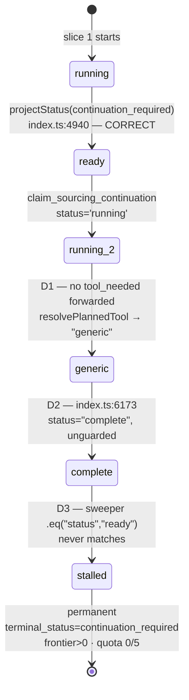
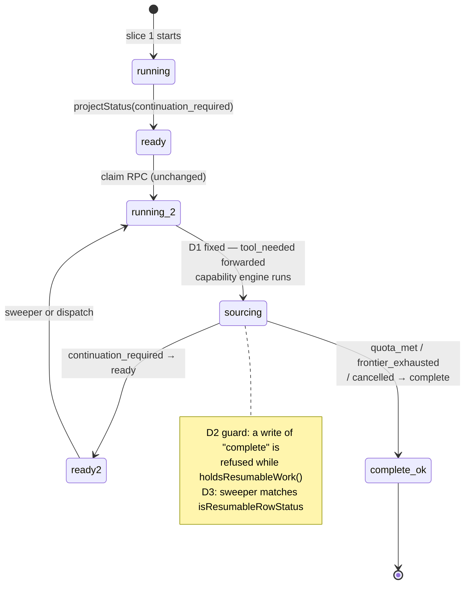

# Continuation Status Defect — Read-Only Investigation

**Read-only. Nothing implemented, deployed, mutated, or spent.**

Evidence: production task `a7a9371d-bd61-457f-8511-32874b3542d7` (acceptance run,
2026-08-31 16:38–16:40 UTC), historical task `7e71d8bc-69f6-444e-a43e-3acb684a7d44`
(2026-08-31 10:26), the live `claim_sourcing_continuation` definition read from
production, and current source.

---

## 1. Exact root cause

**Three defects in series.** Only the third is the one originally suspected, and it is
the least important.

**D1 — the dispatched successor is not told it is a sourcing step. (PRIMARY)**

`dispatchContinuation` (`leadContinuationDispatch.ts:206–227`) forwards
`resume_task_id`, `continuation_of_task_id`, `workspace_id`, `user_id`, `plan_id`,
`agent_slug`, `step_index`, `instruction`, `tool_input` and `lead_mission`. It does
**not** forward `tool_needed` or `execution_mode`.

`isProviderSourcingStep` (`run-agent/index.ts:1319`) is computed from body values only:

```ts
isProviderSourcingTool({
  tool_needed: tool_needed_body,                       // absent on a continuation
  tool_name: tool_input_body?.tool_name ?? null,       // absent
  selected_actor_key: tool_input_body?.selected_actor_key ?? null,  // absent
})
```

`resolvePlannedTool` (`plannedToolResolver.ts:57–69`) returns `{ tool: "generic" }` when
all four signals are empty. And `shouldUseApify` (`run-agent/index.ts:1385`) has a
text-sniff fallback that is *disabled by the presence of `tool_input`*:

```ts
const shouldUseApify = !isFirecrawlSelected && (
  isApifySelected || (!tool_input_body && sourcingRe.test(...)));
```

So the successor runs the **generic LLM path** — visible in both runs as
`[aiProvider] ok { task: "agent_execution", agent: "scout" }` — and never enters the
capability engine. That is what `no_execution_state_observed` reports.

This is the same class of bug the code already documents at `:1376`:
*"the live root cause: a source_with_apify step fell through to the generic LLM and
fabricated leads."* It was fixed for the first invocation and not for the continuation.

**D2 — the generic completion writer has no resumable-work guard.**

```ts
// run-agent/index.ts:6145
const finalStatus = needs_approval ? "awaiting_approval" : "complete";
// :6173
{ status: finalStatus }
```

This stamps `tasks.status = "complete"` unconditionally. Its sibling — the no-results
writer at `:5974–5996` — guards the identical write:

```ts
const continuationOutstanding = holdsResumableWork(noResPrior);
...
continuationOutstanding ? {} : { status: "complete" },
// "The row keeps `ready` + `continuation_required` when a continuation is
//  outstanding, so the sweeper can still see it."
```

**The invariant is already understood and already implemented — at one of the two
writers.** `:6173` is the one that was missed, and it is the one the generic path uses.

**D3 — the sweeper is stricter than the contract it implements.**

`resume-stalled-leads/index.ts:233` selects `.eq("status", "ready")`. But the repo's own
contract is broader:

```ts
// taskStatusContract.ts:66
LEGACY_RESUMABLE_ROW_STATUSES = ["partial", "running", "complete"];
isResumableRowStatus(s) => s === "ready" || LEGACY.includes(s)
```

and so is the production claim RPC:

```sql
if v_row.status in ('complete','failed','skipped')
   and v_terminal is distinct from 'continuation_required' then … already_terminal
if v_row.status is distinct from 'ready'
   and v_row.status not in ('partial','running','complete') then … not_resumable_state
```

Both already accept `complete` **when** `terminal_status = 'continuation_required'`.
Only the sweeper's SQL is narrower. So an explicit user Continue on the stalled task
would still be admitted today; only automatic recovery is blocked.

## 2. Exact writer and order that creates the contradiction

Reconstructed from timestamped production logs and `tasks` row state.

```
16:40:05.718  slice 1  auto-continuation: terminal_status_overridden → continuation_required
16:40:05.7x   slice 1  projectStatus("continuation_required")
                       → { rowStatus:"ready", taskStatus:"partial" }        CORRECT
16:40:0x      slice 1  index.ts:4940  tasks.update({ status:"ready", ... })  CORRECT
16:40:06.123  slice 1  run-outcome PARTIALLY_SATISFIED
16:40:0x      slice 1  index.ts:5366  dispatchContinuation(...)   ← after the write
16:40:06.864  slice 2  boots
16:40:07.489  slice 2  claim_sourcing_continuation → status = 'running'      (RPC)
16:40:07.531  slice 2  resuming task { next_round: 1, claim: "fresh_claim" }
16:40:07.588  slice 2  lineage lease acquired
16:40:16.337  slice 2  aiProvider ok { agent_execution, scout }     ← D1: GENERIC PATH
16:40:17.0x   slice 2  index.ts:6173  writeTaskResult(..., { status:"complete" })  ← D2
16:40:17.025  slice 2  terminal_guard_decision { task_status: "ready" }
16:40:17.080  slice 2  terminal_guard_skip_task { current: "complete" }      ← too late
```

**The contradictory state is created at `run-agent/index.ts:6173`, by the successor,
overwriting the `ready` its own parent had correctly written ~10 seconds earlier.**

Two secondary observations, both exonerating:

- The parent is **not** at fault. It persists at `:4940` *before* dispatching at `:5366`,
  and `projectStatus` maps `continuation_required → ready` correctly.
- The terminal guard is **not** at fault. It computed `task_status: "ready"` and then
  *skipped* because `TERMINAL_TASK_STATUSES` already contained the `complete` D2 wrote.
  It is a witness, not a writer.

`updated_at` on the row is `16:40:07.489` — the claim RPC's timestamp — because the
`:6173` update sets `status` and `result` but not `updated_at`, and no trigger maintains
it. That is why the row's timestamp appears to predate the write that broke it.

## 3. Current state transitions



## 4. Corrected state transitions



## 5. Option A vs B vs C

| | What it changes | Verdict |
|---|---|---|
| **A — continuation owns lifecycle** | write `status=ready` when more work remains | **Already implemented.** `projectStatus:149` returns `rowStatus:"ready"` and `:4940` writes it. Nothing to add; what is missing is *protecting* it from a later writer |
| **B — sweeper accepts `complete` + `continuation_required`** | widen the sweeper's SQL | **Safe, and not the weakening it appears to be.** `isResumableRowStatus` and the claim RPC *already* accept `complete` with that terminal status; the sweeper is the outlier. But **alone it fixes nothing** — it would hand the same successor back to the same generic path, which would re-stamp `complete` and burn slices until `MAX_BARREN_SLICES` |
| **C — one invariant at the persistence boundary** | `continuation_required ⇒ status ≠ complete`, enforced where the row is written | **The right shape for D2.** The guard already exists as `holdsResumableWork` and is applied at `:5996`; C is that same call at `:6173`. Not a state-machine rewrite — a second use of an existing predicate |

None of the three addresses **D1**, which is why the successor did no work at all. D1 is
a dispatch-payload defect, not a status defect, and it is the primary fault.

## 6. Recommended minimal fix

Ordered. D1 alone restores correct behaviour; D2 and D3 are the safety net that stops a
silent recurrence.

1. **D1 — forward the routing markers.** Add `tool_needed` (and `execution_mode`) to the
   `dispatchContinuation` body, sourced from the parent invocation. With it, the
   successor enters the capability engine, `:6173` is never reached, and the lead path
   writes `rowStatus` as it already does correctly.
2. **D2 — guard the generic completion writer.** Apply the existing
   `holdsResumableWork(prior)` check at `:6145/:6173`, exactly as `:5996` does. This is
   Option C, using a predicate that already exists.
3. **D3 — align the sweeper with the contract.** Replace `.eq("status","ready")` with the
   `isResumableRowStatus` set **plus** `terminal_status = 'continuation_required'`, which
   is what the claim RPC already enforces. Recovery for rows already stranded.

Do **not** widen the sweeper without D1 and D2: that converts a permanent stall into a
repeating one.

## 7. Files and functions affected

| File | Function / line | Change |
|---|---|---|
| `_shared/leadContinuationDispatch.ts` | `dispatchContinuation` body, `:206–227` | forward `tool_needed`, `execution_mode` |
| `_shared/leadContinuationDispatch.ts` | `DispatchRequest` | carry the two fields |
| `run-agent/index.ts` | `:5366` dispatch call site | pass them from the parent |
| `run-agent/index.ts` | `:6145`, `:6173` | `holdsResumableWork` guard |
| `resume-stalled-leads/index.ts` | `:233` selection | widen to the contract set |
| `_shared/taskStatusContract.ts` | — | no change; already correct |
| `claim_sourcing_continuation` | — | no change; already correct |

## 8. Regression tests required

| Test | Asserts |
|---|---|
| dispatch carries routing markers | body includes `tool_needed`; successor resolves `source_with_apify`, not `generic` |
| successor enters the capability engine | a dispatched continuation runs discovery/investigation, not `agent_execution` |
| `continuation_required` + resumable work ⇒ never `complete` | `:6173` refuses the stamp while `holdsResumableWork` |
| `continuation_required` + `ready` ⇒ sweeper resumes | selection matches |
| `quota_met` ⇒ never resumed | terminal preserved |
| `frontier_exhausted` ⇒ never resumed | terminal preserved |
| `cancelled` ⇒ never resumed | terminal preserved |
| actively-leased task ⇒ no second generation | claim RPC `already_claimed` still refuses |
| two sweeper ticks ⇒ at most one successor | single dispatch |
| `MAX_BARREN_SLICES` still stops a loop | unchanged |
| spend idempotency across the resumed slice | no duplicate `logical_call_key` |
| checkpoint restoration across the resumed slice | working set, Brain decisions, hiring evidence intact |

## 9. Risks

- **Widening the sweeper (D3) resurrects stranded rows.** Bounded by the claim RPC's
  `already_terminal` check on `terminal_status`, which is unchanged — but any row that
  is `complete` + `continuation_required` becomes live again, including historical ones.
  Worth an explicit age or `continuations_used` bound.
- **D1 changes what a continuation does** — from a no-op generic LLM turn to real,
  paid sourcing work. That is the intent, and it means continuations start costing
  credits where they previously cost none. Ceilings (`maxContinuations`,
  `maxCostUnits`, `MAX_BARREN_SLICES`) are the containment and are unchanged.
- **D2 could mask a genuine completion** if `holdsResumableWork` were ever wrong. It
  reads `terminal_status === "continuation_required"` or `auto_continuation.continuing`,
  both written by the same finalizer, so the risk is low and identical to `:5996`'s.
- The generic path's `complete` is correct for genuine non-lead steps; the guard must
  not change those.

## 10. Impact on the adaptive-discovery acceptance run

**None of the adaptive-discovery changes are implicated.** Discovery behaved exactly as
designed and the state it wrote is intact:

```
raw_rows 50 · admitted 34 · pool_target 20
stop_reason "admitted_target_met" · pages_taken { …company_search: 1 } · exhausted false
```

`decideAutoContinuation` correctly returned `quota_unmet_frontier_remains` rather than
`replenishment_required`, because the frontier was **not** exhausted (22 remaining). The
replenishment path was therefore never reached — correctly.

Fix A is proven in production. **Fix B(i) remains unproven**, and cannot be exercised
until D1 is fixed: no continuation currently reaches the capability engine at all, so no
lineage can ever reach an exhausted frontier through natural execution.

The identical signature in `7e71d8bc` — `resuming task` → `agent_execution scout` →
`terminal_guard_skip_task { current: "complete" }` — confirms this predates the adaptive
discovery work and is not a regression from it.

---

*Investigation only. No implementation, no deployment, no state mutation, no credits.*
