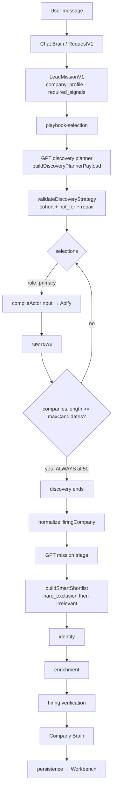
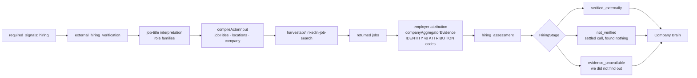
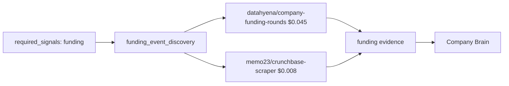
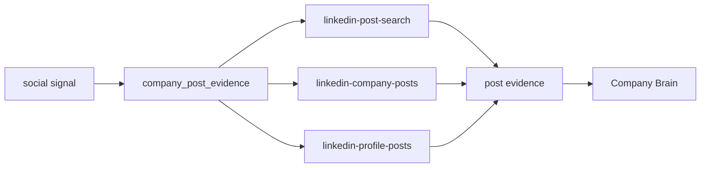
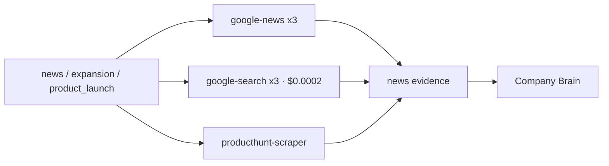
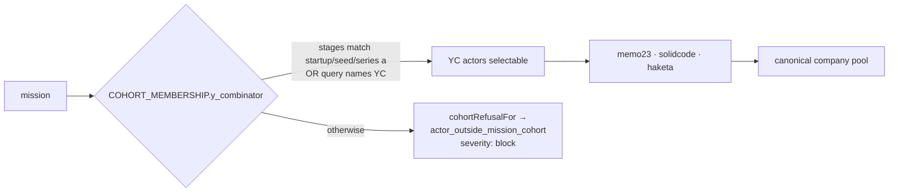
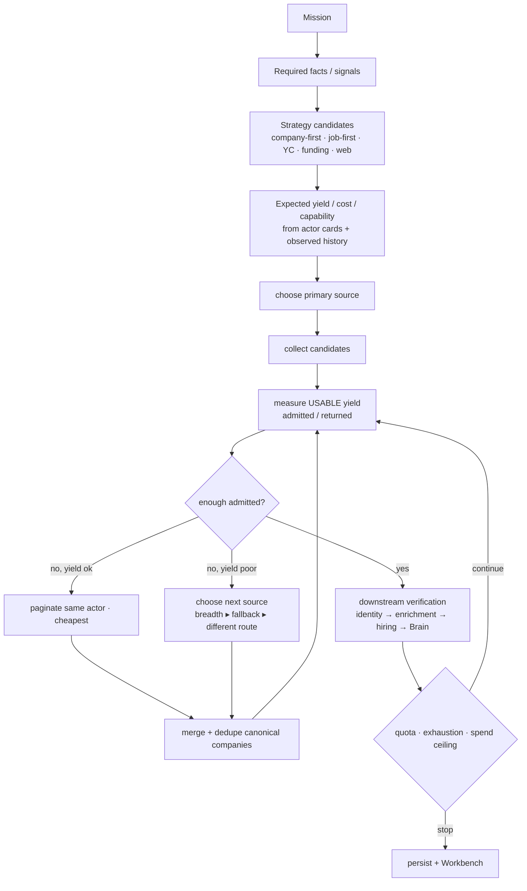

# Agentory Signal Workflow Audit

**Read-only audit. No production behaviour changed, no provider calls, no credits spent.**

Evidence base: repository source at `feat/lead-mission-v1`, the persisted result of
production run `7e71d8bc-69f6-444e-a43e-3acb684a7d44`, its provider payload
(Apify run `Am0f777fpvd6Kcyk1`, dataset `jV3iaXYuS8BnbpR1J`), and live Apify Store
schemas read through metadata APIs.

---

## 1. Executive summary

Agentory has a **richer provider inventory than its router can reach**. Twenty-two
actors are registered with structured capability cards, four of them YC scrapers and
one a Crunchbase source. Six actors declare `company_discovery`. The strategy layer
already has the right vocabulary — actor roles `primary | breadth | fallback`, a
`shouldRunSelection` contract, cohort containment, and a per-actor `fallback_actors`
field.

Almost none of it is exercised. Every company-first sourcing mission observed follows
one path: a GPT planner picks **one** `primary` actor, it returns rows, and discovery
stops. The four biggest limitations:

1. **Discovery completion is measured in raw rows, not usable candidates.**
   `leadCapabilityEngine.ts:3648` breaks on `companies.length >= maxCandidates`. A
   provider that returns 50 junk rows looks identical to one that returns 50 good
   ones, so `breadth` and `fallback` actors can never earn their call.

2. **`hiring_signal` is not a discovery purpose.** `DISCOVERY_PURPOSES`
   (`leadDiscoveryStrategy.ts:193`) is `company_discovery | funding_discovery |
   social_discovery | news_signal`. `harvestapi/linkedin-job-search` is carded
   `capabilities: ["hiring_signal"]` only, so it is **never briefed to the planner as a
   discovery option**. Job-first discovery is structurally impossible today, not merely
   unchosen.

3. **The adaptive layer that noticed was disabled and never replaced.** In run
   `7e71d8bc` the legacy path logged `will_run_another_source: true` and the broad
   fallback logged `blocked: "execution_owned_by:capability_engine_v1"`. Containment
   was correct; the capability engine never gained the equivalent rule.

4. **Two schema sources disagree, and the narrower one silently wins.** The registry
   card's `supported_filters` omits `startPage`/`takePages`; `ACTOR_INPUT_CONTRACTS`
   and the card's own `input_limits: { takePages: 20, maxItems: 1000 }` include them.
   The dropper reads `supported_filters`, so run `7e71d8bc` recorded
   `dropped_filters: startPage` with the reason *"has no such input"* — a statement
   the live Apify schema and two other repo sources contradict. Pagination, the
   cheapest possible replenishment, is unreachable on a false premise.

**Agentory does not currently distinguish a DISCOVERY SOURCE from a SIGNAL
VERIFICATION SOURCE as a routing decision.** The distinction exists as data on the
actor cards (`capabilities`) and is used to *filter what the planner is shown*, but
there is no reasoning about which of several valid routes to a signal has the better
expected yield per dollar.

---

## 2. Complete capability inventory

Mission signal vocabulary (`leadMission.ts:249`, `MISSION_SIGNAL_TYPES`) — six types:
`hiring`, `funding`, `expansion`, `leadership_change`, `technology`, `product_launch`.

Public capability ids (`leadCapabilityCatalogue.ts:31`) — seventeen, including
`startup_company_discovery`, `general_company_discovery`, `funding_event_discovery`,
`embedded_hiring_evidence`, `external_hiring_verification`, `company_post_evidence`,
`expansion_evidence`, `product_launch_evidence`, `technology_evidence`.

Registered actors (`apifyIntelligenceRegistry.ts`), with card-declared capabilities:

| Signal | Provider / Actor | Discovery? | Verification? | $/result | Input compiler | Normalizer | Persistence |
|---|---|---|---|--:|---|---|---|
| company | `harvestapi/linkedin-company-search` | **yes** | no | 0.004 | `icpDiscoveryConstraints` → `mergeDiscoveryActorInput` → `compileActorInput` | `hiringActorNormalizers` (LinkedIn co) | working set → checkpoint |
| company / startup | `memo23/y-combinator-scraper` | **yes** (+hiring) | no | 0.001 | `compileActorInput` | `hiringActorNormalizers` | working set |
| company / startup | `solidcode/ycombinator-scraper` | **yes** | no | 0.002 | `compileActorInput` | `hiringActorNormalizers` | working set |
| company / startup | `haketa/ycombinator-companies-scraper` | **yes** (+hiring) | no | 0.002 | `compileActorInput` | `hiringActorNormalizers` | working set |
| company / YC detail | `datacach/yc-companies-detail-scraper` | no | yes | 0.002 | `compileActorInput` | `hiringActorNormalizers` | evidence |
| funding | `datahyena/company-funding-rounds` | **yes** (+funding) | yes | 0.045 | `compileActorInput` | funding normalizer | evidence |
| funding / company | `memo23/crunchbase-scraper` | **yes** (+enrichment) | yes | 0.008 | `compileActorInput` | funding normalizer | evidence |
| hiring | `harvestapi/linkedin-job-search` | **no** — carded `hiring_signal` only | **yes** | 0.001 | `compileActorInput` (jobTitles/locations/company) | `hiringActorNormalizers` (jobs) | `hiring_jobs` + `hiring_assessment` |
| enrichment | `harvestapi/linkedin-company-details` | no | yes | 0.004 | `compileActorInput` (`companies[]`) | `hiringActorNormalizers` | company snapshot |
| social | `harvestapi/linkedin-post-search` | no (social_discovery) | yes | 0.002 | `compileActorInput` | post normalizer | evidence |
| social | `harvestapi/linkedin-company-posts` | no | yes | 0.002 | `compileActorInput` | post normalizer | evidence |
| social | `harvestapi/linkedin-profile-posts` | no | yes | 0.002 | `compileActorInput` | post normalizer | evidence |
| technology | `builtwith/builtwith-official-technology-scraper` | no | yes | 0.002 | `compileActorInput` | tech normalizer | evidence |
| news | `data_xplorer/google-news-scraper-fast` | no | yes | 0.004 | `compileActorInput` | news normalizer | evidence |
| news | `xtracto/google-news-scraper`, `easyapi/google-news-scraper` | no | yes | — | `compileActorInput` | news normalizer | evidence |
| web | `apidojo/google-search-scraper` | no (news_signal) | yes | 0.0002 | `compileActorInput` | search normalizer | evidence |
| web | `mikolabs/google-search-results-scraper`, `prodiger/google-search-scraper` | no | yes | — | `compileActorInput` | search normalizer | evidence |
| product | `crawlerbros/producthunt-scraper` | no | yes | — | `compileActorInput` | product normalizer | evidence |

Every paid call passes through the same spend and identity machinery:
`logical_call_key = <lineage_root>:<capability>:<input_hash>`, `input_hash` =
`providerInputFingerprint` (`v2:` SHA-256 of `canonicalJson({actorKey, input})`),
recorded in `lead_execution_calls` and `credit_transactions.idempotency_key`.
Resume adopts a completed run rather than re-buying it.

---

## 3. Current global workflow



The `BRK` node is where every observed run stops after one actor.

---

## 4. Per-signal workflows

### Hiring



Note the arrow direction: jobs are consumed **per known company**. The actor is never
asked "which companies are hiring SDRs in the UK?"

### Funding



Both actors declare `company_discovery` — funding is the one signal where a
discovery-capable source is already carded and reachable.

### LinkedIn posts / activity



`social_discovery` **is** a discovery purpose, so post actors are briefed to the planner.

### News / web



### YC / startup discovery



### Technology


---

## 5. Discovery-source matrix

From card `capabilities` and `DISCOVERY_PURPOSES` — repo facts, not estimates.

| Source | Company discovery | Hiring discovery | Funding | Geography filter | Industry filter | Briefed to planner? |
|---|---|---|---|---|---|---|
| `linkedin-company-search` | **yes** | no | no | `locations` (presence) | `industryIds` | yes |
| `linkedin-job-search` | **no** (possible via employer extraction — not carded) | verification only | no | `locations` | via job titles | **no** |
| `linkedin-profile-search` | not registered | — | — | would offer HQ + headcount | `industryIds` | n/a |
| YC (`memo23`/`solidcode`/`haketa`) | **yes** | partial (`hiring_signal`) | no | none | none | yes, cohort-gated |
| `company-funding-rounds` | **yes** | no | **yes** | limited | limited | yes |
| `crunchbase-scraper` | **yes** | no | **yes** | HQ-native | Crunchbase categories | yes |
| Google/web | no (`news_signal` only) | no | no | query text | query text | yes |
| BuiltWith | no | no | no | no | no | no |

---

## 6. Exact workflow of run `7e71d8bc`

```
"UK B2B SaaS, 20–200 employees, hiring SDRs/BDRs/AEs"
  → mission: company_research · target_entity company · requested_output qualified_companies
            locations ["United Kingdom"] · employee_range 20–200 · stages []
  → playbook-selection: combination "single" · runnable ["hiring"]
  → discovery_strategy: source "model_repaired" · blocked 0
        actors: [ apify_linkedin_company_search · role primary ]
        dropped_filters: maxItems, startPage  ("has no such input" — FALSE)
  → capability_graph: general_company_discovery providers ["apify_linkedin_company_search"]
        fallback_policy "provider_fallback_only"  (one provider — nothing to fall back to)
  → Apify Am0f777fpvd6Kcyk1 → 50 rows · $0.201
  → break: companies.length (50) >= maxCandidates (50)
  → round_complete: discovered 50 · eligible 0 · qualification_rate 0
  → triage 50 → 38 (12 irrelevant) · shortlist → 22 (16 employee_size)
  → investigation_slice_taken: selected 10 of ~22
  → round_loop_stop: "deadline_reached — the checkpoint reserve was reached"
  → 0 qualified · continuation_required · 21 candidates never investigated
```

**Pool quality, measured under the presence rule (geography = real presence/branch):**

```
UK presence (any office)   50 / 50
exact 20–200 employees     34 / 50
presence AND size          34 / 50    → 68% structurally valid
```

The raw pool was **not** the binding constraint. Time was: 10 of ~22 admitted
companies were investigated before the checkpoint reserve.

**Why no alternative discovery strategy was attempted — four independent reasons:**

1. **YC** — `COHORT_MEMBERSHIP.y_combinator` requires `stages` to match
   startup/seed/series-a/early/venture, or the query to name YC. The mission had
   `stages: []` and no YC mention, so `cohortRefusalFor` would block all three YC
   actors as `actor_outside_mission_cohort`. **Correct behaviour.**
2. **Job-first** — `hiring_signal` is not in `DISCOVERY_PURPOSES`, so
   `linkedin-job-search` was never in `discoveryCatalogBriefing()`. The planner could
   not have chosen it.
3. **Second company source** — the planner returned one actor; nothing requires a
   `breadth` or `fallback` companion, and `fallback_actors: []` on the company-search
   card offers none.
4. **Any source at all, after the fact** — the loop had already broken on
   `companies.length >= maxCandidates`. Even a selected `breadth` actor would have
   been skipped, because 50 raw rows read as a full pool.

---

## 7. Adaptive sourcing gap

The decision belongs in exactly one place, and the surrounding contract already exists:

```
supabase/functions/_shared/leadCapabilityEngine.ts:3641–3660
    the discovery selection loop

  :3648   if (companies.length >= maxCandidates) break;        ← raw rows
  :3653   if (!shouldRunSelection(sel, companies.length, maxCandidates)) …
```

`shouldRunSelection` (`leadDiscoveryStrategy.ts:964`) is already correct:

```ts
if (sel.role === "primary")  return true;
if (sel.role === "fallback") return collectedSoFar === 0;
return collectedSoFar < poolTarget;          // breadth
```

Both call sites pass **`companies.length`** — rows returned. The yield signal the
decision needs (`eligible`, `qualification_rate`) is computed one stage later and
recorded in `round_complete`, but never fed back. The gap is a *counting* gap inside
an otherwise complete mechanism.

Secondary gap: `DISCOVERY_PURPOSES` must include a hiring-derived discovery purpose
before job-first routing is expressible at all.

---

## 8. Proposed target architecture (conceptual)



YC is first-class in this design: a startup-shaped mission routes to YC as `primary`,
and a non-startup mission still reaches it as `breadth` **only if** cohort membership
holds. Cohort containment stays — it is protecting correctness, not blocking recall.

Route selection for a hiring-dominant mission becomes an explicit comparison:

```
OPTION A  company search → companies → job verification per company
OPTION B  job search → matching jobs → employer attribution → dedupe → company qualification
```

Both remain valid; the router picks on expected admitted-candidates per dollar.

---

## 9. Recommended next changes

### MUST FIX

1. **Count admitted candidates, not returned rows,** at
   `leadCapabilityEngine.ts:3648` and `:3653`. One substitution makes the existing
   `breadth`/`fallback` contract reachable. Nothing else in this document works
   without it.
2. **Reconcile the three schema sources.** Card `supported_filters` vs
   `ACTOR_INPUT_CONTRACTS.fields` vs card `input_limits` disagree for
   `apify_linkedin_company_search`. Make one authoritative, so `startPage`/`takePages`
   stop being dropped with a false explanation.
3. **Replace the disabled adaptive layer.** `will_run_another_source: true` currently
   goes nowhere because `broad-job-fallback` is `blocked: execution_owned_by:
   capability_engine_v1`. The engine needs the equivalent rule or the signal should be
   removed rather than logged misleadingly.

### SHOULD IMPROVE

4. Add a hiring-derived discovery purpose so `linkedin-job-search` can be briefed as a
   discovery route, and card it accordingly.
5. Give triage the structured facts it is currently denied — `toTriageInput`
   (`leadCapabilityEngine.ts:1408`) collapses the raw `locations[]` array to one
   scalar and `industries` to one label, which is why it reported "UK location not
   evidenced" for companies whose UK offices were in the paid payload.
6. Populate `fallback_actors` for discovery-capable cards; the field exists and is
   empty for company search.

### OPTIONAL

7. Register `harvestapi/linkedin-profile-search` as a discovery route (offers HQ and
   headcount filters LinkedIn company search lacks).
8. Record observed admitted-yield per actor per mission shape, to make route choice
   empirical rather than heuristic.

---

## 10. Exact files / modules involved

| Path | Functions | Role |
|---|---|---|
| `_shared/leadMission.ts` | `MISSION_SIGNAL_TYPES`, `canonicalSignalType`, `companyIsTheDeliverable` | signal vocabulary |
| `_shared/leadCapabilityCatalogue.ts` | `PUBLIC_CAPABILITY_IDS` | capability vocabulary |
| `_shared/apifyIntelligenceRegistry.ts` | actor cards: `capabilities`, `supported_filters`, `input_limits`, `fallback_actors`, `cohort_scope` | provider inventory |
| `_shared/actorInputContracts.ts` | `ACTOR_INPUT_CONTRACTS` | verified input schemas |
| `_shared/leadDiscoveryStrategy.ts` | `DISCOVERY_PURPOSES:193`, `discoveryCatalogBriefing:222`, `COHORT_MEMBERSHIP:507`, `cohortRefusalFor:516`, `validateDiscoveryStrategy:526`, `buildDiscoveryPlannerPayload:877`, `shouldRunSelection:964` | route selection |
| `_shared/leadCapabilityEngine.ts` | discovery loop `:3641–3660`, `toTriageInput:1408`, `icpDiscoveryConstraints` call `:3775` | execution |
| `_shared/icpDiscoveryConstraints.ts` | `icpDiscoveryConstraints:291` | mission → filters |
| `_shared/discoveryInputMerge.ts` | `mergeDiscoveryActorInput` | input precedence |
| `_shared/discoveryBatchSize.ts` | batch width from quota/budget/`observedRowsPerLead` | pool target |
| `_shared/hiringActorNormalizers.ts` | `NormalizedHiringCompany:17`, per-actor normalizers | provider → canonical |
| `_shared/companyAggregatorEvidence.ts` | `IDENTITY_SIGNAL_CODES:218`, `ATTRIBUTION_SIGNAL_CODES:224` | employer attribution |
| `_shared/leadResumeState.ts` | `HiringStage:188` | hiring outcome vocabulary |
| `_shared/leadInvestigationBudget.ts` | `buildSmartShortlist:883`, `ShortlistCandidate:792` | hard exclusion + ranking |
| `_shared/missionTriage.ts` | `TriageCompanyInput:85` | GPT triage contract |
| `_shared/leadAutoContinuation.ts` | `decideAutoContinuation`, `lineageIsFinished` | continuation |

---

*Audit only. No code changed, no provider calls, no credits, no deployment.*
