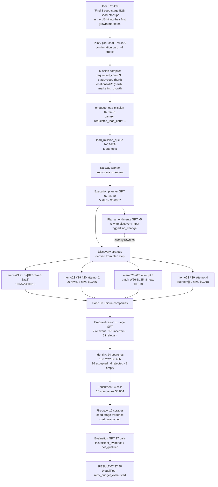
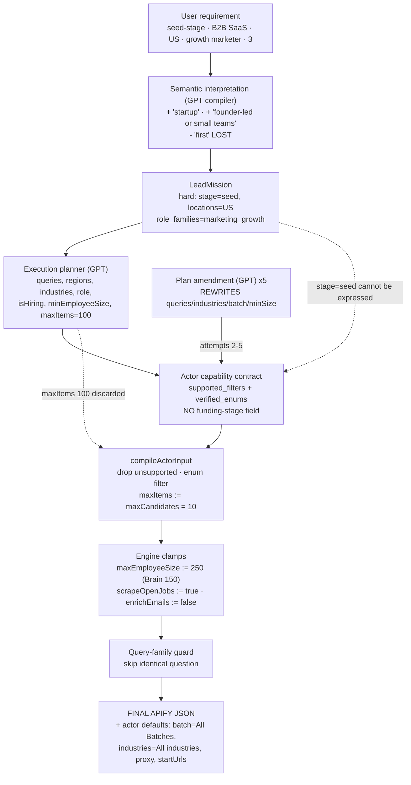
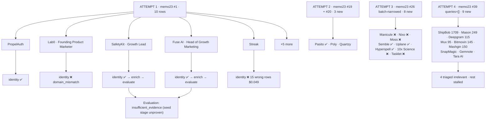
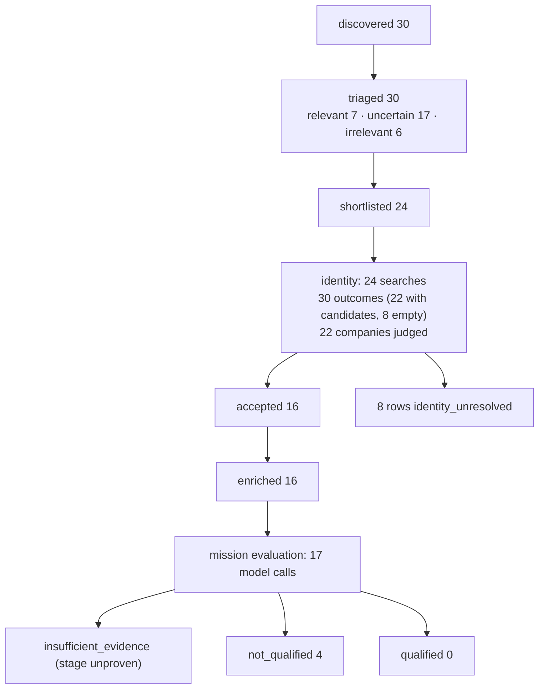

# Lead V2 Forensic Audit — Run 1e52d43c

**Scope:** one production run, read-only. Queue `1e52d43c-7351-4777-ab93-20c80e32ff26`, task/lineage `d9c2974f-bb12-4f29-8821-235d743ed7b8`, plan `8fbc66e8-17b7-4651-8690-44b9ceb56f7a`, workspace `e8af257d-4c42-4fc2-9d62-037cdfac27c4`. IDs verified against production before use; this is the newest queue row (the two older ones are `30cac5d4`, 06:29 today, and `6d8d146d`, run 4250f181 yesterday). Nothing was changed, restarted or cleaned up while auditing.

**Evidence used:** production rows (`lead_mission_queue`, `tasks.result`, `task_plans`, `lead_lineages`, `lead_execution_calls`, `lead_model_calls`, `credit_transactions`), Railway worker logs (7,165 deduplicated lines, 07:15:02–07:37:48 UTC), Apify run records + `INPUT` key-value records + result datasets for all 33 runs, and the source at commit `125f0cfa`. Full machine-readable call log: **`docs/audits/lead-v2-run-1e52d43c-apify-calls.json`**.

---

## Executive Summary

The run reached discovery, identity, enrichment, evaluation — and produced **0 qualified companies** out of **30 discovered**, then died as `retry_budget_exhausted` after 5 worker attempts.

The query generation is genuinely broken, and not in the way the logs suggest. Findings, in order of severity:

1. **Discovery input is re-invented on every attempt by the *execution-plan amendment* call, and the change is logged as `execution_plan_amendment_no_change`.** The amendment replaces the whole plan object (`leadCapabilityEngine.ts:5308`), but the "did anything change?" test compares only the *list of capabilities* (`before.join(">") !== after.join(">")`, line ~5330). Every amendment silently rewrote the discovery step's `queries`, `industries`, `batch` and `minEmployeeSize` while reporting no change. This is why the five memo23 calls asked five different questions.
2. **One of those rewrites produced `queries: []`** — an unfiltered YC directory sweep (call #5, 07:32:06). It returned ShipBob (1,709 employees), Mashgin (150), Deepgram (115), Mux (95), Bitmovin (145) — none of them seed-stage, all of them paid for downstream.
3. **The mission's `requested_count: 3` never reaches discovery. The canary quota of 1 does.** `maxCandidates = Math.max(10, quota.requestedLeadCount * 10)` (`run-agent/index.ts:2544, 3844`) uses the canary-forced execution quota (1), giving `maxItems: 10` per call instead of 30, and an admitted target of 8.
4. **The GPT execution planner's own discovery input is never used as written.** It proposed `maxItems: 100`; `compileActorInput` clamps it to `maxCandidates` (10). It proposed no `maxEmployeeSize` on attempt 1; the engine clamped in `"250"` from an *advisory* Company Brain bound of 150.
5. **Identity search overrides the planner deliberately and correctly**, but nothing records that it did: the plan said `maxItems: 5`, no locations; the code sent `maxItems: 15`, `locations: ["United States"]`, `scraperMode: "full"`.
6. **Cost is still under-reported ~2.4×**: Apify billed **$0.5902**; the ledger recorded **$0.2463**. Result-event charges that settle after the run document is read are missed, and all 12 Firecrawl calls carry `cost_source: "unknown"` with no dollar value at all.
7. **The seed-stage hard constraint was never expressible**: memo23 has no funding field, and no other source ran. 30 of 30 companies reached evaluation with stage unproven, which is the direct cause of the `insufficient_evidence` verdicts.

The single deepest problem: **GPT is nominally in charge of search strategy, but what actually reaches Apify is the product of four rewriting layers** (plan amendment → strategy validation → `compileActorInput` clamps → engine-level size clamp), none of which is reconciled against the mission, and one of which reports its rewrites as "no change".

---

## Run Identity

| Field | Value |
|---|---|
| Queue id | `1e52d43c-7351-4777-ab93-20c80e32ff26` |
| Task id / lineage id | `d9c2974f-bb12-4f29-8821-235d743ed7b8` |
| Plan id | `8fbc66e8-17b7-4651-8690-44b9ceb56f7a` |
| Workspace | `e8af257d-4c42-4fc2-9d62-037cdfac27c4` |
| Conversation | `8b861237…` (user message 07:14:03, Pilot reply 07:14:09) |
| Queue created | 2026-09-14 07:14:51 UTC |
| Attempts | 5 of 5 (`V2_MAX_ATTEMPTS`) |
| Worker | Railway `aiworforce-platfrom`, deploy `f89a6933`, commit `125f0cfa` |
| Final queue status | `failed` |
| Final task status | `failed`, `terminal_status: retry_budget_exhausted` |
| Final lineage | `terminal`, `terminal_reason: retry_budget_exhausted` |
| Final plan | `failed` |
| Continuation owner | `v2_queue` (no Continue offered in UI) |
| Attempt boundaries | A1 07:15:02–07:19:37, A2 07:21:41–07:24:34, A3 07:26:37–07:29:53, A4 07:32:07–07:35:02, A5 07:37:14–07:37:48 |
| Why each attempt ended | A1–A4 `execution_deadline_reached` (5-min mission ceiling); A5 `budget_exhausted` → queue `failed` |

---

## Original User Request

Raw text, exactly as typed into Pilot and stored on `messages` (07:14:03):

```
Find 3 seed-stage B2B SaaS startups in the US hiring their first growth marketer.
```

Pilot's reply (07:14:09) proposed the chain and showed a confirmation card reading "Find 3 companies in b2b saas (founder-led or small teams) · hiring (marketing_growth) · United States · REQUESTED LEADS 3 · ~7 credits · Worth knowing: declared gap". The user pressed **Start Workflow** at 07:14:49; `enqueue-lead-mission` wrote the queue row at 07:14:51.

---

## Compiled Mission

Persisted verbatim on the queue row (`request.tool_input.lead_mission`), compiled by `lead-mission-compiler` (git `046b61b0`).

```json
{
  "original_user_query": "Find 3 seed-stage B2B SaaS startups in the US hiring their first growth marketer.",
  "requested_count": 3,
  "requested_output": "qualified_companies",
  "target_entity": "company",
  "company_profile": {
    "stages": ["startup"],
    "locations": ["United States"],
    "verticals": ["b2b saas (founder-led or small teams)"],
    "business_models": []
  },
  "hard_constraints": {
    "stage": { "value": "seed", "reason": "stated in the request", "operator": "eq" },
    "company_profile.locations": { "value": ["United States"], "reason": "stated explicitly in the user's query", "operator": "in" }
  },
  "soft_preferences": {},
  "required_signals": [{
    "type": "hiring", "event": "hiring", "phrase": "hiring growth marketer", "subject": "company",
    "qualifier": { "role_terms": ["growth marketer"], "role_families": ["marketing_growth"] },
    "role_families": ["marketing_growth"]
  }],
  "required_signal_terms": ["growth marketer"],
  "directives": { "source_strategy": [], "required_evidence": [], "preferred_signals": ["hiring"],
                  "execution_preference": "balanced", "allowed_broadening": { "employee_range": {"min": null, "max": null} } }
}
```

### Provenance of every mission field

| Field | Value | Where it came from |
|---|---|---|
| `original_user_query` | the sentence above | **user text**, verbatim |
| `requested_count` | 3 | **user text** ("Find 3") |
| `company_profile.locations` | `["United States"]` | **user text** ("in the US"), normalised by the compiler |
| `hard_constraints["company_profile.locations"]` | `in ["United States"]` | **GPT mission compiler** promoted it to hard |
| `hard_constraints.stage` | `eq "seed"` | **GPT mission compiler** from "seed-stage" (note: value is `"seed"`, while yesterday's run compiled `"seed-stage"` — unstable normalisation) |
| `company_profile.stages` | `["startup"]` | **GPT inferred** — "startup" is not the user's word |
| `company_profile.verticals` | `["b2b saas (founder-led or small teams)"]` | **GPT invented the parenthetical.** The user never said founder-led or small teams. This string is later used as a vertical label, not as a filter |
| `required_signals[0].role_families` | `["marketing_growth"]` | **GPT** classified "growth marketer" into the family |
| `required_signal_terms` | `["growth marketer"]` | **user text** |
| `employee_range` | absent | **not stated by the user**; the mission owns no size axis, which is why the Brain's bound is only advisory |
| `requested_output` | `qualified_companies` | **code default** for company-first missions |
| "first" (as in *first* growth marketer) | **nowhere** | **LOST at compile time.** No field encodes "first hire". It survives only inside `original_user_query` and is re-read later by the evaluator prompt |

### Quota

| Number | Value | Source |
|---|---|---|
| Mission `requested_count` | 3 | user |
| Body `requested_lead_count` | 1 | **canary override** — `forceCanaryLeadCount` (`leadMissionV2Request.ts:49`), `V2_CANARY_FORCED_REQUESTED_LEAD_COUNT = 1` |
| `lead_quota_provenance` (result) | `{source: "v2_canary", execution_quota: 1, mission_requested: 3}` | recorded by the fix in `125f0cfa` |
| **Effect on discovery** | `maxCandidates = max(10, 1 × 10) = 10` | `run-agent/index.ts:2544` — had the mission's 3 been used, this would be 30 |

### Company Brain (workspace ICP) — inherited, not requested

`tasks.result.company_brain_policy`:

```json
{"size": {"min": 1, "max": 150, "source": "explicit_numeric"}, "enforced": true,
 "hard_constraints": ["employee_count", "industry", "business_model"],
 "policy_hash": "b3259dcd…", "unknown_evidence": "research"}
```

The workspace's target industries are **"Recruiting / Talent Acquisition / Staffing Agencies"** — i.e. the standing ICP is for a completely different business than this mission. Every attempt logged `[run-agent][industry-precedence] generic exclusions suppressed` for the terms `staffing`, `staffing agency`, `recruiting agency`, `recruitment agency`, `staffing and recruiting`, `claimed_by: "Recruiting / Talent Acquisition / Staffing Agencies"`, `source: workspace_target_industries` — the mission's words correctly outranked the ICP. The Brain's **size bound (max 150) did reach discovery** as an advisory clamp (see Call #1).

---

## Actual Runtime Architecture

What actually ran, in order, per attempt:

1. `enqueue-lead-mission` → `lead_mission_queue` row (canary quota stamped into the body, mission untouched).
2. Railway worker claims the row (`claim_next_lead_mission`), runs `handleRunAgent` **in-process** (not over HTTP — so no continuation 401 is possible in V2).
3. `run-agent` builds the capability graph, resolves the Company Brain policy, then calls the **execution planner** (GPT) — once, on attempt 1 only; later attempts restore the plan from the checkpoint.
4. `runCapabilityPlan` derives the **discovery strategy from the execution plan's step input**, not from the discovery planner (`leadCapabilityEngine.ts:4122–4182`).
5. Discovery → prequalification (free) → mission triage (GPT) → shortlist → identity → enrichment → web evidence (Firecrawl) → pool/mission evaluation (GPT).
6. At the 5-minute ceiling the engine checkpoints and the worker releases the mission as `resumable`; the queue re-claims it ~2 minutes later.
7. After attempt 5 the worker states the final status itself and reconciles queue/task/lineage/plan (`retry_budget_exhausted`).

---

## Query Generation Architecture

There are **four** layers between "what GPT decided" and "what Apify received". Only the first is visible in the UI.

| # | Layer | File / function | What it can change |
|---|---|---|---|
| 1 | Execution planner (GPT) | `gptExecutionPlanner.ts` → `makeGptExecutionPlanner` | proposes actor + full input JSON per step |
| 1b | **Execution-plan amendment (GPT)** | `leadCapabilityEngine.ts:5259–5340` | **replaces the entire plan after discovery, every attempt** — including the discovery step's input |
| 2 | Strategy validation | `leadDiscoveryStrategy.ts:562` `validateDiscoveryStrategy` | drops unknown actors/filters, defaults `role`, dedupes |
| 2b | Input compilation | `leadDiscoveryStrategy.ts:319` `compileActorInput` | drops fields not in `supported_filters`, drops non-enum values, truncates arrays to `input_limits`, **overwrites `maxItems` with the engine's `maxCandidates`** |
| 3 | Engine size clamp | `leadCapabilityEngine.ts` memo23 branch + `clampMemo23MaxSize` | forces `maxEmployeeSize` to the smallest enum ≥ the resolved bound |
| 3b | Query-family dedupe | `memo23QueryFamily` + family guard | skips a repeat question entirely |
| 4 | Actor compiler | `hiringActorInputs.ts:326` `compileMemo23YcInput` | normalises scalars to lists, forces `enrichEmails: false`, validates enums |
| 5 | Apify platform | actor input schema | fills unset defaults (`batch: ["All Batches"]`, `industries: ["All industries"]`, `location: ""`, `proxy`, concurrency, `startUrls: []`) |

The **discovery planner** (`gptDiscoveryPlanner.ts`, role `discovery_actor_selection`) is *not* the normal path. It ran only twice in this run, both times as a mid-attempt **replan** after the pool looked thin (07:22:09 and 07:26:51). When the execution plan already names a discovery actor, `plannedHere.length > 0` and the discovery planner is never consulted (`leadCapabilityEngine.ts:4122`).

---

## Actor Selection

| Actor | Capability | Why chosen | Could it prove the mission's constraints? |
|---|---|---|---|
| `memo23/y-combinator-scraper` (`apify_yc_companies_memo23`) | `startup_company_discovery` | Named by the execution planner on attempt 1 and re-named by every amendment. The graph's `entry_capability` is `startup_company_discovery` because `company_profile.stages` contains "startup"; the allowed providers are memo23 and solidcode | **US**: yes (`regions`). **B2B SaaS**: partially — `industries: ["B2B"]` is a broad YC vertical, "SaaS" only as free-text `queries`. **Hiring**: yes (`isHiring` + `openJobs`). **Growth-marketer role**: no — `role: "marketing"` is a coarse family filter. **Seed stage**: **no** — the actor has no funding field; `batch` is an accelerator cohort. **Size**: only the coarse enum bands |
| `harvestapi/linkedin-company-search` | `company_identity_resolution` | Planner step 2; it is the only actor that maps a name to a LinkedIn URL (memo23 returns none) | Identity only. The plan's own `purpose` says so explicitly |
| `harvestapi/linkedin-company` | `company_enrichment` | Planner step 3 | Authoritative employee count, industry, website. Not stage |
| `firecrawl_scrape` (`web_evidence_verification`) | evidence fill | Deterministic: `audit_reason: "fill_required_evidence"` after evaluation returned `insufficient_evidence` | Fetches `/news` and `/about` pages to try to prove seed stage. 12 calls, 1 failed |

`apify_yc_companies_solidcode` appears once in a replan proposal (07:26:51) but never ran.

**The system knew about the stage gap.** Pilot's card said "Worth knowing: declared gap", and `assessRequestFeasibility` graded it. Nothing in discovery or evaluation acted on it — the run proceeded and then failed 30 companies for `insufficient_evidence` on the very constraint it had declared unprovable.

---

## Chronological Provider Timeline

45 provider operations were ledgered; 33 were Apify runs, 12 were Firecrawl scrapes. Every Apify run in the account since the queue row was created appears in the ledger — **no unledgered provider runs**.

| # | Time | Att | Stage | Actor | Run id | Rows | Apify $ | Ledger $ |
|---|---|---|---|---|---|---|---|---|
| 1 | 07:15:11 | 1 | discovery | memo23 | `g3wIijOAbYpEEwI97` | 10 | 0.0180 | 0.0180 |
| 2–11 | 07:15:55–07:16:14 | 1 | identity ×10 | linkedin-company-search | see appendix | 39 | 0.1970 | 0.0130 |
| 12 | 07:16:29 | 1 | enrichment | linkedin-company | `z6rRZhStbiRn7yOpg` | 6 | 0.0241 | 0.0241 |
| 13–18 | 07:17:37–07:18:17 | 1 | web evidence ×6 | firecrawl | — | — | **unknown** | **null** |
| 19 | 07:21:48 | 2 | discovery | memo23 | `biOMPehAiDAbEx2Ci` | 10 | 0.0180 | 0.0180 |
| 20 | 07:22:10 | 2 | discovery (replan) | memo23 | `mT7T2ewScfEI2Wxdi` | 10 | 0.0180 | 0.0180 |
| 21 | 07:22:43 | 2 | identity | linkedin-company-search | `MFA7h04MHkEgn01cX` | 3 | 0.0130 | 0.0010 |
| 22 | 07:23:01 | 2 | enrichment | linkedin-company | `paRmY6609UebBnLtV` | 1 | 0.0041 | 0.0040 |
| 23–25 | 07:23:49–07:24:03 | 2 | web evidence ×3 | firecrawl | — | — | **unknown** | **null** |
| 26 | 07:26:53 | 3 | discovery (replan) | memo23 | `Jg1SocG73w5Mtze99` | 10 | 0.0180 | 0.0180 |
| 27–34 | 07:27:34–07:27:48 | 3 | identity ×8 | linkedin-company-search | see appendix | 42 | 0.1760 | 0.0200 |
| 35 | 07:28:06 | 3 | enrichment | linkedin-company | `qFHlWi91GKXlYkgqr` | 4 | 0.0161 | 0.0161 |
| 36–38 | 07:29:00–07:29:12 | 3 | web evidence ×3 | firecrawl | — | — | **unknown** | **null** |
| 39 | 07:32:06 | 4 | discovery | memo23 | `4havAcZYghTdDA0DJ` | 10 | 0.0180 | 0.0180 |
| 40–44 | 07:32:50–07:32:59 | 4 | identity ×5 | linkedin-company-search | see appendix | 19 | 0.0770 | 0.0090 |
| 45 | 07:33:24 | 4 | enrichment | linkedin-company | `L5QHuk9MTVSggq3Cy` | 5 | 0.0201 | 0.0201 |
| — | 07:37:15 | 5 | discovery resolved, **no call** | — | — | — | — | — |

Attempt 5 resolved a strategy (`queries: ["B2B SaaS","SaaS software"]`) and then stopped with `terminal_reason: "budget_exhausted"` before spending.

---

## Call #1 — memo23 discovery, attempt 1 (`g3wIijOAbYpEEwI97`, 07:15:11)

### Why it happened
The capability graph's entry is `startup_company_discovery`. The execution planner (GPT `gpt-5.6-luna`, 07:15:10, 26,405→1,183 tokens, $0.0067) returned a 5-step plan naming memo23 for step 1. `plannedActorsFor(plan, cap)` is non-empty, so the engine built the discovery strategy **from the plan step** and never called the discovery planner (`leadCapabilityEngine.ts:4122`).

### Query provenance
The planner's step-1 input at this moment (from `discovery_strategy_resolved`, 07:15:10):

```json
{"mode":"companies","regions":["United States of America"],"industries":["B2B"],"isHiring":true,
 "role":"marketing","scrapeOpenJobs":true,"minEmployeeSize":"5+","maxItems":10,"queries":["B2B SaaS","SaaS"]}
```

| Final field | Source | Upstream value | Transformation | Code | Why |
|---|---|---|---|---|---|
| `queries: ["B2B SaaS","SaaS"]` | **GPT execution planner** | mission vertical `"b2b saas (founder-led or small teams)"` | model's own paraphrase; the parenthetical was dropped | `gptExecutionPlanner.ts` | free-text topic search; YC has no SaaS industry enum |
| `regions: ["United States of America"]` | **GPT**, from mission `locations: ["United States"]` | `"United States"` | model mapped to the actor's verified enum spelling | enum list in `hiringActorCatalog.ts` | actor rejects `"United States"` |
| `industries: ["B2B"]` | **GPT** | mission vertical | mapped to YC's 11-value enum | `compileActorInput` enum check | closest expressible vertical |
| `role: "marketing"` | **GPT**, from `role_families: ["marketing_growth"]` | `marketing_growth` | coarse family filter | — | actor has no "growth marketer" filter |
| `isHiring: true` | **GPT**, from required signal `hiring` | — | — | — | |
| `minEmployeeSize: "5+"` | **GPT invention** | mission states no minimum | — | — | **not requested; excludes 1–4-person startups, exactly the "first marketing hire" cohort** |
| `maxItems: 10` | **code** | planner asked for 100 later; here 10 | `min(maxItems, published limit)` where `maxItems = maxCandidates` | `compileActorInput` (`leadDiscoveryStrategy.ts:380`), `maxCandidates = max(10, quota×10)` (`run-agent/index.ts:2544`) | **canary quota 1, not mission count 3** |
| `maxEmployeeSize: "250"` | **engine clamp** | planner sent **nothing** (`chosen: null`) | smallest enum ≥ 150 | `clampMemo23MaxSize` / `memo23MaxSizeCeiling` | Company Brain advisory bound 150 (`bound_source: "brain_advisory"`) |
| `scrapeOpenJobs: true`, `scrapeFounderDetails: false`, `enrichEmails: false` | **hardcoded** | — | forced regardless of planner | engine memo23 branch; `compileMemo23YcInput` forces `enrichEmails:false` | job evidence feeds prequalification; emails forbidden by architecture |
| `batch`, `industries` default, `location`, `proxy`, `startUrls`, concurrency | **Apify actor defaults** | unset by Agentory | filled by the platform | actor input schema | `batch: ["All Batches"]` is why this was an all-time YC sweep |

### Final JSON actually sent (Apify `INPUT`, defaults included)
```json
{"batch":["All Batches"],"enrichEmails":false,"industries":["B2B"],"isHiring":true,"location":"",
 "maxConcurrency":10,"maxEmployeeSize":"250","maxItems":10,"maxRequestRetries":3,"minConcurrency":1,
 "minEmployeeSize":"5+","mode":"companies","monitoringMode":false,"nonprofit":false,
 "proxy":{"useApifyProxy":true},"queries":["B2B SaaS","SaaS"],"regions":["United States of America"],
 "role":"marketing","scrapeFounderDetails":false,"scrapeOpenJobs":true,"startUrls":[],"topCompany":false}
```

### Output
10 rows, $0.018 (1 start + 10 dataset items). PropelAuth, Lab0, SafetyKit, Gojiberry AI, Fuse AI, Every, Nango, FurtherAI, Streak, Zentail. Batches range Summer 2011 → Spring 2026; team sizes 5–35. Row fields include `batch`, `teamSize`, `industries`, `website`, `openJobs`, `stage`, `status` — **no funding stage**.

### Downstream effect
All 10 admitted (`stop_reason: "admitted_target_met"`, admitted target 8). Free prequalification + GPT triage → 6 shortlisted; 10 identity searches were then bought (calls #2–11).

---

## Calls #2–#11 — identity resolution, attempt 1 (07:15:55–07:16:14)

### Why they happened
memo23 supplies no LinkedIn URL, so plan step 2 resolves each shortlisted company by name.

### Input construction — the code overrides the planner here, deliberately
The plan step said `{"maxItems": 5, "scraperMode": "full", "searchQuery": "{{candidate.name}}"}`. What was sent is built by `buildIdentitySearchInput` (`leadCapabilityEngine.ts:1256`):

| Field | Value sent | Source |
|---|---|---|
| `searchQuery` | company name (e.g. `"SafetyKit"`) | prequalified name → `linkedInSearchQueryFor` |
| `scraperMode` | `"full"` | **hardcoded** `SEARCH_SCRAPER_MODE` (line 1080) — short mode returns no `website`, and the resolver needs a domain |
| `maxItems` | `15` | **hardcoded** `IDENTITY_SEARCH_MAX_ITEMS` (line 1055) — planner's 5 ignored |
| `locations` | `["United States"]` | mission hard constraint via `identitySearchLocations` (line 1219) — planner sent none |

### Output and downstream effect
10 calls, 39 rows, **$0.197 billed** (each `full-company` row costs $0.004). Results by query: `SafetyKit` 1 ✅, `PropelAuth` 1 ✅, `Lab0` 1 (**rejected**, see below), `Gojiberry AI` 0, `Nango` 0, `Fuse AI` 4 (wrong companies: "Fuse AI Workforce", "Color Fuse AI"), `Every` 15 (all unrelated), `Streak` 15 (all unrelated, **$0.049 for zero usable rows**), `FurtherAI` 1 ✅, `Zentail` 1 ✅.

**The common-word problem is unpriced:** `Every`, `Streak`, `Moss`, `Mason`, `10x Science` each returned the maximum 15 full rows, costing $0.061 apiece, and matched nothing. Five such calls = **$0.28 of the run's $0.59**, i.e. 47% of all Apify spend bought zero identity.

---

## Calls #19, #20 — memo23 discovery, attempt 2 (07:21:48 and 07:22:10)

### Why #19 happened
On resume the engine restored the checkpoint and logged `discovery_reopened_for_replenishment` ("the previous slice exhausted its pool with quota unmet and discovery routes remaining"). The strategy was again derived from the plan — but the plan's discovery input **had changed**, because the amendment call at 07:15:52 replaced the plan object while logging `execution_plan_amendment_no_change`.

### Query provenance — the rewrite
| Field | Attempt 1 | Attempt 2 | Who changed it |
|---|---|---|---|
| `queries` | `["B2B SaaS","SaaS"]` | `["B2B SaaS","B2B software as a service","business software SaaS"]` | execution-plan **amendment** (GPT) |
| `industries` | `["B2B"]` | *absent* → Apify default `["All industries"]` | amendment dropped the filter |
| `minEmployeeSize` | `"5+"` | `"1+"` | amendment |
| `batch` | unset → default | explicitly `["All Batches"]` | amendment |
| `maxEmployeeSize` | clamped in | `"250"` (already present) | amendment carried the clamp forward |

Dropping `industries` **widened** the search from YC's B2B vertical to everything; it is why Pasito (Fintech) and Poly (Consumer) entered the pool.

### Output
10 rows, 8 of them already in the pool. Net new: **Pasito, Poly**. Cost $0.018 for 2 new companies.

### Why #20 happened
`discovery_replan_considering` at 07:22:07 found `available_admitted: 5 < admitted_target: 8` and the problem `"1 of 12 rows carry no open role"`. This triggered the **discovery planner** (GPT, `discovery_actor_selection`, 07:22:09, $0.008), which proposed memo23 again with `queries: ["B2B SaaS","SaaS startup"]`, `minEmployeeSize: "5+"`. It returned 10 rows, **9 duplicates**; net new: **Quartzy** (Summer 2011, 100 staff, Healthcare). Cost $0.018 for 1 off-mission company.

---

## Call #26 — memo23 discovery, attempt 3 (`Jg1SocG73w5Mtze99`, 07:26:53)

### Why it happened
Attempt 3 restored the plan, resolved the **same question as attempt 2**, and the family guard correctly refused it:

```
[capability-engine] discovery_repeat_query_skipped {provider: apify_yc_companies_memo23,
  family: {"q":["b2b saas","b2b software as a service","business software saas"],"b":["all batches"],
           "r":["united states of america"],"i":["all industries"],"role":"marketing","hiring":true,"mode":"companies"}}
```

That is the `memo23QueryFamily` guard added in `4bee6cd1` working as intended — it saved one duplicate purchase. The replan then ran (GPT, 07:26:51, $0.0082) and proposed a **batch-narrowed** question.

### Final JSON (the best query of the run)
```json
{"batch":["Winter 2026","Spring 2026","Fall 2025","Summer 2025"],"queries":["B2B SaaS","business software SaaS","software for businesses"],
 "industries":["All industries"],"isHiring":true,"maxItems":10,"maxEmployeeSize":"250","minEmployeeSize":"5+",
 "regions":["United States of America"],"role":"marketing","scrapeOpenJobs":true,"mode":"companies","enrichEmails":false,"scrapeFounderDetails":false}
```

Narrowing `batch` to the four most recent cohorts is the closest any layer came to expressing "seed-stage" — a **proxy**, not proof.

### Output
10 rows, all new: 10x Science, Semble, Uplane, Moss, Hyperspell, Manicule, Tasklet, Nixo (+ Lab0, Gojiberry AI already held). Team sizes 5–22, batches Summer 2025–Spring 2026 — **the most on-mission cohort of the run**. Two of them (Manicule "LinkedIn Content Marketer", Nixo "Founding GTM Lead") carried marketing/growth roles.

---

## Call #39 — memo23 discovery, attempt 4 (`4havAcZYghTdDA0DJ`, 07:32:06) — the empty query

### Why it happened
Attempt 4 restored the plan as amended at 07:27:35. That amendment had rewritten the discovery step to **`queries: []`** with `industries: ["B2B"]`, `minEmployeeSize: "1+"`, `batch: ["All Batches"]`. It was logged as `execution_plan_amendment_no_change`.

### Final JSON
```json
{"batch":["All Batches"],"industries":["B2B"],"isHiring":true,"maxItems":10,"maxEmployeeSize":"250",
 "minEmployeeSize":"1+","mode":"companies","queries":[],"regions":["United States of America"],
 "role":"marketing","scrapeFounderDetails":false,"scrapeOpenJobs":true,"topCompany":false,"enrichEmails":false}
```

With no `queries` and `batch: ["All Batches"]`, this asks the YC directory for *any* US B2B company marked hiring in marketing, ordered by the directory's own ranking — which favours the oldest, largest graduates.

### Output — the worst 10 rows of the run
ShipBob (Summer 2014, 1,709 employees after enrichment), Mason (65), Deepgram (115), Mux (95), Bitmovin (145), SnapMagic (23), Gemnote (40), Mashgin (150), Tara AI (13), Streak (35, duplicate). Nine new companies, **none seed-stage**, several above the Brain's 150 bound.

### Downstream effect
5 identity searches ($0.077, including `Mason` at $0.061 for 15 unrelated rows) and 1 enrichment call ($0.0201) were spent on this cohort. Triage marked 4 of them irrelevant; the rest reached `verifying` and died there when the run ran out of attempts.

---

## Calls #21, #27–#34, #40–#44 — later identity searches

Same construction as attempt 1 (mode `full`, `maxItems 15`, `locations ["United States"]`). 14 further calls, 64 rows, $0.266. Notable: `Pasito` → 3 rows, correct company at rank 1 (accepted); `Moss` → 15 rows, none matching (`moss.dev` vs "Moss Consulting HR Services"); `10x Science` → 15 rows, none matching; `Mason` → 15 rows, none matching.

## Calls #12, #22, #35, #45 — enrichment

`harvestapi/linkedin-company` with the resolved LinkedIn URLs, batched: 6, 1, 4 and 5 companies. $0.0642 total, 16 rows. This is the only stage that produced authoritative employee counts (ShipBob 1,709; Every 455; Mashgin 150; Bitmovin 145).

## Calls #13–#18, #23–#25, #36–#38 — Firecrawl web evidence

12 scrapes of `/news` and `/about` on company sites (`fuseai.com`, `safetykit.com`, `furtherai.com`, `pasito.ai`, `uplane.com`, …), `audit_reason: "fill_required_evidence"`, i.e. the evaluator asked for proof of **seed stage** that discovery could not supply. 11 succeeded, 1 failed (`furtherai.com/about`). One reevaluation log records the outcome plainly: `still_open: ["seed stage", "whether the Growth Lead is the company's first growth marketer"]`.

**No cost was recorded for any of them** (`cost_source: "unknown"`, `actual_cost_usd: null`); 5 of the 12 consumed a credit each.

---

## Query-by-Query Provenance

### QUERY 1 — `["B2B SaaS","SaaS"]` (call #1, attempt 1)
- **User intent:** seed-stage B2B SaaS startups in the US hiring their first growth marketer.
- **Planner interpretation:** "discover US YC startups with hiring status and open-job evidence, biased toward B2B SaaS and marketing roles" (step `purpose`, persisted).
- **Planner raw output:** not persisted anywhere — `lead_model_calls` stores tokens and cost only. Recoverable only through `discovery_strategy_resolved` in the logs, after validation.
- **Query compiler input → output:** `compileActorInput` kept every field (all in `supported_filters`), overwrote `maxItems` → 10, then the engine clamped `maxEmployeeSize` → `"250"`.
- **Runtime overrides:** `maxItems` (100→10 by quota), `maxEmployeeSize` (none→250 by Brain), `enrichEmails:false`, `scrapeOpenJobs:true`.
- **Constraints lost:** seed stage (no field), "first" hire (no field), "founder-led / small teams" (GPT's own invention, never sent).
- **Constraints added:** `minEmployeeSize: "5+"` (GPT), `industries: ["B2B"]`, `role: "marketing"`.
- **Broader or narrower?** Narrower on size (excludes 1–4 staff), broader on stage (all YC batches since 2011).

### QUERY 2 — `["B2B SaaS","B2B software as a service","business software SaaS"]` (call #19, attempt 2)
- **Who generated it:** the **execution-plan amendment** (GPT, 07:15:52), not the discovery planner.
- **What changed vs Query 1:** synonyms added; `industries` **dropped**; `minEmployeeSize` loosened to `"1+"`.
- **Why it happened:** resumed slice reopened discovery for replenishment; the strategy is re-derived from the (silently amended) plan.
- **Effect:** 2 new companies for $0.018; admitted non-B2B verticals (Pasito/Fintech, Poly/Consumer).

### QUERY 3 — `["B2B SaaS","SaaS startup"]` (call #20, attempt 2 replan)
- **Who generated it:** the **discovery planner** (`discovery_actor_selection`, 07:22:09) after `discovery_replan_considering` reported `available_admitted 5 < target 8`.
- **Effect:** 9 of 10 rows were duplicates; 1 new company (Quartzy, 2011 batch, 100 staff, Healthcare) — off-mission on stage, size and vertical.

### QUERY 4 — `["B2B SaaS","business software SaaS","software for businesses"]` + batches W26/S26/F25/Su25 (call #26, attempt 3 replan)
- **Who generated it:** the discovery planner (07:26:51), after the family guard skipped the repeated Query 2.
- **Effect:** the best cohort of the run — 8 new companies, all 2025–2026 batches, 5–22 staff.

### QUERY 5 — `[]` (call #39, attempt 4)
- **Who generated it:** the **execution-plan amendment** at 07:27:35, logged as `no_change`.
- **Effect:** unfiltered directory sweep; 9 new companies of which none are seed-stage; triggered $0.097 of downstream identity+enrichment.

**Identity queries** (24 of them) are not model-generated at all: each is a company name taken from discovery, wrapped by `buildIdentitySearchInput`.

---

## User Intent vs Provider Inputs

| User requirement | Mission representation | Planner representation | Apify representation | Verdict |
|---|---|---|---|---|
| "3" companies | `requested_count: 3` | `maxItems` up to 100 | `maxItems: 10` (from canary quota 1) | **WEAKENED** — mission count never reached the provider |
| seed-stage | `hard_constraints.stage = eq "seed"` | `batch` narrowing (attempt 3 only) | no field exists | **PROVIDER CANNOT EXPRESS** — and never verified downstream |
| B2B SaaS | `verticals: ["b2b saas (founder-led or small teams)"]` | `queries` + `industries:["B2B"]` | free-text queries; `industries` dropped on attempts 2–3, empty on attempt 4 | **WEAKENED** |
| United States | hard constraint `in ["United States"]` | `regions: ["United States of America"]` | sent on every discovery call; `locations` on every identity call | **PRESERVED** |
| hiring | `required_signals[0].event = hiring` | `isHiring: true`, `scrapeOpenJobs: true` | sent on every call | **PRESERVED** |
| growth marketer (role) | `role_families:["marketing_growth"]`, `required_signal_terms:["growth marketer"]` | `role: "marketing"` | coarse family filter only | **TRANSFORMED SAFELY** (exact title checked later from `openJobs`) |
| **first** growth marketer | — | evaluator prompt text only | nothing | **LOST** |
| company size | mission silent; Brain `1–150` (advisory here) | absent on attempt 1 | `maxEmployeeSize: "250"`, `minEmployeeSize` "5+"/"1+" | **INVENTED** (min), **TRANSFORMED** (max) |
| "founder-led or small teams" | invented by the compiler into the vertical string | not sent | not sent | **INVENTED then dropped** |
| evidence requirements | `directives.required_evidence: []` | — | — | PRESERVED (empty) |

---

## Query Provenance Matrix

| Final field/value | Source | Exact upstream value | Transformation | Code | Why |
|---|---|---|---|---|---|
| `queries` (5 different sets) | GPT execution planner + **plan amendments** + discovery planner | mission vertical string | model paraphrase each time | `gptExecutionPlanner.ts`; `leadCapabilityEngine.ts:5308` | no stable query contract |
| `regions:["United States of America"]` | GPT, from mission hard constraint | `"United States"` | enum spelling | `compileActorInput` enum check | actor enum |
| `industries:["B2B"]` / absent | GPT (varies per attempt) | vertical | enum map / dropped | amendment | unstable |
| `role:"marketing"` | GPT | `marketing_growth` | family → actor enum | — | actor lacks role text |
| `isHiring:true` | GPT from required signal | `hiring` | — | — | |
| `minEmployeeSize:"5+"` / `"1+"` | **GPT invention** | mission has no min | — | — | not requested |
| `maxEmployeeSize:"250"` | **engine clamp** | Brain advisory max 150 | smallest enum ≥ bound | `clampMemo23MaxSize` | prevents drift past the bound |
| `maxItems:10` | **deterministic code** | planner's 100 | `min(maxItems, published)` where maxItems = `maxCandidates` | `leadDiscoveryStrategy.ts:380`, `run-agent/index.ts:2544` | canary quota × 10 |
| `scrapeOpenJobs:true` | **hardcoded** | planner's value ignored | forced | engine memo23 branch | feeds prequalification |
| `enrichEmails:false` | **hardcoded** | — | forced | `compileMemo23YcInput` | architecture rule |
| `batch:["All Batches"]` (calls 1,19,20,39) | **Apify default** or amendment | unset | platform default | actor schema | all-time sweep |
| `batch:[W26,S26,F25,Su25]` (call 26) | discovery planner | — | — | — | stage proxy |
| identity `scraperMode:"full"` | **hardcoded** | plan said `"full"` too | forced | `SEARCH_SCRAPER_MODE` line 1080 | resolver needs `website` |
| identity `maxItems:15` | **hardcoded** | plan said 5 | overridden | `IDENTITY_SEARCH_MAX_ITEMS` line 1055 | — |
| identity `locations:["United States"]` | mission hard constraint | — | normalised | `identitySearchLocations` line 1219 | geography is hard |
| identity `searchQuery` | discovery row name | e.g. `"Streak"` | none | `linkedInSearchQueryFor` | **no domain/industry disambiguation** |
| enrichment `companies:[urls]` | resolved identities | LinkedIn URLs | batched | engine enrichment branch | |

---

## Hidden Defaults / Overrides / Clamps

| # | Behaviour | File · function · line | Effect | Hit this run? | Before → after |
|---|---|---|---|---|---|
| 1 | **Amendment replaces the plan; "changed" only compares capability lists** | `leadCapabilityEngine.ts:5308–5336` | discovery input silently rewritten each attempt | **YES ×4** | `["B2B SaaS","SaaS"]` → … → `[]` |
| 2 | `maxItems` overwritten by engine quota | `leadDiscoveryStrategy.ts:378–386` `compileActorInput` | planner's count ignored | **YES** | 100 → 10 |
| 3 | `maxCandidates` from **execution** quota | `run-agent/index.ts:2544, 3844` | canary shrinks discovery | **YES** | mission 3 (→30) → canary 1 (→10) |
| 4 | memo23 size ceiling clamp | `leadCapabilityEngine.ts` memo23 branch + `clampMemo23MaxSize` | forces `maxEmployeeSize` | **YES** | unset → `"250"` (bound 150, `brain_advisory`) |
| 5 | Query-family dedupe | `memo23QueryFamily` (line 1093) + family guard | skips repeat question | **YES ×1** | attempt 3 duplicate skipped |
| 6 | Identity mode/limit/location override | `buildIdentitySearchInput` line 1256; consts 1055, 1080, 1219 | planner input replaced | **YES ×24** | `maxItems 5` → 15; no locations → `["United States"]` |
| 7 | `enrichEmails` forced false | `hiringActorInputs.ts:326` `compileMemo23YcInput` | — | YES | — |
| 8 | `scrapeOpenJobs` forced true, `scrapeFounderDetails` forced false | engine memo23 branch (~4504) | — | YES | — |
| 9 | Apify actor schema defaults | actor side | fills `batch`, `industries`, `location`, `proxy`, `startUrls` | **YES** | absent → `["All Batches"]` / `["All industries"]` |
| 10 | Enum/limit dropping | `compileActorInput` | silently drops unsupported filters | not triggered (`dropped_filters: []`) | — |
| 11 | Replenishment reopens discovery every resume | `leadCapabilityEngine.ts:3983` `discovery_reopened_for_replenishment` | new paid discovery per attempt | **YES ×3** | — |
| 12 | Replan threshold | `leadCapabilityEngine.ts:4995` `discovery_replan_considering` (`available_admitted < admitted_target`) | extra discovery calls | **YES ×2** | target 8 |
| 13 | Admitted target | `leadCapabilityEngine.ts:4380` `min(maxCandidates, max(MIN, owed × PER_OWED))` | pool sizing from quota | YES | 8 |
| 14 | Company Brain ICP industry suppression | `industry-precedence` | mission beats standing ICP | YES (correct) | staffing terms suppressed |
| 15 | Recovery reads fail silently | `run-agent/index.ts:2690–2731` | completed/pending run adoption unavailable on attempt 1 | **YES** | `read failed [object Object]` — error not even stringified |
| 16 | Firecrawl has no cost model | `providerCostModel.ts` (no `firecrawl` entry) | spend invisible | **YES ×12** | cost `null` |

---

## Company-by-Company Trace

All 30 companies, with the discovery call that first returned them.

| Company | Call | Batch | YC team | Triage | Prequal exclusion | Identity | Enriched size | Final stage |
|---|---|---|---|---|---|---|---|---|
| PropelAuth | #1 | W2022 | 5 | uncertain | technical_only | ✅ resolved | 7 | verifying |
| Lab0 | #1 | S2026 | 5 | **relevant** | — | ❌ `domain_mismatch` (`lab0.ai` vs `www.lab0.com`) | — | identity_unresolved |
| SafetyKit | #1 | Su2023 | 10 | **relevant** | — | ✅ | 21 | verifying (`insufficient_evidence`) |
| Gojiberry AI | #1 | S2026 | 7 | uncertain | insufficient_commercial | ❌ 0 candidates | — | identity_unresolved |
| Fuse AI | #1 | W2025 | 12 | **relevant** | — | ✅ | 9 | verifying (`insufficient_evidence`) |
| Every | #1 | Su2023 | 12 | uncertain | insufficient_commercial | ✅ (rank 6) | 455 | verifying |
| Nango | #1 | W2023 | 6 | uncertain | technical_only | ❌ 0 candidates | — | identity_unresolved |
| FurtherAI | #1 | W2024 | 36 | **relevant** | — | ✅ | 64 | verifying (`insufficient_evidence`) |
| Streak | #1 | Su2011 | 35 | uncertain | insufficient_commercial | ❌ 15 wrong rows | — | identity_unresolved |
| Zentail | #1 | Su2012 | 30 | uncertain | technical_only | ✅ | 12 | verifying |
| Pasito | #19 | Su2022 | 20 | **relevant** | — | ✅ (rank 1) | 80 | verifying (`insufficient_evidence`) |
| Poly | #19 | Su2022 | 3 | irrelevant | technical_only | not attempted | — | evaluated |
| Quartzy | #20 | Su2011 | 100 | irrelevant | insufficient_commercial | not attempted | — | evaluated |
| 10x Science | #26 | W2026 | 5 | uncertain | technical_only | ❌ 15 wrong rows | 5 | verifying (`not_qualified`) |
| Semble | #26 | F2025 | 14 | uncertain | insufficient_commercial | ✅ | 3 | verifying (`not_qualified`) |
| Uplane | #26 | F2025 | 22 | uncertain | technical_only | ✅ | 19 | verifying |
| Moss | #26 | F2025 | 5 | uncertain | technical_only | ❌ 15 wrong rows | — | identity_unresolved |
| Hyperspell | #26 | F2025 | 8 | uncertain | technical_only | ✅ | 11 | verifying |
| Manicule | #26 | S2026 | 7 | **relevant** | — | ❌ `domain_mismatch` (`manicule.com` vs `manicule.dev`) | — | identity_unresolved |
| Tasklet | #26 | S2026 | 8 | uncertain | technical_only | ❌ | — | identity_unresolved |
| Nixo | #26 | Su2025 | 6 | **relevant** | technical_only | ❌ `name_matched_nothing_corroborated` | — | identity_unresolved |
| ShipBob | #39 | Su2014 | 1* | uncertain | insufficient_commercial | ✅ | **1709** | verifying |
| Mason | #39 | W2016 | 65 | uncertain | technical_only | ❌ 15 wrong rows | 249 | verifying |
| Deepgram | #39 | W2016 | 115 | irrelevant | technical_only | not attempted | 115 | evaluated |
| Mux | #39 | W2016 | 95 | irrelevant | technical_only | not attempted | 95 | evaluated |
| Bitmovin | #39 | Su2015 | 145 | irrelevant | insufficient_commercial | not attempted | 145 | evaluated |
| SnapMagic | #39 | Su2015 | 23 | uncertain | insufficient_commercial | ✅ | 23 | verifying |
| Gemnote | #39 | Su2015 | 40 | uncertain | insufficient_commercial | ✅ | 28 | verifying (`not_qualified`) |
| Mashgin | #39 | W2015 | 150 | irrelevant | technical_only | not attempted | 150 | evaluated |
| Tara AI | #39 | W2015 | 13 | uncertain | insufficient_commercial | ✅ | 27 | verifying |

\* YC's `teamSize` for ShipBob is stale (1); enrichment returned 1,709.

**Identity totals:** 24 searches; the diagnostics recorded 30 retrieval outcomes across attempts (22 returned candidates, 8 returned none); 22 companies were judged — 16 accepted, 6 rejected — and 8 rows finished as `identity_unresolved`. Match codes: `domain_exact` 16, `name_and_slug` 1, `domain_mismatch` 13, `no_name_or_domain_match` 72, `name_matched_nothing_corroborated` 1.

**Marketing-role finding:** the role-family fix from `4bee6cd1` is visible and working — Lab0's "Founding Product Marketer (AI-native)", Fuse AI's "Head of Growth Marketing", SafetyKit's "Growth Lead" and Pasito's "Product Marketing Manager" were all recognised as the mission's signal (`strongest_signal` on the rows, triage `relevant`). Lab0 and Manicule — two of the strongest fits — were then **lost at identity resolution on a domain mismatch**.

---

## Continuation / Retry Trace

| Attempt | Claim | Release | Reason | Discovery calls | Identity | Enrichment | Reused from checkpoint |
|---|---|---|---|---|---|---|---|
| 1 | 07:15:02 (`resume:false`) | 07:19:37 | `execution_deadline_reached` | #1 | 10 | 1 | — (recovery reads failed) |
| 2 | 07:21:41 (`resume:true`) | 07:24:34 | `execution_deadline_reached` | #19, #20 | 1 | 1 | plan, 10 companies, 6 identities, triage 8 |
| 3 | 07:26:37 | 07:29:53 | `execution_deadline_reached` | #26 | 8 | 1 | plan, 13 companies, 2 identities, triage 2 |
| 4 | 07:32:07 | 07:35:02 | `execution_deadline_reached` | #39 | 5 | 1 | plan, 6 identities, triage 1 |
| 5 | 07:37:14 | 07:37:48 | `budget_exhausted` → `retry_budget_exhausted` | none | 0 | 0 | plan |

**What continuation did right:** identity work was reused — `provider_skipped_resume_reuse / already_completed` appears 6 times (attempts 2–4), and no provider run id appears twice. Triage results were reused (`triage_reused_from_checkpoint`). The one repeated discovery question was caught by the family guard.

**What continuation did wrong:** every resume *reopened discovery* and bought a new question (3 new discovery calls plus 2 replans = $0.09 of memo23), because the amended plan presented a different question each time and `discovery_reopened_for_replenishment` fires whenever quota is unmet.

### Input diff across attempts (discovery step)

```diff
 attempt 1  {"queries":["B2B SaaS","SaaS"],          "industries":["B2B"],            "minEmployeeSize":"5+","maxItems":10,"maxEmployeeSize":"250"}
-attempt 2  {"queries":["B2B SaaS","B2B software as a service","business software SaaS"],
+           "industries": <dropped → Apify default "All industries">, "minEmployeeSize":"1+","batch":["All Batches"]}
-attempt 2r {"queries":["B2B SaaS","SaaS startup"],  "minEmployeeSize":"5+"}
-attempt 3r {"queries":["B2B SaaS","business software SaaS","software for businesses"],"batch":["Winter 2026","Spring 2026","Fall 2025","Summer 2025"]}
-attempt 4  {"queries":[],                           "industries":["B2B"],            "minEmployeeSize":"1+","batch":["All Batches"]}
-attempt 5  {"queries":["B2B SaaS","SaaS software"]} (resolved, never executed)
```

---

## Cost & Efficiency

| Meter | Value |
|---|---|
| Apify runs | 33 (5 discovery, 24 identity, 4 enrichment) |
| **Apify actually billed** | **$0.5902** (memo23 $0.0900, company-search $0.4360, company detail $0.0642) |
| **Agentory ledger recorded** | **$0.2463** — under-reports by $0.3439 (2.4×) |
| Firecrawl | 12 calls, 11 succeeded — **no cost recorded anywhere** |
| Model calls | 43, **$0.092** estimated (`actual_cost_usd` 0.0 on every row) |
| Model breakdown | mission_evaluation 17, pool_evaluation 8, execution_plan_amendment 5, mission_triage 4, evidence_planning 3, discovery_actor_selection 2, evidence_extraction 2, execution_plan 1, grounded_evidence_evaluation 1 |
| Credits charged | 38 (24 identity, 5 discovery, 5 web evidence, 4 enrichment) |
| **Total observed provider + model spend** | **~$0.68** (Apify $0.59 + models $0.09 + Firecrawl unknown) |
| Duplicate provider runs | **0** — no run id or input fingerprint repeated |
| Repeated questions avoided | 1 (family guard, attempt 3) |
| **Wasted identity spend** | **$0.28** — 5 common-word searches (`Every`, `Streak`, `Moss`, `10x Science`, `Mason`) returned 15 rows each, matched nothing |
| Spend on companies later discarded | $0.097+ on the attempt-4 unfiltered cohort (4 triaged irrelevant, rest never finished) |
| Qualified companies | **0** |
| Cost per qualified company | undefined — nothing qualified |

**Cost tied back to query generation:** the empty query (#39) and the two synonym re-queries (#19, #20) produced 12 of the 30 companies and none of the 7 relevant ones; the identity searches they triggered account for roughly half of the wasted $0.28.

---

## Workflow Diagrams

### Diagram A — Actual end-to-end run



### Diagram B — Query construction (where each field entered)



### Diagram C — Actor call tree (real sequence)



### Diagram D — Continuation / resume

```mermaid
flowchart LR
  W1["Attempt 1 07:15:02<br/>discovery+10 identity+1 enrich"] --> CP1["checkpoint v0<br/>10 companies"]
  CP1 --> RL1["release: execution_deadline_reached"]
  RL1 --> W2["Attempt 2 07:21:41 resume:true<br/>restored 10 companies, 6 identities"]
  W2 --> CP2["checkpoint v1 · 13 companies"] --> RL2["release"] --> W3["Attempt 3 07:26:37<br/>restored 13 · repeat query SKIPPED"]
  W3 --> CP3["checkpoint v2 · 21 companies"] --> RL3["release"] --> W4["Attempt 4 07:32:07<br/>restored · queries=[] sweep"]
  W4 --> CP4["checkpoint v3 · 30 companies"] --> RL4["release"] --> W5["Attempt 5 07:37:14<br/>budget_exhausted"]
  W5 --> T["terminal reconciled 07:37:48<br/>queue failed · task failed · lineage terminal · plan failed"]
```



### Diagram E — Decision pipeline with real counts



---

## Problems Found

| # | Problem | Class | Evidence |
|---|---|---|---|
| 1 | Plan amendment rewrites discovery input and reports `no_change` | **query compiler bug / observability bug** | `leadCapabilityEngine.ts:5330`; 5 distinct discovery inputs, all logged as no change |
| 2 | `queries: []` unfiltered sweep | **bad model decision enabled by no floor** | call #39 input; 9 off-mission companies |
| 3 | Discovery breadth driven by canary quota, not mission count | **hardcoded override** | `run-agent/index.ts:2544`; `maxItems 10` vs mission's 3×10=30 |
| 4 | `minEmployeeSize` invented (`5+`) | **bad model decision** | mission has no minimum; excludes 1–4-person startups |
| 5 | Seed stage unprovable yet never enforced or abandoned | **provider limitation + pipeline bug** | no funding field; 12 Firecrawl calls tried to fix it after the fact; verdicts `insufficient_evidence` |
| 6 | Identity searched by bare company name | **actor input bug** | `Every`, `Streak`, `Moss`, `Mason`, `10x Science` → 15 unrelated rows each, $0.28 wasted |
| 7 | Right company rejected on domain mismatch | **identity rule too strict for this case** | Lab0 `lab0.ai` vs `www.lab0.com`; Manicule `.com` vs `.dev` — both were top-fit companies |
| 8 | Apify cost under-reported 2.4× | **cost accounting bug** | $0.5902 billed vs $0.2463 ledgered |
| 9 | Firecrawl spend invisible | **cost accounting gap** | 12 calls, `cost_source: unknown`, no price entry in `providerCostModel.ts` |
| 10 | Recovery reads fail and swallow the error | **state restoration bug** | `[completed-run-recovery] read failed [object Object]` — `String(error)` on an object |
| 11 | Every resume reopens paid discovery | **duplicate-work-adjacent bug** | 3 extra discovery calls + 2 replans |
| 12 | Planner raw output never persisted | **observability gap** | `lead_model_calls` has tokens/cost only; provenance reconstructable only from logs |
| 13 | `verticals` carries an invented parenthetical | **mission compiler bug** | `"b2b saas (founder-led or small teams)"` |
| 14 | Stage value unstable between runs | **mission compiler bug** | `"seed"` today vs `"seed-stage"` yesterday |
| 15 | 5-minute ceiling vs ~4-minute of work per attempt | **expected behaviour, badly tuned** | all 4 productive attempts ended on the deadline |
| 16 | Workbench progress block zeroed while rows exist | **UI-only discrepancy** | `progress.accounts_found: 0` beside 30 rows and `workbench_evaluation_counts.accounts_found: 30` |

---

## Ranked Root Causes

1. **The execution-plan amendment is an unaudited query generator.** It replaces the plan — including discovery inputs — after every discovery pass, and its change detector only looks at the capability list. Nothing compares the new query against the mission, and nothing tells anyone it changed. This produced queries 2, 5 and the empty sweep.
2. **No mission-conformance floor on any generated query.** No layer asserts "the query must still express US + B2B SaaS + the role family, and must never be empty". `compileActorInput` checks the *actor's* schema, never the *mission's* requirements.
3. **Discovery breadth is computed from the execution quota, not the request.** The canary's 1 silently became `maxItems: 10` and an admitted target of 8 — a third of what the user's 3 would have bought, which is why the pool was always starving and replenishment kept firing.
4. **Identity resolution is name-only.** `searchQuery: "<company name>"` with no domain, industry or size disambiguation, at `maxItems: 15` full-price rows — expensive and wrong for any common word, while the domain rule then rejects genuinely correct matches on a TLD difference.
5. **The stage constraint has no owner.** Declared as a gap at preview, unexpressible at discovery, unproven at enrichment, and finally fatal at evaluation — after the money was spent.

---

## Direct Answers

1. **What exactly generated each Apify query?** Discovery queries 1 came from the GPT execution planner; queries 2 and 5 came from GPT *execution-plan amendments*; queries 3 and 4 came from the GPT *discovery planner* during replans. All 24 identity queries came from deterministic code (`buildIdentitySearchInput`) using discovery row names. Enrichment inputs came from resolved LinkedIn URLs.
2. **What generated each actor input JSON?** A chain: model proposal → `validateDiscoveryStrategy` → `compileActorInput` (drops/clamps) → engine clamps (`maxEmployeeSize`, `scrapeOpenJobs`, `enrichEmails`) → `compileMemo23YcInput` normalisation → Apify's own schema defaults.
3. **Which fields came from GPT?** `queries`, `industries`, `batch` (attempt 3), `regions` spelling, `role`, `isHiring`, `minEmployeeSize`, and the *proposed* `maxItems`.
4. **Which came from deterministic code?** `maxItems` (final), `maxEmployeeSize`, `scrapeOpenJobs`, `scrapeFounderDetails`, `enrichEmails`, all identity fields (`searchQuery`, `scraperMode`, `maxItems`, `locations`), all enrichment inputs.
5. **Which were hardcoded/defaulted?** `SEARCH_SCRAPER_MODE = "full"`, `IDENTITY_SEARCH_MAX_ITEMS = 15`, `enrichEmails: false`, `scrapeOpenJobs: true`, `maxCandidates = max(10, quota×10)`, plus Apify's `batch: ["All Batches"]`, `industries: ["All industries"]`, `location: ""`, proxy and concurrency defaults.
6. **Which were overwritten?** `maxItems` 100 → 10; identity `maxItems` 5 → 15; `maxEmployeeSize` unset → `"250"`; identity locations none → `["United States"]`; and the entire discovery input, four times, by amendments.
7. **Which user constraints were lost?** "first" growth marketer (never encoded); "3" (replaced by canary 1 for sizing); seed stage (unexpressible, then unproven); "B2B SaaS" weakened to free-text and dropped entirely on attempt 4.
8. **Which constraints were invented?** `minEmployeeSize` "5+"/"1+"; `maxEmployeeSize` 250 (from a workspace ICP the user never mentioned in this request); `stages: ["startup"]`; the vertical parenthetical "(founder-led or small teams)".
9. **Which could the providers not represent?** Funding stage (memo23 and LinkedIn both), "first hire in a function", exact role title at discovery time, and trustworthy headcount (YC `teamSize` is stale — ShipBob 1 vs 1,709).
10. **Why each actor?** memo23: the graph's entry capability is `startup_company_discovery` and the planner picked it; company-search: the only name→LinkedIn-URL mapper; company detail: authoritative firmographics; Firecrawl: deterministic evidence fill after `insufficient_evidence`.
11. **Why did each subsequent call happen?** #19/#26/#39 because each resume reopened discovery for replenishment with a (silently) new question; #20 and #26 because `available_admitted < admitted_target` triggered a replan; identity calls per shortlisted company; enrichment per batch of resolved identities; Firecrawl per company whose evaluation lacked stage evidence.
12. **Were any queries unnecessarily broad?** Yes — call #39 (`queries: []`, all batches) and call #19 (industries dropped). Both returned mostly 2011–2016 graduates far outside a seed-stage mission.
13. **Were any inconsistent with the mission?** Yes — #39 (no vertical, no stage proxy), #20 (`SaaS startup` returning a 2011 healthcare company), and every call that left `batch: ["All Batches"]` on a seed-stage request.
14. **Did retries change the search strategy?** Yes, every time, and not deliberately: the amendment rewrote the question on attempts 2, 4 and 5, and the replan rewrote it on attempts 2 and 3.
15. **Did continuation duplicate provider work?** No duplicate provider *runs* (0 repeated run ids or input fingerprints), and 6 identity calls were correctly skipped as `already_completed`. But it did buy *new* discovery on every attempt.
16. **Is GPT actually controlling search strategy?** Partly, and unaccountably. GPT chooses actors and query text; deterministic code decides how many rows, what size bounds, which fields survive, and overrides identity inputs entirely. Neither side owns the result, and the amendment path means GPT's later opinions silently replace its earlier ones.
17. **Top 5 root causes of bad query generation:** (1) unaudited plan amendments, (2) no mission-conformance floor on queries, (3) breadth derived from canary quota, (4) name-only identity search, (5) an unownable seed-stage constraint.

---

## Raw JSON Appendix

Complete input/output records for all 33 Apify calls — `agentory_sent_input`, `apify_effective_input_after_actor_defaults`, charged events, per-run cost, ledger cost and returned company names:

**`docs/audits/lead-v2-run-1e52d43c-apify-calls.json`**

Source references used throughout: `supabase/functions/_shared/leadCapabilityEngine.ts` (4122–4182 strategy from plan, 5259–5340 amendment, 4380 admitted target, 4995 replan, 1055/1080/1219/1256 identity inputs, 1093 query family), `leadDiscoveryStrategy.ts` (319 `compileActorInput`, 562 `validateDiscoveryStrategy`, 162–163 defaults), `leadExecutionPlan.ts` (152 `validateExecutionPlan`, 437 planner payload), `gptExecutionPlanner.ts` (137 stage rules), `gptDiscoveryPlanner.ts` (137 stage rules), `hiringActorInputs.ts` (326 `compileMemo23YcInput`), `hiringActorCatalog.ts` (memo23 + company-search cards), `run-agent/index.ts` (2544/3844 `maxCandidates`, 2690–2731 recovery reads, 3016 discovery planner wiring, 3035 execution planner wiring).

**Audit method note:** every number above comes from production rows, Apify run records, or the worker log; where the worker log interleaves concurrent multi-line events, the Apify `INPUT` record and the ledger were treated as authoritative over the log's formatting. The UI's `progress` block was *not* trusted where it disagreed with `workbench_evaluation_counts` and the rows themselves.
