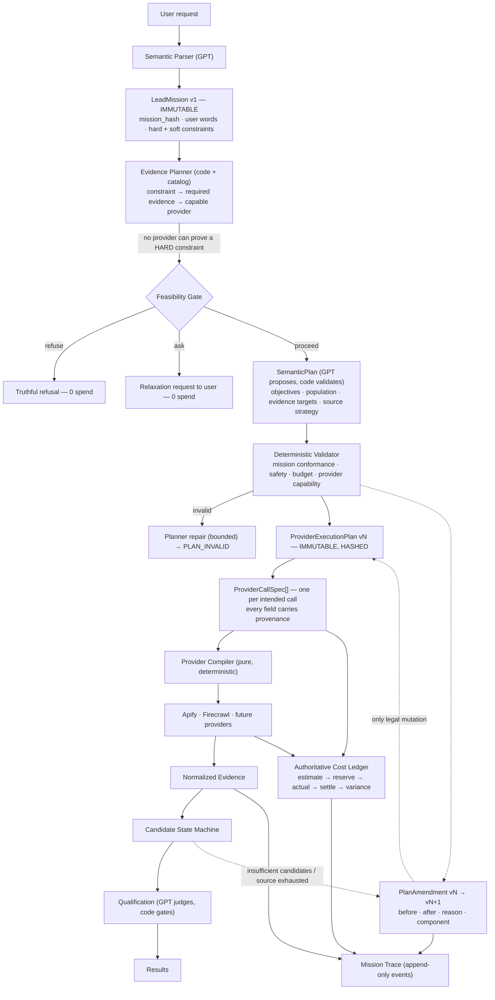
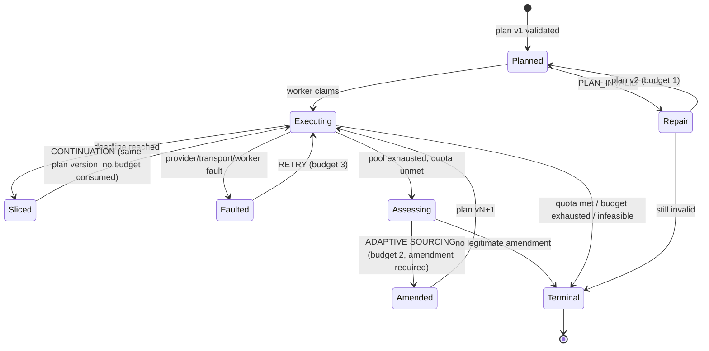
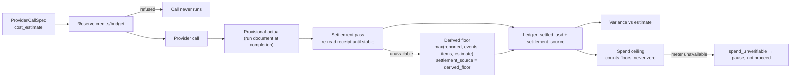
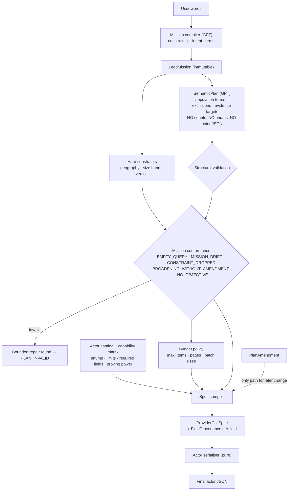
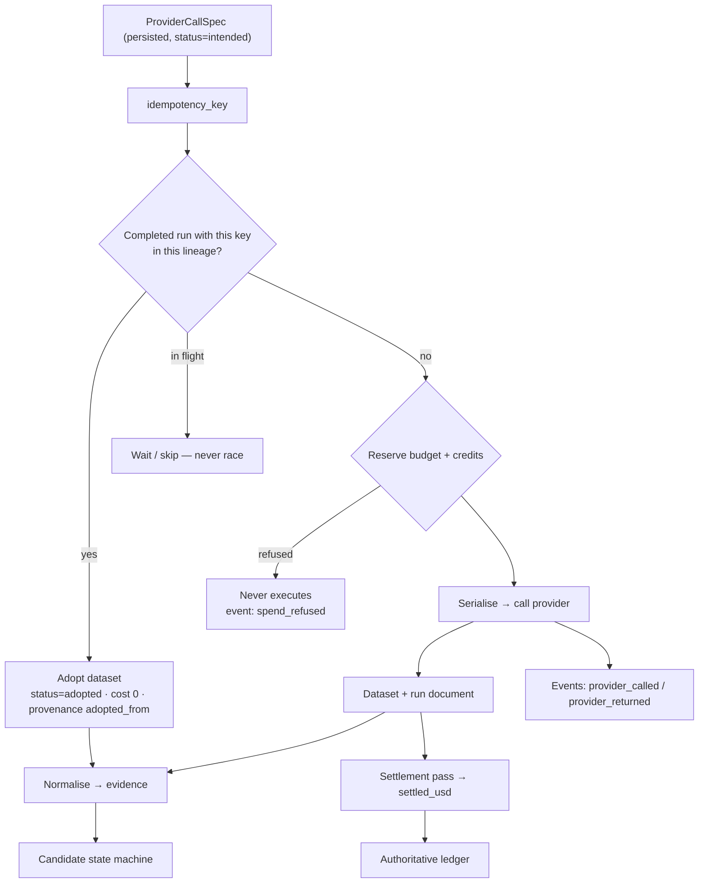
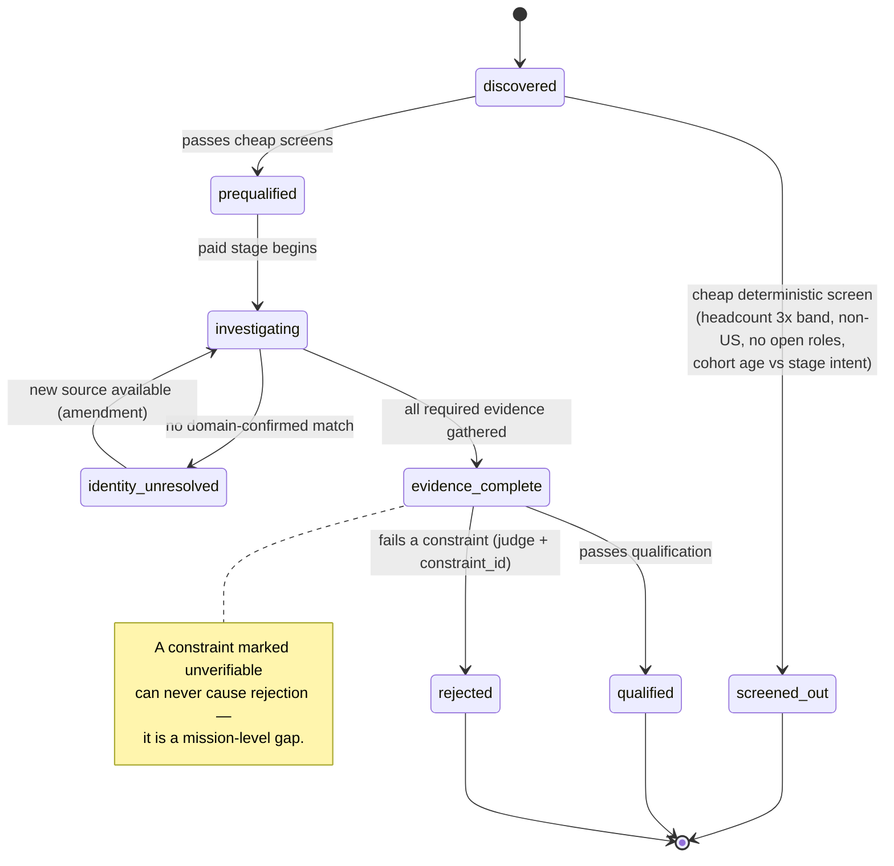

# Lead V2 — Architecture Remediation Plan

**Status:** proposal. No code changed. Written against commit `125f0cfa`, the forensic audit of run `1e52d43c` (`docs/audits/lead-v2-run-1e52d43c-forensic-audit.md`) and the audit of run `4250f181` before it.

---

# Executive Summary

Lead V2 does not have a plan. It has **five components that each believe they own the plan**, and a provider layer that accepts whatever the last one said.

The evidence: in run `1e52d43c` the same mission produced five different discovery questions in 22 minutes — `["B2B SaaS","SaaS"]`, `["B2B SaaS","B2B software as a service","business software SaaS"]`, `["B2B SaaS","SaaS startup"]`, `["B2B SaaS","business software SaaS","software for businesses"]`, and finally `[]` — while every amendment logged `execution_plan_amendment_no_change`. Nothing was lying; nothing was checking either.

This is not a set of bugs to patch. Each of the ten confirmed failures is a *predictable consequence* of three structural defects:

1. **Intent has no canonical, versioned representation.** `tasks.result.capability_execution_state.execution_plan` is a mutable blob that is re-derived, re-validated and replaced in at least four places. There is no plan identity, no version, no diff, no provenance.
2. **Every layer may rewrite every field, and none must declare it.** `compileActorInput` overwrites `maxItems`; the engine clamps `maxEmployeeSize`; `buildIdentitySearchInput` replaces three planner fields; the amendment replaces the whole object. All legal, all invisible.
3. **Feasibility is advisory, spend is not.** The system knew before the first dollar that no scheduled source can prove "seed-stage", said so on the confirmation card, and then spent $0.59 discovering 30 companies whose fate was already decided.

**Recommendation: PARTIALLY salvageable → REFACTOR with a partial rewrite of the planner + provider-execution layer (B, with C for two specific layers).**

Keep: the mission compiler, the actor catalog's verified facts, the capability graph, the queue/worker/lease machinery, the resume checkpoint, the identity match rules, the Workbench projection, and the Brain policy resolver. These are correct and hard-won.

Rewrite: the plan lifecycle (one immutable versioned object), the provider call path (one compiler, one spec, one idempotency key), the cost settlement path (receipt-driven), and the continuation controller (resume, not re-plan).

Delete: roughly a dozen modules that duplicate ownership — five overlapping actor registries, two parallel sourcing loops, a legacy quota controller, and four independent cost estimators.

The single most important new primitive is the **`ProviderCallSpec` with a `plan_version` and a provenance record for every field**. Once no provider call can exist without one, seven of the ten confirmed failures become structurally impossible rather than merely fixed.

---

# Confirmed Failures

From run `1e52d43c` (and, where noted, `4250f181`). Every line is evidence-backed.

| # | Failure | Evidence | Structural cause |
|---|---|---|---|
| 1 | Plan rewritten between attempts, logged `no_change` | `leadCapabilityEngine.ts:5308` replaces `executionPlan`; line ~5330 compares only `before.join(">") !== after.join(">")` over capability names | no plan identity/version/diff |
| 2 | `queries: []` → unfiltered YC sweep | call `4havAcZYghTdDA0DJ`, 9 non-seed companies incl. ShipBob (1,709 staff) | no validity floor on a compiled call |
| 3 | Canary quota shrank discovery | `run-agent/index.ts:2544` `maxCandidates = max(10, quota.requestedLeadCount*10)`, quota = canary 1 | runtime policy leaking into mission semantics |
| 4 | Planner values silently overridden | `maxItems` 100→10 (`leadDiscoveryStrategy.ts:378`); `maxEmployeeSize` unset→"250" (engine clamp) | override without declaration |
| 5 | Correct identity overrides not represented as amendments | `buildIdentitySearchInput` (`leadCapabilityEngine.ts:1256`) replaces `maxItems` 5→15, adds `locations`, forces `scraperMode` | same mechanism, benign intent |
| 6 | Cost under-reported 2.4× | Apify billed $0.5902, ledger $0.2463; 12 Firecrawl rows `cost_source: unknown` | no settlement pass; two provider paths, one priced |
| 7 | Unprovable hard constraint reached evaluation | `hard_constraints.stage = eq "seed"`; memo23 has no funding field; 30/30 died `insufficient_evidence` | feasibility advisory, not gating |
| 8 | Poor-fit candidates admitted | 1,709/150/145/115-employee companies from a 2011–2016 cohort | no cheap deterministic rejection before spend |
| 9 | Query/filter changes not surfaced as mutations | 5 distinct inputs, 0 recorded amendments | no amendment primitive |
| 10 | Retry ≈ new mission | every resume ran `discovery_reopened_for_replenishment` and bought a new question | continuation and replanning share a code path |

Two further defects found while auditing, same family:

| 11 | Recovery reads fail silently | `run-agent/index.ts:2690–2731` logs `read failed [object Object]` (`String(error)` on an object) | error handling without a typed failure |
| 12 | Workbench `progress` block reads all-zero beside 30 real rows | `tasks.result.progress` vs `workbench_evaluation_counts` | two count owners |

---

# Root Architectural Causes

### RC-1 — There is no canonical plan object
`execution_plan` is a field inside a state blob inside a task row. It is produced by `validateExecutionPlan`, restored by `reusableStoredPlan`, replaced by the amendment, and *re-derived into a second representation* (`DiscoveryStrategy`) at `leadCapabilityEngine.ts:4122`. Four representations of the same intent exist simultaneously: the plan step, the discovery strategy, the compiled actor input, and the Apify `INPUT` record. Nothing reconciles them; the audit had to reconstruct the chain from Railway logs because **no persisted artifact records what was asked or why**.

### RC-2 — Mutation is the default, declaration is optional
There is no type-level or runtime distinction between "the plan" and "a modified copy of the plan". Any function holding the object may return a different one. `PlanAmendment` does not exist; the closest thing (`state.amendment_refusals`) records only *refused* structural removals.

### RC-3 — Ownership is blurred in both directions
GPT sets operational parameters it cannot reason about (`maxItems: 100`, `minEmployeeSize: "5+"` — invented, never requested). Deterministic code sets semantic parameters it has no authority over (dropping `industries`, forcing size bounds from an *advisory* Brain preference). The result is a run where neither party can be held responsible for the query that was actually bought.

### RC-4 — Feasibility is computed and then ignored
`assessRequestFeasibility` grades requirements and even produced the "declared gap" line on the user's confirmation card. Its output gates nothing. The pipeline discovers, resolves, enriches and evaluates against a constraint it already knows is unprovable, then reports `insufficient_evidence` as if it were a discovery about the companies.

### RC-5 — Cost is estimated, never settled
`priceProviderCall` reads the Apify run document once, at completion, and writes that number as `actual`. Result-event charges that settle afterwards are never re-read. There is no settlement pass, no variance, and no reconciliation against the provider's own billing. Firecrawl has a full cost model (`firecrawlCostModel.ts`) that the evidence path never calls — it is imported only by `toolRegistry.ts`, while web-evidence rows are written by a different path.

### RC-6 — Too many live components own the same job
`run-agent/index.ts` loads **303 shared modules**. Among them, live simultaneously: five actor/capability registries (`actorRegistry.ts`, `actorCapabilityRegistry.ts`, `apifyIntelligenceRegistry.ts`, `hiringActorCatalog.ts`, `intelligence/capabilityRegistry.ts`), three actor-input builders (`actorInputPlanner.ts`, `actorInputStrategy.ts`, `hiringActorInputs.ts` + `compileActorInput` + `compileFirstProviderCall`), two sourcing loops (`leadCapabilityEngine` and `multiRoundController` + `companyFirstQuotaController`), two route executors (`companyFirstRouteExecutor.ts`, `executeRunAgentCompanyFirstSourcing.ts`), and four cost estimators. The engine alone is **9,854 lines**.

---

# Current Ownership Problems

**Intended model** (yours, and it is the right one):

| Layer | Owns |
|---|---|
| GPT | semantic understanding, search strategy, evidence judgement |
| Code | truth, safety, budgets, constraints, identity, validation, execution boundaries |
| Providers | facts |

**What the implementation actually does:**

| Decision | Should own | Actually owns it | Evidence |
|---|---|---|---|
| What population to search | GPT | GPT, **then the amendment GPT, then the discovery-planner GPT**, unreconciled | 5 different query sets in one mission |
| How many rows to buy | Code | GPT proposes (`maxItems: 100`), code silently overrides (10) | `leadDiscoveryStrategy.ts:378` |
| Size bounds | Code (from mission/Brain) | GPT invents `minEmployeeSize`, code invents `maxEmployeeSize` | run inputs; `clampMemo23MaxSize` |
| Which actor runs | Code (capability + catalog) | GPT picks, code validates — **correct** | `validateDiscoveryStrategy` |
| Whether a constraint is provable | Code | computed by code, **ignored by everything** | `assessRequestFeasibility` |
| Identity acceptance | Code | code — **correct** | `acceptLinkedInMatch` domain rule |
| Geography | Code (hard constraint) | code — **correct** | `identitySearchLocations` |
| Discovery breadth | Code, from **mission** | code, from **canary runtime policy** | `run-agent/index.ts:2544` |
| When to re-search | Code (policy) | engine replenishment + replan + amendment, three triggers | `discovery_reopened_for_replenishment`, `discovery_replan_considering`, amendment |
| What a call cost | Provider receipt | a single early read of the run document | ledger $0.2463 vs $0.5902 |

**Verdict: the intended model is not implemented.** GPT owns operational knobs; code owns semantic ones; providers own nothing because their receipts are not authoritative.

---

# Target Architecture

One intent, one plan, one compiler, one ledger, one lifecycle. Every arrow is typed and every mutation is an event.



**The three structural rules the diagram encodes**

1. `LeadMission` and every `ProviderExecutionPlan` version are **immutable**. Change is expressed as a new version produced by a `PlanAmendment`, never by in-place assignment.
2. **No provider call exists without a `ProviderCallSpec`**, and no spec without a `plan_version`. The compiler is pure: `spec → actor JSON`, no hidden inputs, no environment reads, no clamps of its own.
3. **Feasibility gates spend.** The gate runs before the first paid call and returns exactly one of: proceed, ask for relaxation, refuse.

---

# Canonical Data Models

Four objects replace the current sprawl. TypeScript shapes are indicative, not final.

### 1. `LeadMission` (exists — keep, tighten)
Immutable, hashed, user-owned semantics. **Add** two things: an explicit `intent_terms` list preserving the user's own words (so "first growth marketer" survives compilation), and `constraint_ids` so every hard constraint can be referenced by the evidence planner and the evaluator.

```ts
interface LeadMission {           // frozen at compile time; mission_hash covers all of it
  mission_id: string; mission_hash: string;
  original_user_query: string;
  requested_count: number;                    // 3 — never overwritten by runtime policy
  target_entity: "company" | "person";
  constraints: Constraint[];                  // each { id, axis, operator, value, hardness, source }
  intent_terms: string[];                     // ["first growth marketer"] — preserved verbatim
  requested_output: RequestedOutput;
}
```

`Constraint.source` is one of `user_stated | model_inferred | brain_inherited | code_default`. Today this exists only as prose in `hard_constraints[].reason`; making it an enum is what lets the UI and the evaluator distinguish "the user demanded this" from "a model guessed this".

### 2. `SemanticPlan` (new — GPT's output, code-validated)
What to look for and what would prove it. **No provider nouns, no actor keys, no counts.**

```ts
interface SemanticPlan {
  plan_id: string; mission_id: string; version: 1;
  objectives: Objective[];        // { id, description, satisfies_constraint_ids[] }
  population: {                   // the search cohort, in mission vocabulary
    include_terms: string[]; exclude_terms: string[];
    geography: string[]; verticals: string[]; size_band?: { min?: number; max?: number };
  };
  evidence_targets: EvidenceTarget[];  // { constraint_id, evidence_kind, acceptable_sources[] }
  source_strategy: { primary: SourceIntent; breadth: SourceIntent[]; fallback: SourceIntent[] };
  reasoning: string;
}
```

Separating this from provider mechanics is the point: the GPT layer stops emitting `maxItems` and `minEmployeeSize`, because those are not semantic decisions.

### 3. `ProviderExecutionPlan` (new — code's output, versioned, immutable)
The bridge. Produced deterministically from `SemanticPlan` + capability matrix + budget policy.

```ts
interface ProviderExecutionPlan {
  plan_id: string; mission_id: string; version: number;          // 1, 2, 3 …
  derived_from: { semantic_plan_id: string; amendment_id: string | null };
  stages: PlanStage[];            // ordered: discovery → identity → enrichment → evidence → qualification
  budget: { max_provider_usd: number; max_model_usd: number; pool_targets: PoolTargets };
  hash: string;                   // canonical hash of everything above
  created_at: string; created_by: ComponentId;
}
```

### 4. `ProviderCallSpec` (new — the unit of spend)

```ts
interface ProviderCallSpec {
  provider_call_id: string;       // ULID, assigned before any network activity
  mission_id: string; plan_id: string; plan_version: number; stage_id: string;
  attempt: number;
  provider: "apify" | "firecrawl";
  actor: string;                  // "harvestapi/linkedin-company-search"
  purpose: "discovery" | "identity_resolution" | "enrichment" | "evidence" | "jobs";
  objective_id: string;           // which SemanticPlan objective this serves
  query: QuerySpec | null;        // { terms[], mode } — null only for URL-addressed calls
  filters: Record<string, unknown>;
  location: string[] | null;
  employee_bounds: { min: number | null; max: number | null } | null;
  max_items: number;
  mode: string | null;            // e.g. scraperMode
  required_fields: string[];      // ["linkedinUrl","website"] — asserted against the catalog
  evidence_target: { constraint_id: string; evidence_kind: string } | null;
  hard_constraints: string[];     // constraint_ids this call must not violate
  provenance: FieldProvenance[];  // one entry PER FIELD — see below
  idempotency_key: string;        // see Idempotency
  cost_estimate: { usd: number; basis: string };
}

interface FieldProvenance {
  field: string;                  // "query.terms"
  source: "user" | "mission_compiler" | "semantic_plan" | "capability_matrix"
        | "budget_policy" | "provider_contract" | "amendment" | "code_default";
  value_before?: unknown; value_after: unknown;
  reason: string;                 // "actor enum requires 'United States of America'"
  amendment_id?: string;          // REQUIRED when source === "amendment"
}
```

Your proposed shape was close; the three additions that matter are **`objective_id`** (so a call that serves no objective cannot be built), **`evidence_target`** (so evidence-gathering calls are distinguishable from population calls), and **per-field `provenance`** rather than a single "source of every field" string — the audit's hardest work was reconstructing exactly this, per field.

### 5. `PlanAmendment` (new — the only legal mutation)

```ts
interface PlanAmendment {
  amendment_id: string; mission_id: string;
  from_version: number; to_version: number;
  component: ComponentId;         // "execution_planner" | "validator" | "budget_policy" | "sourcing_controller"
  trigger: AmendmentTrigger;      // "insufficient_candidates" | "source_exhausted" | "evidence_unavailable"
                                  // | "provider_failed" | "provider_limit" | "safety_clamp" | "user_relaxation"
  changes: FieldChange[];         // { path, before, after, reason }
  rationale: string;              // model text when a model proposed it
  approved_by: "code_policy" | "user";
  created_at: string;
}
```

### 6. `CandidateRecord` + lifecycle (consolidate what exists)
One record per company per mission, with a single `state` field and a set of independent evidence flags (see *Candidate Lifecycle*).

### 7. `CostEntry` (rework)
One row per `provider_call_id`, moving through `estimated → reserved → actual → settled`, with `variance` and a `settlement_source` (`provider_receipt` | `provider_events` | `derived_floor` | `unknown`).

### Persistence

Production has no table for any of this (`task_plans` is Pilot's plan; the execution plan lives inside `tasks.result`). Proposed, additive only:

| Table | Purpose | Notes |
|---|---|---|
| `lead_plan_versions` | one row per `ProviderExecutionPlan` version | `(mission_id, version)` unique; plan JSON + hash |
| `lead_plan_amendments` | append-only amendments | FK to plan versions |
| `lead_provider_call_specs` | one row per spec, written **before** the call | `idempotency_key` unique; spec JSON incl. provenance |
| `lead_mission_events` | append-only trace | see *Observability* |
| `lead_execution_calls` | **keep** — becomes the execution/receipt record, joined to a spec by `provider_call_id` | add `provider_call_id`, `plan_version`, `settlement_source`, `variance_usd` |

No table is dropped in the migration; `capability_execution_state` keeps working until Phase 5 retires it.

---

# Plan Versioning

**Rules**

1. A plan version is immutable once written. Version 1 is produced from the `SemanticPlan` after validation, before the first paid call.
2. A new version is produced **only** by a `PlanAmendment`, and an amendment must state a trigger from the closed enum.
3. Change detection compares the **canonical hash of the whole plan** (stages, specs, filters, counts, bounds), never a projection of it. The current comparison of capability names (`leadCapabilityEngine.ts:~5330`) is deleted.
4. Every `ProviderCallSpec` carries the `plan_version` it was compiled from. A spec compiled from version 2 cannot execute after version 3 exists unless the amendment explicitly preserved it (`carried_forward: true`).
5. Resume loads the highest version for the mission; it never re-plans to obtain one.
6. An amendment that would change the population *semantics* (query terms, geography, verticals, size band) requires `trigger ∈ {insufficient_candidates, source_exhausted, user_relaxation}` **and** a mission-conformance re-validation. An amendment for `provider_limit`/`safety_clamp` may only touch operational fields (`max_items`, pagination, batching) — it may never touch semantics.

That last rule alone makes failure #1, #2, #4 and #9 impossible: the amendment that emptied `queries` would have been rejected as a semantic change under a `provider_limit` trigger, and any legitimate semantic change would have appeared as a diff with a reason.

---

# ProviderCallSpec

**Yes — this should replace the current path**, and specifically:

| Current | Fate |
|---|---|
| `leadDiscoveryStrategy.compileActorInput` | **Replaced** by the spec compiler. Its enum/limit knowledge moves into the compiler; its silent `maxItems` overwrite becomes a `budget_policy` provenance entry decided *before* the spec is built |
| `hiringActorInputs.compile*Input` (13 functions) | **Kept, demoted**: they become pure `spec → actor JSON` serialisers with validation, one per actor, no policy |
| `leadCapabilityEngine.buildIdentitySearchInput` | **Replaced**: identity specs are built by the same compiler; the strict mode/limit/locations become provenance entries with `source: "provider_contract"` and `source: "mission_compiler"` |
| `leadCapabilityEngine.compileFirstProviderCall` | **Deleted** (duplicate of the discovery path with its own defaults) |
| `actorInputPlanner.ts`, `actorInputStrategy.ts` | **Deleted** after their unique knowledge is folded into the catalog |
| `toolRegistry.ts` provider execution | **Kept for non-lead paths**, but lead-path calls go through the spec compiler; the two must not both build Apify inputs |
| `hiringActorCatalog.ts` | **Kept and promoted** to the single capability source of truth |

**Execution contract**

```
SemanticPlan  →  [validator]  →  ProviderExecutionPlan vN  →  [spec compiler]  →  ProviderCallSpec
      →  [actor serialiser]  →  actor JSON  →  provider  →  receipt  →  ledger settlement
```

Three assertions make it auditable:
- the compiler is **pure and total**: same spec ⇒ byte-identical JSON (property-tested);
- the serialiser may **only** drop or reformat fields the actor genuinely lacks, and each such drop emits a `FieldProvenance` entry with `source: "provider_contract"`;
- the final JSON is stored next to the spec, so `spec → JSON` is diffable without Railway logs. (In this run, that diff existed only in my head.)

---

# Capability / Evidence Matrix

The missing primitive behind failure #7. Today capability knowledge is scattered across five registries; this consolidates it into one declarative table keyed by **evidence kind**, not by actor.

```ts
interface EvidenceCapability {
  evidence_kind: "funding_stage" | "employee_count" | "geography" | "industry"
               | "open_role" | "team_composition" | "role_seniority" | "company_identity";
  provider: string; actor: string;
  power: "discover" | "prove" | "corroborate";   // discover ≠ prove — the distinction that was missing
  population: "y_combinator" | "linkedin_indexed" | "open_web" | "any";
  confidence: "high" | "medium" | "low";
  freshness_days: number | null;
  cost_per_item_usd: number;
  notes: string;                                  // verified evidence, with a run id
}
```

Seed values implied by the audits:

| Evidence kind | Actor | Power | Confidence |
|---|---|---|---|
| company_identity | `harvestapi/linkedin-company-search` (full mode) | prove (domain match) | high |
| employee_count | `harvestapi/linkedin-company` | prove | high |
| employee_count | `memo23/y-combinator-scraper` (`teamSize`) | corroborate | **low** (ShipBob reported 1 vs 1,709) |
| geography | `harvestapi/linkedin-company` + company site | prove | medium |
| industry | `harvestapi/linkedin-company` | prove | medium |
| open_role | `memo23` `openJobs`, LinkedIn jobs | prove | high |
| **funding_stage** | *none currently integrated* | — | — |
| team_composition | LinkedIn employees actor (people stage, unlocked) | prove | medium |

**Gate semantics.** Before the first paid call, for each **hard** constraint: find a capability with `power: "prove"` whose population covers the plan's cohort. Then:

| Situation | Action | Spend |
|---|---|---|
| All hard constraints provable | proceed | normal |
| A hard constraint provable only by a source not yet integrated (e.g. funding stage → Crunchbase) | **refuse with a named gap**, or proceed only if the user relaxes it to soft | 0 until resolved |
| A hard constraint provable only for a different population | offer the population swap (e.g. "YC cohort cannot prove seed; search a funding index instead") | 0 |
| A soft constraint unprovable | proceed, mark `unverifiable`, and **forbid** the evaluator from rejecting on it | normal |

For run `1e52d43c` the gate would have stopped before the first $0.018 and said: *"Seed-stage is a hard constraint. No integrated source can prove funding stage. Options: (a) add a funding source, (b) treat 'seed-stage' as a soft preference and qualify on YC batch recency + headcount, (c) refuse."* That is a five-second decision instead of a 22-minute $0.68 failure.

**Also required:** the evaluator must never emit `insufficient_evidence` for a constraint the gate marked `unverifiable` — it must emit `unverifiable_constraint`, which is a *mission* outcome, not a company verdict. Thirty companies were failed in this run for a gap the system created.

---

# Query Generation

**Who generates what, after the change**

| Element | Owner | Enforcement |
|---|---|---|
| population terms, verticals, exclusions | GPT (`SemanticPlan`) | must be non-empty; must be traceable to mission terms or an amendment |
| geography, size band | mission (hard constraints) | code copies them in; GPT may not author them |
| actor choice | GPT proposes, code validates against the capability matrix | unknown/incapable actor ⇒ `PLAN_INVALID` |
| counts, pagination, batching | code (budget policy) | GPT never emits `max_items` |
| enums, spellings, field names | code (provider contract) | every coercion logged as provenance |
| evidence targets | code (from constraints) + GPT (suggested sources) | gate must pass |

**Validation rules — any failure produces `PLAN_INVALID` and a bounded repair round, never a paid call**

1. `EMPTY_QUERY` — a discovery spec with no `query.terms` **and** no structured filter that narrows the population. (An unfiltered directory sweep is not a search.)
2. `MISSION_DRIFT` — population terms share no lexical or semantic root with the mission's verticals/intent terms, without an amendment saying why.
3. `CONSTRAINT_DROPPED` — a hard constraint expressible by the actor is absent from the spec (e.g. `regions` missing while geography is hard).
4. `UNSUPPORTED_SETTING` — a field or enum value the catalog does not verify.
5. `BROADENING_WITHOUT_AMENDMENT` — any spec whose population is a strict superset of the previous version's without a `PlanAmendment`.
6. `NO_OBJECTIVE` — spec serves no objective in the plan.
7. `EVIDENCE_UNBACKED` — spec claims an `evidence_target` its actor cannot `prove`.
8. `BUDGET_EXCEEDED` — projected cost pushes the mission past its cap.

Rule 1 alone kills failure #2; rule 5 kills the "quietly wider each attempt" pattern; rule 3 is what would have caught the dropped `industries` on attempt 2.

---

# Validation

Three tiers, executed in order, all deterministic:

1. **Structural** — shape, enums, required fields, actor exists, capability declared. (Largely exists today in `validateExecutionPlan` / `validateDiscoveryStrategy` — consolidate into one.)
2. **Mission conformance** — the rules above; the check that is entirely missing today. Input: mission + plan version + previous version. Output: `valid | invalid(reasons[]) | needs_amendment(changes[])`.
3. **Policy** — budget, canary limits, credit ceiling, provider-capability gate.

A validator failure never silently "falls back to the deterministic ladder" (today's behaviour, `leadDiscoveryStrategy.ts`). It either triggers one bounded repair round with the reasons fed back to the model, or terminates the mission with a truthful reason.

---

# Candidate Lifecycle

Your proposed states are nearly right; the fix is to separate **one lifecycle state** from **independent evidence dimensions**, because the confusing Workbench numbers come from mixing them.

```ts
type CandidateState =        // mutually exclusive, monotonic except via explicit reopen
  | "discovered"             // returned by a discovery call
  | "screened_out"           // cheap deterministic rejection — never cost a paid stage
  | "prequalified"           // passed cheap screens, awaiting investigation
  | "investigating"          // paid work in flight or partially complete
  | "identity_unresolved"    // terminal for this mission unless a new source appears
  | "evidence_complete"      // all required evidence gathered
  | "qualified"              // passed qualification
  | "rejected";              // failed qualification, with a judge and a reason

interface CandidateEvidence {  // independent booleans/enums, NOT states
  identity: "unknown" | "verified" | "mismatch";
  employee_count: EvidenceStatus; geography: EvidenceStatus;
  industry: EvidenceStatus; open_role: EvidenceStatus;
  team_composition: EvidenceStatus; funding_stage: EvidenceStatus | "unverifiable";
}
```

Rules: `rejected` requires a named judge and a constraint id; a candidate whose only failure is an `unverifiable` constraint may never be `rejected` (it is `evidence_complete` + mission-level gap); `screened_out` requires a cheap fact and never follows a paid stage.

**Cheap deterministic screens (failure #8), applied to raw discovery rows before any paid call:**

| Screen | Fact | Source | Action |
|---|---|---|---|
| headcount far outside band | `teamSize` (low confidence) | discovery row | screen out only if **≥ 3×** the band max; otherwise defer to enrichment |
| cohort age vs stage intent | YC `batch` year | discovery row | with `stage=seed` intent, batches older than ~4 years are screened out as `stage_implausible` |
| geography mismatch | `regions`/`allLocations` | discovery row | screen out on explicit non-US |
| industry mismatch | `industries` | discovery row | screen out only against explicit mission exclusions |
| no open roles while hiring is required | `openJobs: []` | discovery row | screen out |

These are mission-derived thresholds, not hardcoded startup heuristics: each screen cites the constraint it serves and is skipped when that constraint is absent. Applied to this run, they would have removed ShipBob, Mashgin, Deepgram, Mux, Bitmovin, Quartzy, Streak and Zentail **before** $0.28 of identity searches.

---

# "First Growth Marketer" Semantics

The mission compiler dropped this entirely (`intent_terms` fixes that). Claiming it requires a **conjunction**, evaluated jointly:

| Component | Evidence | Owner | Source |
|---|---|---|---|
| A relevant role is genuinely open | job title/description matches the `marketing_growth` family | code (`classifyTitle` + family aliases) | discovery `openJobs`, LinkedIn jobs |
| The role is a *first* hire | title carries first-hire markers ("Founding", "First", "Head of X" at ≤ N staff) **or** seniority implies function ownership | GPT judgement, code-gated | job title + description |
| No existing equivalent function | no current employee holds an equivalent title | code, from team composition | LinkedIn employees (people stage — requires unlock) or company site team page |
| Company small enough for the claim to be meaningful | verified headcount ≤ band | code | enrichment |

**Scoring:** all four must be satisfied for `hiring_first_growth_marketer = proven`. Three of four with team composition missing ⇒ `likely` (never `proven`). Keyword-only match ⇒ `insufficient`. The evaluator receives these as structured inputs, so the model judges *wording* and code judges *facts* — GPT may not upgrade `likely` to `proven`.

**Cost note:** team composition needs the people stage, which is unlock-gated. So the honest options for a mission with this requirement are: (a) treat it as soft and report `likely`, or (b) ask the user to unlock people-stage evidence. The capability gate must ask this **before** discovery, not after.

---

# Retry / Continuation

Today one code path serves four different situations, which is why attempt 2 looked like a new mission. Separate them:

| Concept | Definition | Consumes retry budget? | May change the plan? |
|---|---|---|---|
| **Continuation** | the same plan version resumes after a time-slice ends (deadline, lease) | **No** | No |
| **Repair** | the plan was invalid; bounded re-plan before any spend | No (own budget: 1 round) | Yes — new version, trigger `plan_invalid` |
| **Adaptive sourcing** | the plan was valid and executed, but the pool is genuinely insufficient | No (own budget: max 2 per mission) | Yes — amendment, trigger `insufficient_candidates` or `source_exhausted` |
| **Retry** | an *execution fault*: provider error, transport failure, worker crash, lease loss | **Yes** | No |
| **Terminal failure** | budget exhausted, infeasible, retries exhausted, quota met | — | — |

**Continuation must resume, not regenerate.** On claim, the worker loads: highest `plan_version`, its specs, completed provider outputs (by idempotency key), candidate states, evidence, and the cost ledger. It then continues at the first incomplete stage. It may not call the execution planner, the discovery planner, or the amendment path unless an explicit adaptive-sourcing condition is met and its budget remains.

**When adaptive sourcing is legitimate** — all of:
1. every candidate in the current pool has reached a terminal or blocked state (no cheaper work remains);
2. qualified count < requested count;
3. the adaptive-sourcing budget is not exhausted;
4. the proposed amendment passes mission conformance (no broadening without a stated reason);
5. the projected cost fits the remaining mission budget.

In run `1e52d43c`, conditions 1 and 4 were both false on attempts 2–4: candidates were still mid-investigation, and the "new" questions were unexplained rewrites.

**Retry budget (failure #10 / #15).** `V2_MAX_ATTEMPTS = 5` currently counts *time slices*. Under the new model a mission gets: unlimited continuations bounded by a **wall-clock mission budget** (say 30 minutes) and a **spend budget**; 3 execution-fault retries; 1 repair round; 2 adaptive-sourcing amendments. This run would have consumed 0 of 5 retries — it never had an execution fault.



---

# Idempotency

**Key**

```
idempotency_key = sha256(
  mission_id + ":" + provider + ":" + actor + ":" + purpose + ":" +
  canonical_json(serialised_actor_input_without_pagination) + ":" + page
)
```

Deliberately **excludes** `plan_version` and `attempt`: the same question asked under a later plan version is still the same purchase, and must be reused rather than re-bought. It **includes** `page` so pagination is a distinct purchase, and `purpose` so an identical query for a different stage is not wrongly adopted.

**Protocol**
1. Write the `ProviderCallSpec` with its key **before** the network call (`status: intended`).
2. Look up the key across the whole **lineage**: if a completed run exists, adopt its dataset (`status: adopted`, cost 0, provenance `adopted_from: provider_call_id`).
3. If an `intended`/`running` spec exists with the same key and a live lease, wait or skip — never race.
4. On completion, store `provider_run_id`, `dataset_id`, receipt.
5. Uniqueness is enforced by a DB constraint on `(mission_id, idempotency_key)`, not by in-memory sets.

The current `completed_runs` adoption (added for run `4250f181`) is the right idea implemented in the wrong place: it lives in engine state, is rebuilt per slice, and its recovery read **fails silently** (`read failed [object Object]`). Moving the key to a table with a unique constraint makes double purchase impossible rather than unlikely.

Note the current query-family guard (`memo23QueryFamily`) stays useful as a *semantic* dedupe (same question, differently phrased), but it is a planning-time check, not the spend-time guarantee.

---

# Cost Ledger

**Lifecycle per `provider_call_id`:** `estimate → reserve → actual → settle → variance`.

| Phase | When | Source | Rule |
|---|---|---|---|
| estimate | at spec build | capability matrix unit prices × `max_items` | never null |
| reserve | before call | credits/budget | a call whose reserve fails does not run |
| actual | at completion | provider run document | may be **provisional** |
| **settle** | **deferred pass** | **re-read the receipt after the provider's events settle** | the missing step |
| variance | at settle | `settled − estimated` | logged; large variance alerts |

**Why the ledger read $0.2463 against a $0.5902 bill:** `usageTotalUsd` is read once at completion, before result-event charges post. Run `H71EoIbUDYRi47f7q` shows it exactly — ledger $0.001, Apify $0.005 after its `full-company` event settled.

**Fixes**
1. **Settlement pass** — a worker step (and a sweeper for missions that end early) re-reads each Apify run document until `usageTotalUsd` stops changing or a cap is hit, then writes `settled_usd` + `settlement_source: "provider_receipt"`.
2. **Floor, never zero** — if settlement is unavailable, the recorded cost is `max(reported, events×price, items×price, estimate)` with `settlement_source: "derived_floor"`. `unknown` is a status, never `$0`.
3. **Firecrawl** — route the evidence path through the existing `firecrawlCostModel.ts` (`priceFirecrawlCall`), which today only `toolRegistry.ts` imports. Twelve calls with `cost_source: "unknown"` is a wiring gap, not a missing model.
4. **Model spend** — keep the on-exit drain from `125f0cfa`; add settlement of `actual_cost_usd` from provider usage where available (all 43 rows currently carry estimates only).
5. **One writer** — the ledger is written exclusively by the execution layer, from the spec. `providerCostModel`, `firecrawlCostModel` and `modelCostModel` become *pricing functions*, not independent estimators embedded in four call sites.

**Ceiling behaviour when a meter fails.** `MODEL_SPEND_CEILING_USD` (and its provider analogue) must **fail closed with a bounded grace**: if the spend query fails or returns `unknown`-status rows above a threshold, the mission may finish the **current stage** using reserved budget, then pauses with `terminal_status: "spend_unverifiable"` rather than continuing blind. Today `authorizeModelSpend` returns `allowed: !enforce` on a query failure — in `enforce` mode that is already fail-closed for models; the same rule must apply to provider spend, and an `unknown`-cost row must count at its derived floor toward the ceiling, not as zero.



---

# Observability

One append-only event stream per mission (`lead_mission_events`), one row per decision. Every event:

```ts
interface MissionEvent {
  event_id: string; mission_id: string; task_id: string; attempt: number;
  plan_version: number | null; candidate_id: string | null; provider_call_id: string | null;
  event_type: EventType; component: ComponentId; timestamp: string;
  before: unknown | null; after: unknown | null; reason: string;
  cost_usd: number | null; model_usd: number | null;
}
```

`EventType` (closed enum): `mission_compiled`, `feasibility_assessed`, `plan_created`, `plan_amended`, `plan_invalid`, `spec_compiled`, `spec_adopted`, `provider_called`, `provider_returned`, `cost_settled`, `candidate_discovered`, `candidate_screened_out`, `candidate_state_changed`, `evidence_recorded`, `qualification_decided`, `continuation_started`, `retry_consumed`, `mission_terminal`.

The test of this design is the six questions you asked, each answerable by one query:

| Question | Query |
|---|---|
| Why did we call this actor? | `spec_compiled.after.objective_id` → plan stage → `SemanticPlan.objectives` |
| Why this query? | `ProviderCallSpec.provenance` where `field = "query.terms"` |
| Why these filters? | same, per field |
| Who modified them? | `plan_amended` events joined by `plan_version`, plus provenance entries with `source: "amendment"` |
| What did it cost? | `cost_settled` for the `provider_call_id` |
| What did it return? | `provider_returned` (+ dataset id) |
| What decision did that cause? | `candidate_state_changed` / `qualification_decided` carrying that `provider_call_id` |

Two supporting rules: **no `console.log`-only decisions** — anything the audit needed must be an event (the plan-input history existed only in Railway logs and was interleaved and partly unrecoverable); and **typed errors** — `read failed [object Object]` must be impossible, so failures carry a code and a serialised cause.

---

# Workbench State Model

The panel shows counts from three different owners (`progress`, `workbench_evaluation_counts`, the rows themselves); in the final snapshot `progress` read all-zero beside 30 real rows.

**Rule: one owner — the candidate records.** Every count is derived from `CandidateState` + evidence flags, computed in one function, never stored in a second place.

Display model:

| Row | Meaning | Source |
|---|---|---|
| Discovered | all candidates | `count(*)` |
| Screened out | cheap deterministic rejection | `state = screened_out` (+ reason breakdown) |
| Investigating | paid work in flight/partial | `state = investigating` |
| Identity unresolved | lookup could not confirm | `state = identity_unresolved` |
| Evidence complete | all required evidence gathered | `state = evidence_complete` |
| Qualified | passed | `state = qualified` |
| Rejected | failed with a judge | `state = rejected` (+ constraint id) |
| **Unverifiable constraint** | mission-level gap | banner, not a candidate bucket |

States are **mutually exclusive**; evidence flags are **dimensions** shown inside a row's detail. The current "ruled out" bucket disappears in favour of `screened_out` (cheap) vs `rejected` (judged), which is the distinction users kept misreading.

---

# Architectural Invariants

Enforced by types where possible, by runtime assertion otherwise, and by tests always. The numbered ones are the definitive list.

**Mission & intent**
1. `LeadMission` is immutable after compilation; `mission_hash` covers every semantic field.
2. Runtime policy (canary, budgets, feature flags) may never mutate mission semantics — it may only constrain execution, and must record itself as policy.
3. `requested_count` is the mission's; every derived pool target is computed from it, never from an execution limit.
4. The user's own words survive compilation (`intent_terms`) and are available to every evaluator.

**Plan**
5. No provider call without a `ProviderCallSpec`.
6. No `ProviderCallSpec` without a `plan_version` that exists in `lead_plan_versions`.
7. Plan versions are immutable; the only transition is `PlanAmendment(vN → vN+1)`.
8. Change detection compares the canonical plan hash — never a projection such as the capability list.
9. An amendment must carry a closed-enum trigger, a component, and a per-field before/after.
10. Operational triggers (`provider_limit`, `safety_clamp`) may not alter semantic fields (query terms, geography, verticals, size band, evidence targets).
11. Every field of every spec carries provenance; a field with `source: "amendment"` must reference an existing `amendment_id`.

**Query safety**
12. A discovery spec must narrow the population: non-empty query terms **or** a narrowing structured filter. Empty-everything never executes.
13. A hard constraint expressible by the chosen actor must appear in the spec.
14. No population broadening without an amendment.
15. A spec must serve a declared objective.

**Feasibility & evidence**
16. Every hard constraint must have a proving capability before the first paid call; otherwise refuse, ask for relaxation, or downgrade it explicitly.
17. A constraint marked `unverifiable` may never produce a candidate-level rejection.
18. `power: "discover"` never counts as `power: "prove"`.

**Spend**
19. A provider call must reserve budget before executing.
20. Unknown cost never settles as `$0`; it settles at a derived floor with a status.
21. Provider spend is settled from the provider's receipt, not from an early read.
22. Model spend is ledgered on every exit path, success or failure.
23. Spend ceilings count floors and unknowns; if the meter is unavailable, the mission pauses rather than proceeding.

**Execution & resume**
24. One purchase per idempotency key per mission, enforced by a DB constraint.
25. Continuation resumes the highest plan version; it never calls a planner.
26. Retry budget is consumed only by execution faults.
27. Adaptive sourcing requires an exhausted pool, remaining budget, and a conforming amendment.
28. Every decision that the audit would need is an event, not a log line.
29. Every failure carries a typed code and a serialised cause.

**Presentation**
30. All Workbench counts derive from candidate records through one function.
31. A candidate is `rejected` only with a judge and a constraint id.

---

# Code to Remove / Consolidate

Based on the live import graph (`run-agent` loads **303** shared modules).

### Five registries → one
`hiringActorCatalog.ts` (**keep — single source of truth**), and fold in / delete: `actorRegistry.ts`, `actorCapabilityRegistry.ts`, `apifyIntelligenceRegistry.ts`, `intelligence/capabilityRegistry.ts`. Keep `actorEvidenceCapability.ts`'s evidence semantics as the seed of the **capability/evidence matrix**, merged into the catalog.

### Input builders → one compiler + per-actor serialisers
Delete: `actorInputPlanner.ts` (815), `actorInputStrategy.ts` (754), `leadCapabilityEngine.compileFirstProviderCall` (duplicate defaults), `leadDiscoveryStrategy.compileActorInput` (policy hidden in a compiler). Demote `hiringActorInputs.ts` compilers to pure serialisers. Keep `buildIdentitySearchInput`'s *rules* as provenance-bearing spec fields, delete the function.

### Two sourcing loops → one
`multiRoundController.ts` + `multiRoundBinding.ts` + `companyFirstQuotaController.ts` (1,140) implement a second round/quota loop that still runs inside V2 alongside the capability engine's own investigation passes. Choose the capability engine; delete the multi-round loop and its bindings once its round-summary projection is ported.

### Two route executors → one
`companyFirstRouteExecutor.ts` and `executeRunAgentCompanyFirstSourcing.ts` both remain live V1-era entry points. Keep exactly one lead execution entry.

### Four cost estimators → one ledger writer
`providerCostModel.ts`, `firecrawlCostModel.ts`, `modelCostModel.ts` stay as **pricing functions**; remove cost arithmetic from `toolRegistry.ts`, `leadCapabilityEngine.ts`, `leadExecutionFinalizer.ts` and `runOutcome.ts`, leaving one writer in the execution layer.

### Geography flags → one predicate
`mission.geography_is_hard`, `missionGeographyIsHard()`, `identitySearchLocations()`, and `icpDiscoveryConstraints().locations` each answer "is geography binding?" separately. Keep one: the constraint record on the mission.

### Scattered clamps → budget policy
`maxCandidates` (two call sites), `DEFAULT_MAX_ITEMS_PER_ACTOR`, `MAX_RAW_ROWS_PER_ADMITTED`, `admittedTarget`, `clampMemo23MaxSize`, `IDENTITY_SEARCH_MAX_ITEMS` — all move into one `BudgetPolicy` consulted when specs are built, each emitting provenance.

### Stale comparisons & dead state
Delete the capability-list plan comparison; delete `capability_execution_state.discovery_strategy` as a second plan representation once plan versions land; retire `progress` as a count source.

### Continuation paths
`leadAutoContinuation.ts`, `stalledLeadResume.ts`, `resume-stalled-leads`, `continue-workflow` and the V2 queue all resume missions. V2 keeps the queue; the others must either delegate to it or be scoped explicitly to V1 tasks.

**Rough scale:** ~6,000–8,000 lines deleted, ~2,500–3,500 added. The engine drops well below 9,854 lines once planning, compiling, budgeting and cost leave it.

---

# Mermaid Diagrams (remaining)

### Query generation — who may touch what



### Provider execution — spec to receipt



### Candidate lifecycle



---

# Migration Phases

Sequenced by code dependency, not by wish. Each phase ships behind a flag, is provable in production, and is independently revertible. **Every phase keeps the current pipeline running.**

### Phase 0 — Freeze and capture (1–2 days)
- **Do:** freeze `leadCapabilityEngine.ts` planning/compiling code (no further patches); capture deterministic fixtures from runs `1e52d43c` and `4250f181` — all 33 Apify `INPUT`s + datasets, the five discovery inputs, the identity match set, the receipts.
- **Files:** new `tests/fixtures/lead-v2/run-1e52d43c/*.json` (from `docs/audits/lead-v2-run-1e52d43c-apify-calls.json`).
- **Schema:** none. **Rollback:** n/a.
- **Proof:** fixtures replay offline with zero provider calls.

### Phase 1 — Trace + provenance (read-only truth) (3–5 days)
- **Do:** add `lead_mission_events`; emit events from existing code paths *without changing behaviour*; add per-field provenance capture where inputs are already built.
- **Files:** new `leadMissionTrace.ts`; instrument `leadCapabilityEngine.ts`, `leadDiscoveryStrategy.ts`, `run-agent/index.ts`.
- **Schema:** `lead_mission_events` (append-only). **Compatibility:** additive.
- **Tests:** every discovery/identity call in the fixtures produces an event with provenance for each field.
- **Rollback:** stop writing events; drop nothing.
- **Proof:** replay run `1e52d43c` offline and answer the seven observability questions from events alone.

### Phase 2 — Canonical plan + versioning + amendments (1–2 weeks)
- **Do:** introduce `ProviderExecutionPlan` + `PlanAmendment`; persist versions; replace the capability-list comparison with full-hash diffing; make the amendment path produce a version instead of an assignment.
- **Files:** new `leadPlan.ts`, `leadPlanAmendment.ts`; edit `leadCapabilityEngine.ts` (plan resolve/restore/amend), `leadExecutionPlan.ts`.
- **Schema:** `lead_plan_versions`, `lead_plan_amendments`.
- **Compatibility:** keep writing `capability_execution_state.execution_plan` as a mirror for the UI.
- **Tests:** the five audited discovery inputs must produce 4 amendments with diffs; a capability-identical/input-different change must **not** report "no change".
- **Rollback:** flag off → old assignment path.
- **Proof:** a live mission shows ≥1 plan version and any amendment with a real diff.

### Phase 3 — ProviderCallSpec + compiler (1–2 weeks)
- **Do:** compile every lead-path provider call into a spec; persist before the call; make serialisers pure; move all clamps into `BudgetPolicy`.
- **Files:** new `providerCallSpec.ts`, `providerSpecCompiler.ts`, `budgetPolicy.ts`; edit `hiringActorInputs.ts` (demote), delete `compileFirstProviderCall`, `compileActorInput`, `buildIdentitySearchInput`, `actorInputPlanner.ts`, `actorInputStrategy.ts`.
- **Schema:** `lead_provider_call_specs`; `lead_execution_calls` gains `provider_call_id`, `plan_version`.
- **Compatibility:** old callers shimmed for one release.
- **Tests:** golden `spec → JSON` for all 33 fixture calls; property test: compiler purity; assertion: no provider call without a spec (runtime guard + test).
- **Rollback:** flag off → legacy builders (kept dormant one release).
- **Proof:** a live mission where every ledger row joins to a spec and the JSON matches byte-for-byte.

### Phase 4 — Validation + query safety + capability gate (1 week)
- **Do:** implement the 8 validation rules and the capability/evidence matrix gate; wire feasibility to *block* spend; add `unverifiable_constraint` as a mission outcome.
- **Files:** new `planValidator.ts`, `capabilityMatrix.ts`; edit `requestFeasibility.ts` (becomes gating), `hiringActorCatalog.ts` (evidence powers), evaluator input builders.
- **Schema:** none (matrix is code + catalog).
- **Tests:** empty-query spec rejected; dropped-geography rejected; broadening without amendment rejected; seed-stage mission stops **before** the first paid call with a named gap.
- **Rollback:** gate in "observe" mode (log, don't block) — the same two-mode pattern the spend ceiling already uses.
- **Proof:** the exact failed mission, replayed, refuses in <10 s with $0 spend and a clear message.

### Phase 5 — Continuation, retry budget, idempotency (1–2 weeks)
- **Do:** split continuation/repair/adaptive/retry; resume from plan version; DB-enforced idempotency; delete the multi-round loop.
- **Files:** edit `worker/main.ts`, `leadMissionRunner.ts`, `leadCapabilityEngine.ts` (replenishment), delete `multiRoundController.ts`, `multiRoundBinding.ts`, `companyFirstQuotaController.ts`; fix the recovery reads' typed errors.
- **Schema:** unique index on `(mission_id, idempotency_key)`.
- **Tests:** resume buys nothing new when the pool is unexhausted; adaptive sourcing requires an amendment; retry budget consumed only by faults; duplicate purchase raises a constraint violation.
- **Rollback:** flag off → current replenishment (kept one release).
- **Proof:** a live multi-slice mission that completes with exactly one discovery purchase per distinct question.

### Phase 6 — Cost settlement (1 week)
- **Do:** settlement pass; derived floors; Firecrawl pricing wired; ceiling counts floors; `spend_unverifiable` pause.
- **Files:** edit `providerCostModel.ts`, `executionLedger.ts`, `toolRegistry.ts`, web-evidence path; use `firecrawlCostModel.ts`.
- **Schema:** `lead_execution_calls` gains `settled_usd`, `settlement_source`, `variance_usd`.
- **Tests:** the run-`1e52d43c` receipts settle to **$0.5902 ± $0.001**; unknown never settles zero; Firecrawl priced.
- **Rollback:** keep writing the old `actual_cost_usd` column in parallel.
- **Proof:** a live mission whose ledger total matches the Apify console within 2%.

### Phase 7 — Candidate lifecycle + Workbench truth (1 week)
- **Do:** one candidate record with the state machine; cheap screens before paid stages; all counts from one function; retire `progress` as a source.
- **Files:** new `candidateState.ts`; edit `leadWorkbenchProjection.ts`, `src/lib/workbench/*`, `leadCapabilityEngine.ts` (screens).
- **Schema:** optional `lead_candidate_states`, or derive from the checkpoint initially.
- **Tests:** screens remove the audited large/old companies before identity spend; counts reconcile exactly; `unverifiable` never rejects.
- **Rollback:** UI flag to the previous projection.
- **Proof:** Workbench numbers sum correctly on a live mission.

### Phase 8 — Production canary (2–3 days)
- **Do:** run the exact mission end-to-end under the new stack, with the seed-stage constraint resolved (either a funding source integrated or explicitly relaxed by the user).
- **Proof:** see *Canary Strategy*.

---

# Test Strategy

**Fixture-first.** Everything below replays captured provider data — no Apify purchases in CI.

### Regression suite from the failed run (each maps to a confirmed failure)

| Test | Asserts | Fails today? |
|---|---|---|
| `empty_query_never_executes` | a discovery spec with no terms and no narrowing filter is `PLAN_INVALID` | **yes** |
| `plan_change_detected_by_hash` | capability list identical + inputs different ⇒ amendment recorded, not "no change" | **yes** |
| `planner_value_not_silently_overwritten` | `maxItems` 100→10 requires provenance with `source: "budget_policy"` | **yes** |
| `canary_does_not_alter_discovery` | pool targets derive from `requested_count` 3, not the canary 1 | **yes** |
| `no_invented_size_bounds` | `maxEmployeeSize` from an advisory bound appears as provenance, never as an invisible clamp | **yes** |
| `geography_survives_every_stage` | `regions`/`locations` present in every spec while geography is hard | passes today |
| `retry_requires_amendment` | a resumed slice may not change query terms without an amendment | **yes** |
| `duplicate_purchase_impossible` | same idempotency key twice ⇒ adoption, DB constraint on violation | partly |
| `unprovable_hard_constraint_blocks_spend` | seed-stage mission refuses before call #1 | **yes** |
| `first_growth_marketer_requires_conjunction` | keyword-only match ⇒ `insufficient`, never `proven` | **yes** |
| `cost_settles_to_receipt` | fixture receipts total $0.5902 | **yes** |
| `unknown_cost_never_zero` | unknown ⇒ derived floor + status | partly |
| `failed_run_model_spend_ledgered` | throw after planner calls ⇒ rows exist (already added in `125f0cfa`) | passes |
| `workbench_counts_reconcile` | states are exclusive; totals add up | **yes** |
| `screens_remove_oversized_candidates` | ShipBob/Mashgin/Deepgram/Mux/Bitmovin screened before identity spend | **yes** |

### Other layers
- **Property tests:** compiler purity; amendment monotonicity (versions only increase); provenance completeness (every spec field has an entry).
- **Golden files:** `spec → actor JSON` for all 33 fixture calls.
- **Replay harness:** feed captured datasets through normalisation → screens → identity → evidence → qualification, asserting final candidate states. Run `1e52d43c` should end with a *mission-level* `unverifiable_constraint`, not 30 `insufficient_evidence` companies.
- **Revert tests:** for each invariant, break it deliberately and confirm a test fails (the pattern already used for the `4250f181` fixes).

---

# Canary Strategy

1. **Shadow first (no spend):** run the new planner/validator/compiler alongside the old path on replayed fixtures; diff specs. Zero provider calls.
2. **Single-mission canary, gate in observe mode:** one workspace, the exact mission, spend cap $1. Expect either a pre-spend refusal (seed-stage unprovable) or, with the constraint relaxed, a completed mission.
3. **Gate in enforce mode.**
4. **Widen** to the allowlisted workspace for normal missions; watch: specs per mission, amendments per mission (expect ≤1), duplicate-key adoptions, settled-vs-estimated variance, qualified rate.
5. **Success before removing the old path:** 5 consecutive missions with 0 unexplained amendments, ledger variance < 5%, and no `PLAN_INVALID` escapes.

---

# Rollback Strategy

- Every phase ships behind `LEAD_V2_<PHASE>` flags, defaulting off; the old path stays compiled for one release.
- All schema changes are additive; new tables are written alongside existing state (`capability_execution_state` remains until Phase 5).
- Mirror writes during Phases 2–3 mean a rollback loses new observability, never mission progress.
- The gate (Phase 4) and the ceiling both have `observe | enforce` modes.
- Rollback trigger: any mission that cannot resume, any double purchase, or ledger variance > 20%.

---

# Success Criteria

| Criterion | Measure |
|---|---|
| No silent mutation | 100% of spec fields carry provenance; 0 plan changes without an amendment |
| No unfiltered spend | 0 executed specs failing the validation rules |
| Truthful cost | ledger within 2% of provider receipts; 0 unknown-as-zero |
| No duplicate spend | 0 idempotency-key violations; adoptions logged |
| Feasibility honesty | 0 missions that spend on an unprovable hard constraint |
| Resumability | continuation buys nothing unless the pool is exhausted |
| Retry discipline | retry budget consumed only by faults |
| Observability | the seven questions answerable from events alone |
| UI truth | counts reconcile exactly |
| Quality | for this mission: either an honest pre-spend refusal, or ≥1 qualified company with complete evidence |

---

# Recommended Implementation Order

**0 → 1 → 2 → 3 → 4 → 5 → 6 → 7 → 8**, with two deviations worth noting:

- **Phase 1 before Phase 2 deliberately.** Observability first means every later phase is provable against the same trace, and the fixtures gain provenance before the refactor moves the code.
- **Phase 4 could precede Phase 3** if you want the fastest possible stop to wasted spend: the capability gate is nearly standalone (`requestFeasibility.ts` already computes most of it) and would have prevented this entire run. If cash burn matters more than structure, ship **4 → 1 → 2 → 3 → 5 → 6 → 7**.

Critical path dependency: amendments (2) require plan identity; specs (3) require plan versions; idempotency (5) requires specs; settlement (6) requires `provider_call_id`.

Rough total: **6–9 weeks** of focused work, of which Phases 2, 3 and 5 are the substantial ones.

---

# Summary

**CURRENT ARCHITECTURE SALVAGEABLE:**
**PARTIALLY.** The infrastructure layers are sound and worth keeping — queue/worker/lease, resume checkpoints, the actor catalog's verified facts, identity match rules, the mission compiler, Brain policy resolution, and the Workbench projection. The planning and provider-execution layers are not: they have no plan identity, no mutation discipline, and five live components owning the same decisions inside a 9,854-line engine.

**RECOMMENDED APPROACH:**
**REFACTOR with a partial rewrite (B + C).** Rewrite the plan lifecycle, the provider call path, the cost settlement path and the continuation controller. Delete ~6,000–8,000 lines of duplicated ownership (five registries → one, three input builders → one compiler, two sourcing loops → one, four cost estimators → one writer). Keep everything else. A full rewrite is unnecessary and would discard hard-won correctness.

**BIGGEST ROOT CAUSE:**
**Intent has no canonical, versioned, immutable representation — so five components each rewrite it, and none must declare that they did.** Every confirmed failure except the cost ones descends from this; the plan that emptied `queries: []` and the plan that reported "no change" are the same defect seen twice.

**MOST IMPORTANT NEW PRIMITIVE:**
**`ProviderCallSpec` — carrying `plan_version`, `objective_id`, an idempotency key, and per-field `FieldProvenance` — as the only object a provider call may be made from.** Its necessary companion is `PlanAmendment` as the only legal mutation. Together they make failures #1, #2, #4, #5, #9 and #10 structurally impossible, and give the ledger and the trace a stable spine.

**EXPECTED NUMBER OF IMPLEMENTATION PHASES:**
**9 (Phase 0–8)**, roughly 6–9 weeks, each independently shippable, flagged and revertible.

**SAFE TO BEGIN IMPLEMENTATION:**
**YES** — starting with Phase 0 (freeze + fixtures) and Phase 1 (trace + provenance), both of which are additive and behaviour-neutral. Note one product decision is needed before any canary can pass: **seed-stage is currently unprovable** — either integrate a funding source or agree it becomes a soft preference.

**FIRST PHASE:**
**Phase 0 — freeze the planning/compiling code and capture deterministic fixtures** from runs `1e52d43c` and `4250f181` (33 Apify inputs + datasets + receipts already saved in `docs/audits/lead-v2-run-1e52d43c-apify-calls.json`), so every subsequent change is provable offline without buying provider data. If stopping the bleeding matters more than sequence, ship Phase 4's capability gate immediately after it.
