# Lead V2 — Current Process Diagram (as it actually runs today)

**Read-only map. No redesign, no fixes.** Describes the code deployed at `3f6b6d9b` (P0 live, 2026-09-15) and what two real runs did:

- **Live run `fd27bfac`** (queue `05a7fc3f`, 2026-09-15): the exact prompt *"Find 1 seed-stage B2B SaaS startup in the US hiring its first growth marketer."* — 2 slices, then cancelled. Ledger read with GETs only.
- **Audited run `1e52d43c`** (task `d9c2974f`, 2026-09-14): *"Find 3 seed-stage B2B SaaS startups in the US hiring their first growth marketer"* — 5 slices, all 33 Apify runs captured in `tests/fixtures/lead-v2/run-1e52d43c/`.

Line numbers are `file:line` at `3f6b6d9b`. No provider was called to produce this document.

### Legend (used by every diagram)

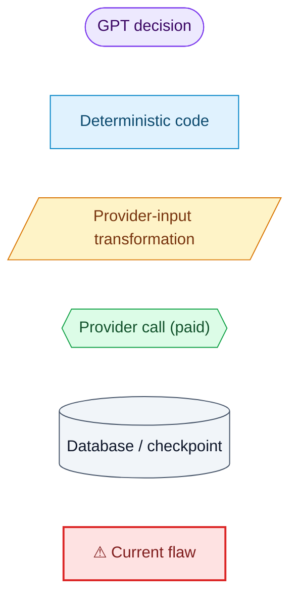

---

## Summary

```
CURRENT PRIMARY DISCOVERY MODE:
  Company-first. For a startup hiring mission the only discovery source is the YC
  directory (memo23/y-combinator-scraper, "companies" mode, isHiring + embedded
  openJobs). Hiring is proven from the YC row's own openJobs; no job source is
  searched. Everything after discovery is per-company: name → LinkedIn identity →
  LinkedIn details → (job search, if needed) → web evidence → GPT evaluation.

WHY LINKEDIN COMPANY SEARCH RUNS:
  Every downstream stage (enrichment, job search, founders) is keyed on a LinkedIn
  company URL, and memo23 returns none (normalizer: linkedin_company_url = null,
  "absent_from_actor_schema"). So each shortlisted company is searched by NAME
  (domain deliberately never sent), with scraperMode "full" hardcoded so the rows
  carry a website, and accepted only if a row's website equals the YC website.
  The YC row already held name + website + YC slug + location for 24/24 searches;
  the search exists to buy a LinkedIn URL, not to learn who the company is.

HOW MANY PLANNER LAYERS CAN INFLUENCE THE RUN:
  12 live for V2 — 7 GPT (chat brain, mission compiler, execution planner,
  execution-plan amendment, discovery planner, mission triage, evidence
  planning/evaluation) + 5 deterministic (Company Brain merge, capability graph,
  strategy validation/compileActorInput, engine clamps + family guard, quota
  controller). 3 more stacks are loaded in run-agent but did not act in the V2
  runs audited (multi-round sourcing, lead strategist, deterministic V1 ladders).

WHERE IDENTITY IS LOST/REBUILT:
  Lost at normalization: memo23 → NormalizedHiringCompany keeps website and derives
  canonical_domain, but the YC slug/url and location are not used as identity keys,
  and there is no LinkedIn field. Rebuilt at company_identity_resolution by a
  name-only LinkedIn search + domain match. Lost again for 8/24 companies that
  already had a domain (0 rows, common-word names, domain variants) — they end
  identity_pending and never reach enrichment/hiring. Not reused across missions:
  fd27bfac re-searched the same 10 companies 1e52d43c resolved a day earlier.

WHERE INPUTS ARE REWRITTEN:
  (1) mission compiler + Company Brain merge (stage, size bound, industries);
  (2) GPT execution planner, then the GPT amendment REPLACES the discovery input
      each pass (fd27bfac slice 1 queries ["B2B SaaS","SaaS software"] min "1+";
      slice 2 no queries, role "marketing", min "5+");
  (3) compileActorInput overwrites maxItems with the execution quota;
  (4) memo23 size clamp, enrichEmails/scrapeOpenJobs forced;
  (5) buildIdentitySearchInput replaces the planner's identity input
      (maxItems 5 → 15, "full", locations added);
  (6) Apify fills unset defaults (batch "All Batches", industries "All industries").

WHERE DUPLICATE SPEND CAN HAPPEN:
  Each slice reopens discovery for replenishment and buys a NEW (rewritten)
  question; each new cohort buys one Company Search per shortlisted company;
  common-word names buy 15 "full" rows that match nothing; identity is reused only
  inside one lineage, so a new mission re-buys the same searches; Firecrawl is
  re-scraped per mission (cache is per intent/TTL).

BIGGEST CURRENT WORKFLOW FLAW:
  Retrieval is company-first and identity-by-name. The run buys a cohort that has
  not been shown to have the signal, then pays per company to rebuild an identity
  the source already half-held, then asks GPT late whether the company fits —
  with several planners able to change the question between slices.
```

---

## 1. Step-by-step: the exact current production path

| # | Step | Module / file | Responsibility | Input | Output | Called by | Owner |
|---|---|---|---|---|---|---|---|
| 1 | User text | `src/lib/pilotChat.ts:59` | invoke `pilot-chat` | `{message, workspace_id, conversation_id?}` | response + message row | Pilot overlay | — |
| 2 | Understand | `pilot-chat/index.ts:1938` `understandRequest` | route the request (`lead_mission`) | message | route + confidence | pilot-chat | **GPT** (chat brain, luna) — not ledgered |
| 3 | Mission compile | `pilot-chat:732/915` `buildMissionCompilerBinding` → `:354` `compileLeadMission` | propose, then validate/repair `LeadMissionV1` | prompt + Brain context + GPT proposal | mission: `required_signals [hiring, "hiring growth marketer"]`, role family `marketing_growth`, `company_profile.stages ["startup"]`, US, count 1 | `buildMissionForPrompt` (`:329`) | **GPT proposes, code decides** |
| 4 | Company Brain merge | `pilot-chat:360` `mergeCompanyBrainIntoMission` | fill open fields from workspace ICP | mission + `company_brain` | merged mission (industries, size bound 150 `brain_advisory`, founder-led) | same | code |
| 5 | Capability graph | `pilot-chat:~362`, `orchestrate:827`, `run-agent:~2177` `buildCapabilityGraph` | entry + schedule + allowed providers (P0 gate enforced for V2) | merged mission | `startup_company_discovery → company_identity_resolution → company_enrichment → hiring_verification → company_brain_qualification → persistence` | pilot-chat, orchestrate, run-agent | code |
| 6 | Preflight / preview | `pilot-chat:369` `buildPaidExecutionPreflight`, `:3102` `buildMissionPreview` | feasibility + first paid call dry run, card text | mission + graph | `workflow_confirmation` card ("~7 credits", "stage:seed (unsupported)") | pilot-chat | code |
| 7 | Start | `orchestrate:827` graph, `:~1706` `v2Route` | 1-step `task_plans` row, V1/V2 decision | approved mission | enqueue body | card "Start Workflow" | code |
| 8 | Enqueue | `enqueue-lead-mission/index.ts:52` | allowlist check, insert queue row | kickoff body | `lead_mission_queue` row (`queued`) | orchestrate | code |
| 9 | Worker slice | `worker/main.ts:103` claim, `:73` bind, `:59/68` `handleRunAgent` in-process, `:135` heartbeat 60s, `:190` release | own one 300 s slice | queue row | task run; release `resumable` / terminal | Railway loop | code |
| 10 | run-agent setup | `run-agent:~2177` graph, `:2742` run recovery, preflight, `:2990` `runCapabilityPlan` | restore lineage, gate spend, start engine | task + mission | engine run | worker | code |
| 11 | Execution planner | `run-agent:3082` `makeGptExecutionPlanner` → `gptExecutionPlanner.ts` | actor + full input JSON per step | graph + mission + catalog | execution plan (first slice only; restored after) | engine | **GPT** `execution_plan` |
| 12 | Discovery strategy | `leadCapabilityEngine.ts:4160` `plannedHere` | take the discovery input FROM the execution plan step | plan step input | strategy | engine | code (GPT-derived) |
| 12b | Discovery planner | `run-agent:3051` `makeGptDiscoveryPlanner` | only when the plan lacks discovery or on replan (`:4995`) | pool summary | new actor/input | engine | **GPT** `discovery_actor_selection` |
| 13 | Actor input compile | `leadDiscoveryStrategy.ts:562` validate, `:319` `compileActorInput` (`:378–386` maxItems), `clampMemo23MaxSize`, `memo23QueryFamily` (`engine:1093`), `hiringActorInputs.ts:326` `compileMemo23YcInput` | legal, bounded memo23 input | strategy + quota | memo23 INPUT | engine | code |
| 14 | YC discovery | `buildInvoker → toolRegistry.runTool("source_with_apify")` | run `memo23/y-combinator-scraper` | INPUT (fd27 slice 1 below) | 10 YC rows with `website`, `slug`, `url`, `allLocations`, `openJobs` | engine | **provider** |
| 15 | Normalize | `hiringActorNormalizers.ts:99` `normalizeMemo23Company`, `:142` `normalizeMemo23OpenJobs` | engine company shape | YC row | `company_name`, `website`, `canonical_domain`, **`linkedin_company_url: null`**, jobs | engine | code |
| 16 | Prequalification | `leadCommercialPrequalification.ts` (`classifyTitle`) | free title/commercial screen | companies + role vocabulary | exclusions `technical_only`, `insufficient_commercial` | engine | code |
| 17 | Triage / shortlist | `engine:3164` `ensureMissionIntelligence` | who gets paid identity | pool | `shortlisted` slice | identity stage | **GPT** `mission_triage` |
| 18 | Identity | `engine:5604` branch, `:1256` `buildIdentitySearchInput`, `companyIdentityResolution.ts:82` | buy a LinkedIn URL per company | shortlisted w/o LinkedIn URL | `identity` verified / ambiguous / unresolved | engine | code |
| 19 | Company Search | `harvestapi/linkedin-company-search` | name → candidate companies | `{searchQuery:name, scraperMode:"full", maxItems:15, locations:["United States"]}` | 0–15 full rows | identity stage | **provider** |
| 20 | Company Details | `engine:5954`, `harvestapi/linkedin-company` | authoritative size/industry/website | ≤5 LinkedIn URLs per call | enriched company | engine | **provider** |
| 21 | Web evidence | web-evidence runner, `webEvidenceStore` | fetch company pages the evaluator asked for | URLs from evidence plan | page text (cached) | evaluation | **GPT** `evidence_planning` picks, Firecrawl fetches |
| 22 | Hiring verification | `engine:6152`, skip via `chainSkips` (`:3871`) | prove hiring | identity-resolved companies | skipped when plan proves hiring from YC `openJobs` (fd27: `skipped_no_input`) else LinkedIn Job Search | engine | code (GPT plan decides skip) |
| 23 | Qualification | `engine:6612` + mission/pool evaluation | verdicts | enriched + evidence | pass / fail / insufficient_evidence | engine | **GPT** `mission_evaluation`, `pool_evaluation`, `grounded_evidence_evaluation` |
| 24 | Amendment | `engine:5252` | rewrite the whole plan after a discovery pass | results summary | new plan (incl. discovery input) | engine | **GPT** `execution_plan_amendment` |
| 25 | Persistence | `engine:8109`, `qualifiedLeadPersistence.ts`, run-agent `buildCheckpoint` (`:4781`) | write results + checkpoint | verdicts, state | `lead_candidates`, `tasks.result`, lineage state | engine / run-agent | code |
| 26 | Workbench | `LeadResultsView.tsx`, `src/lib/workbench/*` | show the run | `tasks.result` + `lead_candidates` | "No qualified leads yet · 10 discovered · 5 identity unresolved · counts disagree" (fd27) | browser | code |

---

## Diagram 1 — Full current Lead V2 end-to-end flow

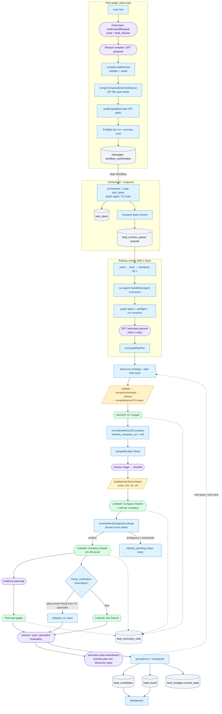

---

## Diagram 2 — Canonical hiring mission flow (live run `fd27bfac`)

Real values from the ledger. Times UTC, 2026-09-15.

```mermaid
flowchart TD
  P["'Find 1 seed-stage B2B SaaS startup in the US<br/>hiring its first growth marketer.'"]:::code
  P --> M["LeadMission: hiring 'hiring growth marketer'<br/>role family marketing_growth · stages [startup] · US · count 1<br/>gap: stage:seed (unsupported)"]:::code
  M --> GR["graph entry startup_company_discovery<br/>(stage = startup) — P0 gate: nothing blocked"]:::code
  GR --> EP(["execution plan (luna)"]):::gpt
  EP --> IN1[/"memo23 slice 1 INPUT<br/>queries ['B2B SaaS','SaaS software'] · regions [United States of America]<br/>industries [B2B] · batch [All Batches] · min '1+' · max '250'<br/>isHiring true · maxItems 10"/]:::xform
  IN1 --> YC1{{"10:50:25 memo23 → 10 YC companies"}}:::prov
  YC1 --> TRI(["triage → 10 shortlisted"]):::gpt
  TRI --> CSS{{"10:51:09–10:51:28 Company Search ×10<br/>Lab0 1 · Gojiberry AI 0 · SafetyKit 1 · PropelAuth 1 · Fuse AI 4<br/>Every 15 · Nango 0 · FurtherAI 1 · Streak 15 · Zentail 1"}}:::prov
  CSS --> IDR["identity: 5 resolved, 5 pending"]:::code
  IDR --> DET{{"10:51:44 Company Details (5 URLs)"}}:::prov
  DET --> FCS{{"10:52:47–10:53:04 Firecrawl ×3 homepages<br/>safetykit.com · fuseai.com · furtherai.com"}}:::prov
  DET --> HVS["hiring_verification: skipped_no_input<br/>3 hiring_verified from YC openJobs"]:::code
  FCS --> EVS(["evaluation: 3 technical_only, 3 insufficient_commercial<br/>0 qualified → PARTIALLY_SATISFIED"]):::gpt
  HVS --> EVS
  EVS --> AMD(["amendment rewrites discovery input"]):::gpt
  EVS --> CK[("checkpoint → queue resumable (attempt 1)")]:::db
  CK --> S2["slice 2 claimed 10:55:56"]:::code
  S2 --> IN2[/"memo23 slice 2 INPUT<br/>NO queries · role 'marketing' · min '5+' · max '250'<br/>industries [B2B] · batch [All Batches] · maxItems 10"/]:::xform
  AMD -.-> IN2
  IN2 --> YC2{{"10:56:01 memo23 → 10 new rows"}}:::prov
  YC2 --> CS2{{"10:56:46–10:56:55 Company Search ×5<br/>Deepgram 2 · SnapMagic 1 · Mux 6 · Tara AI 1 · OneSignal 1"}}:::prov
  CS2 --> DET2{{"10:57:09 Company Details (5 URLs)"}}:::prov
  DET2 --> CAN[("cancel_lead_mission (operator) · worker: lease lost")]:::db
  classDef gpt fill:#ede9fe,stroke:#7c3aed,color:#3b0764
  classDef code fill:#e0f2fe,stroke:#0284c7,color:#0c4a6e
  classDef xform fill:#fef3c7,stroke:#d97706,color:#78350f
  classDef prov fill:#dcfce7,stroke:#16a34a,color:#14532d
  classDef db fill:#f1f5f9,stroke:#475569,color:#0f172a
```

Slice-1 totals: 1 discovery + 10 identity + 1 enrichment + 3 Firecrawl; 20 model calls. Whole run: 19 Apify runs, **$0.2711 billed** (ledger $0.0711).

---

## Diagram 3 — Startup-hiring actor chain (the variant this mission uses)

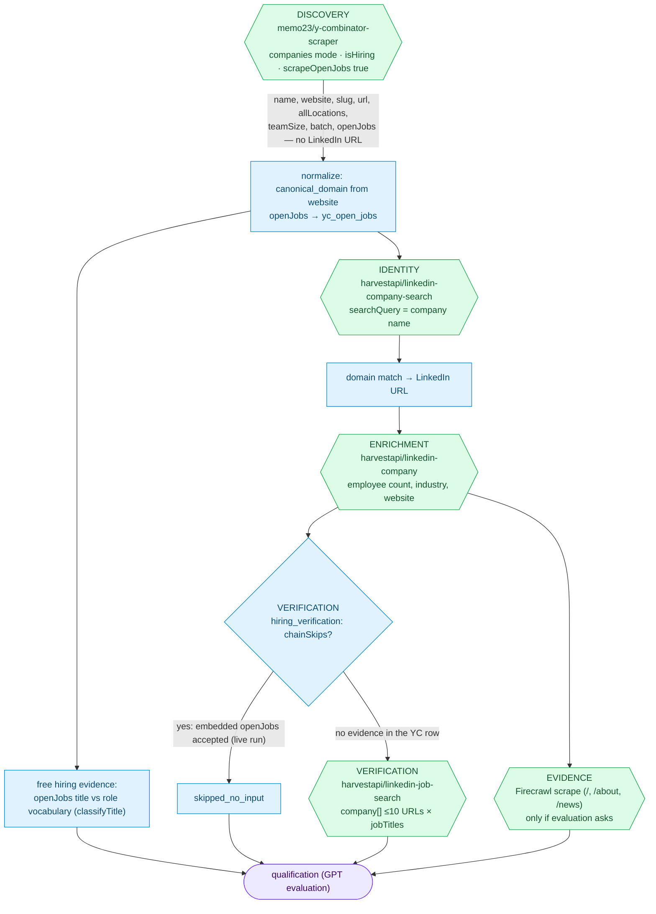

Hiring proof here comes **before** identity (it is in the YC row), yet the pipeline still buys identity + enrichment for every shortlisted company before GPT decides fit.

---

## Diagram 4 — General-hiring actor chain (no startup wording)

Graph entry is `general_company_discovery` (`leadCapabilityGraph.ts` entry branches). No embedded jobs exist, so hiring must be bought per company.

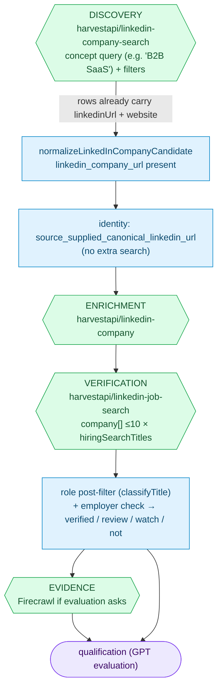

| | Startup hiring (memo23) | General hiring (LinkedIn search) |
|---|---|---|
| Discovery population | YC companies with `isHiring` | any LinkedIn company matching a concept |
| Hiring evidence at discovery | **yes** — `openJobs` in the row | **no** |
| LinkedIn URL at discovery | **no** → name search per company | **yes** → identity free |
| Paid hiring verification | usually skipped (`chainSkips`) | always (Job Search, fuzzy titles → post-filter) |
| Job-first discovery | not available (`job_discovery` not engine-driven; job-board actors have no V2 card) | same |

---

## Diagram 5 — Identity resolution / LinkedIn Company Search

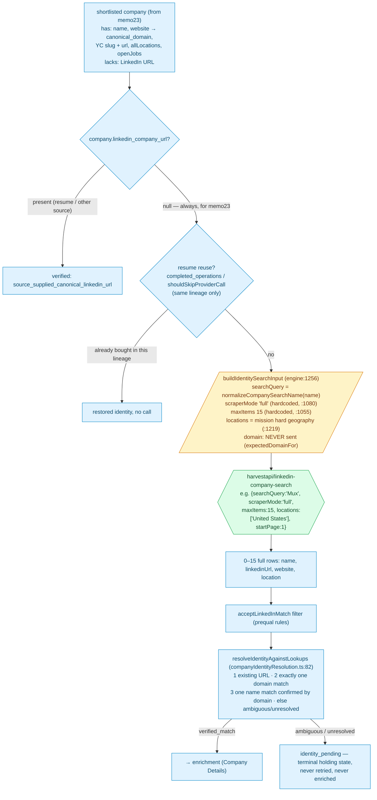

### What identity existed before each Company Search (`1e52d43c`, all 24 calls)

Source actor for every row: **memo23**. Every row had name, YC website, YC slug/url and YC `allLocations`; **none had a LinkedIn URL** (the actor has no such field).

| searchQuery | YC domain before | rows | exact-name rows | row with YC domain | Result |
|---|---|---|---|---|---|
| FurtherAI | furtherai.com | 1 | 1 | 1 | ✅ |
| Tara AI | tara.ai | 1 | 1 | 1 | ✅ |
| Uplane | uplane.com | 2 | 2 | 1 | ✅ |
| Zentail | zentail.com | 1 | 1 | 1 | ✅ |
| Gemnote | gemnote.com | 1 | 1 | 1 | ✅ |
| SafetyKit | safetykit.com | 1 | 1 | 1 | ✅ |
| Pasito | pasito.ai | 3 | 1 | 1 | ✅ |
| 10x Science | 10xscience.com | 15 | 0 | 1 | ✅ (by domain, rank >1) |
| Mason | bymason.com | 15 | 3 | 1 | ✅ (by domain) |
| Semble | sembleai.com | 4 | 3 | 1 | ✅ |
| SnapMagic | snapmagic.com | 1 | 1 | 1 | ✅ |
| Hyperspell | hyperspell.com | 1 | 1 | 1 | ✅ |
| Fuse AI | fuseai.com | 4 | 2 | 1 | ✅ |
| ShipBob | shipbob.com | 1 | 1 | 1 | ✅ |
| Every | every.io | 15 | 2 | 1 | ✅ (rank 6) |
| PropelAuth | propelauth.com | 1 | 1 | 1 | ✅ |
| Nango | nango.dev | **0** | 0 | 0 | ❌ no candidates |
| Gojiberry AI | gojiberry.ai | **0** | 0 | 0 | ❌ no candidates |
| Streak | streak.com | 15 | 0 | 0 | ❌ common word |
| Moss | moss.dev | 15 | 4 | 0 | ❌ common word |
| Lab0 | lab0.ai | 1 | 1 | 0 | ❌ domain mismatch (lab0.com) |
| Manicule | manicule.com | 1 | 0 | 0 | ❌ domain mismatch (manicule.dev) |
| Tasklet | tasklet.ai | 2 | 1 | 0 | ❌ name without domain |
| Nixo | withnixo.com | 2 | 1 | 0 | ❌ name without domain |

**16 / 24 resolved — exactly the 16 whose results contained the YC domain.** The other 8 already had a domain and were lost anyway.

### Answers

| Question | Answer (current code) |
|---|---|
| Was Company Search necessary? | **Only to obtain a LinkedIn URL.** The company's existence, name, website, location and hiring evidence were already in the YC row. It is necessary *because* enrichment (`harvestapi/linkedin-company`), Job Search (`company[]` of LinkedIn URLs) and founders are keyed on the LinkedIn URL. |
| Used because identity was incomplete? | Yes, in the narrow sense: the one missing field is `linkedin_company_url` (`normalizeMemo23Company` sets it `null`, `"absent_from_actor_schema"`). Name + domain were complete. |
| Used because the resolver requires domain/LinkedIn proof? | **Yes.** A bare name never resolves (`resolveIdentityAgainstLookups` rule 3 needs domain confirmation). That is also why `scraperMode` is hardcoded to `full` (short rows have no website) — every search costs full-row price. |
| Did the upstream actor already contain a usable identity field that was ignored? | **Partly.** The YC `website` is used only to *verify* results, never as the *retrieval key* (`expectedDomainFor`: "Never sent to the Actor"). The YC `slug`/`url` and `allLocations` are not used at all. There was no upstream LinkedIn field to use. |
| Why does it run repeatedly? | One search per shortlisted company, **per new cohort**. Each slice reopens discovery (`engine:3983`) with an amended question → new companies → new searches. Reuse is lineage-scoped only, so `fd27bfac` re-bought the **same 10 searches, same inputs** that `1e52d43c` bought the day before (Lab0, Gojiberry AI, SafetyKit, PropelAuth, Fuse AI, Every, Nango, FurtherAI, Streak, Zentail). |

---

## Diagram 6 — Planner ownership

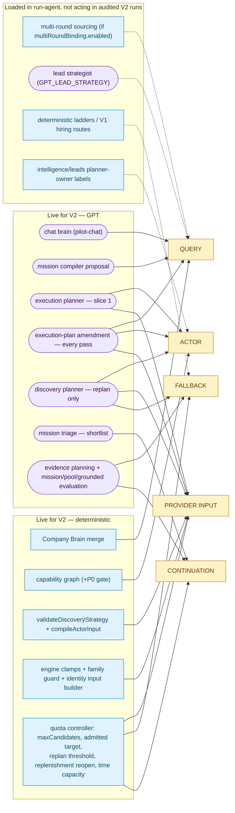

| Layer | Live for V2? | Can change | Evidence |
|---|---|---|---|
| Chat brain (GPT) | yes | route only | pilot-chat `:1938` |
| Mission compiler (GPT + code) | yes | signals, roles, stage, geography, hard constraints | pilot-chat `:354` |
| Company Brain merge | yes | industries, size bound, stage defaults | pilot-chat `:360` |
| Capability graph | yes | entry, allowed providers, schedule | `buildCapabilityGraph` |
| Execution planner (GPT) | yes, slice 1 | actor + full input | `run-agent:3082`; restored from checkpoint later |
| Amendment (GPT) | **yes, every pass** | whole plan incl. discovery input | `engine:5252`; fd27 slice 2 input changed |
| Discovery planner (GPT) | only replan / plan without discovery | actor + input | `engine:4160`, `:4995`; ran 2× in `1e52d43c` |
| Strategy validation / compile | yes | drops, defaults, `maxItems` | `leadDiscoveryStrategy.ts:319/562` |
| Engine clamps / identity builder | yes | size enum, forced fields, identity input | `clampMemo23MaxSize`, `:1256` |
| Quota controller | yes | cohort size, reopen, replan, stop | run-agent quota, `engine:4380/4995/3983` |
| Triage (GPT) | yes | who gets paid identity | `engine:3164` |
| Evaluation (GPT) | yes | verdicts; triggers Firecrawl and amendment input | model roles in ledger |
| Multi-round sourcing | loaded | re-runs engine with round plans | `run-agent:~3965`, flag-gated |
| Lead strategist (GPT) | loaded | title broadening between rounds | `leadStrategy/*`, flag-gated |
| Deterministic ladders | V1 routes | fallbacks | `executeRunAgentCompanyFirstSourcing` `run-agent:5486` |
| Planner-owner labels | yes (label only) | ledger `planner_owner` | every fd27 provider row says `deterministic_registry_v1 / selected_directly` although GPT planned the chain |

---

## Diagram 7 — Provider-input mutation path

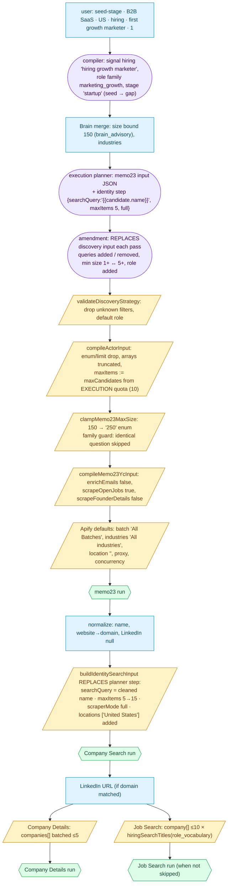

| Field | Introduced | Rewritten / clamped / replaced |
|---|---|---|
| `queries` | execution planner | amendment each pass (fd27: `["B2B SaaS","SaaS software"]` → none; 1e52d43c: 5 versions incl. `[]`) |
| `industries` | Brain merge / planner | amendment may drop → Apify default `"All industries"` |
| `regions` / location | compiler (US hard) | memo23 `regions ["United States of America"]`; identity `locations ["United States"]` added by code |
| employee bounds | Brain merge (150) | `clampMemo23MaxSize` → `"250"`; min `1+`/`5+` flips per amendment |
| `maxItems` | planner | `compileActorInput` → execution quota (10); identity → 15 hardcoded |
| `role` | compiler role family | amendment adds/removes `"marketing"` (fd27 slice 2) |
| hiring signal | compiler | memo23 `isHiring` true + `openJobs`; Job Search `jobTitles` from role vocabulary |
| `scraperMode` | planner (identity) | hardcoded `"full"` |
| company name | memo23 `name` | `normalizeCompanySearchName` → `searchQuery` |
| LinkedIn URL | absent at discovery | produced only by Company Search + domain match |
| domain | memo23 `website` | derived `canonical_domain`; used for match only, never sent |
| `batch` | planner / amendment | Apify default `"All Batches"` when unset |

---

## Diagram 8 — Continuation / resume (current behaviour)

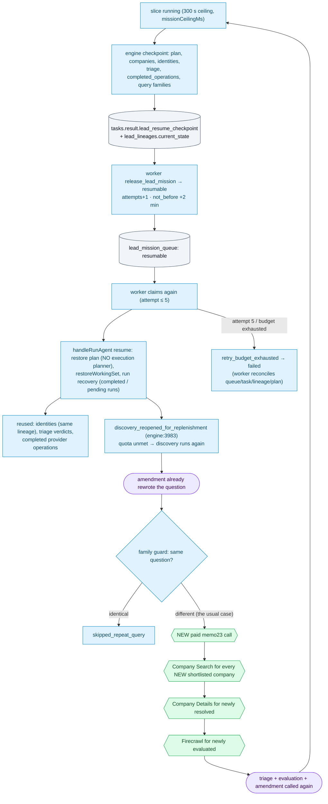

| On resume | Reruns? |
|---|---|
| Execution planner | **no** — plan restored from checkpoint |
| Amendment | **yes** — after every discovery pass |
| Discovery planner | only on thin-pool replan |
| Triage | only for new companies (`triage_reused_from_checkpoint`) |
| memo23 discovery | **yes, new question** each slice while quota unmet (fd27 slice 2; 1e52d43c 4 of 5 slices) |
| Company Search | only for new companies in this lineage; **never shared across lineages** |
| Company Details | new identities only (batch keyed per company) |
| Firecrawl | new evaluation targets (page cache per intent/TTL) |
| Evaluation | yes |

---

## Diagram 9 — Persistence / data flow

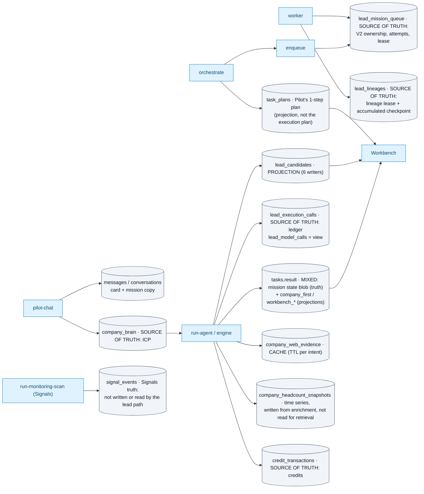

| Table | Enters at | Writer(s) | Truth or projection |
|---|---|---|---|
| `tasks` | orchestrate/worker create; run-agent/engine update | run-agent, worker, sweepers, continue-workflow, 10+ modules | **both** — state blob + Workbench projections |
| `task_plans` | Start | orchestrate, worker reconcile | projection of Pilot's plan |
| `lead_lineages` | first slice | `lineageLease.ts`, worker | truth (lease + `current_state`) |
| `lead_mission_queue` | enqueue | enqueue, worker RPCs | truth (ownership/scheduling) |
| `lead_execution_calls` | every provider/model/stage call | ledger writer (model rows flushed at slice end) | truth for what was called; **not** for what was billed |
| `lead_candidates` | persistence | 6 writers | projection |
| `company_web_evidence` | Firecrawl | `webEvidenceStore` | cache |
| `company_headcount_snapshots` | enrichment | run-agent | truth for history; unused by retrieval |
| `company_brain` | Pilot/orchestrate read | Brain setup | truth (input) |
| `signal_events` | — (Signals only) | monitoring | not part of this flow |

---

## Diagram 10 — Cost / ledger flow

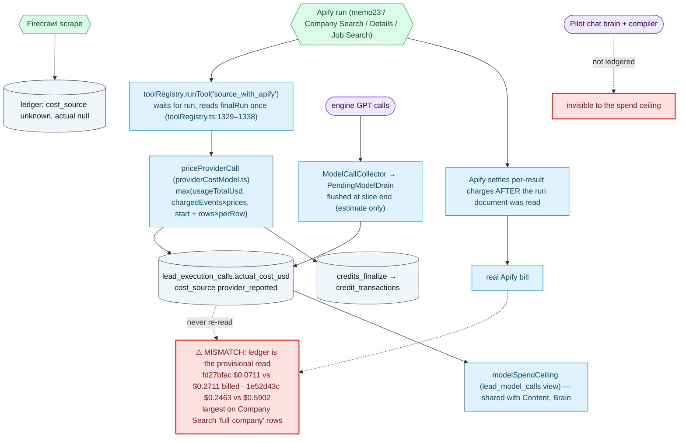

---

## Diagram 11 — Current flaws overlay

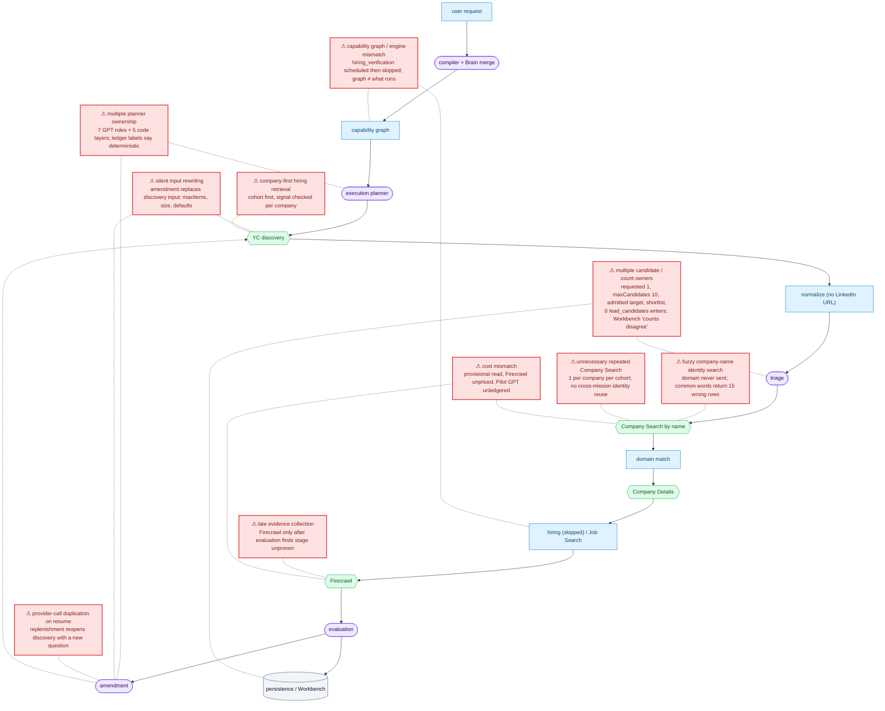

| Flaw | Where it lives | Evidence |
|---|---|---|
| Multiple planner ownership | run-agent `:3051/:3082`, engine `:5252`, `:3164` | 8 GPT roles in fd27 ledger; provider rows labelled `deterministic_registry_v1` |
| Silent input rewriting | engine `:5252`, `leadDiscoveryStrategy.ts:378`, clamps | fd27 slice 1 vs slice 2 memo23 inputs |
| Fuzzy name identity | engine `:1256`, `leadCommercialPrequalification.ts:451` | Every/Streak/Moss 15 rows; Nango/Gojiberry 0 |
| Repeated Company Search | engine `:5604`, lineage-scoped reuse | fd27 re-bought 1e52d43c's 10 searches |
| Duplication on resume | engine `:3983`, `:4995` | 4 new discovery questions in 1e52d43c |
| Graph / engine mismatch | graph schedules, engine `:3871` skips | fd27 `hiring_verification: skipped_no_input` |
| Company-first hiring | graph entry `startup_company_discovery` | no job-first route in V2 |
| Late evidence | Firecrawl after evaluation | fd27 3 scrapes after enrichment; 1e52d43c 12 for seed stage |
| Cost mismatch | `toolRegistry.ts:1329`, `providerCostModel.ts` | $0.0711 vs $0.2711 |
| Count owners | run-agent quota, engine `:4380`, 6 writers | Workbench "Run details · counts disagree" on fd27 |
