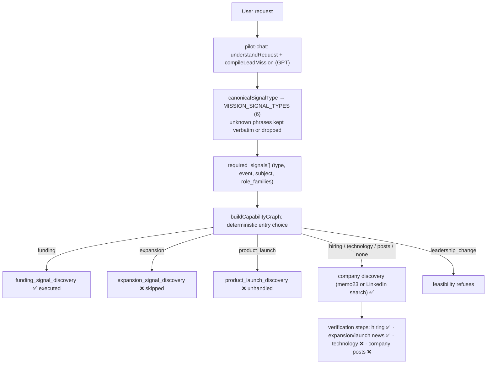
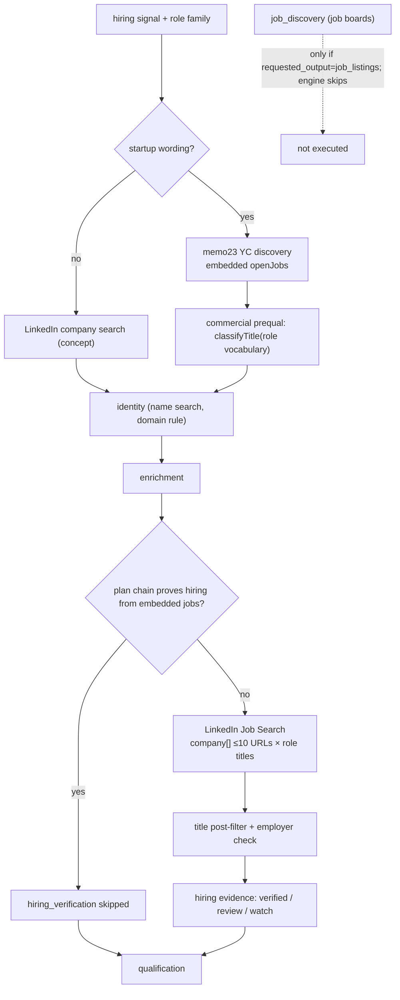
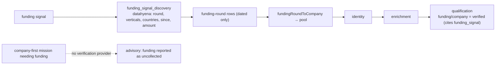
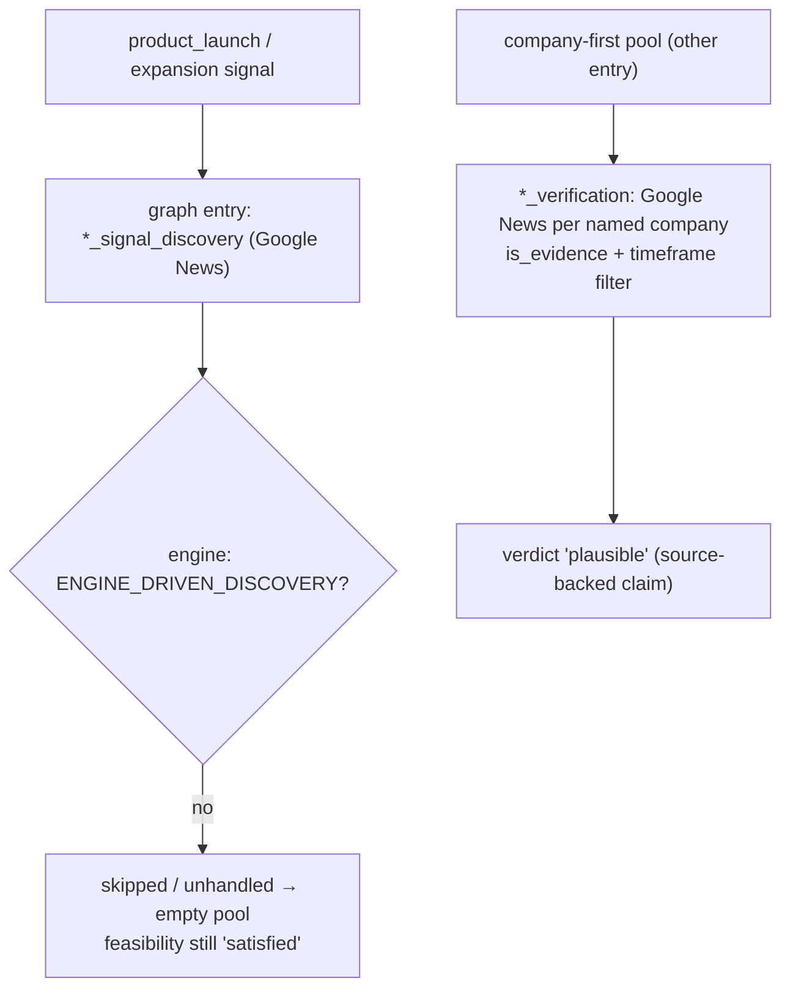
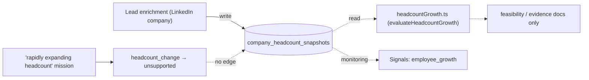
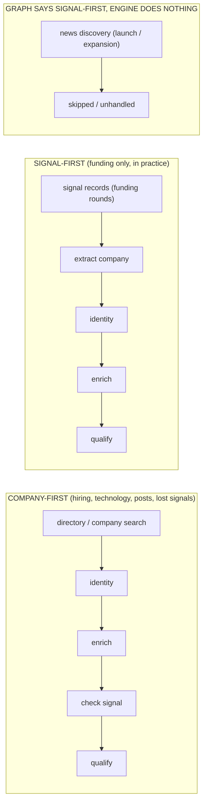
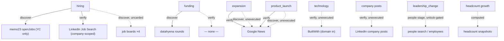
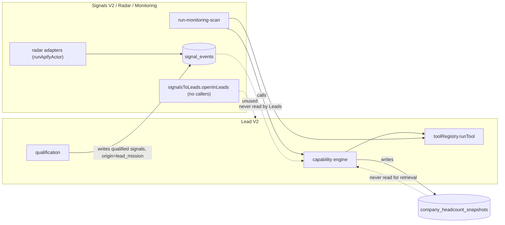

# Lead V2 — Current Signal Targeting Audit

**Status:** read-only. No code, deploys, provider calls or migrations. Evidence: source at `125f0cfa`, plus a **local, provider-free execution of the real functions** — `parseLeadMissionDeterministic`, `buildCapabilityGraph`, `selectResearchPlaybooks` and `assessRequestFeasibility` — for each example request, and for one mission per signal type injected the way the GPT compiler expresses it. Production missions are compiled by GPT (`leadMissionCompiler.ts`), so field values can differ from the deterministic parse; the **graph, engine and executor behaviour shown here are exact**.

---

# Executive Summary

Lead V2 recognises six signal types. **Only two produce leads in practice, and only one is retrieved signal-first.**

| Signal | What actually happens today |
|---|---|
| **Hiring** | **Company-first.** Discover companies (LinkedIn company search, or memo23 for startups), then prove hiring from memo23's embedded `openJobs` or a company-scoped LinkedIn Job Search. No job-first discovery exists in V2; the graph itself says so in a routing advisory. |
| **Funding** | **Signal-first — the only one.** Enters at `funding_signal_discovery` (datahyena funding rounds), extracts the company, resolves identity, enriches, and credits the round as evidence in qualification. Discovery-only: it cannot verify funding for a company already in hand. |
| **Product launch / expansion** | **Signal-first in the graph, dead in the engine.** The graph enters at a Google News discovery step that the engine does not execute (`expansion`: explicit skip; `product_launch`: falls through to `unhandled capability`). The pool is empty, no error is raised, feasibility reports `satisfied`. |
| **Technology** | **Company-first in the graph, unexecuted in the engine.** `technology_verification` (BuiltWith) is scheduled, but the engine has no executor, so it ends as `unhandled capability`. BuiltWith cannot search by technology anyway. |
| **Leadership change** | **Unsupported.** No capability; feasibility refuses the mission (`no_requirement_provable`). |
| **Headcount growth** | **Unsupported for retrieval.** Snapshots are *written* by enrichment, never *read* for retrieval; `headcount_change` has no evidence source. |
| **News / new office / social activity** | Not in the mission vocabulary. "Opened a new office" and "LinkedIn activity" parse to **no signal at all** and silently become plain company-profile searches. |

**The vocabulary is not unified.** At least six independent vocabularies name signals (mission types, signal events, playbook strategies, capability ids, actor evidence events, Signals V2 types); "funding" is `funding` in one, `funding_signal` in another, `recent_funding` in Signals V2.

**Natural first-source routing does not exist**, except for funding. Hiring — the most common anchor — starts from companies because no job-discovery actor has a verified schema card, so the system cannot start from job postings.

---

# Signal Vocabulary

Every place a signal is named today:

| # | Vocabulary | File | Members | Used by |
|---|---|---|---|---|
| 1 | `MISSION_SIGNAL_TYPES` | `leadMission.ts:249` | `hiring, funding, expansion, leadership_change, technology, product_launch` | mission `required_signals[].type` |
| 2 | `SIGNAL_EVENTS` | `missionSignalDescriptor.ts:61` | `hiring, funding, expansion, product_launch, technology, leadership_change, post, comment, headcount_change` | `required_signals[].event`, feasibility, graph |
| 3 | Signal subjects | `missionSignalDescriptor.ts` | `company, leadership, employee, …` | graph (company vs leadership posts) |
| 4 | Capability ids | `leadCapabilityGraph.ts` | `funding_signal_discovery, expansion_signal_discovery, product_launch_discovery, hiring_verification, expansion_signal_verification, product_launch_verification, technology_verification, company_post_verification, job_discovery, …` | graph, planner, engine |
| 5 | Artifact names | `leadCapabilityGraph.ts` `produces` | `funding_signal, expansion_signal, launch_signal, hiring_evidence, technology_evidence, company_activity_evidence, …` | feasibility `CLAIM_TO_EVENT` |
| 6 | Actor evidence events | `actorEvidenceCapability.ts` | `hiring, funding, post, comment, expansion, product_launch, technology, leadership_change` × `power: discovery \| verification` | feasibility, planner briefing |
| 7 | Research playbooks | `leadResearchPlaybooks.ts` | strategies `hiring, funding, supplied_company, social, news`; roles `discovery_shape` (hiring, funding) vs `qualifier` (others) | playbook selection/authorization |
| 8 | Source strategies | `leadMissionCompiler.ts` `SOURCE_STRATEGY_GUIDE` | `startup_cohort_first, job_signal_first, company_profile_first, known_companies_only` | GPT compiler directives |
| 9 | **Signals V2 `SignalType`** | `signalEvent.ts:44–136` | growth: `recent_funding, employee_growth, market_expansion, geographic_expansion`; GTM: `sales_hiring, revops_hiring, growth_hiring, new_revenue_leader, outbound_initiative, positioning_change`; product: `product_launch, major_release, new_integration, category_expansion`; founder intent (5); engagement (6); market: `competitor_activity, market_problem_discussion`; risk (5) | `signal_events`, radar, monitoring |
| 10 | Unrepresentable evidence | `leadMission.ts` `UNREPRESENTABLE_EVIDENCE` | reviews, sentiment, web traffic, financials | compiler "recorded miss" notes |

**Does "funding" mean the same thing everywhere? No.** It is `funding` (mission type, event), `funding_signal` (artifact), `funding_signal_discovery` (capability), `funding` strategy (playbook) and `recent_funding` (Signals V2). "Hiring" fragments further in Signals V2 into `sales_hiring / revops_hiring / growth_hiring`. "Leadership change" is `leadership_change` in Leads and `new_revenue_leader` / `role_changed` / `person_left_company` in Signals. `headcount_change` (event) ≈ `employee_growth` (Signals) but `expansion` (mission) ≈ `market_expansion` / `geographic_expansion`. There is an alignment test (`signalVocabularyAlignment.test.ts`) that pins vocabularies 1 and 7 to each other; nothing aligns Leads with Signals V2.

Metadata drift found while auditing: the `SIGNAL_RESEARCH_ROLES` comment says `expansion_signal_discovery` "points at `apify_linkedin_company_search`"; the registry actually lists `apify_google_news`.

---

# Signal Support Matrix

| Signal | Recognized by compiler? | Runnable capability? | Discovery source | Verification source | Provider/actor | Wired to V2 execution? | Status |
|---|---|---|---|---|---|---|---|
| **hiring** | yes | yes | company discovery (memo23 embedded jobs / LinkedIn company search) | `hiring_verification` | memo23 `openJobs`; `harvestapi/linkedin-job-search` (company-scoped) | **yes** | **PARTIALLY SUPPORTED** (verification only; no job-first discovery) |
| **funding** | yes | yes | `funding_signal_discovery` | none (discovery-only) | `datahyena/company-funding-rounds` | **yes** (engine-driven discovery) | **PARTIALLY SUPPORTED** (discovery yes, verification no) |
| **expansion** | yes | discovery: **no** (skipped); verification: yes | `expansion_signal_discovery` → **skipped** | `expansion_signal_verification` | Google News (+ company posts listed) | verification only | **PARTIALLY SUPPORTED** (verification on a company-first pool only) |
| **product_launch** | yes | discovery: **no** (`unhandled capability`); verification: yes | `product_launch_discovery` → **unhandled** | `product_launch_verification` | Google News (+ company posts listed) | verification only | **PARTIALLY SUPPORTED** (same) |
| **technology** | yes | **no** (`unhandled capability`) | none (BuiltWith cannot search) | `technology_verification` | `builtwith/…-technology-scraper` (domain in, tech out) | **no** | **PROVIDER EXISTS BUT NOT WIRED INTO LEADS** |
| **leadership_change** | yes | no | none | none | people actors exist (founder_discovery, unlock-gated) | no | **NAME/SCHEMA EXISTS BUT NO RUNNABLE SOURCE** |
| **headcount_growth** (`headcount_change`) | event only | no | none | none | computed from `company_headcount_snapshots` (`headcountGrowth.ts`) | snapshots written, never read | **ONLY AVAILABLE THROUGH SIGNALS INFRA** (and not even there as retrieval) |
| **news** (generic) | no (not a type) | — | — | — | Google News actor | only as expansion/launch verification | **NOT SUPPORTED** as a signal |
| **social activity / company posts** | `post` event (company subject) | verification scheduled (`company_post_verification`) — **no executor** | none | LinkedIn company posts | `harvestapi/linkedin-company-posts` | **no** (`unhandled capability`) | **PROVIDER EXISTS BUT NOT WIRED INTO LEADS** |
| **leadership posts** | `post` (leadership subject) | no | post search (discovery) exists in catalog | profile posts | `harvestapi/linkedin-post-search`, `-profile-posts` | no; feasibility refuses | **PROVIDER EXISTS BUT NOT WIRED INTO LEADS** |
| **hiring spike** | no | no | — | — | Signals V2 `*_hiring` types | no | **ONLY AVAILABLE THROUGH SIGNALS INFRA** |
| **team composition** | no | no (people stage) | — | `apify_linkedin_company_employees` | unlock-gated founder discovery | only post-qualification, on unlock | **PROVIDER EXISTS BUT NOT WIRED INTO LEADS** (for this purpose) |
| **new office / geographic expansion** | no (parses to nothing) | — | — | — | Google News could serve | no | **NOT SUPPORTED** (silently dropped) |
| **competitor activity** | no | — | — | — | radar competitor intelligence | Signals only | **ONLY AVAILABLE THROUGH SIGNALS INFRA** |

---

# Current Request Interpretation

Real output of the production functions, run locally (deterministic parse; the graph, playbook and feasibility results are what production computes from those fields).

| # | Request | `required_signals` parsed | Graph entry | Scheduled steps | Playbook | Feasibility | What the engine actually does |
|---|---|---|---|---|---|---|---|
| A | US B2B SaaS companies hiring growth marketers | `hiring` (`marketing_growth`) | `general_company_discovery` | company search → identity → enrichment → **hiring_verification** (job search) → qualify | `hiring` runnable | ok | company-first; LinkedIn company search by concept, then company-scoped job search. Advisory: *"hiring-first … no registered Actor can DISCOVER open job postings across employers"* |
| A′ | … **startups** hiring growth marketers | `hiring` | `startup_company_discovery` | memo23 → identity → enrichment → hiring_verification → qualify | `hiring` | ok | memo23 with embedded `openJobs`; paid job search skipped when the plan chain proves hiring (`chainSkips`) — the audited runs |
| B | … recently raised funding | `funding` | **`funding_signal_discovery`** | datahyena → identity → enrichment → qualify | `funding` runnable | ok | **signal-first**: funding rounds → companies; the round is credited as `funding/company` evidence |
| C | AI companies that launched a new product recently | `product_launch` | **`product_launch_discovery`** | Google News → identity → enrichment → product_launch_verification → qualify | **none runnable** | ok (`satisfied`) | entry step is **not engine-driven → `unhandled capability`** → empty pool → nothing downstream |
| D | SaaS companies rapidly expanding headcount | `headcount_change` + `expansion` | `expansion_signal_discovery` | Google News → … → expansion_signal_verification → qualify | none | **gap**: headcount unsupported | entry **explicitly skipped** ("not yet engine-driven; partial result") → empty pool |
| E | Companies using Snowflake | `technology` | `general_company_discovery` | company search → identity → enrichment → **technology_verification** (BuiltWith) → qualify | none | ok (`satisfied`) | company search runs on the concept; technology step → **`unhandled capability`**; Snowflake is never checked |
| F | Companies where a new VP Sales was hired | `leadership_change` (subject leadership) | `general_company_discovery` | no signal step | none | **refused** (`no_requirement_provable`) | blocked before spend |
| G | Companies that recently opened a new office in the US | **none** | `general_company_discovery` | company search → identity → enrichment → qualify | none | ok | signal **silently lost**; a generic US company search |
| H | Companies with strong recent LinkedIn activity | **none** | `general_company_discovery` | same | none | ok | signal **silently lost** |

With the GPT compiler, G and H might emit `expansion` and `post`/company. The graph then produces: `expansion` → skipped Google News discovery (as D); `post`/company → company-first + `company_post_verification`, which has no executor (as E). Either way no signal-driven lead results.

**Path for every request (common skeleton):**
```
user text → pilot-chat understandRequest (Lovable/Gemini) → compileLeadMission (OpenAI)
→ required_signals + company_profile + hard_constraints → mergeCompanyBrainIntoMission
→ orchestrate buildCapabilityGraph (entry + steps) → V2 queue → run-agent
→ selectResearchPlaybooks (authorization applies to hiring-only missions)
→ gptExecutionPlanner (chooses actors per scheduled capability) → engine executes ENGINE_DRIVEN capabilities
→ normalizers → evidence registry → qualification (proven-verdict rules per signal)
```

---

# Hiring

**Order of operations today (V2):**

1. **Mission:** `required_signals: [{ type: "hiring", role_families: [...] }]`, `required_signal_terms`. The compiler is told: *"Prefer 'embedded_hiring_evidence' over 'external_hiring_verification' whenever hiring evidence is needed at all"* (`leadMissionCompiler.ts:350`), and for `job_signal_first`: *"discovery still has to find the EMPLOYER — prefer a source carrying embedded hiring evidence, or plan discovery first and hiring verification second"* (`:229`).
2. **Graph entry:** startup wording → `startup_company_discovery` (memo23, whose embedded `openJobs` covers the YC population); otherwise `general_company_discovery` (LinkedIn company search). **`job_discovery` is only entered when `requested_output === "job_listings"`** (`leadCapabilityGraph.ts:811`) — and the engine skips it (`skipped_no_input`, "not yet engine-driven").
3. **Hiring verification is added** when the discovery provider's evidence does not cover hiring for the population (`evidenceCoversPopulation`, `:950–966`). For YC cohorts it is covered, so the paid step is scheduled but skipped when the execution plan proves hiring from memo23 (`chainSkips`, engine `:6152`).
4. **Role family:** `buildQualificationContext` → `role_vocabulary` from `role_families` + `required_signal_terms` → `hiringSearchTitles` (engine `:6170`).
5. **LinkedIn Job Search** (`harvestapi/linkedin-job-search`) is called only for **identity-resolved companies** (`targets = companies.filter(c => c.identity && identityIsActionable(c.identity))`), batched ≤ 10 companies per call (`compileHarvestJobSearchInput`: `company[]` required, max 10, `jobTitles[]` required). Its compiler warns: *"jobTitles matching is FUZZY — a deterministic title post-filter is mandatory"* and *"the posting company may not be the employer"*.
6. **Post-filter:** title classification against the mission vocabulary (`classifyTitle`), employer check (aggregator evidence), outcome buckets `verified / review / watch / notVerified` (`hiring_verification_complete`).
7. **Proof of hiring** = a named open job whose title matches the mission's role vocabulary, attached to the verified employer (embedded `openJobs` from memo23, or a job-search row for that company). A generic `isHiring: true` flag is not proof.
8. **Qualification:** the eligibility gate admits companies with `hiring_verified`, `hiring_jobs`, or a hiring assessment that reaches the Brain (engine `:6703–6715`).

**Can it start from job records? No — not in V2.** The graph's own advisory states it: *"No registered Actor can DISCOVER open job postings across employers: the four job-board Actors have no verified schema card … and `apify_linkedin_job_search` is company-scoped by contract."* The four job-board keys (`apify_jobs`, `apify_linkedin_jobs_crawlworks`, `apify_indeed_jobs_automation_lab`, `apify_glassdoor_jobs`) exist only under `job_discovery`.

**Job-first still exists in V1 only:** `hiringRouteContract.ts` routes `startup_company_first | general_company_first | broad_job_fallback`, where `broad_job_fallback` requires a structured reason (`primary_source_no_candidates`, `insufficient_hiring_matches`, …) and runs the V1 quota loop (`executeRunAgentCompanyFirstSourcing`, `runTool("source_with_apify")`).

Implication for "job-first when hiring is the anchor": the missing piece is not the engine shape — it is **a carded job-discovery actor** (verified schema + compiler + normalizer + employer extraction) and making `job_discovery` engine-driven.

---

# Funding

| Question | Answer (code) |
|---|---|
| Reachable from V2? | **Yes.** `funding_signal_discovery` is supported and in `ENGINE_DRIVEN_DISCOVERY` (engine `:8957`). Graph enters there when the mission has a funding signal and no conflicting strategy (`leadCapabilityGraph.ts:~883`). |
| Can the execution planner select it? | Yes — it is the scheduled discovery capability; the planner chooses among that capability's providers (only datahyena). |
| Can it discover companies? | **Yes** — one row per funding event → `fundingRoundToCompany` → `addCompany` (engine `:4720–4758`). Rows without a date are refused (`is_evidence`). |
| Can it verify funding for a specific company? | **No.** No company/URL input; the registry comment: *"DISCOVERY ONLY … `funding_verification` is deliberately absent from the graph."* The graph emits an advisory when a funding mission is routed any other way (`:1210`). |
| Input | `compileDatahyenaFundingInput`: `round` (stage enum), `verticals`, `countries`, `employeeBuckets`, `since` (ISO date), `minAmountUsd/maxAmountUsd`, `maxItems` ≤ 500 (billed ~$0.045/record). |
| Output | company name/domain/LinkedIn, `round_stage`, `amount_usd`, `announced_date`, investors, source articles. |
| Compiler awareness | yes — `funding` is a mission type and playbook (`discovery_shape`). |
| Qualification | **yes** — `provenVerdicts["funding/company"] = verified` citing the `funding_signal` evidence items, only if `funding_signal_discovery` completed (engine `:7690–7703`); the eligibility gate admits companies found by a round (`roundByCompanyKey`). |

So funding **does drive retrieval** — but only as an *entry*. A mission that needs funding **plus** a company-first entry (e.g. "YC startups that raised a seed round", which would enter at startup discovery) cannot prove funding: the graph advises it will be reported as uncollected. This matters directly for the audited seed-stage missions.

---

# Product Launch / News

- `product_launch_discovery` and `expansion_signal_discovery` exist in the registry with `apify_google_news` and are **supported**, so the graph **enters** at them.
- The engine's discovery executor handles only `ENGINE_DRIVEN_DISCOVERY` (startup, general, funding). `expansion_signal_discovery` is explicitly skipped (`leadCapabilityEngine.ts:5379–5384`, *"capability is not yet engine-driven; the mission reports a partial result"*). `product_launch_discovery` is not even in that skip list — it reaches the final branch: `finish(cap, "skipped_no_input", …, "unhandled capability: …")` (`:8114`).
- **Verification works**: `ENGINE_DRIVEN_SIGNAL_VERIFICATION` runs `expansion_signal_verification` / `product_launch_verification` with Google News over shortlisted, identity-resolved companies, filtering articles by `is_evidence` and timeframe (`:5407–5485`), producing `plausible` verdicts in qualification.
- LinkedIn company posts are listed as a provider for these verifications, but the executor calls only `apify_google_news`.
- `apify_linkedin_post_search` (the one actor with post *discovery* power) is not in any lead capability.
- Playbooks `news` and `social` have `discovery_capabilities: []`, so no playbook is runnable — but playbook authorization only gates hiring-only missions (`leadPaidExecutionPreflight.ts:432`: every other mission returns `applies: false`), so nothing blocks the run.

**Answer:** *"Find AI companies that launched a new product recently"* cannot start from launch evidence today. The graph routes it signal-first; the engine silently executes nothing at the entry; the mission ends with an empty pool while feasibility reported the requirement `satisfied`. Product-launch evidence is usable only as **verification** on a company-first pool.

---

# Headcount Growth / Hiring Spike

- **Write side (lead path):** enrichment records each company's employee count as a `company_headcount_snapshots` row (engine `:6065`, run-agent `:4647–4663`).
- **Read side:** `headcountGrowth.ts` (`evaluateHeadcountGrowth`, `GtmGrowthInput`) is imported only by `headcountSnapshotStore.ts`, `requestFeasibility.ts` and `actorEvidenceCapability.ts` — **no retrieval or qualification path reads snapshots.**
- **Vocabulary:** `headcount_change` is an event but not a mission type; feasibility grades it `unsupported` (*"headcount growth is COMPUTED, not retrieved … a company measured once has a size"*, `actorEvidenceCapability.ts:498`).
- **Hiring spike:** exists only as Signals V2 types (`sales_hiring`, `growth_hiring`, …) and monitoring; Leads cannot query it.

**Integration boundary:** Leads → snapshots (write) → *nothing*. Signals monitoring → snapshots/headcount growth → `signal_events`. Lead V2 never reads either for retrieval.

---

# Technology

- `technology_verification` (BuiltWith) is scheduled whenever a technology signal is present (`leadCapabilityGraph.ts:1025`) — **but the engine has no executor**; it ends at `unhandled capability` (`:8114`).
- `compileBuiltWithInput` requires `startDomains` (root domains): *"this Actor cannot search"*; and *"a detection is present-tense: it carries no adoption date"*.
- **Discovery capability: none.** "Find companies using Snowflake" becomes a general company search (LinkedIn company search on the concept — a name matcher, which the catalog marks `not_for` concept search) and the technology is never checked.
- **Verification capability: exists in the catalog, not in the engine.**

---

# Leadership / People Signals

| Piece | Exists | Connected to leadership-change retrieval? |
|---|---|---|
| `leadership_change` mission type | yes | no capability produces it |
| `apify_people_search` (LinkedIn profile search) | yes, `power: discovery` for leadership_change | only under `founder_discovery` (post-qualification, unlock-gated) |
| `apify_linkedin_company_employees` | yes, `discovery` | same |
| `apify_linkedin_profile_enrichment` | yes, `verification` | contact enrichment only |
| `apify_linkedin_profile_posts` / `post_search` | yes | not in any lead capability |
| Google News | yes | not used for leadership |
| Signals V2 `new_revenue_leader`, `role_changed`, `person_left_company` | yes | Signals only |

People stages are never automatic (`PEOPLE_STAGES` → "only ever OFFERED"). Feasibility refuses F (`no_requirement_provable`). **Not supported.**

---

# Current Company-First vs Signal-First Behaviour

| Signal | Current retrieval mode | First source called | Why |
|---|---|---|---|
| hiring | **COMPANY-FIRST** | memo23 (startups) or LinkedIn company search | no carded job-discovery actor; job search is company-scoped; `job_discovery` not engine-driven |
| funding | **SIGNAL-FIRST** | datahyena funding rounds | engine-driven discovery; discovery-only provider |
| product_launch | graph: signal-first → engine: **nothing** | none (entry unhandled) | `product_launch_discovery` not engine-driven |
| expansion | graph: signal-first → engine: **nothing** | none (entry skipped) | `expansion_signal_discovery` explicitly skipped |
| technology | **COMPANY-FIRST**, signal unchecked | LinkedIn company search | BuiltWith cannot search; verification executor missing |
| leadership_change | **UNSUPPORTED** (refused) | none | no capability |
| headcount growth | **UNSUPPORTED** | none | computed metric, never read for retrieval |
| company posts / social | **COMPANY-FIRST**, signal unchecked | LinkedIn company search | `company_post_verification` has no executor |
| new office / news | signal lost → **COMPANY-FIRST** | LinkedIn company search | not in vocabulary |

---

# Provider Routing

| Signal | Natural first source | Current first source | Mismatch |
|---|---|---|---|
| hiring | job boards / LinkedIn job *discovery* | company directory/search | **yes** — jobs are only a verification step |
| funding | funding-round index | funding-round index (datahyena) | **no** |
| product launch | news / company posts / launch sites | none executed | **yes** — entry dead |
| expansion / new office | news, company posts, office announcements | none executed (expansion) / company search (office) | **yes** |
| leadership change | people/role-change data, news | none | **yes** |
| headcount growth | stored snapshots / headcount series | none | **yes** — data exists, never read |
| technology | technology-install index (reverse lookup) | company search | **yes** — no reverse-lookup provider |
| social activity | post search | company search | **yes** |
| company profile / ICP | company directories/search | company directories/search | no |

**Natural first-source routing exists only for funding.**

---

# Planner Prompt Behaviour

No planner is told "if hiring, start from jobs" or "if funding, start from funding events". Routing is decided by **the capability graph before any model runs**; the models then choose actors within the capabilities the graph scheduled.

| Prompt | Relevant text | Effect |
|---|---|---|
| Shared briefing (`agentoryBriefing.ts` `DISCOVERY_MODES`) | *"SIGNAL DISCOVERY — The request is defined by an event ("currently hiring engineers", "recently funded"). Needs an Actor carrying that signal, or a separate verification step. … "AI startups hiring software engineers" is a CONCEPT cohort filtered by a SIGNAL. Decide whether one Actor covers both, or whether one discovers and another verifies."* | describes the choice; mandates no source |
| Execution planner (`gptExecutionPlanner.ts` `STAGE_RULES`) | *"Use ONLY capabilities from authorised_capabilities … For each step use ONLY an actor listed under THAT capability … If the authorised capabilities and their actors cannot establish what this request needs, return an empty steps list."* | can only pick providers inside the graph's capabilities — it **cannot** re-route hiring to job discovery |
| Discovery planner (`gptDiscoveryPlanner.ts` `STAGE_RULES`) | *"Use ONLY actor_key values listed in available_actors … Read best_for, not_for and known_defects … An actor whose input_entities do not include 'query' CANNOT discover."* | capability-list inference only |
| Amendment | same execution-planner prompt + a results summary | same limits |
| Strategy planner (`leadStrategy/strategist.ts`) | receives `hiring_role_intent` (requested titles) | broadens **role titles** between rounds; no source routing |
| Mission compiler (`leadMissionCompiler.ts`) | `SOURCE_STRATEGY_GUIDE`: `job_signal_first` = *"discovery still has to find the EMPLOYER — prefer a source carrying embedded hiring evidence, or plan discovery first and hiring verification second"*; *"Prefer 'embedded_hiring_evidence' over 'external_hiring_verification'"*; *"You do NOT choose data providers"* | **explicitly steers hiring to company-first** |

So the models are not the obstacle: the graph decides entry deterministically, and the compiler's guidance actively recommends company-first for hiring.

---

# Capability Graph

| Signal | Capability | Providers | Requires | Produces | allowed_next | evidence_required | Engine executes? |
|---|---|---|---|---|---|---|---|
| hiring (discovery) | `job_discovery` | `apify_jobs`, `apify_linkedin_jobs_crawlworks`, `apify_indeed_jobs_automation_lab`, `apify_glassdoor_jobs` | requested_output = job_listings | `job_posting` | `job_deduplication`, `company_identity_resolution` | job_title, company_name | **no** (skipped) |
| hiring (verification) | `hiring_verification` | `apify_linkedin_job_search` | company_identity, hiring signal | `hiring_evidence` | `company_brain_qualification` | job_title, posted_date | **yes** |
| funding | `funding_signal_discovery` | `apify_funding_rounds_datahyena` | funding signal | `company_candidate`, `funding_signal` | `company_identity_resolution` | company_name, funding_event, announced_date | **yes** |
| expansion (discovery) | `expansion_signal_discovery` | `apify_google_news` | expansion signal | `company_candidate`, `expansion_signal` | identity | company_name, expansion_statement, published_at, source_url | **no** (skipped) |
| expansion (verification) | `expansion_signal_verification` | news, company posts | identity, expansion | `expansion_evidence` | qualification | statement, published_at, url | **yes** (news only) |
| product launch (discovery) | `product_launch_discovery` | `apify_google_news` | product_launch signal | `company_candidate`, `launch_signal` | identity | company_name, launch_statement, published_at, url | **no** (unhandled) |
| product launch (verification) | `product_launch_verification` | news, company posts | identity, product_launch | `launch_evidence` | qualification | statement, published_at, url | **yes** (news only) |
| technology | `technology_verification` | `apify_builtwith_technology` | company_domain, technology | `technology_evidence` | qualification | domain, technologies | **no** (unhandled) |
| company posts | `company_post_verification` | `apify_linkedin_company_posts` | company_identity | `company_activity_evidence` | qualification | post_url, posted_at | **no** (unhandled) |
| people | `founder_discovery` | company employees, people search | qualification_verdict = pass | `person_candidate` | employer_verification | person_name, title | yes, unlock-gated |

The graph **does express** `job_discovery → company_identity_resolution` (job-first) and `*_signal_discovery → identity` (signal-first) — the topology is there. **The engine does not execute three of the four signal-first entries.**

---

# Signals V2 Integration

| Signals asset | Lead V2 reads it? | Lead V2 writes it? | Reusable? |
|---|---|---|---|
| `signal_events` (typed, freshness, expiry, confidence, subject_key) | **no** | **yes** — qualified companies' signal assessments written with `origin: "lead_mission"` when Signals V2 is enabled (run-agent `:5724–5790`) | yes — as a model and as a store |
| `signals` table | only a per-plan count (run-agent `:7444`) | via memoryWriter | limited |
| `company_headcount_snapshots` | no (write only) | yes | yes — growth computation already exists |
| `headcountGrowth.ts` | no | — | yes |
| monitoring (`run-monitoring-scan`) | — | — | it **calls the lead engine**, the reverse coupling |
| radar provider adapters (`radarIntel/radarProviderAdapters.ts`) | no | — | **separate Apify transport** (`runApifyActor`, env-configured actors), not `toolRegistry` |
| `signalsToLeads.openInLeads` | — | — | **no callers** in functions or frontend — the bridge exists but is unused |
| Signals V2 hiring dual-write (`dualWriteHiringSignalV2`) | no | memoryWriter path | yes |

**Shared provider adapters?** Partly: monitoring shares the lead engine and `toolRegistry`; radar uses its own `runApifyActor`. Two Apify transports exist.

**Coupling risk of sharing:** Signals already depends on the lead engine (monitoring). Reading Signals data *into* Leads would add the reverse edge; it is safe only if Leads reads **stored events** (tables), not Signals *code paths*.

---

# Provider Limitations

| Actor | Can discover | Can prove | Cannot |
|---|---|---|---|
| memo23 YC | YC companies (with hiring state, open jobs) | open roles for YC companies | funding stage, exact size, non-YC companies |
| LinkedIn company search | companies by name/structured filters | identity (full mode, domain match) | concepts, industry, size, signals |
| LinkedIn company details | — | headcount, industry, website | discovery |
| LinkedIn job search | — (company-scoped) | open roles for given companies | employers; exact titles without post-filter |
| datahyena funding | companies by funding round | the round it found | funding of a given company |
| Google News | (would: companies from articles) | expansion/launch statements for a named company (`plausible`) | structured events; company extraction is not implemented for discovery |
| BuiltWith | — | tech stack of a given domain | reverse lookup; adoption date |
| LinkedIn company posts | — | company activity | discovery |
| LinkedIn post search | posts by topic | — | company-specific proof |
| People search / employees | people | leadership titles (people stage) | automatic use (unlock-gated) |

---

# Gaps / Failure Modes

1. **Dead signal-first entries.** The graph enters at `product_launch_discovery` / `expansion_signal_discovery`; the engine skips them. No error, empty pool, feasibility says `satisfied`.
2. **Unexecuted verification steps.** `technology_verification` and `company_post_verification` are scheduled and silently end as `unhandled capability`.
3. **No job-first discovery for hiring.** Job-board actors are uncarded; `job_discovery` is not engine-driven.
4. **Funding cannot combine with another entry.** Discovery-only provider; a funding + cohort mission cannot prove funding.
5. **Signals silently dropped at parse.** "New office", "LinkedIn activity", "news" → `required_signals: []`.
6. **Feasibility over-reports.** `satisfied` is computed from the capability claim, not from engine executability — C, D (expansion half) and E all pass feasibility and cannot run.
7. **No unified vocabulary** across Leads and Signals V2; no mapping table.
8. **No freshness semantics in Leads** (timeframe only on news verification); Signals has freshness/expiry.
9. **Stored evidence ignored.** Headcount snapshots and Signals V2 events are never read for retrieval.
10. **Playbook gate only guards hiring.** Non-hiring missions with no runnable playbook proceed.
11. **Leadership/people signals unreachable** without unlock; no news-based leadership path.
12. **Metadata drift** (expansion discovery provider documented as LinkedIn search, registered as Google News).

---

# Ranked Issues

| Rank | Issue | Severity | Cost impact | Lead-quality impact | Difficulty |
|---|---|---|---|---|---|
| 1 | Graph routes to engine-unexecutable signal entries (launch/expansion) with feasibility `satisfied` | **critical** | low spend, full wasted mission | total (0 results, no explanation) | **low** — make feasibility check engine executability; implement or unroute |
| 2 | No job-first discovery for hiring (the most common anchor) | **high** | high (company-first buys identity/enrichment on non-hiring companies) | high | medium — card one job-discovery actor + employer extraction |
| 3 | Scheduled verification steps with no executor (technology, company posts) | **high** | low | high (signal never checked, companies qualified without it) | low–medium |
| 4 | Signals silently lost at parse (new office, social, news) | high | medium | high | low (vocabulary + recorded miss) |
| 5 | No unified signal vocabulary Leads ↔ Signals V2 | medium | — | medium | medium |
| 6 | Funding discovery-only; cannot combine with cohort entries | medium | medium | medium (seed-stage missions) | medium–high (needs a verification source) |
| 7 | Headcount/Signals data never read for retrieval | medium | medium (re-buys what is known) | medium | medium |
| 8 | No reverse-lookup technology source | medium | — | high for tech missions | high (provider) |
| 9 | Leadership change unsupported | medium | — | medium | medium–high |
| 10 | Two Apify transports; monitoring depends on the lead engine | medium (architecture) | — | — | medium |

---

# Mermaid Diagrams

### Current signal interpretation path



### Current hiring path



### Current funding path



### Current news / product-launch path



### Current headcount-growth path



### Current technology path


### Company-first vs signal-first comparison



### Signal / provider capability map



### Lead V2 vs Signals V2 integration boundary



---

# Implications for Signal-First Retrieval

Not a design — what the current system would need for each mode:

- **Hiring-first:** a carded job-discovery actor (verified schema, bounded compiler, normalizer, cost model), employer extraction + aggregator filtering, and `job_discovery` added to `ENGINE_DRIVEN_DISCOVERY`; the compiler's "prefer embedded hiring evidence / discovery first" guidance would need revisiting.
- **Funding-first:** already works as an entry; needs a verification path (company → funding) to combine with other anchors, and a stage mapping for "seed-stage".
- **News-first:** execute `*_signal_discovery`: article → company extraction → identity, with freshness; or unroute those entries until executed.
- **People-first:** a leadership-change capability (people/role-change or news-derived), outside the unlock-gated founder stage.
- **Technology-first:** a reverse-lookup technology provider; plus an executor for `technology_verification` for company-first use.
- **Hybrid:** feasibility must check **engine executability**, not just capability claims; a unified signal vocabulary (Leads ↔ Signals V2); read access to stored evidence (snapshots, `signal_events`) as a zero-cost first source.

---

**CURRENT SIGNAL TARGETING UNDERSTOOD:** YES

**HIRING:** COMPANY-FIRST

**FUNDING:** SIGNAL-FIRST

**PRODUCT LAUNCH:** UNSUPPORTED (as a retrieval anchor — graph routes signal-first, engine does not execute it; usable only as verification on a company-first pool)

**HEADCOUNT GROWTH:** UNSUPPORTED

**TECHNOLOGY:** UNSUPPORTED (graph is company-first, but the verification step has no executor and no reverse-lookup source exists)

**LEADERSHIP CHANGE:** UNSUPPORTED

**SIGNAL VOCABULARY UNIFIED:** NO

**BIGGEST CURRENT PROBLEM:** The capability graph routes signal missions (product launch, expansion, technology, company posts) into capabilities the engine never executes, while feasibility reports them `satisfied` — so those missions silently return nothing; and hiring, the most common anchor, cannot start from job postings at all.

**NATURAL FIRST-SOURCE ROUTING EXISTS:** NO (funding is the only exception)

**SIGNALS V2 REUSABLE:** PARTIALLY — `signal_events`, freshness/confidence semantics, headcount snapshots and growth computation are reusable as stored data; the code paths are coupled (monitoring already calls the lead engine; radar has its own Apify transport; the Signals→Leads bridge is unused).

**SAFE TO DESIGN SIGNAL-FIRST ARCHITECTURE NEXT:** YES
