# Lead V2 — Final Architecture Review

**Status:** architecture discovery. No code, deploys, provider calls or migrations. Inputs: the current code (`125f0cfa`), production schema, import graphs of every edge function, runs `4250f181` and `1e52d43c`, `LEAD_V2_ARCHITECTURE_REMEDIATION_PLAN.md`, and the proposed *Opportunity Retrieval Architecture*.

Companions: `LEAD_V2_BACKEND_DEPENDENCY_MAP.md` (full inventory) · `LEAD_V2_CURRENT_VS_TARGET_GAP_MATRIX.md` (module verdicts).

---

# Executive Summary

**What Lead V2 is today:** a queue-driven worker running one 303-module edge handler that contains **three lead execution routes, five planner stacks, five actor registries, three input-builder families and four cost estimators**, all live at once. The part that works — queue, lease, checkpoint, ledger, catalog facts, identity rules, Brain policy, Workbench shell — is genuinely good. The part that decides *what to search and what counts as a result* has no single owner.

**How far the proposal is from it:** **LARGE, not fundamental.** The retrieval, planning and qualification core must be rebuilt; the infrastructure mostly stays. Several primitives the proposal treats as new already exist and should be reused:

| Proposed component | Already exists as |
|---|---|
| Candidate evidence graph (storage) | `lead_evidence` (22 cols: `evidence_kind`, `provider`, `actor_key`, `source_url`, `observed_at`, `confidence`, `verification_status`, `dedupe_key`) and `signal_events` (with `freshness`, `expires_at`) — written today only by Signals V2 |
| Evidence-backed GPT reasoning | `groundedClaims.ts` — claims must cite `evidence_ids`; unsupported claims are rejected |
| Output classification | `opportunityPortfolio.ts` — `qualified / review / identity_unresolved_watch / watch` + A/B/C role tiers |
| Opportunity signals | Signals infra: headcount growth, hiring signals, news, funding discovery |
| Page evidence cache | `company_web_evidence` with per-intent TTL |
| Resume + idempotency | V2 queue, lineage lease, `completed_runs`, query-family guard |

**Verdict on the proposal: MODIFY.** The direction is right — hard constraints gate, preferences rank, signals surface, evidence is cited. But the 17-box diagram is too many runtime components, blurs two different kinds of retrieval, and leaves the two riskiest decisions (hardness and label assignment) to GPT. The recommended architecture collapses it to **eight runtime components around three primitives**:

1. **`RetrievalPlan` (versioned, immutable) with `ProviderCallSpec`s** — the only way anything is searched.
2. **`EvidenceItem`** — the only way anything is known.
3. **`MissionEvent`** — the only way anything is explained.

Key modifications to the proposal:
- **Split retrieval into two loops**: *population retrieval* (exact / adjacent / signal query families → candidates) and *evidence retrieval* (gap-driven, per candidate). "Evidence queries" do not belong in the query portfolio.
- **Merge** Constraint Interpreter into the Mission Compiler, and Evidence Feasibility into a Capability Gate. They are compile-time decisions; separating them re-creates the drift this rewrite exists to kill.
- **Code decides which labels a candidate may receive; GPT chooses among them and explains with citations.** GPT never promotes a candidate past what the evidence allows.
- **Hardness is explicit and user-confirmed.** Do not make "seed-stage" soft by policy; make the system *ask* when a stated constraint is unprovable, before spend.
- **No graph database.** The "graph" is a candidate × evidence-dimension view over typed evidence rows.

**Recommended implementation type: PARTIAL REWRITE** of planning, retrieval control, provider compilation and qualification; **refactor** of evidence, cost, continuation and Workbench; **keep** infrastructure. Roughly 6–8k lines deleted.

---

# Current Architecture

What actually runs for a V2 lead mission (allowlisted workspace `e8af257d`):

| # | Component | File | Inputs → outputs | Tables/RPCs | Models/providers | Class | Survives? |
|---|---|---|---|---|---|---|---|
| 1 | Pilot | `pilot-chat/index.ts` | message → mission + confirmation card | `conversations`, `messages`, `company_brain`, `tasks` | Lovable/Gemini (`understandRequest`), OpenAI (compile) | shared | keep+modify |
| 2 | Mission compiler | `leadMissionCompiler.ts`, `leadMission.ts` | proposal → `LeadMissionV1`, Brain merged | — | OpenAI | V2 | keep+modify |
| 3 | Orchestrate | `orchestrate/index.ts` | approved mission → `task_plans` + graph → V1/V2 route | `task_plans`, `company_brain`, `activity_feed` | — | shared | keep |
| 4 | Enqueue | `enqueue-lead-mission` | kickoff body (canary quota stamped) → queue row | `lead_mission_queue` | — | V2 | keep |
| 5 | Worker | `worker/main.ts`, `leadMissionRunner.ts` | claim → in-process run-agent → release + terminal reconcile | queue RPCs, `tasks`, `task_plans`, `lead_lineages` | — | V2 | keep+modify |
| 6 | run-agent lead branch | `run-agent/index.ts` | kickoff → Brain policy, planner bindings, lineage lease, checkpoint restore → engine | 14+ tables | all | shared | split |
| 7 | Execution planner | `gptExecutionPlanner.ts`, `leadExecutionPlan.ts` | mission + graph → plan steps with actor inputs | — | OpenAI | V2 | replace |
| 8 | Capability engine | `leadCapabilityEngine.ts` | plan → discovery → prequal → triage → shortlist → identity → enrichment → evidence → evaluation → pool | `lead_execution_calls`, `company_web_evidence`, `company_headcount_snapshots` | Apify, Firecrawl, OpenAI | V2 (also used by monitoring) | split |
| 9 | Amendment | engine `5250–5340` | pool summary → replacement plan | — | OpenAI | V2 | delete |
| 10 | Discovery replan | `gptDiscoveryPlanner.ts`, `leadDiscoveryStrategy.ts` | pool summary → new selections | — | OpenAI | shared (monitoring) | replace |
| 11 | Multi-round wrapper | `multiRoundController.ts`, `multiRoundBinding.ts` | engine run → further rounds | — | via strategist | legacy-in-V2 | delete |
| 12 | Provider transport | `toolRegistry.runTool` via `buildInvoker` | envelope → Apify/Firecrawl run | ledger | Apify, Firecrawl | shared (5 features) | keep |
| 13 | Identity | `companyIdentityResolution.ts`, `acceptLinkedInMatch` | name search rows → verdict | — | Apify | V2 | keep |
| 14 | Evaluation | `missionTriage.ts`, `missionEvaluation.ts`, pool evaluation, grounded (shadow), Brain fit | evidence → pass/reject/unknown | — | OpenAI | V2 | replace |
| 15 | Ledger / credits / ceiling | `executionLedger.ts`, `creditAuthorization.ts`, `modelSpendCeiling.ts` | calls → rows, reservations, verdicts | `lead_execution_calls`, `credit_transactions` | — | shared | keep+modify |
| 16 | Workbench projection | `leadWorkbenchProjection.ts`, `opportunityPortfolio.ts` | companies → rows + counts | `tasks.result`, `lead_candidates` | — | V2 | keep+modify |

V1 (non-allowlisted workspaces) runs the same run-agent directly from orchestrate and may take `executeCompanyFirstRoute` or the quota loop `executeRunAgentCompanyFirstSourcing` instead of the engine.

---

# Current Production Call Graph

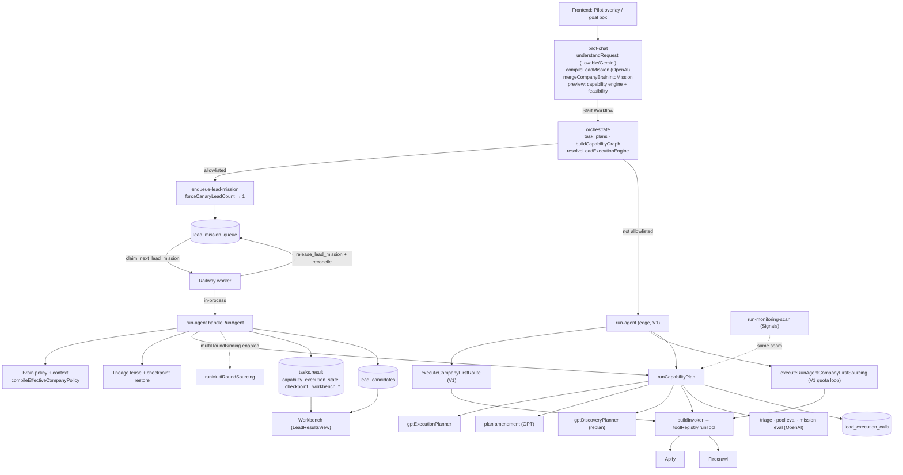

---

# Full Backend Dependency Audit

The full inventory is in `LEAD_V2_BACKEND_DEPENDENCY_MAP.md`. The findings that change the architecture:

1. **The lead engine is not lead-only.** `run-monitoring-scan` (Signals) calls `runCapabilityPlan`, `buildCapabilityGraph` and `makeGptDiscoveryPlanner` through the same seam (`run-monitoring-scan/index.ts:7, 225–279`). Any planner/engine refactor changes Signals monitoring unless it is isolated first.
2. **Pilot previews through the engine.** `pilot-chat` loads the capability engine and mission evaluation; a new planner must also serve the preview, or preview and execution will diverge.
3. **`toolRegistry.runTool` is the provider transport for six features** (run-agent, orchestrate, daily-brief, setup-company-brain, run-lead-action, unlock-founders, monitoring). It must stay; lead-specific policy must leave it.
4. **The model spend ceiling is workspace-wide and shared with Content and Brain.** A lead mission can starve content generation and vice versa.
5. **`lead_candidates` has six writers**; `lead_evidence` has zero lead writers.
6. **Three crons touch lead state:** `tasks_sweep_stuck_runs` (5 min), `resume-stalled-leads` (3 min + 10 min), monitoring tick (15 min).
7. **The worker imports run-agent in-process**, so its footprint is the full 303-module graph.

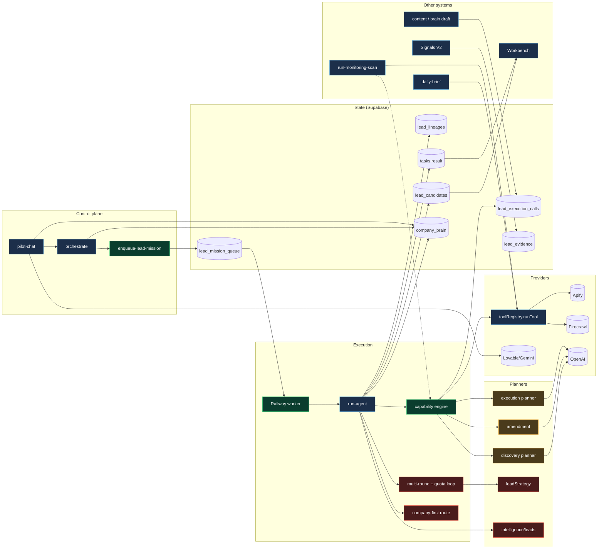
*Green: current V2 path · blue: shared · red: legacy still live · amber: to be replaced.*

---

# Database / RPC / Queue Map

| Store | Role today | Target role |
|---|---|---|
| `lead_mission_queue` | V2 queue, attempts ≤ 5, `not_before` backoff | **keep**; attempts counts faults only |
| `lead_lineages` | lease + accumulated checkpoint (`current_state`) | **keep**; checkpoint slimmed to pointers |
| `tasks.result` | mission state blob + Workbench projections + checkpoint | **keep as projection only**; stop being the source of truth for plans/evidence |
| `task_plans` | Pilot plan | keep |
| `lead_execution_calls` | provider/model/stage ledger (37 cols) | **keep + extend**: spec rows (`status: intended`), `provider_call_id`, `plan_version`, settlement fields |
| `lead_model_calls` (view) | model spend | keep |
| `credit_transactions` + `credits_reserve/finalize` | credits | keep |
| `lead_evidence` | Signals V2 evidence items | **reuse** for mission evidence (add `mission_id`, `company_key`, `origin`) |
| `company_web_evidence` | Firecrawl page cache, TTL | keep (cache, not truth) |
| `company_headcount_snapshots` | headcount series | keep (feeds growth signal) |
| `lead_candidates` | delivered rows, 6 writers | keep; **one mission writer** |
| **new** `lead_plan_versions` | — | immutable plan versions **with the amendment that produced each version inline** |
| **new** `lead_mission_events` | — | append-only trace |

RPCs: `claim_next_lead_mission`, `bind_lead_mission_execution`, `heartbeat_lead_mission`, `release_lead_mission` (worker); `claim_sourcing_continuation` (V1 continuation); `credits_reserve`, `credits_finalize`; SQL `tasks_sweep_stuck_runs`.

---

# Provider / Model Map

| Provider | Path | Priced by | Ledger accuracy today |
|---|---|---|---|
| Apify | `toolRegistry.runTool` | `providerCostModel.priceProviderCall` | early read — **2.4× under** in `1e52d43c` |
| Firecrawl | `toolRegistry` (priced) and web-evidence path (**unpriced**) | `firecrawlCostModel.priceFirecrawlCall` (toolRegistry only) | 12 rows `unknown` |
| OpenAI | `gptProvider.gptStructured` | `modelCostModel` | estimates only; failure path now drained |
| Anthropic | `aiProvider.ts` | `modelCostModel` | not on V2 path |
| Lovable/Gemini | `pilot-chat`, `aiProvider`, `leadStrategy/adapters/lovableAi.ts` | partial | Pilot chat brain **not ledgered** |

Actor capabilities per actor: see dependency map §6. The one gap that matters for the example mission: **no integrated actor can prove a specific company's funding stage** (`datahyena` discovers rounds; memo23/LinkedIn have no funding field).

---

# Current Query Generation

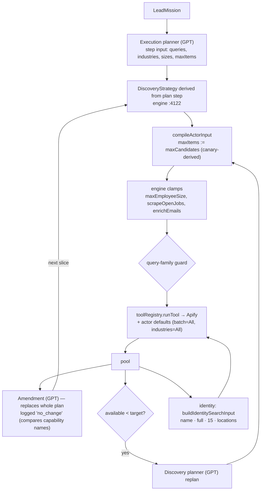

Five query sources, four rewriting layers, zero reconciliation against the mission. Full evidence: `docs/audits/lead-v2-run-1e52d43c-forensic-audit.md`.

---

# Current Candidate / Evidence Flow

Discovery rows → `addCompany` (keyed by domain / prequal key) → free commercial prequalification (role tiers A/B/C, exclusions) → GPT triage (relevant/uncertain/irrelevant) → shortlist (budget) → identity (name search, domain rule) → enrichment (LinkedIn company) → Firecrawl web evidence (for missing evidence) → pool evaluation + mission evaluation (GPT) → `opportunityPortfolio` → Workbench rows.

Evidence lives in **four** places: the engine's in-memory company objects, the checkpoint blob in `tasks.result`/`lead_lineages.current_state`, `company_web_evidence` (pages), and `company_headcount_snapshots`. None of it is a typed evidence item with provenance and freshness; `lead_evidence` (which is exactly that) is unused by leads.

---

# Current Cost Flow

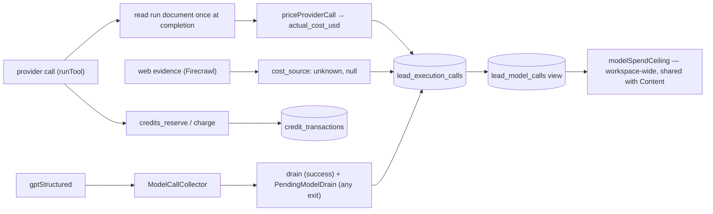
Missing: a settlement pass, per-mission/per-family budgets, Firecrawl pricing on the evidence path, ledgering of Pilot's chat brain.

---

# Current Continuation Flow

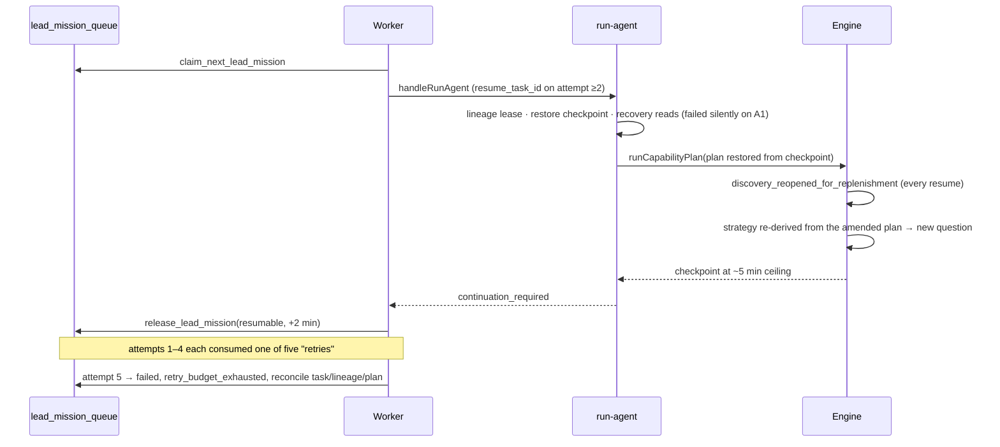

---

# Hidden Coupling

| A | B | Shared | Risk | Isolation strategy |
|---|---|---|---|---|
| Lead engine | Signals monitoring | `runCapabilityPlan`, discovery planner, graph, `runTool` | engine refactor silently changes monitoring spend/results | freeze a `MonitoringRetrievalPort` facade + contract tests **before** Phase 2 |
| Lead planner | Pilot preview | engine, evaluation | preview ≠ execution | one `feasibility + plan-preview` module used by both |
| Lead provider path | daily-brief, Brain setup, lead actions, founders | `toolRegistry.runTool` | transport change breaks 5 features | keep `runTool` stable; new compiler sits *above* it |
| Lead model spend | Content, Brain draft, daily-brief | `modelSpendCeiling`, ledger | cross-feature starvation | per-feature sub-budgets |
| V2 worker | `tasks_sweep_stuck_runs` | `tasks` | sweeper fails a live V2 task | exclude V2-owned tasks (as resume-stalled-leads does) |
| V2 worker | resume-stalled-leads / continue-workflow | `tasks`, continuation claim | double execution | keep `loadV2OwnedTaskIds` exclusion + test |
| Lead evidence | Signals V2 | `lead_evidence` | mixed writers/semantics | `origin` + `mission_id` columns, separate dedupe namespace |
| Lead delivery | lead actions, MCP, memory | `lead_candidates` (6 writers) | inconsistent rows | one mission writer; others own their own lead types |
| Worker deploy | any shared-module change | 303-module import graph | unrelated changes redeploy/break the worker | shrink the lead runtime entry to its own module graph |
| V1 edge path | V2 refactor | run-agent | V1 non-allowlisted workspaces break | V2 code behind `LEAD_V2_*` flags; V1 untouched until GA |

---

# Duplicate Ownership

The most important section for the rewrite. Every row is a live responsibility with more than one owner today.

| Responsibility | Current owners | Conflict observed | Single owner (target) |
|---|---|---|---|
| **Plan creation** | `gptExecutionPlanner`; amendment; `intelligence/leads` (planner-owner, persisted plan artifact); `leadStrategy` strategist; deterministic registry ladder; pilot-chat preview graph; orchestrate graph | 5 discovery questions in 1 mission | **Retrieval Planner** (GPT) → validator → `RetrievalPlan` |
| **Query creation** | execution planner; amendment; discovery planner; strategist titles; `intelligence/leads/leadQueryPacks`; `leadRoleTaxonomy.buildQueryPack`; `hiringSearchVocabulary`; `compileFirstProviderCall` defaults | `queries: []` | **Retrieval Planner** (query families), vocabulary modules as inputs |
| **Actor choice** | execution planner; discovery planner; playbooks (`leadResearchPlaybooks`); graph `allowed_providers`; `hiringSourcePlan`; `compoundSourcingPipeline`; `actorInputPlanner` | planner picks, strategy re-picks | planner proposes, **capability matrix** validates |
| **maxItems / breadth** | `maxCandidates` (run-agent ×2); `DEFAULT_MAX_ITEMS_PER_ACTOR`; `compileActorInput`; `IDENTITY_SEARCH_MAX_ITEMS`; `leadInvestigationBudget`; `admittedTarget`; `MAX_RAW_ROWS_PER_ADMITTED` | planner 100 → 10 silently | **Retrieval Controller budget policy** |
| **Employee size** | mission range; Brain policy; `clampMemo23MaxSize`; `MEMO23_DEFAULT_MAX_SIZE`; `icpDiscoveryConstraints.companySize`; `resolveEmployeeBounds`; prequal `employee_size`; `companyIcpFilter` | advisory bound became a filter | **constraint list** (hardness explicit) → gate + compiler |
| **Geography** | mission hard constraint; `geography_is_hard`; `missionGeographyIsHard`; `identitySearchLocations`; `icpDiscoveryConstraints.locations`; `intelligence/leads/leadGeography`; `provider_query_location` | four answers to "is geography binding?" | **constraint list** |
| **Retries / continuation** | V2 queue attempts; run-agent self-dispatch (gated off in V2); resume-stalled-leads cron; continue-workflow; `leadAutoContinuation`; `stalledLeadResume`; multi-round rounds; engine investigation passes; replenishment; stuck-run sweeper | each resume re-plans | **worker + Retrieval Controller**; V1 sweepers V1-only |
| **Cost** | `providerCostModel`; `firecrawlCostModel`; `modelCostModel`; `toolRegistry`; `executionLedger`; `creditPricing`; `sequentialSourceRuntime`; `intelligence/*`; `radarDiagnostics` | $0.25 vs $0.59 | pricing functions + **one ledger writer with settlement** |
| **Candidate counts** | `progress`; `workbench_evaluation_counts`; `mission_funnel`; portfolio counts; `company_first.counts`; `qualified_lead_run_context`; frontend partition | `progress` zero beside 30 rows | **one projection over candidate records** |
| **Identity** | `companyIdentityResolution`; `suppliedCompanyIdentity`; `actorIdentity`; `acceptLinkedInMatch`; `identityMatchDiagnostics`; `referentBinding` | diagnostics vs resolver disagreed (`4250f181`) | **Entity Resolver** (domain rule authoritative) |
| **Provider input** | 13 `hiringActorInputs` compilers; `compileActorInput`; `actorInputPlanner`; `actorInputStrategy`; `discoveryInputMerge`; `buildIdentitySearchInput`; `compileFirstProviderCall`; `jobsProviderInput`; `harvestApiPeople`; `structuredCompanyEnrichment` input | hidden rewrites | **spec compiler** + pure serialisers |
| **Qualification** | `missionEvaluation`; pool evaluation; `groundedBatchEvaluation` (shadow); `companyBrainSemanticFit`; `leadQualificationVerdict`; commercial prequal; `opportunityPortfolio`; `poolRanking` | 30 × `insufficient_evidence` for a system-created gap | **deterministic eligibility gate** + **Opportunity Reasoner** |
| **Registries** | `hiringActorCatalog`; `actorRegistry`; `actorCapabilityRegistry`; `apifyIntelligenceRegistry`; `intelligence/capabilityRegistry`; `actorEvidenceCapability` | facts disagree across files | **`hiringActorCatalog` + capability matrix** |

---

# Current vs Proposed Gap Analysis

The concern-by-concern and module-by-module matrices are in `LEAD_V2_CURRENT_VS_TARGET_GAP_MATRIX.md`. Summary:

| Layer | Change size | Why |
|---|---|---|
| Control plane (Pilot, orchestrate, queue) | **small** | contracts stay; confirmation card and mission gain hardness + intent terms |
| Worker / lease / checkpoint | **small–medium** | continuation vs retry split; resume from plan version |
| Planning | **large** | five planners → one Retrieval Planner + one Evidence Planner |
| Retrieval control | **large** (new) | portfolio scheduling, yield, stop rules, budgets |
| Provider compilation | **large** | three builder families → one compiler |
| Evidence | **medium** | adopt `lead_evidence` + existing caches as typed evidence |
| Qualification | **large** | binary evaluation → eligibility gate + constrained opportunity labels |
| Cost | **medium** | settlement + floors + per-family budgets |
| Observability | **large** (new) | events + provenance |
| Workbench | **medium** | new classes; one count source |

**Overall: LARGE. Not fundamental** — the proposal changes *how the system decides*, not *how it runs*.

---

# Review of Multi-Query Retrieval

**The idea is right.** The audited run proved a single question is fragile: the best cohort came from the batch-narrowed query 4, and the worst from the empty query 5. Asking several *deliberate* questions and fusing the results beats asking one question five accidental ways.

**But the proposal conflates two different retrievals**, which will cause the next generation of bugs:

| | Population retrieval | Evidence retrieval |
|---|---|---|
| Question | "which companies might fit?" | "is X true of *this* company?" |
| Unit | a query family | a (candidate, evidence dimension) gap |
| Input | mission population + signals | the evidence graph's gaps |
| Output | new candidates | evidence items |
| Budget driver | yield of eligible candidates | value of closing a gap for a *ranked* candidate |
| Stop rule | family yield / novelty | gap closed, or unprovable, or candidate not worth it |

**Recommendation:** the query portfolio contains **only population families** (exact, adjacent, signal). "Evidence queries" move to a separate **Evidence Planner** loop driven by gap analysis — which the proposal already has as steps 13–14. Running evidence queries as portfolio members would spend evidence budget on companies that have not yet passed the cheap hard gate.

---

# Review of Query Portfolio

| Question | Answer |
|---|---|
| Separate query *types*? | **One `QueryFamily` type with a `purpose` tag** (`exact` / `adjacent` / `signal`). Same compiler, same validator, same telemetry; the tag changes only budget share and stop rules |
| Shared plan? | **Yes — one `RetrievalPlan` per version.** Families are its members; adding one is an amendment |
| Concurrency | ≤ **2 population families in flight** per mission; identity/enrichment batches run separately. Memo23 and LinkedIn search are fast; the constraint is spend and duplicate rate, not wall clock |
| Prevent broad/noisy search | validator rules (no empty query, mission conformance, no broadening without amendment) + **adjacency must name its relaxation** ("drops seed-stage batch filter to widen to all YC"; "role broadened from growth marketer to marketing generalist") |
| Duplicate companies | the entity resolver unions by canonical domain → LinkedIn URL → normalised name; telemetry records `unique_new` per family |
| Budget allocation | start: exact 60% · adjacent 25% · signal 15% of the discovery budget; rebalance after the first page of each family by `cost_per_hard_eligible` |
| Stop a family | any of: `unique_new / returned < 0.2` over the last page; `hard_eligible_rate < 0.1` after ≥ 20 rows; family budget spent; provider says exhausted; ≥ 2 pages with no new eligible candidate |
| New family from GPT | only via amendment with trigger `insufficient_candidates` or `source_exhausted`, **when every existing family is stopped** and the mission budget allows; max 2 new families per mission |

**Telemetry.** The proposed fields are necessary but not sufficient. Add: `family_id` + `plan_version` (to attribute across amendments), `relaxations[]` (what an adjacent family gave up), `duplicates` (returned but already held), `screened_out` (cheap-gate removals — the cheapest waste signal), `identity_resolved`, `cost_per_hard_eligible` (the one number to rank families by), `stop_reason`, and `pages_taken`. Drop `worth_considering` from family telemetry: labels are assigned late and should not steer discovery.

---

# Review of Retrieval Controller

**Keep it — it is the most important new component in the proposal**, and it should absorb four current owners: replenishment, discovery replan, investigation budget, and the multi-round loop.

Responsibilities (deterministic):
1. schedule families and evidence specs within budgets;
2. compute yield per family and apply stop rules;
3. decide when adaptive retrieval is justified, and request an amendment from the planner;
4. own continuation: on resume, rebuild its queue from persisted specs, never from a planner.

What it must **not** do: invent queries, change semantics, or re-plan on resume. It asks the planner for an amendment and validates the answer.

State it restores on resume: mission, plan version, families + their telemetry, specs (intended/running/completed), candidate union, evidence items, open gaps, remaining budgets.

---

# Review of Evidence Graph

**Adopt it as the central candidate representation — as a relational view, not a graph store.**

```ts
interface EvidenceItem {                  // stored in lead_evidence (mission-scoped)
  evidence_id: string; mission_id: string; company_key: string;
  dimension: "identity" | "geography" | "industry" | "headcount" | "funding" | "hiring"
           | "job" | "team_composition" | "marketing_function" | "founder_led_gtm"
           | "product_activity" | "headcount_growth" | "launch" | "web_claim";
  value: unknown;                         // normalized, typed per dimension
  source: { provider: string; actor: string | null; provider_call_id: string | null;
            url: string | null; excerpt: string | null };
  observed_at: string; valid_until: string | null;   // freshness
  confidence: "high" | "medium" | "low";
  method: "provider_field" | "deterministic_derivation" | "model_extraction";
  derived_from: string[];                 // evidence_ids for derived facts
  supersedes: string | null;
}
```

Rules:
- **Every fact has a source.** `method: "model_extraction"` requires an excerpt from a stored page (the pattern `groundedClaims` already enforces).
- **Conflicts are kept, not resolved on write.** The view picks by `confidence` > `method` (`provider_field` > `derivation` > `extraction`) > recency, and shows the conflict (e.g. YC `teamSize` 1 vs LinkedIn 1,709 for ShipBob).
- **Freshness is per dimension**: hiring/jobs ~14 days, headcount ~30, funding ~180, identity ~365 — reuse `signalFreshness.ts` / `webEvidenceStore.ttlHoursFor`.
- **GPT never writes facts.** It writes *claims* that cite `evidence_id`s; claims live with the opportunity assessment, not in the evidence store.

Reuse: `lead_evidence` already has `evidence_kind`, `provider`, `actor_key`, `source_url`, `observed_at`, `verified_at`, `confidence`, `normalized_value`, `dedupe_key`. It needs `mission_id`, `company_key`, `origin`, `method`, `derived_from` (jsonb) — additive columns.

---

# Review of Opportunity Reasoner

**Split the decision in two, and never let the second overrule the first.**

1. **Deterministic eligibility** (code): every hard constraint `proven` → eligible; any hard constraint `disproven` → ineligible; any hard constraint `unknown` → `eligible_pending` (not surfaced as a match; may appear as low priority with the gap stated).
2. **Label ceiling** (code): computed from evidence coverage, not from GPT.
3. **Opportunity reasoning** (GPT): chooses a label **at or below the ceiling**, writes the explanation with citations.

| Label | Ceiling rule (code) | GPT's job |
|---|---|---|
| `exact_match` | all hard proven **and** all preferences proven **and** primary target signal proven | confirm, explain |
| `strong_opportunity` | all hard proven; ≥ 1 strong opportunity signal proven; ≤ 1 preference unproven, none disproven | judge whether the signal genuinely compensates; explain the trade-off |
| `worth_considering` | all hard proven; some preferences unproven or one disproven; ≥ 1 signal present | explain why still worth a look and what is missing |
| `low_priority` | all hard proven, weak or no signals; or hard constraints `eligible_pending` | state the gap |
| `ineligible` | a hard constraint disproven | not surfaced (counted, reason shown) |

**Scores:** keep a numeric `evidence_coverage` (0–1, deterministic) and a `signal_strength` (deterministic sum of weighted proven signals). **Do not** show a GPT-generated fit score — it invites false precision. Rank within a label by coverage, then signal strength.

**Explanations:** each `why_surfaced` sentence must cite ≥ 1 `evidence_id`; the validator rejects any sentence whose cited evidence does not exist or does not support the dimension named (`groundedClaims`' rejection logic, reused). `missing_evidence[]` is generated by code from the gap list, not by GPT — so GPT cannot omit an inconvenient gap.

---

# Hard Constraint Semantics

The proposal's example softens "seed-stage" by default. That contradicts "preserve explicit user intent": in *"Find 3 seed-stage B2B SaaS startups in the US"*, seed-stage is a restrictive modifier of the noun the user asked for. Softening it silently would repeat the audited failure in the opposite direction.

**Rule set for the Mission Compiler** (GPT proposes, code decides, user confirms):

| Linguistic form | Default hardness | Example |
|---|---|---|
| Restrictive modifier of the target noun | **hard** | "**seed-stage** B2B SaaS startups" |
| Location / jurisdiction ("in the US", "based in") | **hard** | "in the US" |
| Explicit exclusion ("not agencies", "excluding") | **hard** | |
| Explicit strength words ("must", "only", "exactly") | **hard** | |
| Hedged or ranked wording ("ideally", "preferably", "bonus if") | **preference** | "ideally under 20 people" |
| Activity qualifier ("hiring their first growth marketer") | **target signal** — the primary thing to prove, with defined evidence | |
| Brain ICP not stated in the request | **preference** (`source: brain_inherited`), never hard, never a hidden filter | Brain size 1–150 |
| Inferred by the model ("startup", "small team") | **preference** (`source: model_inferred`) | |

**Unprovable hard constraints are the one place hardness can change — and only by the user.** When the Capability Gate finds a hard constraint no integrated source can prove, the confirmation card asks, before any spend:

> "Seed-stage can't be verified by our current sources. Treat it as: **(a)** a preference (rank by YC batch recency and team size, and show it as unverified), **(b)** keep strict (we'll stop — no results can be verified), or **(c)** add a funding source."

The decision is stored on the mission as a constraint amendment with `source: user_relaxation`. Nothing downgrades silently.

**Company Brain classification:** ICP industries → preference; Brain disqualifiers → hard *only if* the user's request does not contradict them; Brain size bounds → preference unless the request states size; Brain "negative industries" are suppressed when the request names that industry (existing industry-precedence behaviour, kept).

---

# Feasibility Rules

| Constraint class | Provable? | Action | Spend |
|---|---|---|---|
| Hard | yes, for the plan's population | proceed | normal |
| Hard | only for a different population | offer the population change | 0 until accepted |
| Hard | no integrated source | **ask**: relax to preference / keep strict (stop) / add source | 0 until answered |
| Hard | only via an unlock-gated stage (e.g. team composition) | ask for the unlock or relax | 0 until answered |
| Preference | no | proceed; show `unverified` per candidate; never reject on it | normal |
| Target signal | partially (e.g. open role yes, "first hire" needs team data) | proceed; label ceiling capped at `strong_opportunity` unless proven | normal |
| Opportunity signal | no | proceed; the signal simply contributes nothing | normal |

The gate runs in **pilot-chat's preview** (so the question appears on the confirmation card) and again at execution start (plan version 1). Both call the same module.

---

# Workbench Contract

The UI needs one payload, derived in one function:

```ts
interface WorkbenchMissionView {
  mission: { requested_count: number; execution_limit: number | null;  // canary shown, not hidden
             constraints: Array<{ id; label; hardness; source; status: "verified" | "partial" | "unverifiable" }> };
  stage: "planning" | "retrieving" | "investigating" | "reasoning" | "complete" | "stopped";
  counts: { discovered; screened_out; investigating; identity_unresolved;
            evidence_complete; exact_match; strong_opportunity; worth_considering;
            low_priority; ineligible };                               // mutually exclusive, sum = discovered
  candidates: Array<{ company; state; label | null; evidence_coverage; signal_strength;
                      constraints: Record<constraint_id, EvidenceStatus>;
                      why_surfaced: CitedSentence[]; missing_evidence: string[];
                      next_action: string | null }>;
  retrieval: { families: FamilyTelemetry[]; plan_version: number; amendments: AmendmentSummary[] };
  cost: { provider_usd_settled; provider_usd_pending; model_usd; credits };
}
```

Backwards compatibility: keep writing `workbench_evaluation_rows`, `workbench_portfolio`, `company_first` from the same function during migration, so the current `LeadResultsView` keeps working until the new view ships.

---

# What to Keep

Infrastructure that is correct today and should survive unchanged or nearly so:

- **Queue / worker / lease:** `lead_mission_queue` + the four RPCs, `worker/main.ts`, lineage lease, `leadMissionTerminal.ts` (terminal reconciliation proved correct in `1e52d43c`).
- **Mission object:** `LeadMissionV1` + `mission_hash` + canary provenance (`leadMissionV2Request.ts`).
- **Actor facts:** `hiringActorCatalog.ts`, `actorInputContracts.ts`, `hiringActorNormalizers.ts`.
- **Identity rule:** `companyIdentityResolution.ts` + domain-match acceptance (`acceptLinkedInMatch`).
- **Provider transport:** `toolRegistry.runTool` (shared with five features).
- **Pricing functions:** `providerCostModel.ts`, `firecrawlCostModel.ts`, `modelCostModel.ts`.
- **Credits:** `creditAuthorization.ts`, `credits_reserve` / `credits_finalize`.
- **Brain policy resolution:** `companyBrainEffectivePolicy.ts`, `companyBrainCompiler.ts`, industry-precedence.
- **Vocabulary:** `roleFamilies.ts`, `leadRoleTaxonomy.ts`, `commercialSignalPolicy.classifyTitle`, `missionQualificationContext.ts`.
- **Evidence caches:** `company_web_evidence` (`webEvidenceStore.ts`), `company_headcount_snapshots`.
- **Signals modules** usable as signal sources: `headcountGrowth.ts`, `signalFreshness.ts`, Signals V2 schema.

# What to Refactor

- `leadCapabilityEngine.ts` → **split**: stage executors (discovery execution, identity, enrichment, evidence) stay; planning, budgeting, compiling, cost and continuation leave.
- `leadCapabilityGraph.ts` → becomes the capability *requirements* input to the planner, not a second plan.
- `executionLedger.ts` → settlement, spec join, floors.
- `modelSpendCeiling.ts` → counts floors; per-feature sub-budgets.
- `webEvidenceRunner/Planner/Extraction` → the Evidence Planner's executors; emit `EvidenceItem`s.
- `groundedClaims.ts` / `groundedBatchEvaluation.ts` → the citation validator for the Opportunity Reasoner.
- `opportunityPortfolio.ts` → output classification (4 labels + ineligible).
- `companyBrainSemanticFit.ts`, `leadQualificationVerdict.ts` → inputs to eligibility/ceiling rules.
- `leadWorkbenchProjection.ts` + `src/lib/workbench/*` → one projection, new classes.
- `pilot-chat` confirmation card + `leadMissionCompiler.ts` → hardness policy, intent terms, feasibility questions.
- `worker/main.ts` + `leadMissionRunner.ts` → continuation ≠ retry.
- `tasks_sweep_stuck_runs` → skip V2-owned tasks.

# What to Delete

After their unique knowledge is ported (each deletion has a named port target):

| Delete | Port target |
|---|---|
| execution-plan amendment (engine `5250–5340`) | `PlanAmendment` |
| `gptExecutionPlanner.ts` | Retrieval Planner |
| `gptDiscoveryPlanner.ts`, `leadDiscoveryStrategy.ts` (strategy half) | Retrieval Planner (query families) + validator |
| `leadStrategy/*`, `leadStrategyOwner.ts` | adjacent query families |
| `intelligence/leads/*` (planner, bridge, authority, query packs, adaptive runtime, geography) | Retrieval Planner / constraint list |
| `multiRoundController.ts`, `multiRoundBinding.ts`, `companyFirstQuotaController.ts` | Retrieval Controller |
| `hiringSourcePlan.ts`, `compoundSourcingPipeline.ts`, `sequentialSourceRuntime.ts`, `leadResearchPlaybooks.ts` ladder parts | capability matrix + planner |
| `actorRegistry.ts`, `actorCapabilityRegistry.ts`, `apifyIntelligenceRegistry.ts`, `intelligence/capabilityRegistry.ts` | `hiringActorCatalog.ts` |
| `actorInputPlanner.ts`, `actorInputStrategy.ts`, `discoveryInputMerge.ts`, `compileActorInput`, `compileFirstProviderCall`, `buildIdentitySearchInput` | spec compiler |
| `missionTriage.ts`, `missionEvaluation.ts` binary verdict path | eligibility gate + Opportunity Reasoner |
| duplicated geography predicates, scattered clamps | constraint list, budget policy |
| `capability_execution_state.discovery_strategy` / `execution_plan` as sources of truth | `lead_plan_versions` |
| `progress` as a count source | Workbench projection |

V1 (`executeCompanyFirstRoute`, the quota loop, V1 sweepers) stays **frozen and untouched** until V2 is the default for every workspace, then is deleted in one step.

---

# Final Recommended Architecture

The proposal's 17 stages collapse into **eight runtime components** plus three cross-cutting records. Fewer boxes, each with exactly one job and one owner.

| # | Component | Owner | Replaces / merges (from the proposal) |
|---|---|---|---|
| 1 | **Mission Compiler** | GPT proposes, code decides hardness, user confirms | Mission Compiler + Constraint Interpreter |
| 2 | **Capability Gate** | code | Evidence Feasibility Check |
| 3 | **Retrieval Planner** | GPT | GPT Retrieval Strategist + Query Portfolio (population families only) |
| 4 | **Retrieval Controller** | code | Retrieval Controller + Gap Analysis scheduling |
| 5 | **Spec Compiler** | code | Provider Call Specs + Deterministic Compiler |
| 6 | **Entity & Evidence Store** | code | Entity Resolution + Dedupe + Candidate Evidence Graph |
| 7 | **Evidence Planner** | GPT proposes targets, code schedules via the Controller | Gap Analysis + Targeted Evidence Retrieval |
| 8 | **Opportunity Reasoner** | code computes eligibility + ceiling; GPT labels + explains with citations | Cheap Hard-Gate Screening + GPT Opportunity Reasoner + Output Classification |

Cross-cutting: **`RetrievalPlan` versions + `PlanAmendment`**, **`MissionEvent` trace**, **settled cost ledger**.

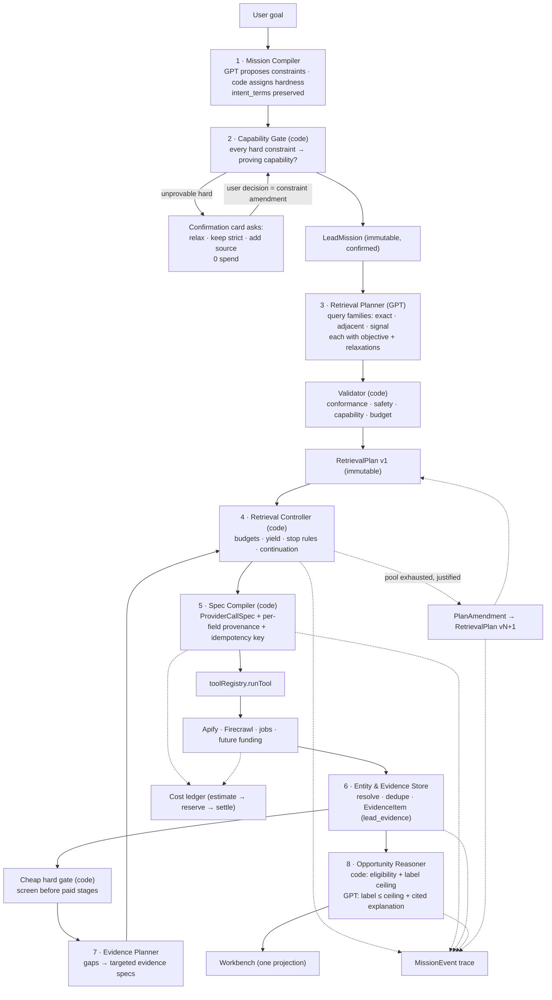

**What this deliberately does not include:**
- a graph database (a relational view over `lead_evidence` is enough);
- a separate constraint-interpreter service (compile-time, part of the compiler);
- evidence queries inside the population portfolio;
- GPT-authored scores;
- a new candidate table (candidates stay in the checkpoint + `lead_candidates` for delivery until volume demands otherwise).

---

# Required Data Models

```ts
type Hardness = "hard" | "preference" | "target_signal" | "opportunity_signal";
type ConstraintSource = "user_stated" | "model_inferred" | "brain_inherited" | "code_default" | "user_relaxation";

interface Constraint { id: string; axis: string; operator: string; value: unknown;
                       hardness: Hardness; source: ConstraintSource; evidence_dimension: string; }

interface LeadMission { mission_id; mission_hash; original_user_query; requested_count;
                        constraints: Constraint[]; intent_terms: string[]; requested_output; }

interface QueryFamily { family_id; purpose: "exact" | "adjacent" | "signal"; objective: string;
                        population: { terms: string[]; filters: Record<string, unknown> };
                        relaxations: Array<{ constraint_id; description }>;   // required for adjacent
                        proposed_actors: string[]; budget_share: number; }

interface RetrievalPlan { plan_id; mission_id; version; families: QueryFamily[];
                          evidence_policy: { dimensions_required: string[]; unlocks: string[] };
                          budgets: { discovery_usd; evidence_usd; model_usd; wall_clock_ms };
                          hash; amendment: PlanAmendment | null; }

interface PlanAmendment { from_version; to_version; component; trigger;
                          changes: Array<{ path; before; after; reason }>; rationale; approved_by; }

interface ProviderCallSpec { provider_call_id; mission_id; plan_version; family_id | null;
                             gap_id | null; purpose; provider; actor; query | null; filters;
                             location | null; employee_bounds | null; max_items; mode | null;
                             required_fields: string[]; provenance: FieldProvenance[];
                             idempotency_key; cost_estimate_usd; }

interface EvidenceItem { /* see Review of Evidence Graph */ }

interface OpportunityAssessment { company_key; eligibility: "eligible" | "eligible_pending" | "ineligible";
                                  label_ceiling: Label; label: Label; evidence_coverage: number;
                                  signal_strength: number; why_surfaced: CitedSentence[];
                                  missing_evidence: string[]; model_call_id; }

interface MissionEvent { event_id; mission_id; task_id; attempt; plan_version | null;
                         candidate_key | null; provider_call_id | null; event_type; component;
                         timestamp; before | null; after | null; reason; cost_usd | null; }
```

### Schema impact — minimal

| Need | Where | Change |
|---|---|---|
| Plan versions + amendments | **new** `lead_plan_versions` | one row per version; the amendment that produced it stored inline (no separate amendments table) |
| Trace | **new** `lead_mission_events` | append-only |
| Provider call specs | **existing** `lead_execution_calls` | add `provider_call_id`, `plan_version`, `family_id`, `settled_usd`, `settlement_source`, `variance_usd`; write the spec row with `status: intended` before the call; `request_input` holds the spec + provenance |
| Idempotency | **existing** `lead_execution_calls` | partial unique index on `(workspace_id, lineage_id, idempotency_key)` for provider calls |
| Evidence | **existing** `lead_evidence` | add `mission_id`, `company_key`, `origin`, `method`, `derived_from` |
| Query telemetry | derived | computed from specs + events; no table |
| Candidates | **existing** checkpoint + `lead_candidates` | no new table now |
| Opportunity assessments | **existing** `tasks.result` projection + `lead_candidates.raw` | no new table now |

**Two new tables, additive columns on two existing ones.** The remediation plan's five new tables are reduced to two.

---

# Migration Plan

Run old and new side by side wherever it costs nothing, and switch execution only when the new path has been proven on fixtures and in shadow.

| Step | What | Spend | Behaviour change | Proof to advance |
|---|---|---|---|---|
| **M0 — Fixtures & freeze** | capture runs `4250f181` + `1e52d43c` (inputs, datasets, receipts) as offline fixtures; freeze planner/compiler code in the engine | 0 | none | fixtures replay offline |
| **M1 — Isolate couplings** | `MonitoringRetrievalPort` facade so Signals monitoring no longer calls the engine directly; sweeper skips V2 tasks; contract tests for `runTool` callers | 0 | none | monitoring + five `runTool` features pass contract tests |
| **M2 — Observe-only trace** | `lead_mission_events`; emit events + per-field provenance from the *current* code | 0 | none | the 7 observability questions answered for a live run |
| **M3 — Plan versions** | `lead_plan_versions`; current plan + every amendment recorded as versions with hash diffs (still executed by old code) | 0 | none (recording) | a live run shows each silent rewrite as a visible amendment |
| **M4 — Shadow planning** | new Mission Compiler hardness + Capability Gate + Retrieval Planner run **in parallel** and write a shadow `RetrievalPlan`; not executed | ~model only | none | shadow plans diffed against executed plans on real missions |
| **M5 — Shadow specs** | Spec Compiler builds specs for every call the old path makes; compare byte-for-byte to the JSON actually sent | 0 | none | 100% match or every mismatch explained by provenance |
| **M6 — Offline replay** | full new pipeline over fixtures: families → specs → (fixture) provider → evidence → reasoner | 0 | none | run `1e52d43c` ends in a pre-spend feasibility question, or with relaxation produces labelled candidates |
| **M7 — Gate enforce** | Capability Gate switches to enforce in pilot-chat + execution | saves spend | refuses/asks earlier | no unprovable-hard mission reaches discovery |
| **M8 — Internal canary** | allowlisted workspace executes through specs + Controller + Reasoner, **1-lead limit, $1 cap** | small | V2 only, one workspace | see Production Canary Strategy |
| **M9 — Partial rollout** | widen allowlist; old V2 path kept one release behind a flag | normal | V2 workspaces | success criteria met on 5 consecutive missions |
| **M10 — Delete** | remove the planners, registries, builders, loops listed in *What to Delete*; V1 frozen until V2 is default, then removed | — | — | build + all suites green, 303 → materially smaller module graph |

Critical dependencies: M3 needs M2's event model; M5 needs M3's plan versions; M6 needs M4+M5; M8 needs M6+M7; deletions only after M9.

---

# Test Strategy

**Fixture-first; no provider purchases in CI.**

| Suite | What it pins |
|---|---|
| Fixture replay (`1e52d43c`, `4250f181`) | full pipeline offline; asserted final states and labels |
| Validator | empty query rejected; mission drift rejected; dropped hard constraint rejected; broadening without amendment rejected; adjacent family without named relaxation rejected |
| Plan versioning | capability-identical/input-different change ⇒ new version with diff (the audited `no_change` case) |
| Canary isolation | pool targets from `requested_count`, never the execution limit |
| Spec compiler | golden `spec → JSON` for all 33 audited calls; purity property test; every field has provenance |
| Idempotency | same key twice ⇒ adopted, DB constraint on violation; resume buys nothing new with an unexhausted pool |
| Portfolio | family stop rules; budget rebalancing by `cost_per_hard_eligible`; ≤ 2 concurrent families; new family only via amendment |
| Evidence | conflicting headcount (YC 1 vs LinkedIn 1,709) resolved by method/confidence and shown as conflict; freshness expiry |
| Hardness | "seed-stage B2B SaaS startups" ⇒ seed = hard; "ideally seed-stage" ⇒ preference; Brain size ⇒ preference with `brain_inherited` |
| Feasibility | unprovable hard ⇒ question, 0 spend; unprovable preference ⇒ proceed with `unverified` |
| Reasoner | label never above ceiling; every sentence cites existing evidence; `missing_evidence` generated by code; `first growth marketer` keyword-only ⇒ cannot exceed `worth_considering` |
| Cost | fixture receipts settle to $0.5902; unknown never zero; Firecrawl priced; ceiling counts floors |
| Workbench | counts mutually exclusive and sum to discovered |
| Coupling contracts | monitoring port, `runTool` callers, sweeper exclusion, V1 path unchanged |
| Revert tests | each invariant deliberately broken once; a test must fail |

---

# Production Canary Strategy

1. **Shadow week (M4–M5):** every real V2 mission produces a shadow plan and shadow specs; zero extra provider spend.
2. **Decide the seed-stage question** before the canary (preference / strict / funding source) — otherwise the canary's correct outcome is a refusal.
3. **Canary mission:** the exact audited request, one workspace, 1-lead limit, $1 hard cap, gate in enforce.
4. **Pass criteria:** no empty or non-conforming spec executed; every spec joined to a plan version; ≤ 1 amendment, each with a stated trigger; 0 duplicate purchases; ledger within 2% of Apify console; every surfaced company has cited `why_surfaced` and code-generated `missing_evidence`; Workbench counts sum exactly.
5. **Then** widen to normal missions in the allowlisted workspace; watch `cost_per_hard_eligible`, amendments/mission, label distribution, and variance.
6. **Rollback trigger:** any unconforming spec executed, any double purchase, ledger variance > 20%, or a surfaced claim without valid evidence.

---

# Risks

| Risk | Likelihood | Impact | Mitigation |
|---|---|---|---|
| Too many queries / runaway spend | high without controls | high | ≤ 2 concurrent families, ≤ 2 amendment-added families, per-family budget, `cost_per_hard_eligible` stop rule, mission $ cap |
| GPT over-broadening (adjacent families drift) | high | high | adjacency must name its relaxation; validator rejects unnamed broadening; hard constraints never relaxable by a family |
| Duplicate candidates across families | high | medium | entity resolver unions by domain → LinkedIn URL → name; `duplicates` telemetry; stop families with low novelty |
| Noisy signals (weak "opportunity" reasons) | medium | high (trust) | signals are typed evidence with thresholds; label ceiling caps what signals can earn |
| Evidence explosion (too many items, cost) | medium | medium | evidence retrieval only for candidates past the cheap gate and ranked in the top-N; per-dimension TTL cache reuse |
| Stale facts | medium | medium | `valid_until` per dimension; re-fetch only when stale and decision-relevant |
| Expensive team-composition checks (people stage) | high for "first hire" missions | medium | unlock-gated; ask at the Capability Gate; default ceiling `strong_opportunity` without it |
| Weak/hallucinated opportunity reasoning | medium | high | citations mandatory and validated; code-generated gaps; no GPT scores |
| Latency (more stages, more queries) | medium | medium | parallel identity/enrichment batches; continuation across slices is free under the new retry model |
| Complexity (new components) | medium | high | 8 components not 17; delete 6–8k lines of duplicates in the same programme; module graph shrinks |
| Hardness misclassification | medium | high | linguistic rule table + user confirmation on the card; tests per phrasing |
| Coupled systems break (monitoring, runTool users) | medium | high | M1 isolation + contract tests before any refactor |
| Migration stalls with two stacks live forever | medium | high | M10 deletion is a scheduled phase with a date, not "later" |

---

# Mermaid Diagrams

The following complete the required set. Already above: current architecture/call graph (*Current Production Call Graph*), backend dependency map (*Full Backend Dependency Audit*), current query generation, current continuation, current cost flow, proposed architecture (*Final Recommended Architecture*).

### Proposed multi-query retrieval flow

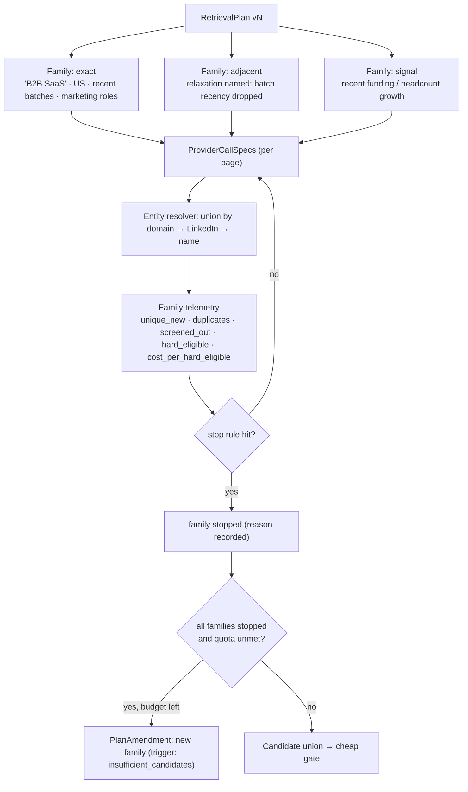

### Retrieval Controller

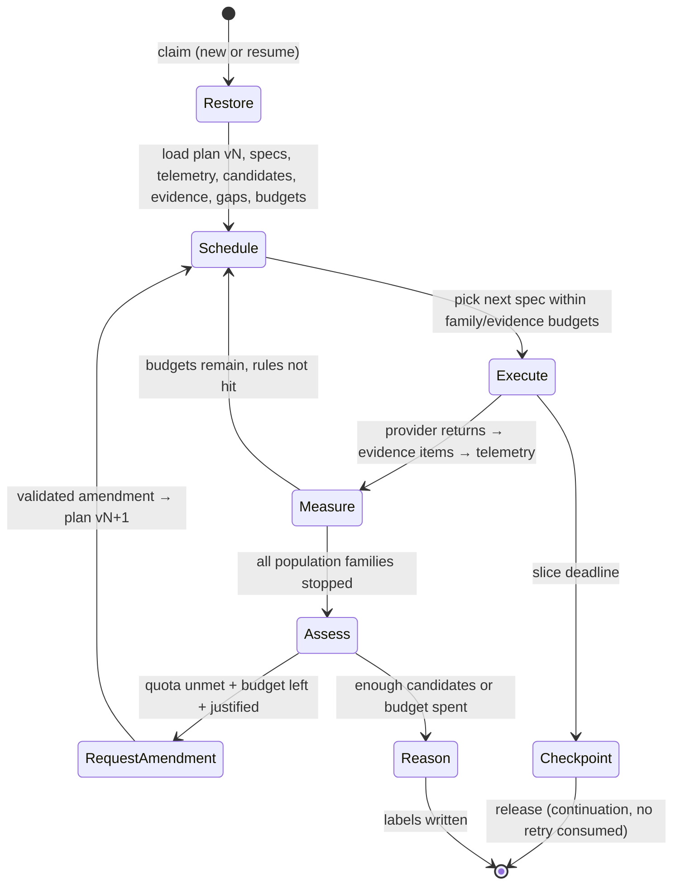

### ProviderCallSpec execution

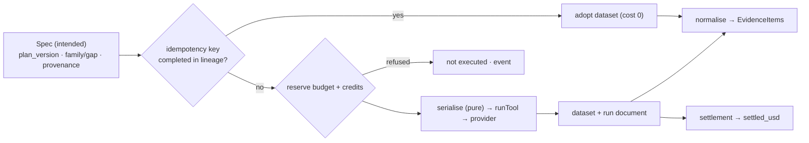

### Evidence graph (relational view)

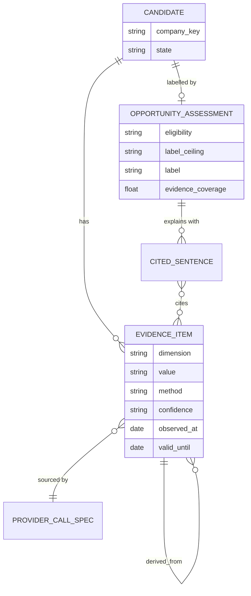

### Candidate lifecycle

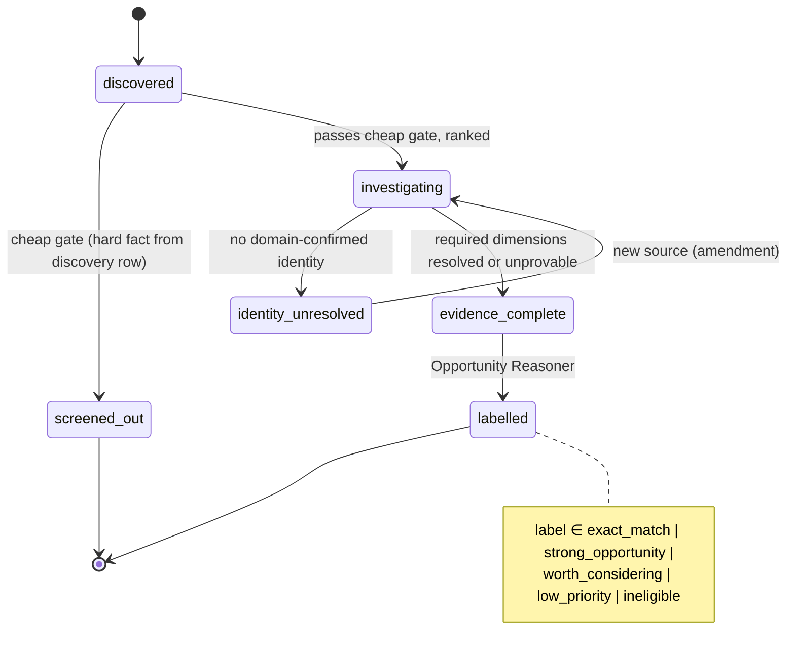

### Opportunity reasoning

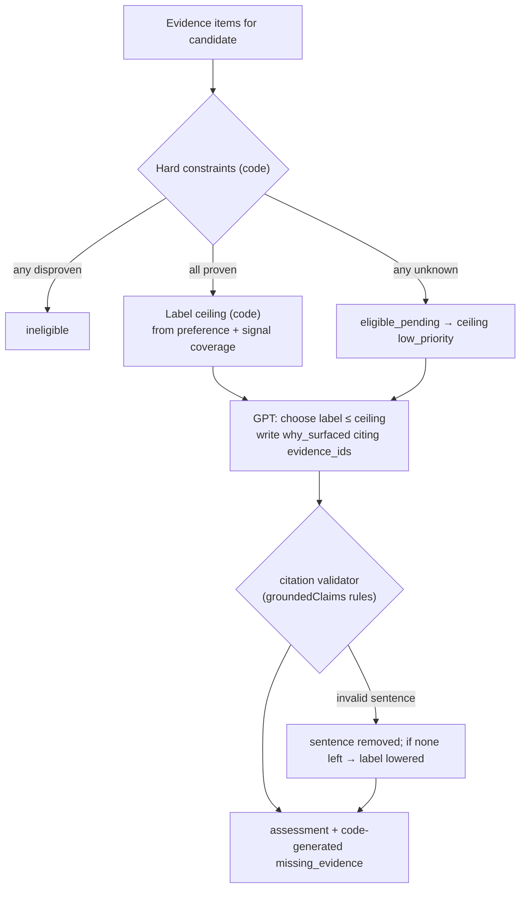

### Cost flow (target)

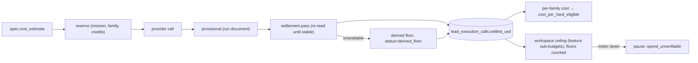

### Target Workbench data flow

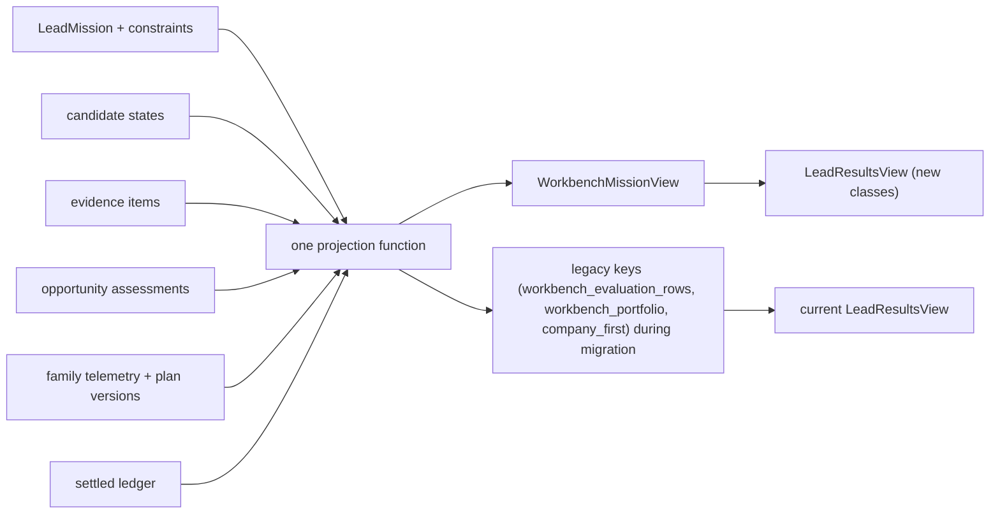

### Migration bridge — current → proposed

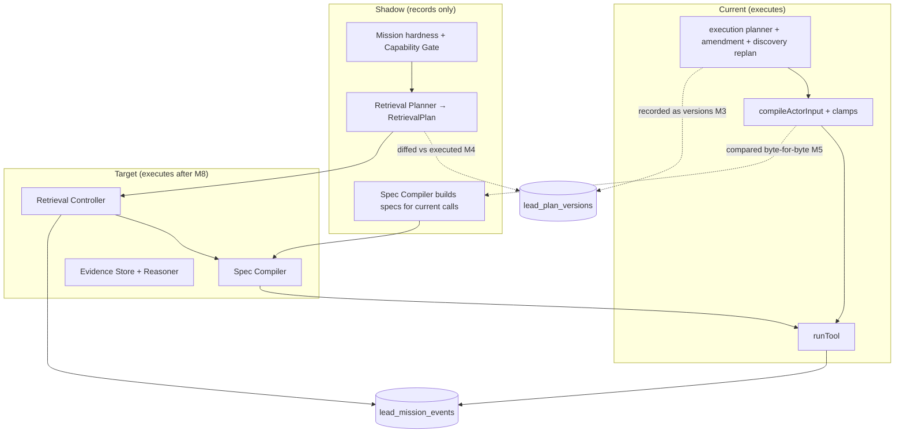

---

# Final Recommendation

Adopt the opportunity-retrieval direction, **modified**:

1. **Two retrieval loops, not one portfolio:** population families (exact / adjacent / signal) and gap-driven evidence retrieval.
2. **Eight components, not seventeen**, with the constraint interpreter merged into the compiler and feasibility merged into a Capability Gate that asks the user before spending.
3. **Code bounds GPT at the two dangerous points:** hardness (linguistic rules + user confirmation) and labels (eligibility + ceiling computed from evidence; GPT chooses at or below, with validated citations).
4. **Reuse before you build:** `lead_evidence` for evidence, `groundedClaims` for citations, `opportunityPortfolio` for labels, `toolRegistry.runTool` for transport, the V2 queue/lease/checkpoint for execution, Signals modules for opportunity signals.
5. **Two new tables** (`lead_plan_versions`, `lead_mission_events`), additive columns elsewhere.
6. **Isolate the couplings first** (Signals monitoring, `runTool` users, the stuck-run sweeper) — the biggest practical risk of the rewrite is breaking systems that silently share the lead engine.
7. **Delete aggressively** once each port lands: four registries, three builder families, two sourcing loops, three planner stacks.

**Decisions needed from you before implementation:**
- (a) the hardness rule table (especially: are restrictive modifiers like "seed-stage" hard by default?);
- (b) the seed-stage/funding answer (integrate a funding source, or accept "unverifiable + ask");
- (c) whether team-composition evidence (people stage, unlock-gated) is in scope for "first hire" missions;
- (d) the four label definitions and ceilings above;
- (e) the discovery/evidence budget split and per-mission cap.

---

**CURRENT SYSTEM UNDERSTOOD:** YES

**BACKEND DEPENDENCIES MAPPED:** YES

**CURRENT VS TARGET DIFFERENCE:** LARGE

**PROPOSED ARCHITECTURE VERDICT:** MODIFY

**CURRENT ARCHITECTURE SALVAGEABLE:** PARTIALLY

**RECOMMENDED IMPLEMENTATION TYPE:** PARTIAL REWRITE

**BIGGEST CURRENT ARCHITECTURAL RISK:** Five live planner stacks and four input-rewriting layers with no plan identity — intent is rewritten silently on every attempt.

**BIGGEST PROPOSED ARCHITECTURAL RISK:** Uncontrolled multi-query breadth — adjacent/signal families over-broadening and multiplying provider spend and duplicates, unless family budgets, named relaxations and yield stop rules are enforced by code from day one.

**MOST IMPORTANT PRIMITIVE TO BUILD FIRST:** the versioned `RetrievalPlan` with `ProviderCallSpec` + per-field provenance (preceded by coupling isolation and the observe-only trace).

**SAFE TO IMPLEMENT:** NO — not until decisions (a)–(e) are made. M0 (fixtures) and M1 (coupling isolation) are safe to start at any time.

**DOCUMENTS CREATED:**
- `docs/lead-v2/LEAD_V2_FINAL_ARCHITECTURE_REVIEW.md`
- `docs/lead-v2/LEAD_V2_BACKEND_DEPENDENCY_MAP.md`
- `docs/lead-v2/LEAD_V2_CURRENT_VS_TARGET_GAP_MATRIX.md`
