# Lead V2 — Signal-First Final Implementation Plan

**Status:** single source of truth for implementation. Supersedes `LEAD_V2_SIGNAL_FIRST_IMPLEMENTATION_BRIEF` (incomplete) and incorporates every change required by `docs/lead-v2/LEAD_V2_SIGNAL_FIRST_PLAN_VALIDATION.md` (C1–C10). Self-contained: no section depends on another document or conversation.
**Baseline:** repository at `125f0cfa`, production project `ohsdatpvfdjdemstoiuj`, Railway worker `aiworforce-platfrom`.
**This document authorises no code by itself.** Implementation starts with P0 only after sign-off.

---

# Executive Summary

Lead V2 today searches in the wrong place, rewrites its own intent silently, and turns incomplete evidence into rejection. The audits proved it: five different discovery questions for one mission reported as "no change", an unfiltered `queries: []` sweep, identity searches costing 74% of spend and matching nothing, a hard "seed-stage" requirement no source could prove, and signal missions (product launch, expansion, technology) that the graph advertises and the engine never executes.

This plan rebuilds the retrieval core around one principle — **search where the evidence naturally lives** — with three safeguards the previous brief lacked:

1. **An anchor is enabled only when it is production-ready end to end** (provider card, verified contract, engine executor, normaliser, company extraction, cost model, fixtures). The capability graph naming an anchor is never enough.
2. **Safety before breadth.** Versioned plans, provider-call specs, provenance, idempotency, absolute spend ceilings, a canonical identity strategy and a mission trace all exist before a second retrieval route runs.
3. **Truth over coverage.** Every criterion carries its type, source and time window; code owns eligibility and the maximum label; GPT explains with citations and cannot promote, hide or invent.

**Ready at start:** generic company-profile retrieval and funding-first discovery. **First signal-first canary:** hiring-first (after a job-discovery provider is carded). **Later, gated by real work:** funding verification, news/launch/expansion (company extraction), stored headcount/signals, leadership and technology (provider-dependent).

---

# Product Goal

A user describes the companies they want to reach. Agentory:

1. understands **exactly** what was asked — what is required, what is preferred, what is a signal, what is a guess — and shows it before spending;
2. retrieves from the source where that evidence naturally lives;
3. assembles one clean pool of real, correctly identified companies;
4. completes only the evidence that is missing, cheapest first, and only for companies worth it;
5. returns **Exact Matches, Strong Opportunities, Worth Considering and Low Priority** leads — each with why it surfaced, what is proven, what is missing, and where it came from;
6. never spends on a question it cannot answer, never buys the same thing twice, and reports its cost truthfully.

Success for *"Find seed-stage US B2B SaaS startups hiring their first growth marketer"* is a small ranked set such as *1 Exact · 2 Strong · 3 Worth Considering*, each truthful and evidence-backed — or, when the evidence cannot exist, an honest explanation before spend. Never *"0 qualified"* for a reason the system itself created.

---

# Current Problems Being Eliminated

| # | Problem (proven) | Eliminated by |
|---|---|---|
| 1 | Plan amendments rewrite discovery input; logged `no_change` (capability-list comparison) | versioned RetrievalPlan + full-hash change detection (P2) |
| 2 | `queries: []` → unfiltered paid sweep | ProviderCallSpec validation (P2) |
| 3 | Canary quota shrinks discovery (`maxCandidates = max(10, quota×10)`) | mission count vs execution limit separation (P1/P2) |
| 4 | Planner values overridden silently (`maxItems`, `maxEmployeeSize`, identity inputs) | per-field provenance; overrides are recorded (P2) |
| 5 | Ledger under-reports ~2.4× ($0.2463 vs $0.5902); Firecrawl unpriced | receipt settlement + floors (P2) |
| 6 | Unprovable hard constraint reaches evaluation (seed-stage) | executability feasibility + card decisions (P0/P1) |
| 7 | Large/old/off-mission companies admitted | cheap hard gate before paid stages (P4/P5) |
| 8 | Graph routes to unexecuted capabilities (launch/expansion/technology/company posts) with feasibility `satisfied` | executability feasibility (P0) |
| 9 | Hiring cannot start from jobs; identity by bare name | hiring-first with employer URL identity (P3) |
| 10 | Continuation re-plans every slice; attempts = slices | continuation ≠ retry ≠ adaptation (P2/P4) |
| 11 | Binary pass/reject; 30× `insufficient_evidence` | eligibility + opportunity labels with ceilings (P5) |
| 12 | Three Workbench count owners | one projection (P5) |
| 13 | Six+ signal vocabularies; Leads ↔ Signals unmapped | canonical vocabulary with aliases (P1) |
| 14 | Five planner stacks, five registries, three input builders, two sourcing loops | ownership removal (P9) |
| 15 | Company Brain bounds act as hidden filters | Brain rules with source + card (P1) |

---

# Design Principles

1. **Search where the evidence lives** — the first source follows the mission's anchor, if and only if that anchor is ready.
2. **Readiness is proven, not declared** — an anchor or capability is enabled by passing the enablement contract, never by being listed.
3. **Intent is immutable and visible** — the mission is compiled once, shown on the card, and changes only by an explicit, recorded user decision.
4. **Code owns truth; GPT owns judgment** — code: constraints, identity, eligibility, budgets, idempotency, ceilings, feasibility. GPT: understanding, strategy proposals, extraction, opportunity reasoning. Providers: facts.
5. **Safety before breadth** — no multi-route retrieval before plans, specs, idempotency, ceilings, identity and trace exist.
6. **Cheapest sufficient evidence first** — stored → cached → cheap provider → expensive provider; expensive evidence only for shortlisted, eligible companies.
7. **Nothing silent** — no silent mutation, no silent softening, no silent empty run, no silent zero cost.
8. **Preserve proven infrastructure** — queue, lease, checkpoint, catalog facts, identity domain rule, transport, pricing functions, Brain policy resolution.
9. **Additive migration** — aliases not renames; new tables only where existing ones cannot serve; old paths deleted only after equivalence.
10. **Every result is explainable** — route, evidence, gaps and cost are answerable without logs.

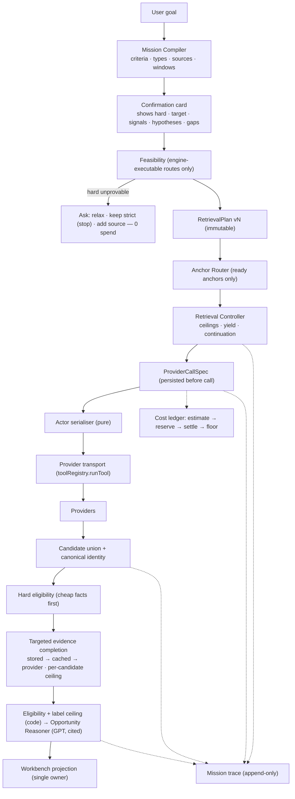
*Final architecture.*

---

# Locked Architecture Rules (validated 2026-09-15 — binding on P1–P9)

Adopted with the corrected before/after architecture after P0 passed live (`3f6b6d9b`). Every later phase is reviewed against these; a phase that needs to break one stops and reports the conflict instead of drifting.

1. **No hardcoded `signal → actor`.**
   - The Actor Playbook / capability catalog (`hiringActorCatalog.ts`, `actorInputContracts.ts`, `actorInputStrategy.ts`, `discoveryScenarioMatrix.ts`, surfaced by `agentoryBriefing.actorPlaybookSection`) stays the single description of what each actor can and cannot do: inputs, outputs, costs, defects, limits.
   - GPT chooses the research strategy from the **relevant subset of ready actors** for each mission. No table in code maps a signal to an actor.
2. **Code owns truth; GPT owns strategy.**
   - Code decides which actors/capabilities are actually ready and executable (P0 executability gate, enablement contract E1–E7).
   - GPT may choose and combine ready actors, design queries, decide which candidates deserve deeper research, and propose adaptations — never outside what code declared ready.
3. **ProviderCallSpec is authoritative from P2.**
   - GPT proposes actor + intent-level input; code validates schema, hard constraints, budget, dedupe/idempotency and provider limits.
   - The resulting ProviderCallSpec is exactly what executes. No downstream semantic rewrite of any kind.
   - Every clamp or default is explicit provenance on the spec (`safety_clamp`, `system_default`, …), never hidden. Today's silent overrides (`compileActorInput` maxItems, identity `maxItems 15`, amendment query rewrites) are the behaviour this rule retires.
4. **The adaptive feedback loop is versioned.**
   - Results may lead GPT to propose: continue; stop; change query; add/remove a route; deepen evidence on selected companies.
   - Any meaningful strategy change requires a **named trigger**, a **validated PlanAmendment** and a **new RetrievalPlan version** (see Amendment rules).
   - **Worker continuation alone never re-plans.** A resumed slice executes the current plan version; it does not reopen discovery with a new question.
5. **Multi-source discovery is phased, not available immediately.**
   - P3: the first real hiring-first route.
   - P4: multi-source candidate union / identity merge.
   - P6+: funding verification / hiring+funding hybrid.
   - P7+: news / product launch / expansion.
   - P8+: stored headcount / signals.
   - P9+: leadership / technology, only if provider-ready.
6. **Actor Playbook efficiency.**
   - Today the full playbook is ~70k characters (~26k input tokens) on every planning call, three calls per slice.
   - Future planners receive only the actor cards and capabilities relevant to the mission's ready anchors and evidence gaps — never the whole catalog.
7. **Identity strategy.**
   - Prefer a source-provided LinkedIn URL or domain.
   - Reuse known identity across routes and missions where safe (canonical key, freshness, same company evidence).
   - LinkedIn Company Search (a NAME index) is a **guarded fallback**, not the default identity method.
8. **Do not overstate current actors.**
   - Hiring discovery still needs one V2-carded job actor (the V2 job actor is company-scoped).
   - Funding verification needs a provider with company input (datahyena is discovery-only).
   - News-first needs article → company extraction.
   - Technology-first needs a reverse-discovery provider (BuiltWith is domain → technology only).
   - Leadership-first needs a production-ready source.

---

# Mission Semantics

Every requirement in a mission is a **Criterion**.

```ts
type CriterionKind = "hard" | "target" | "opportunity_signal" | "hypothesis";
type CriterionSource =
  | "user_explicit"            // the user said it
  | "user_inferred"            // GPT read it from the user's words
  | "company_brain_policy"     // a workspace rule (e.g. a disqualifier)
  | "company_brain_preference" // workspace ICP preference
  | "system_default";          // e.g. a default time window

interface Criterion {
  id: string;
  dimension: CanonicalKind | "geography" | "industry" | "business_model" | "company_size"
           | "company_stage" | "role" | "team_composition" | "exclusion";
  value: unknown;                         // normalised
  kind: CriterionKind;
  source: CriterionSource;
  time_window?: { days: number; basis: "posted" | "announced" | "observed" | "published";
                 source: CriterionSource };  // the window is itself sourced: stated, inferred or default
  confidence?: number;                    // 0–1, REQUIRED when source = user_inferred
  elevated_by?: "only" | "must" | "strictly" | "exactly" | "excluding" | null;
  user_phrase: string;                    // the words that produced it
  rationale: string;
}
```

**Type meanings**

| Type | Meaning | Can reject? | Can rank? | Can be the anchor? |
|---|---|---|---|---|
| `hard` | eligibility; the user demands it | yes (when disproven) | — | yes |
| `target` | what the user is looking for / prefers | **no** | yes | yes (when an observable signal) |
| `opportunity_signal` | makes an imperfect company worth surfacing | no | yes | yes (e.g. funding) |
| `hypothesis` | an opportunity thesis the user wants tested ("likely to need…") | **never** | yes, weakly | never directly — anchors on its proxy signals |

**Compilation rules (GPT proposes, code decides, card confirms)**

| User wording | Result |
|---|---|
| Location / jurisdiction ("in the US", "based in") | `hard`, `user_explicit` |
| Explicit exclusions ("not agencies", "excluding") | `hard`, `elevated_by: excluding` |
| Strength words: **only, must, strictly, exactly** | elevate the criterion to `hard` |
| Hedges: prefer, ideally, bonus if | `target` |
| Company kind in the noun phrase ("B2B SaaS companies") | `hard` (industry/business model) |
| Restrictive stage/size modifiers ("seed-stage", "small") | `target` **unless** elevated; card asks when it would be hard and unprovable |
| Observable activity ("hiring X", "recently raised", "launched") | `target` (the anchor) |
| "must currently be hiring" | `hard` + window |
| "likely to need…", "probably…", "could benefit" | `hypothesis` + proxy `opportunity_signal`s shown on the card |
| Anything GPT infers without the user's words | `user_inferred` with `confidence`; never `hard` |
| Company Brain ICP not stated in the request | `company_brain_preference` → `target` |
| Company Brain policy rule (disqualifier) | `company_brain_policy` → `hard` only if the request does not contradict it; always shown |

**Time windows (system defaults; always shown; user-editable on the card)**

| Phrase | Default window | Basis |
|---|---|---|
| "recently funded / raised" | 180 days | announced date |
| "recently launched" | 90 days | published date |
| "currently / actively hiring" | 30 days | posted date |
| "recently expanded / opened office" | 180 days | published date |
| "recently hired a VP …" | 120 days | observed/announced |
| "rapidly expanding headcount" | ≥ 20% growth over 180 days, ≥ 2 readings ≥ 60 days apart | observed |

A phrase with a temporal word and no window is **incomplete**: the compiler must attach a default window with `source: system_default`.

**Never silently soften.** A `hard` criterion becomes `target` only through a user decision on the card, recorded as an amendment with `source: user_explicit`.

**Examples**

| Request | Compiles to |
|---|---|
| "Find seed-stage startups" | stage = seed → `target`; card asks if it should be strict when unprovable |
| "Find ONLY seed-stage startups" | stage = seed → `hard` (`elevated_by: only`); forces a funding-first route or an ask |
| "Prefer seed-stage startups" | stage = seed → `target` |
| "Find companies hiring growth marketers" | hiring(role: marketing_growth) → `target`, anchor, window 30 d |
| "Find companies that must currently be hiring" | hiring → `hard`, window 30 d |
| "Find startups likely to need a growth marketer soon" | `hypothesis`; proxies: recent funding (180 d), adjacent GTM hiring, no marketing leader, founder-led GTM — all `opportunity_signal`, shown and editable |

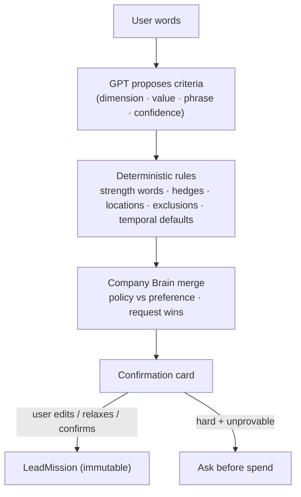
*Mission semantics.*

---

# Canonical Signal Vocabulary

Nine canonical **kinds**. Existing names are **not renamed**; each maps to a kind through one alias module.

| Kind | Lead mission types | `SIGNAL_EVENTS` | Capability ids | Actor evidence events | Playbooks | Signals V2 types |
|---|---|---|---|---|---|---|
| `hiring` | `hiring` | `hiring` | `hiring_verification`, `job_discovery` | `hiring` | `hiring` | `sales_hiring`, `revops_hiring`, `growth_hiring`, `founder_hiring_post` |
| `funding` | `funding` | `funding` | `funding_signal_discovery` (+ future `funding_verification`) | `funding` | `funding` | `recent_funding` |
| `product_launch` | `product_launch` | `product_launch` | `product_launch_discovery`, `product_launch_verification` | `product_launch` | `news` | `product_launch`, `major_release`, `new_integration`, `category_expansion` |
| `expansion` | `expansion` | `expansion` | `expansion_signal_discovery`, `expansion_signal_verification` | `expansion` | `news` | `market_expansion`, `geographic_expansion` |
| `headcount_growth` | *(add as recognised)* | `headcount_change` | *(future stored-evidence route)* | — | — | `employee_growth` |
| `leadership_change` | `leadership_change` | `leadership_change` | *(future)* | `leadership_change` | — | `new_revenue_leader`, `role_changed`, `person_left_company` (risk) |
| `technology` | `technology` | `technology` | `technology_verification` | `technology` | — | — |
| `social_activity` | *(add as recognised)* | `post`, `comment` | `company_post_verification` | `post`, `comment` | `social` | founder-intent types, engagement types |
| `company_profile` | — | — | `startup_company_discovery`, `general_company_discovery`, `known_company_resolution` | — | `supplied_company` | — |

Rules: subtypes are **kept** (a `revops_hiring` event is not evidence for a growth-marketer mission — the subtype maps to a role family); risk types map to **disqualifiers**, not signals; an unmapped phrase is recorded as `unrecognised_signal` and shown on the card (never dropped). One test asserts every member of every vocabulary maps to exactly one kind (extends `signalVocabularyAlignment.test.ts`).

---

# Retrieval Anchor Model

**Anchor** = the canonical kind whose evidence defines the population, and therefore the first source. Each mission has one **primary anchor** and at most one **secondary anchor** (hybrid). Other criteria are proven later by evidence completion.

**Anchor selection (deterministic)**

1. If the user supplied companies → `company_profile` (known companies).
2. Else take the `target`/`hard` criteria whose kind is anchor-able **and ready** (see readiness matrix).
3. Prefer the criterion the user's sentence is *about* (the activity: hiring, raised, launched); tie-break by source specificity (fewer, better rows) then unit cost.
4. A `hard` stage/funding criterion that only a funding route can prove forces `funding` as primary or secondary.
5. If no anchor-able criterion is ready → `company_profile` fallback, and the card states *"searched by company profile; <signal> will be checked per company"* — or, if that signal is `hard` and unprovable per company → ask.
6. A hybrid (two anchors) is allowed only when both are ready and the second covers a `hard` criterion the first cannot prove.

**Anchor enablement contract — all must hold, per anchor, before the router may select it:**

| # | Gate | Evidence of readiness |
|---|---|---|
| E1 | Capability exists in the graph | registry entry |
| E2 | Provider available (token, actor reachable) | health check (free metadata GET) |
| E3 | Verified input contract (V2 catalog card + `actorInputContracts` entry) | card with `verified_at` |
| E4 | Engine executor exists for the capability | in `ENGINE_DRIVEN_DISCOVERY` / verification set, with a test |
| E5 | Normaliser for the result rows | normaliser + fixture |
| E6 | Company extraction yields a canonical company (URL/domain/name+location) | extraction test on fixtures |
| E7 | Cost model (unit price, start fee, per-call ceiling) | pricing from the actor's `pricingInfo` |
| E8 | Replay fixture + acceptance test | fixture in `tests/fixtures/lead-v2/<anchor>/` |

Anchor states: **`ready`**, **`partially_supported`** (discovery ready, verification not — or the reverse), **`needs_provider_work`**, **`needs_extraction_work`**, **`deferred`**. Only `ready` anchors are selectable; the others are shown truthfully on the card.

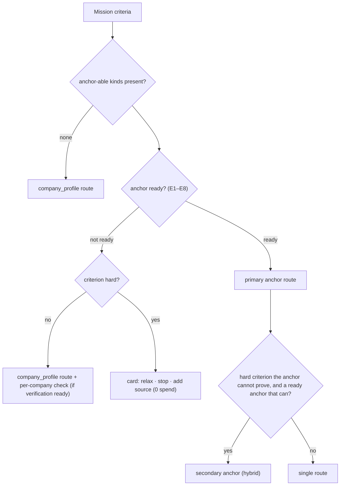
*Anchor routing.*

---

# Anchor Readiness Matrix

State at the start of implementation (verified against code at `125f0cfa`):

| Anchor | Natural first source | Provider today | E1 | E2 | E3 | E4 | E5 | E6 | E7 | State | Enabled in phase |
|---|---|---|---|---|---|---|---|---|---|---|---|
| `company_profile` | company directories / search | memo23, LinkedIn company search | ✅ | ✅ | ✅ | ✅ | ✅ | ✅ | ✅ | **ready** | now |
| `funding` (discovery) | funding-round index | datahyena funding rounds | ✅ | ✅ | ✅ | ✅ | ✅ | ✅ | ✅ ($0.045/record) | **ready** | now |
| `funding` (verification of a known company) | funding source with company input | none | ❌ | — | — | — | — | — | — | **needs_provider_work** | P6 |
| `hiring` (discovery) | job postings | V1-only job actors (`apify_jobs`, `apify_linkedin_jobs_crawlworks`, `apify_indeed_jobs_automation_lab`, `apify_glassdoor_jobs`, curious-coder LinkedIn jobs) | ✅ (`job_discovery`) | ✅ | ❌ | ❌ (skipped) | ✅ (`normalizeApifyJobRow`) | ◐ (company + company LinkedIn URL on V1 rows) | ❌ | **needs_provider_work** | **P3** |
| `hiring` (verification) | company-scoped job search | `apify_linkedin_job_search` | ✅ | ✅ | ✅ | ✅ | ✅ | n/a | ✅ | **ready** (verification) | now |
| `product_launch` | news / launch evidence | Google News | ✅ | ✅ | ✅ | ❌ (`unhandled capability`) | ✅ (`normalizeNewsArticle`) | ❌ (no company field) | ❌ (not recorded) | **needs_extraction_work** | P7 |
| `expansion` | news / announcements | Google News | ✅ | ✅ | ✅ | ❌ (explicit skip) | ✅ | ❌ | ❌ | **needs_extraction_work** | P7 |
| `headcount_growth` | stored headcount series | `company_headcount_snapshots` + `headcountGrowth.ts` | ❌ | ✅ | n/a | ❌ | ✅ | ✅ | free | **needs_engine_work**; as an *anchor* only when stored coverage suffices | P8 |
| `leadership_change` | role-change data / people / news | people actors (unlock-gated), news | ❌ | ◐ | ◐ | ❌ | ◐ | ◐ | ◐ | **deferred** | P9 (if a direct evidence route is proven) |
| `technology` (discovery) | reverse install index | none (BuiltWith is domain→tech) | ❌ | — | — | — | — | — | — | **deferred** (needs new provider) | P9 (if provider) |
| `technology` (verification) | domain → tech | BuiltWith | ✅ | ✅ | ✅ | ❌ (`unhandled capability`) | — | n/a | ❌ | **needs_engine_work** | P9 |
| `social_activity` | post search | LinkedIn post search / company posts | ◐ | ✅ | ✅ | ❌ | ✅ (`normalizeSocialPost`) | ❌ (attribution) | ◐ | **deferred** | after P9 |

---

# RetrievalPlan

The single source of truth for what the mission searches. Immutable per version.

```ts
interface RetrievalPlan {
  plan_id: string; mission_id: string; mission_hash: string; version: number;
  anchors: { primary: CanonicalKind; secondary: CanonicalKind | null; reasons: string[] };
  routes: Route[];                           // one per anchor route
  evidence_policy: {
    dimensions_required: string[];           // from hard + target criteria
    team_composition: "not_needed" | "shortlisted_only";
    freshness: Record<string, number>;       // days per dimension
  };
  ceilings: Ceilings;                        // see Cost and Idempotency
  execution_limit: number | null;            // canary limit — never changes mission.requested_count
  created_by: "retrieval_planner" | "amendment";
  amendment: PlanAmendment | null;           // the amendment that produced this version (inline)
  hash: string;                              // canonical hash of everything above
}

interface Route {
  route_id: string; anchor: CanonicalKind; capability: string; provider: string;
  query_families: Array<{ family_id: string; purpose: "exact" | "adjacent";
                          terms: string[]; filters: Record<string, unknown>;
                          relaxations: Array<{ criterion_id: string; description: string }> }>;
  page_cap: number; route_ceiling_usd: number;
}
```

**Rules**
- The **Retrieval Planner** (GPT) proposes routes' query families and terms; code fills providers, filters from hard criteria, ceilings and caps, and validates.
- **Validation** rejects: empty or non-narrowing queries; dropped expressible hard constraints; adjacent families without named relaxations; routes on non-ready anchors; ceilings above mission limits.
- `mission.requested_count` sizes pools (e.g. admitted target = requested × 3, bounded by ceilings); `execution_limit` only caps delivery.
- The plan is persisted in `lead_plan_versions` before the first paid call. The checkpoint stores only `(plan_id, version)`.

---

# Plan Amendments

The only legal change to a plan. Stored inline with the version it produces.

```ts
interface PlanAmendment {
  from_version: number; to_version: number;
  trigger: "insufficient_candidates" | "route_exhausted" | "route_low_yield" | "evidence_unavailable"
         | "provider_failed" | "provider_limit" | "safety_clamp" | "user_decision";
  component: "retrieval_controller" | "validator" | "budget_policy" | "user";
  changes: Array<{ path: string; before: unknown; after: unknown; reason: string }>;
  rationale: string;                         // model text when a model proposed it
  approved_by: "code_policy" | "user";
  created_at: string;
}
```

- **Change detection = canonical hash of the whole plan**, never a projection (the capability-list comparison is deleted).
- **Operational triggers** (`provider_limit`, `safety_clamp`) may change only operational fields (page caps, batch sizes, max items). They may never change query terms, geography, industry, stage, evidence requirements or anchors.
- **Semantic changes** (new query family, new route) require `insufficient_candidates`, `route_exhausted`, `route_low_yield` or `user_decision`, pass validation, and fit the adaptive reserve.
- **Mission criteria never change by amendment**, except `user_decision` from the card (e.g. relaxing an unprovable hard constraint).

---

# ProviderCallSpec

Every Lead retrieval and evidence provider call is compiled into a spec and **persisted before the network call**.

```ts
interface ProviderCallSpec {
  provider_call_id: string;                  // ULID, pre-assigned
  mission_id: string; plan_id: string; plan_version: number;
  route_id: string | null; candidate_key: string | null; gap_id: string | null;
  purpose: "discovery" | "identity" | "enrichment" | "hiring_evidence" | "funding_evidence"
         | "news_evidence" | "team_composition" | "technology_evidence";
  provider: "apify" | "firecrawl"; actor: string;
  query: { terms: string[] } | null; filters: Record<string, unknown>;
  location: string[] | null; employee_bounds: { min: number | null; max: number | null } | null;
  max_items: number; mode: string | null; page: number;
  required_fields: string[];                 // asserted against the card
  provenance: Array<{ field: string;
    source: "mission" | "retrieval_planner" | "validator" | "budget_policy" | "provider_contract"
          | "identity_strategy" | "amendment";
    before?: unknown; after: unknown; reason: string; amendment_version?: number }>;
  serialized_input: Record<string, unknown>; // exact JSON to be sent
  idempotency_key: string;
  cost: { estimate_usd: number; ceiling_usd: number };
  status: "intended" | "adopted" | "running" | "succeeded" | "failed" | "refused_budget";
}
```

- **Storage:** a row in `lead_execution_calls` (existing table) with added columns `provider_call_id`, `plan_version`, `route_id`, `settled_usd`, `settlement_source`, `variance_usd`; `request_input` holds spec + provenance + `serialized_input`.
- **Serialisers** (`hiringActorInputs.ts` compilers) are pure: spec → JSON. They may drop or reformat only fields the actor genuinely lacks, and each drop is a provenance entry with `source: provider_contract`.
- **Scope:** all Lead retrieval and evidence calls. Pilot preview, Brain setup, lead actions and founder unlock keep using `runTool` directly until they are migrated by name.

---

# Cost and Idempotency

**Absolute ceilings — no percentage split. Unused budget stays unused.**

```ts
interface Ceilings {
  mission_provider_usd: number;       // default 2.00 (canary 1.50)
  mission_model_usd: number;          // default 0.40
  per_route_usd: Record<string, number>;
  per_call_usd: Record<string, number>;
  per_candidate_evidence_usd: number; // default 0.06 (+0.03 team composition when required)
  adaptive_reserve_usd: number;       // default 0.30 — only for justified amendments
}
```

| Ceiling | Default | Grounding |
|---|---|---|
| Mission provider | $2.00 (canary $1.50) | audited missions spent $0.36–$0.59 Apify |
| Mission model | $0.40 | audited missions $0.07–$0.09 |
| Route: company profile | $0.40 | memo23 $0.008 start + $0.001/row |
| Route: hiring (jobs) | $0.50 | set from the carded actor's `pricingInfo` in P3 |
| Route: funding | $0.90 (≈ 20 records) | datahyena $0.045/record |
| Per call: identity search | $0.03 | full-mode rows $0.004 each; common-word names capped at 5 rows |
| Per call: enrichment batch | $0.05 | ≈ $0.004/company |
| Per candidate evidence | $0.06 (+ $0.03 team composition) | identity + enrichment + one targeted check |
| Adaptive reserve | $0.30 | at most two justified amendments |

**Reservation:** before each call, reserve the spec's `ceiling_usd` against call → candidate → route → mission ceilings (and credits via `credits_reserve`). If any would be exceeded, the call is `refused_budget` and never executes.

**Yield-based route stopping.** Per route, after each page, compute: spend, raw rows, unique companies, duplicates, hard-eligible companies, useful opportunities (label ≥ Worth Considering, known once reasoned; until then hard-eligible is the proxy), and **cost per useful company**. Stop the route when any of:
- novelty (unique new ÷ raw) < 0.2 on the last page;
- hard-eligible rate < 0.1 after ≥ 20 raw rows;
- cost per hard-eligible > 3× the best running route (hybrid only);
- route ceiling reached, provider exhausted, or page cap reached.

**Idempotency.** `idempotency_key = sha256(workspace_id : lineage_id : provider : actor : purpose : canonical_json(serialized_input minus page) : page)`. A partial unique index on `lead_execution_calls (workspace_id, lineage_id, idempotency_key)` for provider calls. Before calling: if a `succeeded` row exists → adopt its dataset (`status: adopted`, cost 0); if `running` under a live lease → wait/skip. The query-family semantic guard (`memo23QueryFamily`) stays as a planning-time check.

**Settlement.** At completion the run document gives a provisional cost. A settlement pass re-reads the provider receipt until `usageTotalUsd` stops changing (bounded retries; a sweeper settles missions that ended early) → `settled_usd`, `settlement_source: provider_receipt`. If unavailable: `max(reported, events × price, rows × price, estimate)` with `settlement_source: derived_floor`. Firecrawl calls are priced through `firecrawlCostModel.priceFirecrawlCall`. **Unknown is a status, never $0.** Model calls keep the on-exit drain.

**Ceiling behaviour if a meter fails.** If spend cannot be read or `unknown`-status rows exceed $0.10, the mission finishes the current call and pauses with `spend_unverifiable` — it does not continue blind. The workspace model ceiling counts floors, not zeros, and gains per-feature sub-budgets (Leads / Content / Brain / Pilot).

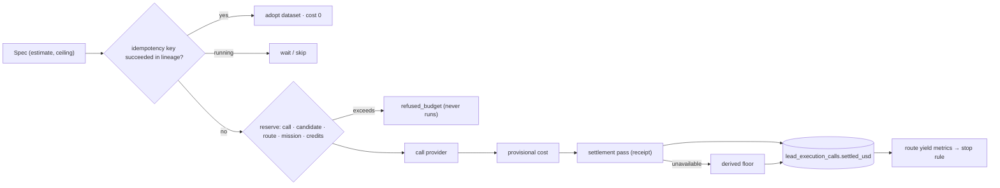
*Cost / idempotency.*

---

# Candidate Identity and Union

**Canonical identity strategy (defined in P2, used by every route):**

1. **Company LinkedIn URL** (normalised) — strongest; job rows, identity search and enrichment supply it.
2. **Canonical domain** (registrable domain of the website) — second.
3. **Provisional key** `name + country` — only until 1 or 2 is known; never merges with a different domain.

- **Merge rule:** two records are one company if they share a LinkedIn URL **or** a canonical domain. On merge, route provenance is unioned (`found_by: [hiring_route, funding_route]`) and evidence items are re-keyed.
- **Identity resolution** (existing domain rule, `acceptLinkedInMatch`) runs only when a record lacks a LinkedIn URL. **A provider row that already carries the employer LinkedIn URL skips identity search.**
- **Aggregator / staffing filter** (`extractAggregatorEvidence`) runs **before** identity spend on job-derived records; a posting company that is an agency is not the employer.
- **Common-word guard:** name-only searches for dictionary words use `maxItems 5` and require location or domain corroboration.
- **Dedupe across attempts:** the union persists in the checkpoint; resumed slices extend it, never rebuild it.

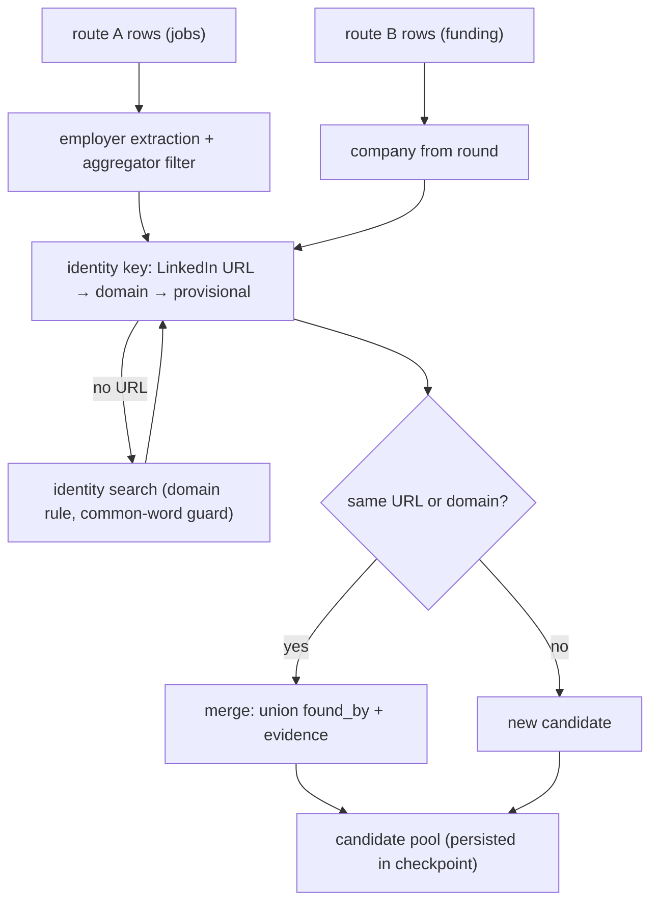
*Candidate union.*

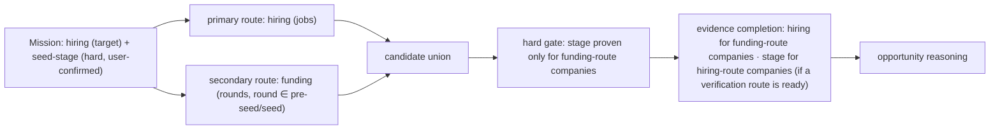
*Hybrid retrieval.*

---

# Evidence Model

One representation for everything the system knows about a company.

```ts
interface EvidenceItem {
  evidence_id: string; workspace_id: string; company_key: string;
  dimension: "identity" | "geography" | "industry" | "business_model" | "headcount" | "headcount_growth"
           | "funding" | "company_stage" | "hiring" | "job" | "team_composition" | "marketing_function"
           | "founder_led_gtm" | "product_launch" | "expansion" | "leadership_change" | "technology"
           | "web_claim";
  value: unknown;                            // typed per dimension
  status: "proven" | "disproven" | "plausible" | "unknown";
  source: { provider: string; actor: string | null; provider_call_id: string | null;
            url: string | null; excerpt: string | null };
  method: "provider_field" | "deterministic_derivation" | "model_extraction";
  observed_at: string; valid_until: string | null;   // freshness
  confidence: "high" | "medium" | "low";
  derived_from: string[];                    // evidence_ids
  mission_id: string | null;                 // provenance only; facts are company-scoped
  origin: "lead_mission" | "signals" | "enrichment" | "web";
}
```

**Storage decisions**

| Store | Role |
|---|---|
| in-engine evidence registry (`evidence_type`, `evidence_id`) | in-flight working copy (exists; qualification already cites it) |
| **`lead_evidence`** (existing) | **canonical persisted evidence**, company-scoped. Add columns: `company_key`, `mission_id` (nullable), `method`, `derived_from` (jsonb), `valid_until`, `origin`. Written with `origin: lead_mission`; namespaced dedupe key so Signals V2 rows never collide |
| mission judgments (labels, cited claims, gaps) | mission-scoped in the task projection and `lead_candidates.raw` — never in `lead_evidence` |
| `company_web_evidence` | page cache (TTL per intent); extracted claims become evidence items citing the page |
| `company_headcount_snapshots` | time series; growth written as a derived evidence item |
| `signal_events` | Signals-owned; read through a data contract (see Signals Integration) |

**Freshness** (days `valid_until` from `observed_at`): identity 365 · industry 365 · headcount 30 · headcount_growth 90 · funding 180 · company_stage 180 · hiring/job 30 · team_composition 90 · product_launch/expansion = the criterion's window · technology 180. Stale evidence may be shown but cannot support Exact Match or Strong Opportunity.

**Conflicts** are kept, not resolved on write. The view chooses by method (`provider_field` > `deterministic_derivation` > `model_extraction`), then confidence, then recency, and surfaces the conflict (e.g. YC `teamSize` 1 vs LinkedIn 1,709).

**GPT never writes evidence.** Model extraction produces an item only with a stored excerpt from a fetched page; reasoning produces *claims* that cite evidence ids.

---

# Targeted Evidence Completion

After identity and the cheap hard gate, each candidate has a **gap list**: required dimensions (from hard and target criteria) that are `unknown` or stale.

**Order per gap, cheapest sufficient first:**
1. fresh stored evidence (`lead_evidence`, headcount snapshots, `signal_events` via contract);
2. cached pages (`company_web_evidence`) + extraction;
3. the cheapest ready verification provider for that dimension;
4. an expensive provider — only for shortlisted candidates, within the per-candidate ceiling.

**Selection:** candidates are completed in rank order (hard-eligible first, then by coverage and signal strength) until the evidence ceilings or the needed pool size is reached. A gap is closed as `proven`, `disproven`, or `unavailable` (no ready source) — `unavailable` is recorded, never retried in a loop.

**Team-composition policy (locked).** Team-composition evidence (existing employees' titles → "first marketing hire", "no existing marketing leader", "founder-led GTM") is **in scope only when**:
- a criterion in the mission requires it (e.g. *first* growth hire, no marketing leader, founder-led GTM); **and**
- the candidate has passed identity, hard eligibility and basic company evidence; **and**
- the candidate is **shortlisted** (top-N, default N = 10); **and**
- the per-candidate team-composition ceiling ($0.03) remains.

It is never a discovery-stage call and never runs over the whole pool. It records **aggregate role presence** (e.g. "no marketing/growth titles among 12 employees") as evidence — not personal contact data. It is separate from the post-qualification founder unlock, which remains a user-initiated people stage.

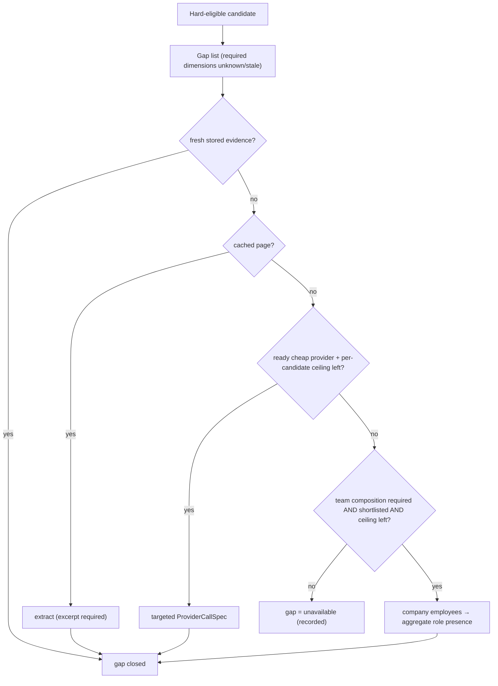
*Evidence completion.*

---

# Eligibility

Code-only, deterministic, evaluated per candidate over evidence items:

| Result | Rule |
|---|---|
| **eligible** | every `hard` criterion `proven` (fresh) |
| **pending** | no `hard` criterion disproven; ≥ 1 `hard` criterion `unknown` → candidate goes to evidence completion for those dimensions |
| **ineligible** | any `hard` criterion `disproven` |

**Cheap hard gate:** before any paid identity/enrichment, hard criteria checkable from discovery rows are applied (explicit non-US location, excluded industry, headcount ≥ 3× a hard size bound, no open roles when hiring is hard). Low-confidence facts (e.g. YC `teamSize`) can only *defer* to enrichment, never reject — except the 3× rule.

`target`, `opportunity_signal` and `hypothesis` criteria **never** make a candidate ineligible.

---

# Opportunity Reasoning

**Code** computes eligibility, the **maximum label** (ceiling), `evidence_coverage` (0–1) and `signal_strength`. **GPT** chooses a label **at or below** the ceiling and writes cited reasons.

| Label | Ceiling rule (all required) | Evidence floor | Allowed gaps |
|---|---|---|---|
| **EXACT MATCH** | eligible; all `target` criteria proven and fresh; anchor signal proven within window | ≥ 1 cited item per criterion | none |
| **STRONG OPPORTUNITY** | eligible; anchor signal proven within window; ≤ 1 `target` unproven; none disproven | anchor item + all hard items cited | one unproven target |
| **WORTH CONSIDERING** | eligible; anchor signal **or** ≥ 1 opportunity signal proven | ≥ 1 cited signal item | several unproven targets or one disproven target |
| **LOW PRIORITY** | eligible; no fresh anchor/opportunity signal | hard items | many |
| **INELIGIBLE** | any hard criterion disproven — a disposition, not surfaced as a lead (counted, reason shown) | the disproving item | — |
| *(pending)* | a hard criterion unknown after completion ceilings — shown as "needs verification", never as a match | — | — |

**GPT cannot:** override a failed hard constraint; hide missing evidence (the "missing" list is generated by code from gaps); invent positive evidence (every "why surfaced" sentence must cite existing evidence ids — validated with the `groundedClaims` rules; invalid sentences are removed and the label drops one level if none remain); promote beyond the ceiling; use stale evidence to support Exact/Strong. Hypotheses may appear only as "possible reason to reach out", citing their proxy signals.

**Scores** are separate from labels and deterministic. Ranking within a label: coverage, then anchor freshness, then signal strength.

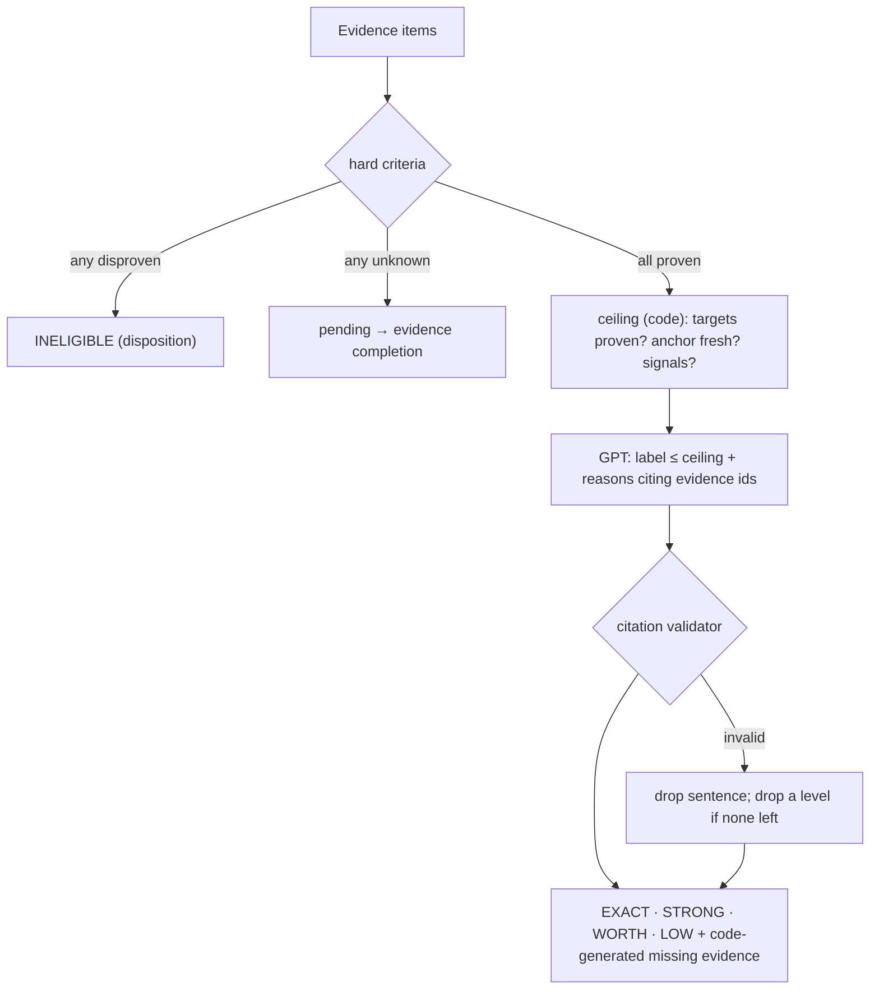
*Opportunity evaluation.*

---

# Workbench Contract

One backend projection owns every number.

```ts
interface WorkbenchMissionView {
  mission: { requested_count: number; execution_limit: number | null;
             criteria: Array<{ id: string; label: string; type: CriterionType; source: CriterionSource;
                               window: string | null; status: "verified" | "partial" | "unverifiable" }>;
             unsupported: string[] };            // e.g. "technology discovery not available"
  stage: "planning" | "retrieving" | "completing_evidence" | "reasoning" | "complete" | "stopped";
  counts: {                                      // mutually exclusive; sum = discovered
    discovered: number; screened_out: number; investigating: number; identity_unresolved: number;
    pending: number; exact_match: number; strong_opportunity: number; worth_considering: number;
    low_priority: number; ineligible: number;
  };
  leads: Array<{
    company: { name: string; domain: string | null; linkedin_url: string | null };
    label: Label | null; found_by: string[];     // routes
    hard_checks: Record<string, "pass" | "fail" | "unknown">;
    why_surfaced: Array<{ text: string; evidence_ids: string[] }>;
    key_evidence: EvidenceSummary[]; missing_evidence: string[]; caveats: string[];
    evidence_coverage: number; next_action: string | null;
  }>;
  routes: Array<{ route_id: string; anchor: string; spend_usd: number; raw: number; unique: number;
                  duplicates: number; hard_eligible: number; useful: number; stop_reason: string | null }>;
  cost: { provider_settled_usd: number; provider_pending_usd: number; model_usd: number;
          unknown_cost_calls: number; credits: number };
}
```

Compatibility: during migration the same function also writes `workbench_evaluation_rows`, `workbench_portfolio`, `workbench_progress` and `company_first`, derived from the same source, so the current `LeadResultsView` keeps working until the new view ships. `progress` stops being an independent count source.

---

# Continuation / Retry / Adaptation

| Concept | Trigger | Consumes retry budget | May change the plan |
|---|---|---|---|
| **Continuation** | worker slice deadline / lease release | **no** | **no** — resumes plan version, pool, evidence, gaps, route telemetry, ceilings |
| **Retry** | execution fault: provider error, transport failure, worker crash, lease loss | **yes** (3 per mission) | no |
| **Repair** | plan invalid before spend | no (1 round) | yes (new version, `user_decision`/validator) |
| **Adaptation** | all routes stopped and quota unmet, reserve left | no (≤ 2 amendments) | yes (amendment with trigger) |
| **Terminal** | quota met · ceilings reached · infeasible · retries exhausted · user cancel | — | — |

Continuation restores: mission, plan version, route telemetry and stop states, specs (intended/running/completed), candidate union, evidence items, gaps, remaining ceilings. It **never calls a planner**. The V2 queue's `attempts` counts retries only; slices are bounded by a mission wall-clock budget (default 30 min) and ceilings.

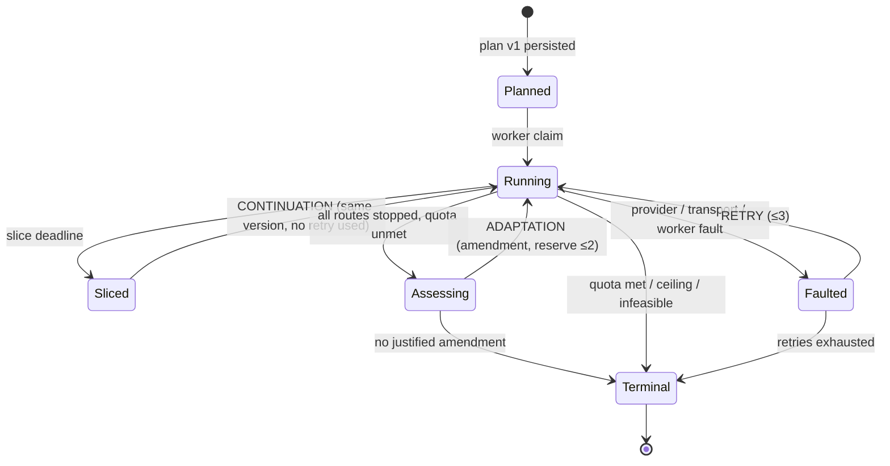
*Continuation.*

---

# Signals Integration

- **Direction:** Lead V2 **reads stored Signals data through versioned data contracts**; it never calls Signals code paths at runtime.
- **Contracts:** a read view (or typed query module) over `signal_events` mapped to canonical kinds with `subject_key`, `occurred_at`, `freshness`, `confidence`, `verification_status`; a read module over `company_headcount_snapshots` with `evaluateHeadcountGrowth`.
- **Use:** as the first step of evidence completion for any matching dimension, and (P8) as a retrieval source when stored coverage is sufficient.
- **Writes:** Leads keeps writing qualified signal assessments to `signal_events` with `origin: lead_mission` (existing behaviour) — unchanged.
- **No new runtime coupling:** the existing reverse coupling (monitoring calling the lead engine) is isolated behind a `MonitoringRetrievalPort` in P0.
- The unused `signalsToLeads.openInLeads` bridge is left untouched until a product decision uses it.

---

# Company Brain Rules

| Brain element | Classified as | Effect |
|---|---|---|
| ICP industries, business models | `company_brain_preference` → `target` | ranking only |
| Size bounds (e.g. 1–150) | `company_brain_preference` → `target` unless the request states size | ranking; never a discovery filter unless user-confirmed |
| Disqualifier keywords / negative industries | `company_brain_policy` → `hard` **unless the request contradicts** (industry precedence) | exclusion, shown on card |
| Brain `hard_constraints` list | `company_brain_policy` only if the Brain is `enforced` **and** the request does not contradict | shown on card; user can override |
| Brain context for planners | context only | never alters criteria |

Every Brain-derived criterion appears on the confirmation card with its source. A Brain rule that would narrow the mission is never applied silently. (Workspace `e8af257d`'s Brain targets recruiting agencies — a direct example of why this must be visible.)

---

# Shared-System Isolation

| Shared system | Contract to protect | Guard (added in P0 unless stated) |
|---|---|---|
| Signals monitoring (`run-monitoring-scan`) | uses `runCapabilityPlan`, discovery planner, graph | `MonitoringRetrievalPort` facade + contract test; Lead V2 changes go behind it |
| Pilot preview (`pilot-chat`) | mission compile + preview must equal execution | one shared feasibility/preview module (P1) |
| orchestrate | kickoff body, V1/V2 routing | versioned kickoff contract test |
| run-agent | V1 routes, other agents | V2 changes behind `LEAD_V2_*` flags; V1 untouched |
| Railway worker | in-process run-agent (303 modules) | worker smoke test per phase |
| V1 Leads | shared engine, `actorRegistry` job actors | V1 frozen; no V1 actor deleted while carding one for V2 |
| `toolRegistry.runTool` | transport for 5+ features | no contract change; new compiler sits above it |
| credits (`credits_reserve/finalize`) | RPC contract | reserve per spec; RPC unchanged |
| `modelSpendCeiling` | workspace-wide | per-feature sub-budgets (P2) |
| Content, Brain draft, daily-brief | ledger + ceiling | contract tests |
| Company Brain | policy resolution | Brain rules above; industry precedence kept |
| Workbench | legacy keys | dual-write projection (P5) |
| `tasks_sweep_stuck_runs` | must not fail V2 tasks | exclude V2-owned tasks |
| `resume-stalled-leads`, `continue-workflow` | must not resume V2 tasks | keep `loadV2OwnedTaskIds` exclusion + test |

---

# Corrected P0-P9 Implementation Sequence

Each phase ships behind flags, keeps the current path running, adds regression coverage before replacing behaviour, and has a rollback. **No provider purchases in normal testing** — fixtures only; any live probe is named, bounded and approved.

### P0 — Safety, fixtures, coupling isolation, executability feasibility
- **Goal:** protect shared systems and stop today's silent-empty missions before adding architecture.
- **Scope:**
  - capture fixtures (inputs, datasets, receipts) from runs `4250f181`, `1e52d43c`, `9144eaa4` into `tests/fixtures/lead-v2/`;
  - freeze planning/query code in the engine (bug fixes only);
  - `MonitoringRetrievalPort` facade; contract tests for Pilot preview, orchestrate kickoff, `runTool` callers, credits, model ledger, V1 exclusion, sweepers;
  - sweeper excludes V2-owned tasks;
  - **executability feasibility:** `assessRequestFeasibility` returns `satisfied` only when E1–E5 hold for the scheduled capability (and E6 for discovery); new statuses `not_executable`, `needs_provider_work`, `partially_supported`;
  - the graph stops entering capabilities the engine cannot execute (product-launch/expansion discovery, technology/company-post verification) — missions fall back to company-profile + an explicit "not searched by this signal" disclosure, or ask when the signal is hard;
  - fix silent recovery-read errors (`[object Object]`).
- **Files:** `requestFeasibility.ts`, `leadCapabilityGraph.ts` (entry gating), `leadCapabilityEngine.ts` (no behaviour change except executability), `run-monitoring-scan`, `tasks_sweep_stuck_runs` migration, tests.
- **Schema:** sweeper SQL change only.
- **Rollback:** flag `LEAD_V2_EXECUTABILITY_GATE=observe|enforce`.
- **Exit gate:** fixtures replay offline; contract tests green; the four dead capabilities are reported truthfully (acceptance tests PL-0, TECH-0).

### P1 — Mission semantics + canonical signal mapping
- **Goal:** stable, visible intent.
- **Scope:** `Criterion` model (type, source, window, confidence, elevation); deterministic hardness rules; time-window defaults; hypothesis class; Company Brain rules; canonical kinds + alias module (no renames); `headcount_growth` and `social_activity` recognised; unknown signals recorded; confirmation card shows hard / target / signals / hypotheses / Brain-derived / unsupported; shared preview/feasibility module for Pilot and execution; `requested_count` vs `execution_limit` separation.
- **Files:** `leadMissionCompiler.ts`, `leadMission.ts`, new `missionCriteria.ts`, new `signalKinds.ts`, `missionConfirmationCard.ts`, `pilot-chat`.
- **Schema:** none (mission JSON is versioned: `lead_intelligence_contract_version` bump; old missions read through an adapter).
- **Rollback:** compiler flag; adapter reads both shapes.
- **Exit gate:** the six semantic examples compile as specified; Brain criteria visible; unknown signals surfaced.
- **Locked P1 deliverables (2026-09-15):**
  - canonical mission representation on every compiled mission: `goal`, `requested_count`, `criteria[]` (`kind` hard / target / opportunity_signal / hypothesis; `value`; `source` user_explicit / user_inferred / company_brain_policy / company_brain_preference / system_default; `time_window` where relevant; `confidence` when inferred) and canonical signals with their aliases;
  - interpretations that must hold: "hiring growth marketers" → hiring; "just hired a VP Sales" → `leadership_change`, never ordinary hiring; "recently funded" → funding + visible window; "opened a new office" → expansion / geographic_expansion; "likely to need a marketer soon" → hypothesis, not a verified signal; "ONLY seed-stage" → seed `hard`; "prefer seed-stage" → seed `target`;
  - unknown signal language never silently disappears — it is recorded and shown;
  - Company Brain additions carry provenance and never silently override explicit user intent;
  - the confirmation card shows hard constraints, target criteria, opportunity signals, hypotheses/assumptions, time windows and unsupported/unprovable requirements;
  - out of scope for P1: RetrievalPlan, ProviderCallSpec, hiring-first, new actor selection, multi-source execution, Opportunity Reasoner.

### P2 — RetrievalPlan + ProviderCallSpec + provenance + idempotency + cost caps + trace + identity strategy
- **Goal:** safety before breadth.
- **Scope:** `lead_plan_versions` (amendment inline); plan hashing; amendment rules; ProviderCallSpec persisted in `lead_execution_calls` before each call; per-field provenance; pure serialisers; idempotency key + unique index; ceilings (mission / route / call / candidate / reserve); reservation; receipt settlement + floors; Firecrawl pricing; per-feature model sub-budgets; `lead_mission_events`; canonical identity key strategy + common-word guard; continuation ≠ retry in the worker.
- **Order inside P2:** observe mode first (write plans/specs/events beside current behaviour), then enforce.
- **Files:** new `retrievalPlan.ts`, `providerCallSpec.ts`, `specCompiler.ts`, `budgetPolicy.ts`, `missionTrace.ts`, `candidateIdentity.ts`; `executionLedger.ts`, `providerCostModel.ts`, `modelSpendCeiling.ts`, `worker/main.ts`, engine call sites.
- **Schema:** new `lead_plan_versions`, `lead_mission_events`; `lead_execution_calls` + `provider_call_id`, `plan_version`, `route_id`, `settled_usd`, `settlement_source`, `variance_usd`; partial unique index on idempotency key.
- **Rollback:** `LEAD_V2_SPECS=observe|enforce`; tables are additive.
- **Exit gate:** every provider call joins a spec; the audited "input changed, logged no change" case produces a new version; duplicate execution impossible on resume (CONT-1, DUP-1); ledger within 2% of fixture receipts (COST-1).

### P3 — Hiring-first end-to-end (first signal-first canary)
- **Goal:** prove the architecture on the most common anchor.
- **Scope:**
  1. **Provider carding:** choose one job-discovery actor from the V1 set by field coverage — prefer rows carrying the **employer's company LinkedIn URL or domain** (the curious-coder LinkedIn jobs rows carry `company` + company `linkedinUrl`). Verify its live input schema and pricing from actor metadata (free GETs); one bounded, approved probe; add V2 card + contract + compiler (limits, pagination, window) + cost model.
  2. **Normaliser:** reuse `normalizeApifyJobRow` (V1) mapped to `NormalizedHiringJob`.
  3. **Employer extraction:** employer = row's company URL/domain; `extractAggregatorEvidence` removes staffing/aggregator posters; title match with `classifyTitle` + role families before admission.
  4. **Engine:** `job_discovery` joins `ENGINE_DRIVEN_DISCOVERY`; hiring anchor selectable.
  5. **Identity:** URL/domain rows skip identity search; name-only rows use the guarded search.
  6. **Hard gate:** US + B2B SaaS from job/company fields, then enrichment.
- **Files:** `hiringActorCatalog.ts`, `actorInputContracts.ts`, `hiringActorInputs.ts`, `apifyJobsNormalizer.ts`, `companyAggregatorEvidence.ts`, `leadCapabilityGraph.ts`, engine discovery branch.
- **Schema:** none.
- **Rollback:** `LEAD_V2_ANCHOR_HIRING=off` → company-profile route.
- **Exit gate:** HIRE-1 passes on fixtures, then one internal canary within ceilings.

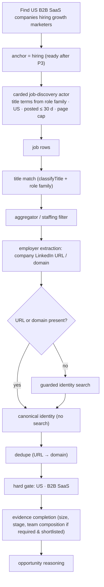
*Hiring-first.*

### P4 — Candidate union + evidence system + targeted evidence completion
- **Scope:** cross-route union with `found_by`; `lead_evidence` columns + writer; stored-evidence reads (own `lead_evidence`, snapshots, `signal_events` contract); gap lists; completion order; per-candidate ceilings; team-composition policy; cheap hard gate.
- **Schema:** `lead_evidence` + `company_key`, `mission_id`, `method`, `derived_from`, `valid_until`, `origin`.
- **Exit gate:** no duplicate companies across routes (UNION-1); evidence calls only for gaps (EVID-1); team composition only for shortlisted candidates that need it (TEAM-1).

### P5 — Eligibility + Opportunity Reasoner + Workbench
- **Scope:** eligibility/pending/ineligible; label ceilings and floors; grounded reasoner (reuse `groundedClaims`, `opportunityPortfolio`); `WorkbenchMissionView` + legacy dual-write; one count owner.
- **Exit gate:** SEM-1 (hard vs preference), WORTH-1, WB-1.

### P6 — Funding hybrid + seed-stage semantics
- **Scope:** funding-first unchanged; hybrid (hiring + funding) with union; `funding_verification` capability enabled **only** when a provider with company input is carded (evaluate candidates; until then funding for other-route companies = `unknown`/`plausible` via news); **seed-stage defined separately:** `company_stage = seed` requires a round with `round_stage ∈ {pre-seed, seed}` and no later round, dated within 24 months; "recent funding" = any round within the window. Proxies (YC batch ≤ 24 months, headcount ≤ 25) produce a `hypothesis`-level "likely early-stage", never `proven`.
- **Exit gate:** FUND-1, HYB-1, SEED-1.

### P7 — News / product launch / expansion
- **Scope:** article retrieval → **company extraction** (subject company from title/lead with an extraction test set; model extraction requires excerpt) → attribution confidence → canonical identity → freshness window → evidence; enable `product_launch` and `expansion` anchors only after E6 passes on fixtures; company-post verification executor.
- **Exit gate:** PL-1, EXP-1 (no attribution false positives on the fixture set).

### P8 — Stored signals / headcount retrieval
- **Scope:** headcount-growth derivation from snapshots via contract; `signal_events` retrieval by kind; `headcount_growth` anchor enabled only when stored coverage for the mission's population ≥ a threshold (default: ≥ 50 companies with ≥ 2 readings ≥ 60 days apart); otherwise stored-evidence-only + truthful limitation.
- **Exit gate:** HC-1.

### P9 — Leadership / technology where provider-ready + final cutover + deletion of old ownership
- **Scope:** leadership-change anchor only with a direct evidence route (role-change data or news-extracted appointments) — separate from founder unlock; technology verification executor (BuiltWith, domain → tech); technology-first only with a genuine reverse-discovery provider; final cutover; deletions (see *Old Ownership to Remove*).
- **Exit gate:** LEAD-1/TECH-1 pass (truthfully, whether supported or not); all release gates green; equivalence on canaries.

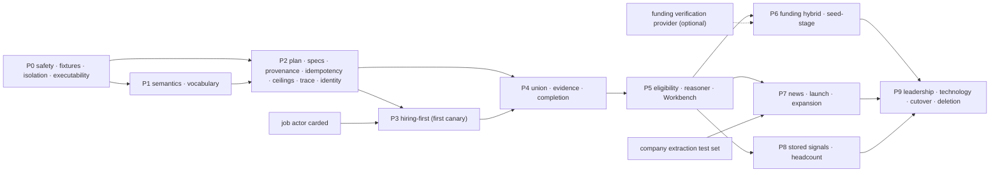
*Phased migration.*

---

# Acceptance Missions

All are **hard release gates**, run first on fixtures (no spend) and then as bounded canaries where marked. "Truthful" means: the card or result states the limitation before spend, the mission ends with a named reason, and no generic search is presented as proof.

| Gate | Mission / scenario | Phase | Pass criteria |
|---|---|---|---|
| **HIRE-1** hiring-first | "Find US B2B SaaS companies hiring growth marketers." | P3 | first provider call is the job-discovery route; employers from job rows; ≥ 70% identities from row URL/domain without search; staffing posters excluded; US + B2B SaaS hard-checked; results labelled with cited open roles; within ceilings |
| **FUND-1** funding-first | "Find US B2B SaaS companies that recently raised." | P6 (works earlier) | first call is the funding route; window 180 d shown; rounds cited; no company-profile discovery before funding |
| **HYB-1** hiring + funding hybrid | "Find ONLY seed-stage US B2B SaaS startups hiring their first growth marketer." | P6 | card confirms seed-stage as hard; two routes; union dedupes; stage proven only where a round exists; team composition checked only for shortlisted; no label above ceiling |
| **SEED-1** seed vs recent funding | "seed-stage startups" vs "startups that recently raised" | P6 | different criteria, different evidence rules |
| **PL-0** product launch (before P7) | "Find AI companies that launched a new product recently." | P0 | truthful: anchor unavailable disclosed; no silent empty run; feasibility not `satisfied` |
| **PL-1** product-launch-first | same | P7 | news route first; company extracted with attribution confidence; freshness 90 d; cited articles |
| **HC-1** headcount growth | "Find SaaS companies rapidly expanding headcount." | P0 truthful → P8 | threshold + window shown; stored evidence read first; if coverage insufficient → truthful limitation, not a generic search presented as growth |
| **LEAD-1** leadership change | "Find SaaS companies that recently hired a VP Sales." | P0 truthful → P9 | truthful limitation until a direct evidence route exists; never silently company-search |
| **TECH-0/1** technology | "Find US companies using Snowflake." | P0 truthful → P9 | no reverse provider → limitation stated; company-profile fallback only if the user accepts it, and then technology is verified per domain (after executor) and never claimed from the search |
| **CONT-1** continuation | any mission across ≥ 3 worker slices | P2 | same plan version across slices; no planner call on resume; no retry consumed by slicing |
| **DUP-1** duplicate prevention | resume after a completed provider call; identical spec twice | P2 | adoption, cost 0; DB constraint blocks re-execution |
| **SEM-1** hard vs preference | the six semantic examples | P1/P5 | compile as specified; preferences never reject; hard disproven → ineligible |
| **WORTH-1** worth considering | fixture company: hard proven, anchor missing, funding signal proven | P5 | labelled Worth Considering with cited signal and code-listed gaps |
| **WB-1** Workbench reconciliation | any completed mission | P5 | counts mutually exclusive and sum to discovered; legacy keys agree |
| **COST-1** cost reconciliation | fixture receipts of `1e52d43c` + a canary | P2 | settled ledger within 2% of provider receipts; no unknown settled as $0; Firecrawl priced |
| **UNION-1 / EVID-1 / TEAM-1** | multi-route fixture | P4 | no duplicates; evidence only for gaps; team composition bounded |

---

# Regression Strategy

- **Fixtures first:** every provider interaction used in tests is a captured fixture (input JSON, dataset rows, run document, receipt). New anchors add fixtures before code (E8).
- **Suites:** mission compilation (semantic table), vocabulary mapping (every name maps to one kind), feasibility executability (each dead capability), plan hashing/amendments, spec compilation (golden JSON; purity property test), idempotency, ceilings/reservation, settlement, identity/union, aggregator filter, evidence freshness/conflicts, eligibility, label ceilings + citation validator, Workbench counts, continuation, shared-system contracts.
- **Replay harness:** runs a whole mission offline over fixtures and asserts final labels, counts, spend and events.
- **Revert tests:** for every invariant, deliberately break it once and confirm a test fails.
- **Existing suites** (edge, frontend, infra, worker, build) stay green every phase; old names remain valid through aliases.

---

# Canary Strategy

1. **Observe:** P0–P2 changes run in observe mode on the internal workspace; compare recorded plans/specs to executed calls; zero extra spend.
2. **Shadow:** new plans generated beside current missions; diffs reviewed.
3. **Hiring-first canary (P3):** internal workspace, HIRE-1 wording, mission ceiling $1.50, execution limit 3, gate in enforce. Pass → proceed.
4. **Multi-route canary (P6):** HYB-1 wording, same ceilings.
5. **Anchor canaries** (P7, P8) only after their fixtures pass.
6. **Rollout:** widen the V2 allowlist; old path kept one release behind flags.
7. **Stop conditions:** any executed spec failing validation; any duplicate execution; ledger variance > 20%; any surfaced reason without valid evidence; any shared-system contract failure.

---

# Architectural Invariants

1. Mission criteria are immutable after compilation, except by an explicit user decision on the card, recorded as an amendment.
2. Runtime policy (canary, flags) cannot change mission semantics; `execution_limit` never alters `requested_count`.
3. No Lead retrieval or evidence provider call without a persisted ProviderCallSpec.
4. No ProviderCallSpec without a RetrievalPlan version.
5. No silent provider-input mutation — every change is provenance or an amendment.
6. No empty or non-narrowing query, dropped expressible hard constraint, or unexplained broadening may execute.
7. No capability or anchor is feasible or selectable unless it passes the enablement contract (E1–E8) for this population.
8. Hard constraints cannot be softened except by the user.
9. Target criteria, opportunity signals and hypotheses never make a candidate ineligible.
10. Every opportunity reason cites existing evidence; GPT writes claims, never evidence.
11. Continuation resumes the current plan version; strategy changes only via an amendment with a trigger.
12. Retry budget is consumed only by execution faults.
13. Adaptation requires an amendment, all routes stopped, and adaptive reserve remaining.
14. The same effective provider purchase is never executed twice (DB-enforced key).
15. Unknown cost is a status and settles at a floor, never $0; a failed meter pauses the mission.
16. Stored evidence is checked, and used if fresh, before buying equivalent evidence.
17. Candidate identity is canonical across routes (LinkedIn URL → domain).
18. Workbench counts have one owner.
19. No anchor is advertised to the user unless selectable.
20. A hard constraint must have an executable proving route before spend, or the user is asked.
21. Company Brain criteria carry their source and never silently narrow a mission.
22. Ceilings (call, candidate, route, mission, reserve) are enforced before each call.
23. Team-composition lookups run only for shortlisted, hard-eligible candidates whose mission requires them.
24. Shared systems change only through reviewed contract changes with contract tests.

---

# Old Ownership to Remove

| Old owner | Replaced by | Removed in |
|---|---|---|
| execution-plan amendment path (`leadCapabilityEngine.ts` 5250–5340) and capability-list change detection | PlanAmendment + plan hash | P2 (disabled) → P9 (deleted) |
| `gptExecutionPlanner.ts` as the plan owner | Retrieval Planner | P9 |
| `gptDiscoveryPlanner.ts` + `leadDiscoveryStrategy` strategy half | Retrieval Planner query families | P9 |
| `leadStrategy/*`, `leadStrategyOwner.ts` | adjacent query families | P9 |
| `intelligence/leads/*` planning stack | Retrieval Planner + criteria | P9 |
| `multiRoundController.ts`, `multiRoundBinding.ts`, `companyFirstQuotaController.ts` | Retrieval Controller | P9 |
| `hiringSourcePlan.ts`, `compoundSourcingPipeline.ts`, `sequentialSourceRuntime.ts`, ladder parts of `leadResearchPlaybooks.ts` | anchors + enablement contract | P9 |
| `actorRegistry.ts`, `actorCapabilityRegistry.ts`, `apifyIntelligenceRegistry.ts`, `intelligence/capabilityRegistry.ts` | `hiringActorCatalog.ts` | P9 (after V1 retirement) |
| `actorInputPlanner.ts`, `actorInputStrategy.ts`, `discoveryInputMerge.ts`, `compileActorInput`, `compileFirstProviderCall`, `buildIdentitySearchInput` | spec compiler + serialisers + identity strategy | P2 (bypassed) → P9 |
| `missionTriage` / `missionEvaluation` binary verdict path | eligibility + reasoner | P5 (bypassed) → P9 |
| duplicated geography predicates and scattered clamps | criteria + budget policy | P2 → P9 |
| `capability_execution_state.execution_plan` / `discovery_strategy` as truth | `lead_plan_versions` | P2 |
| `progress` as a count source | Workbench projection | P5 |
| V1 routes (`executeCompanyFirstRoute`, quota loop) and V1 sweepers | V2 for all workspaces | after cutover |

---

# Final Production Cutover

1. All release gates green on fixtures and canaries; shared-system contracts green.
2. V2 enabled for all workspaces by allowlist expansion; V1 kept one release behind `LEAD_EXECUTION_ENGINE=v1_edge` for rollback.
3. Two weeks of production missions meeting: no unexplained amendments, ledger variance < 5%, zero duplicate executions, zero surfaced reasons without evidence, reconciled Workbench counts.
4. Delete the old ownership listed above in one reviewed change per group, each with its tests removed or migrated.
5. Success check: the lead runtime's module graph is materially smaller than today's 303 shared modules, and the ownership reads: Mission Compiler → RetrievalPlan → Anchor Router / Retrieval Controller → ProviderCallSpec → Provider Transport → Candidate Assembly → Evidence Completion → Eligibility + Opportunity Reasoner → Workbench.

---

**COMPLETE PLAN CREATED:** `docs/lead-v2/LEAD_V2_SIGNAL_FIRST_FINAL_IMPLEMENTATION_PLAN.md`

**ALL VALIDATION CHANGES INCORPORATED:** YES — C1 (anchors by readiness, P3/P6/P7/P8/P9), C2 (cost/idempotency in P2 before routes), C3 (identity strategy in P2, union in P4 before hybrids), C4 (executability feasibility in P0), C5 (criterion type/source/window/confidence/hypothesis), C6 (aliases, no renames), C7 (absolute ceilings + yield stops), C8 (monitoring isolation in P0), C9 (self-contained), C10 (team-composition policy).

**SECTIONS 1-END PRESENT:** YES

**PHASE 0 SAFE:** YES

**FIRST SIGNAL-FIRST CANARY:** Hiring-first (P3) — "Find US B2B SaaS companies hiring growth marketers", after one job-discovery actor is carded.

**ANCHORS READY AT START:** `company_profile`; `funding` (discovery only); hiring *verification* (company-scoped) is ready as evidence, not as an anchor.

**ANCHORS REQUIRING PROVIDER/EXTRACTION WORK:** hiring discovery (provider carding, P3); funding verification (provider, P6); product launch and expansion (company extraction, P7); headcount growth (stored-coverage engine work, P8); leadership change and technology discovery (new providers, P9); social activity (attribution, deferred).

**TEAM COMPOSITION POLICY:** In scope only as targeted evidence — for shortlisted (top 10), identity-resolved, hard-eligible candidates whose mission requires it (first hire, no marketing leader, founder-led GTM); aggregate role presence only; ≤ $0.03 per candidate; never in discovery; separate from the founder unlock.

**BUDGET POLICY:** Absolute ceilings — mission provider $2.00 (canary $1.50), mission model $0.40, per route ($0.40 company profile / $0.50 hiring / $0.90 funding), per call (identity $0.03, enrichment batch $0.05), per candidate evidence $0.06 (+$0.03 team composition), adaptive reserve $0.30; reservation before every call; unused budget stays unused; yield-based route stopping (novelty, hard-eligible rate, cost per useful company); receipt settlement with unknown-cost floors.

**SAFE TO IMPLEMENT P0 AFTER THIS DOCUMENT:** YES
