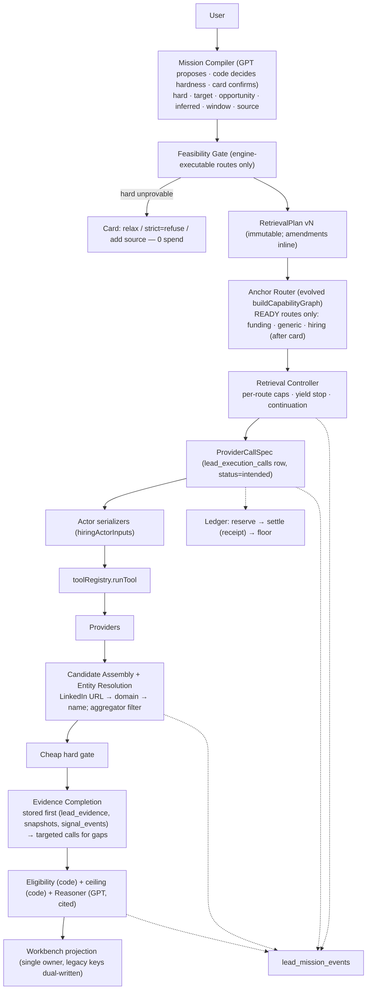
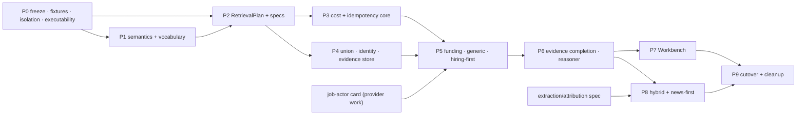
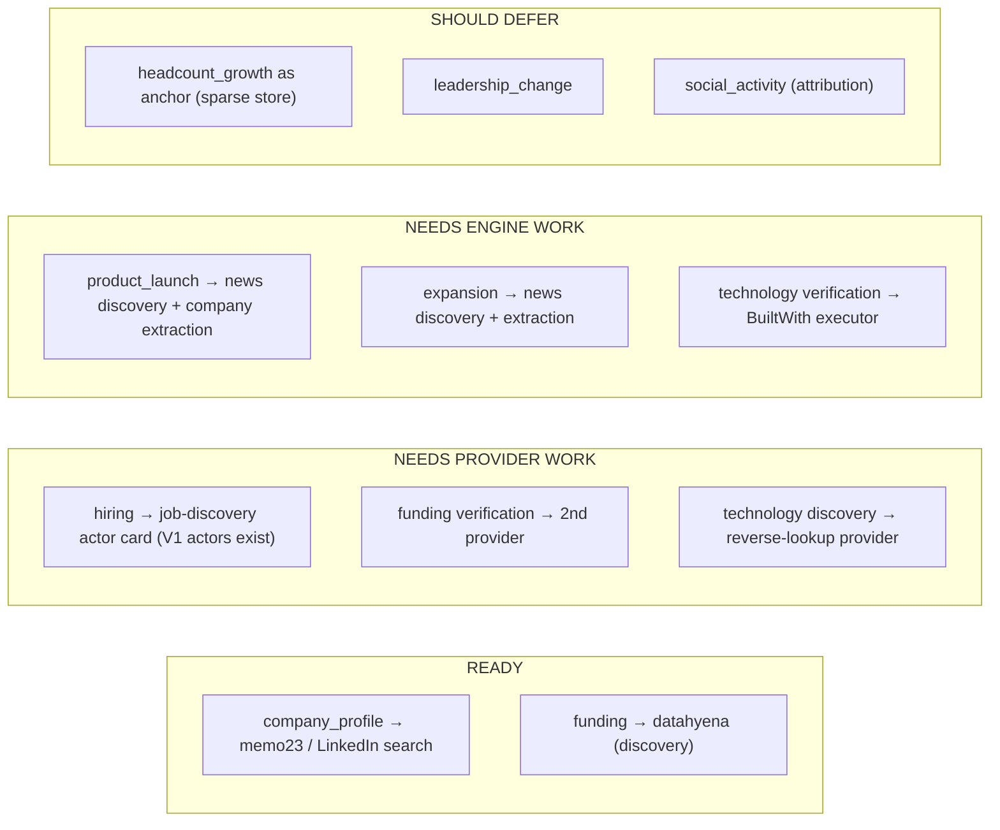
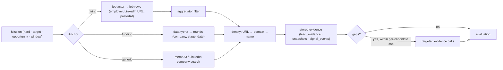
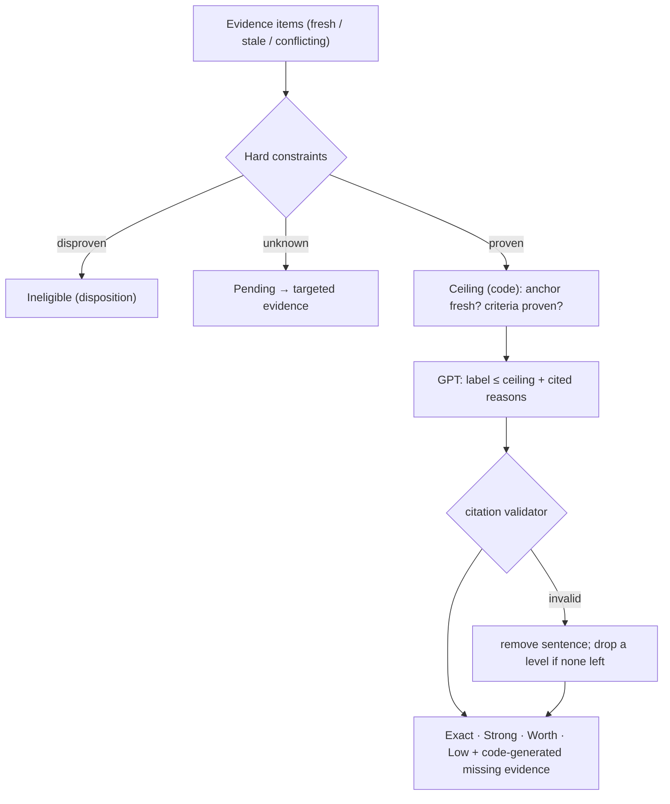

# Lead V2 — Signal-First Plan Validation

**Status:** read-only validation. No code, deploys, provider calls or migrations.
**Input validated:** `LEAD_V2_SIGNAL_FIRST_IMPLEMENTATION_BRIEF (2).md`, checked against the repository at `125f0cfa`, production schema, and the five existing Lead V2 audits.

> **Scope note.** The brief file supplied contains **sections 25–30 only** (phase plan, acceptance missions, invariants, success, operating rules, delivery standard). Sections 1–24 — component definitions, data models, the budget split, route designs — are not in it. Where this validation references those (e.g. the ~40/45/15 budget split), it uses the description in the request. **Before Phase 1 starts, sections 1–24 must be supplied or re-derived, or the phases have no component specification to implement against.**

---

# Executive Verdict

**The direction is right. The plan, as written, would not work.**

It correctly targets the proven failures — silent input mutation, company-first retrieval for signal missions, binary qualification, untruthful counts, unsettled cost — and it keeps the good infrastructure. Its invariants are, with a few rewordings, the right invariants.

But it has one structural flaw and four serious gaps:

1. **Phase 3 treats seven retrieval anchors as routing work.** They are mostly **provider and extraction work**. Measured against the code, only **funding** and **generic company** are executable today. Hiring-first needs a job actor carded for V2; news-first needs company extraction from articles (the news normalizer has no company field); headcount-first has almost no stored data to start from; leadership-first has no capability; technology-first has no provider. Shipping Phase 3 as written re-creates the exact defect the audits found: a graph that advertises anchors the engine cannot run.
2. **Cost control arrives in Phase 7, after multi-route retrieval in Phase 3.** Multi-anchor retrieval without per-route caps, DB idempotency and receipt settlement is the "runaway multi-query spend" risk the review ranked highest. Budgets must precede routes.
3. **Candidate union/entity resolution arrives in Phase 4, after hybrid routes in Phase 3.** Two routes cannot merge without canonical identity.
4. **The three-way semantic split (hard / target / opportunity) is not expressive enough** — it has no place for *temporal* qualifiers ("recently", "currently") or for *inferred* opportunity ("likely to need soon"), and it does not say who decides hardness.
5. **The 40/45/15 budget split should not be the control.** Real costs show the dominant spend is per-candidate identity (74% of Apify in `1e52d43c`) and that unit prices differ 45× between routes (datahyena $0.045/record vs memo23 $0.001/row). Percentages cannot protect against that; absolute per-route and per-candidate caps can.

**Verdict: YES WITH CHANGES.** Phase 0 is safe to start now. Phase 1 is safe once the missing sections are supplied and the semantics table below is agreed. The full plan is not safe to implement as written.

---

# What the Plan Gets Right

- **Phase 0 first** — freeze, fixtures, coupling isolation. The coupling list (Signals monitoring, Pilot preview, orchestrate, transport, credits, model ledger, V1, sweepers) matches the dependency map exactly.
- **Versioned RetrievalPlan + ProviderCallSpec before routing changes** (Phase 2). Correct dependency: it makes "no change while inputs changed" structurally impossible before anything new is routed.
- **"Every advertised anchor executes, falls back explicitly, or is declared unsupported before spend"** (Phase 3 exit). This is the fix for the graph/engine mismatch.
- **Technology-first only with a genuine reverse-discovery provider.** Correct and honest.
- **Leadership-first "where supported", otherwise a truthful limitation.** Correct.
- **Discovery budget separated from evidence budget; evidence only for missing facts.** Correct and cheap.
- **Code sets the label ceiling; GPT explains with evidence.** Correct.
- **Removing old stacks only after equivalence is proven** (Phase 8) and the operating rule *"do not stop after adding new abstractions while leaving old planner/sourcing stacks as the real production owner."* This is the single most important operating rule in the brief.

---

# What Must Change Before Implementation

| # | Change | Why (evidence) |
|---|---|---|
| C1 | **Split Phase 3 by anchor readiness.** Ship funding-first and generic first; hiring-first after a V2 job-provider card; news/launch-first only after a company-extraction spec; defer headcount-, leadership- and technology-first behind explicit limitations. | anchor readiness table below |
| C2 | **Move the cost core (per-route caps, DB idempotency key, receipt settlement, unknown-cost floor) ahead of any multi-route phase.** | `1e52d43c`: ledger $0.2463 vs billed $0.5902; datahyena 45× per-row price |
| C3 | **Move candidate union + canonical identity into the same phase as the first hybrid route.** | merging without identity duplicates companies across routes |
| C4 | **Add "feasibility = engine executability" and "stop routing to unexecutable entries" to Phase 0.** It is a small, isolated fix that stops silent empty missions today. | `product_launch_discovery`, `expansion_signal_discovery`, `technology_verification`, `company_post_verification` are scheduled and never executed |
| C5 | **Extend mission semantics** with hardness *source* (user / inferred / Brain), temporal window, and a distinct *inferred opportunity* class; define confirmation-card rules. | ambiguity cases below |
| C6 | **Vocabulary = small canonical enum + alias table; do not rename capability ids or `required_signals` in Phase 1.** | old names appear in 100+ test files (`required_signals` 46, `hiring_verification` 45, `job_discovery` 38, `funding_signal_discovery` 14) |
| C7 | **Replace the 40/45/15 split with absolute caps** (mission, per-route, per-candidate evidence) plus yield-based stop rules; keep percentages only as initial allocation. | budget section |
| C8 | **Isolate Signals monitoring from the engine *before* Phase 2 edits the engine.** | `run-monitoring-scan` calls `runCapabilityPlan` + `makeGptDiscoveryPlanner` directly |
| C9 | **Supply sections 1–24** (component specs, data models) or re-derive them from `LEAD_V2_FINAL_ARCHITECTURE_REVIEW.md`. | brief file is incomplete |
| C10 | **Decide team-composition scope** (people stage is unlock-gated) before Mission B is used as an acceptance test. | `PEOPLE_STAGES` are never automatic |

---

# Current vs Proposed Component Validation

| Proposed component | Existing equivalent | Reuse? | Conflict? | Recommended action |
|---|---|---|---|---|
| Mission Compiler | `leadMissionCompiler.ts` + `leadMission.ts` (`mergeCompanyBrainIntoMission`, `canonicalSignalType`, `UNREPRESENTABLE_EVIDENCE`) | **yes** | none | **KEEP + MODIFY**: add hardness source, temporal window, intent terms, inferred-opportunity class |
| RetrievalPlan | `tasks.result.capability_execution_state.execution_plan` (mutable, unversioned) + `DiscoveryStrategy` | partly (shape) | **yes** — amendment path replaces it silently (`leadCapabilityEngine.ts:5308`) | **REPLACE** the lifecycle; keep `validateExecutionPlan` checks inside the new validator |
| Retrieval Anchor Router | `buildCapabilityGraph` entry selection (`leadCapabilityGraph.ts:800–905`) | **yes** — it already chooses signal-first entries deterministically | yes — routes to unexecutable entries | **KEEP + MODIFY**: gate on executability; become the router |
| Retrieval Controller | replenishment, `discovery_replan_*`, `leadInvestigationBudget`, `multiRoundController`, `companyFirstQuotaController` | pieces | **yes** — four owners | **REPLACE** (absorb all four) |
| ProviderCallSpec | `lead_execution_calls.request_input` (`compiled_actor_input`, `compiled_input_hash`, `logical_call_key`) | **yes** — the row already exists per call | none | **KEEP + MODIFY**: write the row *before* the call as the spec |
| Provider compiler / serializers | `hiringActorInputs.ts` (13 compilers) + `compileActorInput` + `buildIdentitySearchInput` + `compileFirstProviderCall` + `actorInputPlanner/Strategy` | compilers yes | **yes** — policy hidden in 4 places | **KEEP** compilers as serializers; **DELETE** the policy layers |
| Candidate Assembly | `addCompany`, `restoreWorkingSet`, checkpoint working set | yes | single-route assumptions | **KEEP + MODIFY**: route provenance, union across routes |
| Entity Resolution | `companyIdentityResolution.ts`, `acceptLinkedInMatch`, `suppliedCompanyIdentity`, `actorIdentity`, `referentBinding` | **yes** (domain rule proven) | 5 owners | **KEEP + CONSOLIDATE**; accept direct LinkedIn URLs from job rows to bypass name search |
| Evidence Model | in-engine `evidence_registry` (`evidence_type`, `evidence_id`), `groundedClaims`, `company_web_evidence`, `company_headcount_snapshots`, `lead_evidence` (unused by leads) | **yes** | none structural | **KEEP + MODIFY**: persist the registry items to `lead_evidence` |
| Evidence Completion | `webEvidencePlanner/Runner/Extraction`, `*_signal_verification`, `hiring_verification` | yes | coarse (per capability, not per gap) | **KEEP + MODIFY**: drive by per-company gaps |
| Eligibility Gate | `leadCommercialPrequalification`, `resolveEmployeeBounds`, `brainMayReject`, eligibility filter (`leadCapabilityEngine.ts:~6703`) | yes | Brain advisory bounds leak in | **KEEP + MODIFY**: constraint-list driven only |
| Opportunity Reasoner | `missionEvaluation`, pool evaluation, `groundedBatchEvaluation` (shadow), `opportunityPortfolio` (qualified/review/watch, tiers), proven-verdict rules (`provenVerdicts`) | **yes** — citation discipline + tiers exist | binary pass/reject framing | **KEEP + MODIFY**: ceiling in code, labels in `opportunityPortfolio`, grounded evaluator as the reasoner |
| Workbench Projection | `leadWorkbenchProjection.ts`, `src/lib/workbench/*` | yes | 3 count owners | **KEEP + MODIFY**: one projection |
| Cost / Yield Controller | `providerCostModel`, `firecrawlCostModel`, `modelCostModel`, ledger, `modelSpendCeiling`, credits | pricing yes | 4 estimators, early-read settlement | **KEEP** pricing; **REPLACE** settlement; **NEW** per-route yield |
| Continuation / Resume | V2 queue + lineage lease + checkpoint + `completed_runs` + query-family guard | **yes** | resume re-plans; attempts = slices | **KEEP + MODIFY**: resume plan version; retry = faults |

---

# Retrieval Anchor Validation

| Anchor | Natural source | Provider in repo | Schema verified (V2 card) | Discovers | Verifies | Engine executes | Normalizer | Company extraction | Cost known | Evidence shape | Readiness |
|---|---|---|---|---|---|---|---|---|---|---|---|
| **generic_company_profile** | directories / company search | memo23, LinkedIn company search | yes | yes | identity | yes | yes | n/a | yes | yes | **READY** |
| **funding** | funding-round index | datahyena | yes | **yes** | **no** (no company input) | **yes** | yes (`normalizeDatahyenaFundingRound`) | yes (`fundingRoundToCompany`) | yes ($0.045/record) | yes (`funding_signal`) | **READY** (discovery); verification **NEEDS PROVIDER WORK** |
| **hiring** | job boards / LinkedIn jobs | V1 only: `apify_jobs`, `apify_linkedin_jobs_crawlworks`, `apify_indeed_jobs_automation_lab`, `apify_glassdoor_jobs`, curious-coder LinkedIn jobs; V2: `apify_linkedin_job_search` (company-scoped) | **no** for discovery actors (only in `actorRegistry`) | would | yes (company-scoped) | discovery **no** (`job_discovery` skipped) | yes — `normalizeApifyJobRow` (V1), `normalizeLinkedInJob` (V2) | **partial** — V1 `NormalizedJob` carries `company` + company `linkedinUrl` | not in V2 | yes | **NEEDS PROVIDER WORK** |
| **product_launch** | news, posts, launch sites | Google News, LinkedIn company posts, post search | yes (News) | would | yes (named company) | discovery **no** (`unhandled capability`) | `normalizeNewsArticle` | **no** — title/url/source/date only | not recorded in repo | partial | **NEEDS ENGINE WORK** (+ extraction design) |
| **expansion** | news, posts, office announcements | Google News | yes | would | yes | discovery **no** (explicit skip) | yes | **no** | not recorded | partial | **NEEDS ENGINE WORK** |
| **headcount_growth** | stored headcount series | `company_headcount_snapshots` + `headcountGrowth.ts` | n/a (stored) | only over companies already snapshotted | computed | no | yes | n/a | free | yes | **SHOULD DEFER** as an anchor (store is sparse); **READY** as a stored-evidence check |
| **leadership_change** | role-change data, people search, news | people search/employees (unlock-gated), profile posts | partly | people only | people | no | yes | via employer of person | partly | partly | **SHOULD DEFER** (truthful limitation) |
| **technology** | reverse install index | BuiltWith (domain in) | yes | **no** | yes (per domain) | verification **no** (unhandled) | n/a in engine | n/a | not recorded | yes | **NEEDS NEW PROVIDER** (discovery); **NEEDS ENGINE WORK** (verification) |
| **social_activity** | post search | LinkedIn post search, company posts | yes | posts (not companies) | yes (company posts) | no | `normalizeSocialPost` | author→company attribution **unsolved** | partly | partly | **SHOULD DEFER** |

**Phase-3-safe now:** generic, funding. **After one bounded provider/engine item each:** hiring (card a job actor), product launch / expansion (extraction + attribution). **Defer:** headcount-first, leadership, technology discovery, social.

---

# Hiring-First Validation

**The plan underestimates this work.** It reads as routing ("hiring request → jobs first"); it is a provider-integration project.

What exists:
- **V1 job pipeline** (live for non-allowlisted workspaces): `jobsProviderInput.buildJobsProviderInputs`, `curiousCoderJobsInput` (LinkedIn jobs scraper, count 10–100), `apifyJobsNormalizer.normalizeApifyJobRow` → `NormalizedJob { company, linkedinUrl (company), location, companyDescription, postedAt, … }`, `runAgentCompoundJobAdapter`.
- **Employer vs posting-company guard:** `companyAggregatorEvidence.extractAggregatorEvidence` (staffing industry ids/names, identity + attribution signal codes) — the "posted by an agency" problem already has a detector.
- **V2 hiring verification:** `apify_linkedin_job_search` with a verified contract; fuzzy-title warning and mandatory deterministic post-filter; employer warning.
- **Title matching:** `classifyTitle` + `roleFamilies` (now including marketer/growth forms).

What is missing for a production V2 hiring-first route:

| Item | Status | Work |
|---|---|---|
| V2 catalog card for a job-**discovery** actor | missing (V1 registry only) | verify the live input schema, limits, pricing; add card + contract |
| Bounded compiler | V1 builder exists | port into `hiringActorInputs` style (limits, cost, refusals) |
| Normalizer → `NormalizedHiringJob` | two exist (V1 + V2) | pick one; map V1 fields |
| Employer extraction | partial — company name + **company LinkedIn URL** on V1 rows | use the URL as identity directly when present; name search only when absent |
| Aggregator/staffing filter | exists | apply before identity spend |
| Company dedupe | `addCompany` keys; LinkedIn URL normalization exists | key by normalized company LinkedIn URL → domain |
| Title match | exists | run on every job row before admitting the employer |
| Pagination / result ceilings | V1 count 10–100 | per-route page cap + yield stop |
| Geography | location string per job | map to mission geography; US-only filter before identity |
| Freshness | `postedAt` | `postedLimit`/window from the mission's temporal qualifier |
| Cost | not in V2 cost model | add unit price; per-route cap |
| Engine executability | `job_discovery` is skipped (`leadCapabilityEngine.ts:5379`) | add to `ENGINE_DRIVEN_DISCOVERY` |

**Why it is worth it:** in `1e52d43c`, name-based identity search cost **$0.436 of $0.590 Apify spend (74%)** and produced most of the identity failures. A job row that already carries the employer's LinkedIn URL removes that step for most candidates. Hiring-first is likely cheaper *and* more accurate than the current company-first path — but only once the provider is carded.

---

# Funding / Seed-Stage Validation

| Question | Finding | Recommendation |
|---|---|---|
| Funding-first discovery | works today (engine-driven datahyena entry; round credited as `funding/company` evidence) | keep; add per-route cap ($0.045/record; the compiler already refuses > 500 records) |
| Company from another source → later funding verification | **impossible today** — datahyena has no company input; graph emits an advisory and reports funding as uncollected | requires either a second provider with company input, or a web/news corroboration path |
| Second funding provider required? | **for hard funding/stage constraints: yes**; for preference-level: no | do not block the plan on it; make stage a preference unless the user insists |
| Web/news corroboration sufficient? | sufficient for a **preference** / `plausible` verdict (matches the existing rule that publisher claims yield `plausible`, not `verified`) | allowed as corroboration, never as `verified` for a hard constraint |
| Funding as preference unless hard | **yes** | default "raised recently" in a lead request = target signal (anchor), not hard eligibility |
| Seed-stage semantics | seed-stage is a *stage* claim (round type ≤ seed, recency), not "has funding"; datahyena `round` enum can express it **for companies found by a round**; nothing can prove it for companies found another way | compile as **hard only when the user marks it** ("ONLY seed-stage") and route funding-first; otherwise **target criterion**, corroborated by YC batch recency + headcount + round evidence where present |

**Seed-stage design, validated:** the audited failure (30 companies failed for unprovable stage) is fixed **only** if (a) stage defaults to target criterion, (b) "ONLY/must" wording makes it hard *and* forces funding-first routing, and (c) the feasibility gate asks the user when a hard stage cannot be routed funding-first. The brief's "seed-stage behavior follows mission hardness" is right but unspecified — the table in *Mission Semantics Validation* specifies it.

---

# Signal Vocabulary Validation

**One canonical enum — yes, but small.** Nine canonical signal *kinds*, each an anchor-able or evidence-able concept:

```
hiring · funding · product_launch · expansion · headcount_growth ·
leadership_change · technology · social_activity · company_profile
```

**Aliases map into it; nothing is renamed.**

| Layer | Keep its names? | Mapping |
|---|---|---|
| `MISSION_SIGNAL_TYPES` (6) | yes | identity map; add `headcount_growth`, `social_activity` as *recognised* kinds so they stop disappearing (feasibility then says "unsupported", not nothing) |
| `SIGNAL_EVENTS` (9: incl. `post`, `comment`, `headcount_change`) | yes | `post`/`comment` → `social_activity`; `headcount_change` → `headcount_growth` |
| capability ids (`funding_signal_discovery`, `hiring_verification`, …) | **yes** — do not rename | each capability declares the canonical kind it serves |
| artifacts (`funding_signal`, `launch_signal`, …) | yes | declared kind |
| actor evidence events | yes | declared kind + power |
| playbook strategies | yes | kind |
| **Signals V2 `SignalType` (~30)** | **yes — keep the richer subtypes** | many→one: `recent_funding`→funding; `sales_hiring`/`revops_hiring`/`growth_hiring`→hiring (subtype kept as `role_family`); `employee_growth`→headcount_growth; `market_expansion`/`geographic_expansion`→expansion; `product_launch`/`major_release`/`new_integration`→product_launch; `new_revenue_leader`/`role_changed`→leadership_change; founder-intent posts→social_activity; risk types → not signals (disqualifiers) |

One mapping module, one test that every vocabulary member maps to a kind (extending `signalVocabularyAlignment.test.ts`).

**Migration risk:** renaming would break ~100+ test files and the persisted `required_signals` shape in queued/lineage state. Aliasing is additive and zero-risk to existing missions. **Avoid** a mega-enum that merges subtypes: subtypes carry evaluation meaning (a `revops_hiring` event is not evidence for a growth-marketer mission).

---

# Mission Semantics Validation

The three-way split needs **two more dimensions** to be expressive enough: **who decided** (user / inferred / Brain) and **temporal window**. Plus a fourth class distinct from "opportunity signal": an **inferred opportunity** — a prediction, which must never be required.

| Phrase | Compiles to | Hardness | Source | Window | Anchor? | Ask on card? |
|---|---|---|---|---|---|---|
| "Find **seed-stage** startups" | constraint `stage ∈ {pre-seed, seed}` | **target criterion** (default for restrictive modifiers when the system cannot verify them) | user | — | no (company cohort) | **yes — if unprovable**: "Seed-stage can't be verified for every company. Keep as a preference, or make it strict (funding-first only)?" |
| "Find **ONLY** seed-stage startups" | same | **hard** | user (strength word) | — | forces funding-first route | only if funding-first cannot run |
| "**Prefer** seed-stage startups" | same | preference (ranking only) | user | — | no | no |
| "Find companies **hiring** growth marketers" | signal `hiring`, role family `marketing_growth` | **target signal + anchor** | user | default "open now" (e.g. ≤ 30 days posted) | **hiring-first** | no |
| "Find companies that **must currently be hiring**" | same | **hard** (eligibility requires an open matching role) | user | current (≤ 30 days) | hiring-first | no |
| "Find startups **likely to need** a growth marketer soon" | *inferred opportunity* (e.g. recent funding, founder-led GTM, no marketing leader) | **never hard** | model inferred | recent | anchors on the proxy signals (funding / hiring of adjacent roles) | **yes** — show the proxies chosen; user can edit |

**Where GPT may infer safely:** geography normalization, vertical synonyms, role-family expansion, default windows. **Where the card must ask:** any hard constraint the feasibility gate cannot route to a proving source; any inferred opportunity (show proxies); any Brain-inherited constraint that would *narrow* the mission (Brain = preference unless confirmed).

**Hardness rule (deterministic, after GPT proposal):** strength words (only / must / exactly / excluding) → hard; location & explicit exclusions → hard; hedges (prefer / ideally / bonus) → preference; activity qualifiers → target signal; model inferences and Brain ICP → preference with source recorded; restrictive stage/size modifiers → target criterion **unless** a proving route exists and the user confirms hard.

---

# Feasibility Validation

"Feasible" must mean **executable end-to-end**, computed from: capability exists ∧ provider has a V2 card ∧ engine has an executor ∧ the route can produce the required evidence *for this population*.

| Situation | Hard constraint | Target criterion / preference | Opportunity signal |
|---|---|---|---|
| Discovery capability exists, **no executor** | not a route → try other routes; if none can prove it → **ask** (0 spend) | route unavailable; fall back to next anchor, show "not searched by this signal" | ignored as a route |
| Provider exists but **verification-only** | may be proven *after* discovery; eligible only if the verification step executes → proceed with a company-first route + verification | proceed; verify for shortlisted candidates only | verify opportunistically if cheap |
| Provider exists, **schema unverified** | treat as unavailable → **ask** | treat as unavailable → fallback + disclose | unavailable |
| Can **discover but not prove** | cannot satisfy a hard constraint for companies found elsewhere → route must *start* from that source, else **ask** | usable as anchor; candidates from other routes show "unverified" | usable |
| **Stored evidence exists but may be stale** | usable only if fresh within the dimension's window; else re-verify (costed) | usable with staleness shown | usable with staleness shown |
| **Hard constraint cannot be proven** by any executable route | **stop before spend; ask**: relax / keep strict (refuse) / add source | — | — |
| **Preference cannot be proven** | — | proceed; mark `unverified`; **never reject** on it | — |
| **Opportunity signal unavailable** | — | — | proceed; contributes nothing; not shown as a gap |

Implementation note: `assessRequestFeasibility` already grades `satisfied / unsupported / population_mismatch / requires_unlock`. Add **`not_executable`** and **`schema_unverified`**, and compute `satisfied` only from engine-executable capabilities. That single change (C4) removes the "feasibility satisfied, pool empty" failure for C/D/E today.

---

# Evidence Model Validation

| Store | Decision | Why |
|---|---|---|
| in-engine `evidence_registry` (items with `evidence_type`, `evidence_id`) | **the in-flight model** — keep | qualification already cites registry ids (`provenVerdicts`) |
| `lead_evidence` | **canonical persisted evidence for Leads** — company-scoped (`workspace_id`, `company_key`), **not** mission-scoped; add `mission_id` (nullable, provenance), `method`, `derived_from`, `valid_until`, `origin` | facts about a company are reusable across missions; judgments are not |
| mission judgments (assessments, labels, cited claims) | **mission-scoped**, in the task projection / `lead_candidates.raw` | a label depends on the mission |
| `signal_events` | **stays separate** (Signals domain); Leads **reads** it through an adapter mapped to canonical kinds | avoids mixing writers; Leads already writes qualified signals there |
| `company_web_evidence` | stays a **page cache** with per-intent TTL; extracted claims become `lead_evidence` items citing the page | cache ≠ fact |
| `company_headcount_snapshots` | stays a **time series**; derived growth written as `lead_evidence` with `method: derived` | growth is a delta over readings |
| `groundedClaims` | the **citation validator** for the reasoner | already rejects unsupported claims |
| `structuredCompanyEnrichment` | an **evidence producer** | emits items |

**Freshness:** per dimension (hiring ~30 d, funding ~180 d, headcount ~30 d, identity ~365 d; news per window) — reuse `signalFreshness.ts` / `webEvidenceStore.ttlHoursFor`. **Derived facts** are evidence items with `derived_from` — no separate table. **Conflicts** are stored, not resolved on write; the view prefers `provider_field` > `derivation` > `model_extraction`, then confidence, then recency, and shows the conflict (e.g. YC `teamSize` 1 vs LinkedIn 1,709).

**No new evidence table.**

---

# Opportunity Reasoner Validation

**Five labels: keep four surfaced labels; make INELIGIBLE a disposition, not a label.** Add one explicit non-label state: **PENDING** (a hard constraint is unknown — neither eligible nor ineligible).

| Class | Code ceiling (all required) | Evidence minimum | Allowed gaps | GPT role |
|---|---|---|---|---|
| **Exact match** | all hard proven; all target criteria proven; anchor signal proven & fresh | ≥ 1 cited item per criterion | none | confirm + explain |
| **Strong opportunity** | all hard proven; anchor signal proven & fresh; ≤ 1 target criterion unproven, none disproven | anchor + hard items cited | one unproven criterion | explain why the signal compensates |
| **Worth considering** | all hard proven; anchor or ≥ 1 opportunity signal proven | ≥ 1 signal item | several unproven / one disproven preference | explain + list gaps |
| **Low priority** | all hard proven; no fresh signal | hard items | many | state gaps |
| *Ineligible* (disposition) | any hard disproven | the disproving item | — | none |
| *Pending* (state) | any hard unknown | — | — | none; eligible for targeted evidence |

**Score separate from label:** yes — deterministic `evidence_coverage` (0–1) and `signal_strength`; no GPT score. Rank within label by coverage, then signal freshness.

**Preventing over-promotion:** (1) code computes the ceiling; GPT may only choose ≤ ceiling; (2) every "why surfaced" sentence cites an evidence id validated by `groundedClaims` rules — invalid sentences are removed and, if none remain, the label drops one level; (3) "missing evidence" is generated by code from gaps, never by GPT; (4) stale evidence cannot support Exact/Strong.

---

# Budget Validation

**Real numbers** (run `1e52d43c`): Apify $0.5902 = memo23 $0.090 (5 runs) + **company search $0.436 (24 identity runs)** + details $0.064; models $0.092; Firecrawl unpriced. Unit prices: memo23 $0.008 start + $0.001/row; company search $0.001 start + $0.004/full row (15-row common-word searches cost $0.061 each for nothing); details ≈ $0.004/company; **datahyena $0.045/record**; Google News / BuiltWith not recorded in the repo — must be measured before routing.

**The 40/45/15 split is the wrong control.** It allocates *shares* of a budget that has no ceiling, cannot see the 45× unit-price spread between routes, and does not stop the actual waste (identity on weak candidates, common-word searches).

**Recommended:**

| Control | Default (canary) | Purpose |
|---|---|---|
| **Absolute mission cap** | $1.50 provider + $0.25 model | hard stop |
| **Per-route cap** | discovery route ≤ $0.40; funding route ≤ 20 records ($0.90) only if funding is the anchor | runaway multi-query |
| **Per-candidate evidence cap** | ≤ $0.05 per candidate (identity + enrichment + targeted evidence) | expensive evidence on weak candidates |
| **Admission rule** | identity only after the cheap hard gate; skip identity when the source supplied a LinkedIn URL | biggest real waste in `1e52d43c` |
| **Common-word guard** | name-only identity search capped at `maxItems` 5 when the name is a dictionary word, or disambiguated by domain/location | $0.28 wasted in `1e52d43c` |
| **Dynamic stop rules** | route stops when `cost_per_hard_eligible` > 3× the best route, or novelty < 20% on the last page | yield |
| **Idempotency** | DB unique key per (lineage, provider, normalized input, page) | duplicate purchases |
| **Initial allocation** | may start ~40/45/15 but **rebalanced by yield after the first page** | not a control |

---

# Phase-Order Validation

| Phase (brief) | Correct order? | Missing dependency | Safe to start? | Required proof |
|---|---|---|---|---|
| 0 Freeze / fixtures / coupling | yes | add C4 (executability gating) + monitoring facade | **yes** | fixtures replay offline; contract tests green; no mission routes to an unexecutable entry |
| 1 Mission semantics + vocabulary | yes | sections 1–24; semantics table; alias-not-rename | **yes, after C5/C9** | the 6 phrasings compile as specified; unknown signals surface |
| 2 RetrievalPlan + ProviderCallSpec | yes | Phase 0 monitoring isolation | after 0 | every call joins a spec; a capability-identical input change creates a new version |
| 3 Anchor router + signal-first | **no — too early and too wide** | cost core (from 7), candidate union (from 4), job-provider card, extraction design | **no** as written | per-anchor end-to-end fixture replay |
| 4 Union / dedupe / evidence completion | **must precede or accompany hybrid** | persisted evidence (`lead_evidence` columns) | after 2 | no duplicate companies across routes; targeted evidence only for gaps |
| 5 Eligibility + reasoner | yes (after 4) | label ceilings agreed | after 4 | no label above ceiling; all sentences cited |
| 6 Workbench | yes | backward-compatible projection | after 5 | counts reconcile; legacy keys still written |
| 7 Cost / yield / reliability | **too late** | — | core must move before 3 | ledger ≈ receipts; no duplicate purchase on resume |
| 8 Cutover / cleanup | yes | — | last | equivalence + stability on canaries |

---

# Migration / Coupling Risks

| Shared system | How the brief could break it | Guard |
|---|---|---|
| **Signals monitoring** | Phase 2/3 edits `runCapabilityPlan` / discovery planner, which `run-monitoring-scan` calls directly | freeze a `MonitoringRetrievalPort` facade + contract test in Phase 0 |
| **Pilot preview** | new router/semantics diverge from the preview (pilot-chat loads the engine + evaluation) | one feasibility/preview module used by both |
| **orchestrate** | kickoff body / V1-V2 routing contract changes | versioned kickoff contract test |
| **run-agent** | shared by V1 routes and other agents | V2 changes behind `LEAD_V2_*` flags; V1 routes untouched |
| **Railway worker** | imports run-agent in-process (303 modules) | shrink the lead runtime entry; worker smoke test per phase |
| **V1 Leads** | shared engine, registries, `actorRegistry` (V1 job actors) | do not delete V1 job actors while carding one for V2; V1 frozen until V2 default |
| **toolRegistry** | transport for 5+ features | new compiler sits *above* `runTool`; no `runTool` contract change |
| **credits** | per-route caps interact with `credits_reserve` | reserve per spec; keep RPC contract |
| **modelSpendCeiling** | reasoner + extraction add model spend; ceiling is workspace-wide, shared with Content | per-feature sub-budgets before Phase 5 |
| **Content** | shares ledger + ceiling | as above |
| **Company Brain** | semantics change may alter Brain precedence | Brain = preference with source; industry-precedence kept; test |
| **Workbench** | new labels break current `LeadResultsView` | projection writes legacy keys during migration |
| **tasks_sweep_stuck_runs** | could fail a V2 task during longer multi-route runs | skip V2-owned tasks (Phase 0) |
| **resume-stalled-leads / continue-workflow** | could resume V2 tasks | keep `loadV2OwnedTaskIds` exclusion + test |

---

# Database Impact

| Need | Store | Change |
|---|---|---|
| RetrievalPlan versions **+ amendments** | **new** `lead_plan_versions` | one row per version; the amendment that produced it inline (**no** separate amendments table) |
| Mission trace | **new** `lead_mission_events` | append-only |
| ProviderCallSpecs | **existing** `lead_execution_calls` | add `provider_call_id`, `plan_version`, `route_id`, `settled_usd`, `settlement_source`, `variance_usd`; spec row written with `status: intended`; unique index on (workspace, lineage, idempotency key) |
| Route telemetry | **derived** | from specs + events; **no table** |
| Candidate state | **existing** checkpoint + `lead_candidates` | **no table** now |
| Evidence | **existing** `lead_evidence` | add `company_key`, `mission_id` (nullable), `method`, `derived_from`, `valid_until`, `origin` |
| Opportunity assessments | **existing** task projection + `lead_candidates.raw` | none |

**Two new tables; additive columns on two existing tables. Do not create:** amendments, specs, telemetry, candidates, evidence-graph or assessment tables.

---

# Acceptance Mission Simulation

| Mission | Anchor | First source | Fallback | Hard | Target criteria | Evidence required | Likely missing | Expected classification | Blocker after the corrected phases |
|---|---|---|---|---|---|---|---|---|---|
| **A** hiring | hiring | V2-carded LinkedIn jobs discovery | company-first (memo23/LinkedIn search) + job verification | US, B2B SaaS | growth-marketer role | open role (fresh), employer identity, industry, US | size, stage | Exact/Strong for verified openings | **provider card for the job actor** |
| **B** seed-stage + first growth hire | hiring (+ funding if stage is hard) | jobs → employers; funding-first route in parallel only if "ONLY seed-stage" | company-first | US, B2B SaaS (+ stage if user confirms) | seed-stage, *first* growth hire | open role; stage (round or batch proxy); **team composition for "first"** | **team composition** (people stage is unlock-gated), stage for non-funding-route companies | Strong/Worth for most; Exact only with team composition | **unlock scope decision**; stage verification provider if hard |
| **C** funding | funding | datahyena rounds | none needed | US, B2B SaaS | recency | dated round, identity, industry, US | — | Exact/Strong | none (per-route cap) |
| **D** product launch | product_launch | Google News (discovery) | company-first + news verification | AI | recency | dated article naming the company, identity | attribution confidence | Strong/Worth | **company extraction + attribution design** |
| **E** headcount growth | headcount_growth | stored snapshots | company-first + enrichment snapshots (growth needs two readings over time) | SaaS | "rapidly" (threshold) | ≥ 2 dated headcount readings | second reading for new companies | mostly Low/Worth on first run | **sparse store** — cannot be first-source in practice; honest "growth unknown" |
| **F** leadership change | leadership_change | — | none (truthful limitation) | SaaS | VP Sales hired recently | role-change event | everything | — | **no capability** — must refuse/ask, not company-search |
| **G** technology | technology | — (no reverse index) | company-first + BuiltWith verification (after engine executor) | US | Snowflake | tech detection per domain | adoption date (never available) | Worth/Low; never Exact from discovery | **needs new provider** for discovery |

**Still cannot work after the corrected phases without new providers/decisions:** B (fully, without unlock), E (as first source), F, G (as first source). The brief's acceptance criteria for these already allow "truthful limitation" — keep that wording and make it the *pass* condition.

---

# Invariant Review

| # | Invariant | Verdict | Note |
|---|---|---|---|
| 1 | Mission semantics immutable after compilation | **NEEDS REWORDING** | "…except by an explicit user-approved amendment (e.g. relaxing an unprovable hard constraint on the card)" |
| 2 | Canary cannot change semantics | VALID | |
| 3 | No Lead provider call without a persisted spec | **VALID, scope it** | "Lead **retrieval** provider call"; Pilot preview, Brain setup and lead actions use `runTool` too — define whether they are in scope |
| 4 | No spec without a plan version | VALID | |
| 5 | No silent provider-input mutation | VALID | |
| 6 | No empty query → unfiltered paid search | **TOO WEAK** | also forbid broadening without amendment and dropped expressible hard constraints |
| 7 | Feasible only if engine can execute | VALID | add "for this population" and "schema verified" |
| 8 | Hard constraints cannot be silently softened | VALID | |
| 9 | Preferences never auto-reject | VALID | also "never promote above ceiling" |
| 10 | Opportunity reasons evidence-backed | VALID | make citation validation code-enforced |
| 11 | Continuation cannot regenerate strategy | **NEEDS REWORDING** | "continuation resumes the current plan version; strategy may change only through an explicit amendment with a trigger" — otherwise it forbids legitimate adaptive sourcing |
| 12 | Retry is for execution faults | VALID | |
| 13 | Adaptive sourcing requires an amendment | VALID | |
| 14 | Same purchase never charged twice | **NEEDS REWORDING** | "…never *executed* twice" (charging is the provider's); enforce with a DB key |
| 15 | Unknown cost never zero | VALID | |
| 16 | Stored evidence checked before buying | **VALID, needs freshness** | "…checked and used if fresh for that dimension" |
| 17 | Candidate identity canonical across routes | VALID | |
| 18 | Workbench counts one owner | VALID | |
| 19 | GPT cannot invent evidence | VALID | enforce via "GPT writes claims citing evidence ids, never evidence" |
| 20 | Shared changes cannot alter Signals/Content/Pilot/V1 | **TOO STRICT as absolute** | some shared changes are intended (ledger, ceiling); reword: "only through reviewed contract changes with contract tests" |

Missing invariants to add: **(21)** no anchor advertised to the user unless executable; **(22)** hard constraints must have an executable proving route before spend; **(23)** Brain constraints are preferences unless user-confirmed; **(24)** per-route and per-candidate spend caps are enforced before each call.

---

# Missing Risks / Blind Spots

| Rank | Risk | Why it matters | Mitigation |
|---|---|---|---|
| 1 | **Signal→company attribution** (news, posts) | an article or post names several companies; wrong attribution = confident false leads | require the company as the article's subject; confidence `plausible`; corroborate before Strong |
| 2 | **False employer extraction** (job boards) | staffing agencies/aggregators post for clients | `extractAggregatorEvidence` before identity; prefer rows with company LinkedIn URL |
| 3 | **Duplicate companies with different domains/brands** | union across routes double-counts | key by LinkedIn company URL first, domain second; merge on either |
| 4 | **Bad GPT mission interpretation** | hardness errors cascade | deterministic hardness rules + card confirmation |
| 5 | **Hidden Company Brain effects** | this workspace's Brain targets recruiting agencies | Brain constraints as preferences with source; show on card |
| 6 | **Provider outage / partial results** | route returns partial data; plan thinks it's exhausted | distinguish `provider_error` from `exhausted`; retry budget for faults |
| 7 | **Pagination & result ceilings** | job/news sources return top-N; later pages cost more with less yield | per-route page cap + novelty stop |
| 8 | **Stale evidence** | old snapshots/articles support labels | per-dimension freshness; stale cannot support Exact/Strong |
| 9 | **Multi-anchor route conflicts** | two anchors disagree on population | union with route provenance; label per candidate, not per route |
| 10 | **Queue races / candidate state corruption** | longer multi-route runs span more slices | lease + DB idempotency + event log; sweeper exclusion |
| 11 | **Ranking instability** across slices | Workbench order jumps | deterministic ranking keys; GPT never ranks |
| 12 | **Expensive people/team lookups** | "first hire" needs team data | unlock-gated; ask on card; cap per candidate |
| 13 | **UI compatibility** | new labels vs legacy keys | dual-write projection |
| 14 | **Worker ceiling (5 min) vs more routes** | more slices; more resume surface | continuation ≠ retry; per-slice route budget |

---

# Corrected Final Architecture



---

# Corrected Implementation Sequence

| # | Phase | Contents | Proof to continue |
|---|---|---|---|
| **P0** | Freeze, fixtures, isolation, **executability gating** | fixtures from `4250f181`/`1e52d43c`; contract tests; monitoring facade; sweeper exclusion; feasibility `not_executable`; stop routing to unexecutable entries | replay offline; no silent empty missions |
| **P1** | Mission semantics + vocabulary aliases | hardness/source/window/inferred class; alias map incl. Signals V2; card shows sections | 6 phrasings compile as specified |
| **P2** | RetrievalPlan + ProviderCallSpec (observe → enforce) | versions, specs on `lead_execution_calls`, events | every call joins a spec; hidden rewrites impossible |
| **P3** | **Cost & idempotency core** (from brief P7) | per-route/per-candidate caps, DB idempotency key, receipt settlement, Firecrawl pricing, unknown floor | ledger ≈ receipts; no duplicate executions on resume |
| **P4** | **Candidate union + entity resolution + evidence persistence** (from brief P4) | canonical identity, route provenance, `lead_evidence` columns, stored-evidence reads | no duplicates across routes |
| **P5** | Single-anchor routes: **funding-first, generic, hiring-first** | card one job-discovery actor; employer extraction; `job_discovery` engine-driven | Missions A, C pass on fixtures then canary |
| **P6** | Evidence completion + eligibility + reasoner | gaps, ceilings, cited labels | no label above ceiling; B passes as Strong/Worth |
| **P7** | Workbench truth | one projection, new classes, legacy keys | counts reconcile |
| **P8** | Hybrid multi-anchor + news/launch-first | after extraction/attribution spec; merge rules | Mission D passes; no attribution false positives on fixtures |
| **P9** | Cutover + cleanup | delete planner stacks, registries, loops | equivalence + stability |
| **later** | Provider phases | funding verification, team composition (unlock), reverse tech, leadership | per provider |



---

# Go / No-Go Recommendation

- **GO** for P0 now (isolated, additive, protects shared systems, and its executability fix stops today's silent empty missions).
- **GO** for P1 once sections 1–24 are supplied and the semantics table is agreed.
- **NO-GO** for the brief's Phase 3 as written; replace with P3–P5 above.
- **NO-GO** for claiming technology-, leadership- or headcount-first in this programme; ship them as truthful limitations.

---

# Mermaid Diagrams

### Validated target architecture
*(see Corrected Final Architecture above)*

### Corrected phase dependency graph
*(see Corrected Implementation Sequence above)*

### Signal-anchor / provider readiness



### Mission → anchor → provider → evidence flow



### Evidence / opportunity evaluation flow



---

**PLAN VALIDATED:** YES WITH CHANGES

**ARCHITECTURE SOUND:** PARTIALLY

**PHASE ORDER SOUND:** NEEDS CHANGES

**SIGNAL-FIRST MODEL SOUND:** PARTIALLY — right abstraction; only funding and generic anchors are executable today.

**HIRING-FIRST READY:** NEEDS PROVIDER WORK

**FUNDING-FIRST READY:** PARTIALLY — discovery works; verification of companies found elsewhere does not.

**PRODUCT-LAUNCH-FIRST READY:** NO

**HEADCOUNT-FIRST READY:** NO

**LEADERSHIP-FIRST READY:** NO

**TECHNOLOGY-FIRST READY:** NEEDS NEW PROVIDER

**BIGGEST FLAW IN THE PLAN:** Phase 3 treats seven retrieval anchors as routing work when most need provider or extraction work first — shipped as written it would re-create the graph/engine mismatch (advertised anchors the engine cannot execute).

**BIGGEST IMPLEMENTATION RISK:** Multi-route retrieval arriving before per-route cost caps, DB idempotency and canonical identity — runaway spend and duplicate companies (datahyena is ~45× memo23 per row; identity was 74% of spend in `1e52d43c`).

**REQUIRED PLAN CHANGES BEFORE CODING:** C1 split Phase 3 by anchor readiness · C2 move the cost/idempotency core before routes · C3 move candidate union/identity with the first hybrid · C4 executability gating into Phase 0 · C5 extend semantics (source, window, inferred opportunity, card rules) · C6 aliases, not renames · C7 absolute caps instead of 40/45/15 · C8 isolate Signals monitoring before engine edits · C9 supply brief sections 1–24 · C10 decide team-composition scope.

**SAFE TO START PHASE 0:** YES

**SAFE TO START PHASE 1:** YES — once C5 and C9 are settled.

**SAFE TO IMPLEMENT FULL PLAN:** NO
